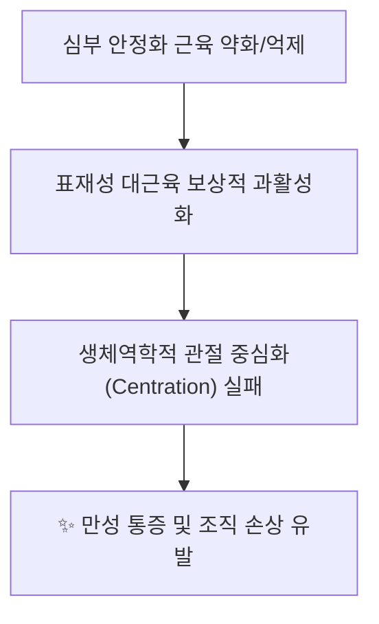

# 🫁 [[구조물/근육/질환명]] (영문명)

> **핵심 요약 (Key Summary)**:
> [[구조물명]]의 해부학적 위치, 신경 지배, 주된 생체역학적 기능과 함께 호발하는 [[임상증후군/질환]] 및 핵심 치료 타깃([[추나요법]], [[약침]])을 3줄 이내로 요약합니다.

---
## 📌 목차
1. [해부학적 정밀 구조 및 지배 신경/혈관](#1-해부학적-정밀-구조-및-지배-신경혈관)
2. [생체역학·토크 분석 & 근막 사슬 (Fascial Chains)](#2-생체역학토크-분석--근막-사슬-fascial-chains)
3. [근막통증증후군(TP) & 연관통 패턴 (Travell & Simons)](#3-근막통증증후군tp--연관통-패턴-travell--simons)
4. [초음파 해부학(Sonoanatomy) 및 중재 시술 랜드마크](#4-초음파-해부학sonoanatomy-및-중재-시술-랜드마크)
5. [관련 임상 질환 및 운동손상 증후군 총괄](#5-관련-임상-질환-및-운동손상-증후군-총괄)
6. [추나·도수치료(MET/PIR) & 침구·재활 운동 프로토콜](#6-추나도수치료metpir--침구재활-운동-프로토콜)
7. [출처 및 학술 참고 문헌 (References)](#7-출처-및-학술-참고-문헌-references)

---
## 1. 해부학적 정밀 구조 및 지배 신경/혈관

| 항목 | 상세 내용 |
| :--- | :--- |
| **기시 (Origin)** | 부착 기시부 |
| **정지 (Insertion)** | 부착 정지부 |
| **신경 지배** | [[지배신경명]] (신경근 레벨) |
| **혈관 공급** | 주 영양 동맥/정맥 |
| **해부학적 변이** | 임상적으로 주의해야 할 선천 변이 |

### 🔬 해부학 도해 및 단면도
![[이미지파일명.jpg|520]]
> **[구조적 특징 및 주행]**: 건의 부착 형태, 섬유 꼬임, 인접 신경/혈관과의 위치 관계 설명.

---
## 2. 생체역학·토크 분석 & 근막 사슬 (Fascial Chains)

* **분절별 모멘트 암과 토크**: 관절 각도에 따른 주동근/길항근 짝힘(Force couples)
* **근막 사슬 연계 (McGill / Myers Anatomy Trains)**: 사선선, 나선선 등 체간-상하지 연결

---
## 3. 근막통증증후군(TP) & 연관통 패턴 (Travell & Simons)

* **TP 위치별 방사통 지도**:
  * `TP 1`: 국소 방사통 영역
  * `TP 2`: 원격 방사통 및 내장기 유사 가성 통증(Pseudo-visceral pain)
* **감별 진단 (진짜 신경근 병증 / 내과 질환 vs 근막통증)**

---
## 4. 초음파 해부학(Sonoanatomy) 및 중재 시술 랜드마크

* **초음파 스캔 뷰 (장축 / 단축)**:
  * 고/저에코 근막 경계 및 핵심 혈관 도플러 확인
* **약침/주사 치료 시 안전 마진 (Safety Margin)**:
  * 기흉, 신경 손상 방지 팁 및 바늘 진입 궤적

---
## 5. 관련 임상 질환 및 운동손상 증후군 총괄

| 임상 질환 / 증후군 | 병리적 연관 기전 | 주요 증상 및 기능 부전 | 핵심 교정 타깃 |
| :--- | :--- | :--- | :--- |
| **[[관련질환1]]** | 역학적 원인 | 임상 증상 | 이완/강화 타깃 |
| **[[관련질환2]]** | 역학적 원인 | 임상 증상 | 이완/강화 타깃 |

---
## 6. 추나·도수치료(MET/PIR) & 침구·재활 운동 프로토콜

* **한의학 경혈 매핑**: [[경혈명1]], [[경혈명2]]
* **근에너지기법 (MET / Post-Isometric Relaxation)**:
  * 관절 각도 세팅 $\rightarrow$ 20% 등척성 저항 $\rightarrow$ 호기 시 부드러운 신장
* **재활 운동 및 보상 패턴 차단 큐잉**

---
## 7. 출처 및 학술 참고 문헌 (References)

1. **Travell, J. G., & Simons, D. G. (1998)**. *Myofascial Pain and Dysfunction: The Trigger Point Manual*, Vol. 1 (2nd ed.). Williams & Wilkins.
   - **[연구 요약]**: 발통점(TrP) 진단 기준, 연관통 방사 경로 및 비활성화(침치료/스트레칭) 핵심 기전 요약.
2. **Sahrmann, S. (2002)**. *Diagnosis and Treatment of Movement Impairment Syndromes*. Mosby.
   - **[연구 요약]**: 운동손상 증후군 분류, 상대적 유연성 결손 및 관절 중심화(Centration) 회복 재활 원리 요약.
3. **McGill, S. (2015)**. *Low Back Disorders: Evidence-Based Prevention and Rehabilitation* (3rd ed.). Human Kinetics.
   - **[연구 요약]**: 척추 및 사지 관절의 생체역학적 부하 역학 및 코어/근막 사슬 안정화 데이터 요약.
4. **StatPearls / Orthobullets (최신)**. *Anatomy, Ultrasound and Clinical Pathology*.
   - **[임상 가이드]**: 초음파 랜드마크, 신경/혈관 주행 및 정형외과적 보존 치료 가이드라인 요약.
