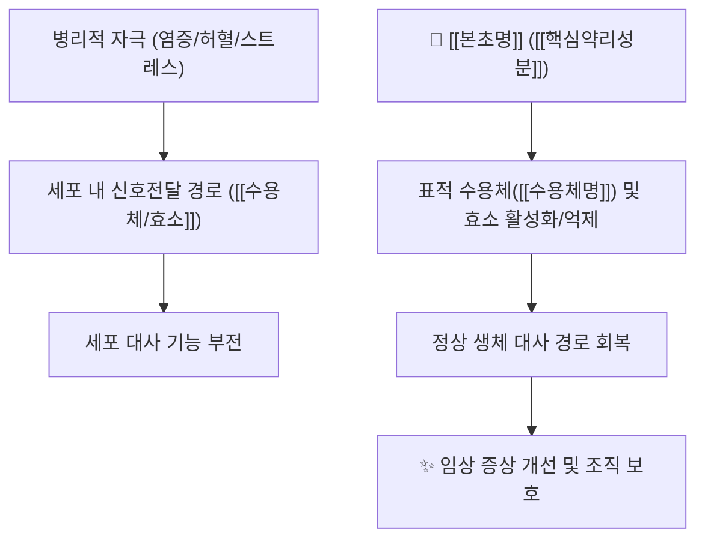

# 🌿 [[본초명]] (한자명, 영문 학명/생약명)

> **핵심 요약 (Key Summary)**:
> 과명(Family) 기원식물명(*Scientific name*)의 약용 부위
> 핵심 지표 성분인 [[지표성분명]]이 특정 수용체/경로([[표적수용체]])를 조절하여 분자약리 효과 발휘
> [[상한론]]의 [[주치병증]], [[체질]](사상의학)의 핵심 병증을 치료하는 대표적인 [[전통효능1]]·[[전통효능2]] 약재

---
## 📌 목차
1. [기본 본초 정보 & 화학 구조 (Pharmacognosy)](#1-기본-본초-정보--화학-구조-pharmacognosy)
2. [핵심 분자약리 기전 & 대사 네트워크](#2-핵심-분자약리-기전--대사-네트워크)
3. [해부생체역학 / 근육·신경 대사 연계](#3-해부생체역학--근육신경-대사-연계)
4. [사상의학 및 체질별 임상 응용 (적응증 vs 금기)](#4-사상의학-및-체질별-임상-응용-적응증-vs-금기)
5. [상한론 『약징(藥徵)』 분석 및 배오 원리](#5-상한론-약징藥徵-분석-및-배오-원리)
6. [핵심 처방 비교 매트릭스](#6-핵심-처방-비교-매트릭스)
7. [출처 및 학술 참고 문헌 (References)](#7-출처-및-학술-참고-문헌-references)

---
## 1. 기본 본초 정보 & 화학 구조 (Pharmacognosy)

| 항목 | 상세 내용 |
| :--- | :--- |
| **기원 식물** | 과명(Family) 학명(Scientific Name)의 약용 부위 |
| **성미 (性味)** | 기미(氣味) |
| **귀경 (歸經)** | 귀경(歸經) |
| **효능 (Actions)** | 전통 한의학 6대/4대 효능 |
| **주요 성분** | • **지표 성분**: [[지표성분명]] (KP/KHP 규격 함량)<br>• **유효 활성 성분군**: [[약리성분1]], [[약리성분2]] 등 |

### 🔬 주요 지표물질 화학 구조
![[이미지파일명.jpg|520]]
> **[구조적 특징 및 활성]**: 화학 골격의 특징, 배당체 형태(C-배당체/O-배당체), 작용기 특성에 따른 생체이용률 및 흡수 특성 해설.

---
## 2. 핵심 분자약리 기전 & 대사 네트워크



### (1) 표적 수용체 및 신호전달 경로
* **[[수용체/효소명]] 활성화/억제**: 
  * 상세 분자 메커니즘 서술.
* **대사 및 면역 조절**:
  * 세포 단위에서의 항염, 항산화, 대사 개선 기전.

---
## 3. 해부생체역학 / 근육·신경 대사 연계

* **근육 섬유 대사 ([[지근]] vs [[속근]])**:
  * 해당 본초가 근육의 유산소/무산소 대사, 미토콘드리아 지방산 산화, 칼슘 채널 및 젖산 대사에 미치는 영향.
* **신경 및 혈관계 조절**:
  * eNOS, 자율신경, 뇌혈류 및 말초 순환 개선 효과.

---
## 4. 사상의학 및 체질별 임상 응용 (적응증 vs 금기)

```
[✅ 최적 적응증 (Sweet Spot)]
• 특정 체질([[태음인]] / [[소음인]] / [[소양인]] / [[태양인]])의 대표 병증
• 환자의 전형적인 체형, 피부 상태, 자각 증상 패턴
• 최적의 치료 반응을 보이는 임상 케이스

[⚠️ 신중 투여 및 금기 (Caution / Contraindication)]
• 부작용이 우려되는 허한/실열 패턴
• 약물 상호작용 및 주의가 필요한 기저 질환군
```

---
## 5. 상한론 『약징(藥徵)』 분석 및 배오 원리

### (1) 『[[약징]]』에 나타난 주치와 방치
> **"[[본초명]] 主治..."**  
> (원문 인용 및 현대 임상적 해석)

* **핵심 약재 배오(짝)의 묘미**:
  * [[본초명]] + [[배오약재1]] $\rightarrow$ 특정 병증 타깃
  * [[본초명]] + [[배오약재2]] $\rightarrow$ 상호 작용 및 시너지

---
## 6. 핵심 처방 비교 매트릭스

| 처방명 | 구성 약재 | 주치 병증 및 임상 타깃 | 특징 및 감별점 |
| :--- | :--- | :--- | :--- |
| **[[대표처방1]]** | [[약재1]], [[약재2]]... | 핵심 주치 | 처방 감별 포인트 |
| **[[대표처방2]]** | [[약재1]], [[약재3]]... | 핵심 주치 | 처방 감별 포인트 |

---
## 7. 출처 및 학술 참고 문헌 (References)

1. **저자명 et al. (연도)**. *논문 제목*. **저널명**, 권(호), 페이지. doi:xxx.
   - **[연구 요약]**: 연구 모델(in vitro / in vivo / RCT), 주요 발견 수치 및 핵심 분자 기전 압축 요약.
2. **WHO Monographs on Selected Medicinal Plants (연도)**. *공식 모노그래프명*. WHO Press.
   - **[공인 데이터]**: WHO 공인 약리학적 효능, 규격 및 안전성 데이터 요약.
3. **대한민국약전(KP) 제12개정 (2022)**. 의약품각조: 해당 생약 규격.
   - **[공정서 규격]**: 지표성분 기준 함량 및 품질 관리 기준.
4. **길익동동 (1784)**. 『약징(藥徵)』.
   - **[고전 원전]**: 주치(主治) 및 방치(旁治) 조문 핵심 요약.
