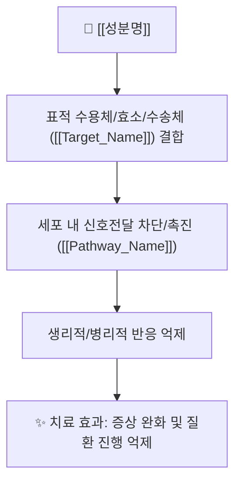

# 💊 [[성분명/약품명]] (영문 일반명 Generic Name, 대표 상품명 Brand Name)

> **핵심 요약 (Key Summary)**:
> [[성분명]]의 약물 계열(Class), 주 적응증(FDA/KFDA 승인 질환), 핵심 작용 기전([[표적수용체/효소]]) 및 가장 주의해야 할 주요 부작용/금기를 3줄 이내로 명확하게 요약합니다.

---
## 📌 목차
1. [기본 약물 정보 & 약동학 (Pharmacokinetics)](#1-기본-약물-정보--약동학-pharmacokinetics)
2. [분자약리 작용 기전 (Mechanism of Action, MoA)](#2-분자약리-작용-기전-mechanism-of-action-moa)
3. [임상 적응증 & 용법·용량 (Indications & Dosing)](#3-임상-적응증--용법용량-indications--dosing)
4. [부작용, 블랙박스 경고 & 금기 (Adverse Effects & Contraindications)](#4-부작용-블랙박스-경고--금기-adverse-effects--contraindications)
5. [약물 상호작용 & 병용 주의 (Drug-Drug & Herb Interactions)](#5-약물-상호작용--병용-주의-drug-drug--herb-interactions)
6. [동일 계열 약물 비교 매트릭스 (Class Comparison)](#6-동일-계열-약물-비교-매트릭스-class-comparison)
7. [출처 및 학술 참고 문헌 (References)](#7-출처-및-학술-참고-문헌-references)

---
## 1. 기본 약물 정보 & 약동학 (Pharmacokinetics)

| 항목 | 상세 내용 |
| :--- | :--- |
| **일반명 (Generic)** | [[영문성분명]] (한글성분명) |
| **대표 상품명 (Brand)** | 국내외 대표 처방 상품명 (오리지널 및 주요 제네릭) |
| **약효 분류 (ATC Code)** | 약물 계열 (예: NSAIDs, ARB, SGLT2i, PPI 등) |
| **생체이용률 (Bioavailability)** | 경구 흡수율 (%) |
| **혈중 반감기 ($t_{1/2}$)** | 시간 (h) / 활성 대사체 반감기 |
| **대사 경로 (Metabolism)** | 간 대사 효소 (예: CYP2C9, CYP3A4, UGT 등) |
| **배설 경로 (Excretion)** | 신장 배설 (%) / 담즙·분변 배설 (%) |

### 🔬 화학 구조식 (Chemical Structure)
![[이미지파일명.jpg|520]]
> **[구조적 특징 및 활성]**: 분자량, 친유성(LogP), 수용체 결합 부위의 화학적 결합 특성 해설.

---
## 2. 분자약리 작용 기전 (Mechanism of Action, MoA)



### (1) 분자 수준 작용 메커니즘
* **[[표적수용체/효소명]] 작용**: 
  * 가역적/비가역적 결합, 경쟁적/비경쟁적 억제 특성.
* **하위 신호전달 및 세포 반응**:
  * 이차 전달자(cAMP, $\text{Ca}^{2+}$, IP3 등) 조절 및 염증/대사/혈관 긴장도 변화.

---
## 3. 임상 적응증 & 용법·용량 (Indications & Dosing)

### (1) 승인 적응증 (FDA / KFDA)
* **주요 승인 질환**: 질환명 1, 질환명 2
* **오프라벨 (Off-label) 활용**: 임상적 근거가 있는 허가 외 사용

### (2) 표준 용법 및 용량 조절
* **성인 표준 용량**: 시작 용량 및 유지 용량, 최대 용량
* **특수 환자군 감량 기준**:
  * **신장애 환자 (eGFR / CrCl 기준)**: 감량 또는 투여 금기 기준
  * **간장애 환자 (Child-Pugh Score)**: 용량 조절 지침
  * **고령자 / 소아**: 투여 주의사항

---
## 4. 부작용, 블랙박스 경고 & 금기 (Adverse Effects & Contraindications)

```
[🚨 FDA 블랙박스 경고 (Black Box Warning)]
• 치명적이거나 중대한 위험이 있는 경고 사항 (예: 심혈관 위험, 태아 독성 등)

[⚠️ 주요 및 흔한 이상반응 (Common Adverse Reactions)]
• 10% 이상 빈발: 이상반응 목록
• 1~10% 빈도: 이상반응 목록
• 드물지만 치명적인 부작용: 아나필락시스, 스티븐스-존슨 증후군(SJS) 등

[⛔ 절대적 & 상대적 금기 (Contraindications)]
• 절대 금기 (Absolute): 임신부, 특정 중증 질환, 약물 과민증
• 상대 금기 (Relative): 특정 병용 질환
```

---
## 5. 약물 상호작용 & 병용 주의 (Drug-Drug & Herb Interactions)

| 병용 약물 / 성분군 | 상호작용 기전 | 임상적 결과 및 대처 방안 |
| :--- | :--- | :--- |
| **CYP 억제제/유도제** | 간 대사 속도 변화 | 혈중 농도 상승(독성) 또는 저하(효과 감소) |
| **특정 양약 병용** | 상가적 부작용 (예: 출혈, 저혈당 등) | 병용 금기 또는 모니터링 강화 |
| **🌿 한약재/건기식 상호작용** | [[당귀]], [[은행엽]], [[인삼]] 등과의 상호작용 | 출혈 경향, 혈압 변동, 간독성 모니터링 |

---
## 6. 동일 계열 약물 비교 매트릭스 (Class Comparison)

| 성분명 | 효력 (Potency) | 반감기 ($t_{1/2}$) | 대사 경로 | 주요 특징 및 차별점 |
| :--- | :--- | :--- | :--- | :--- |
| **[[본 성분명]]** | 기준 효력 | h | CYP 경로 | 기준 약물 특성 |
| **[[비교약물1]]** | 비교치 | h | CYP 경로 | 특정 장점/단점 |
| **[[비교약물2]]** | 비교치 | h | CYP 경로 | 특정 장점/단점 |

---
## 7. 출처 및 학술 참고 문헌 (References)

1. **U.S. Food and Drug Administration (FDA)**. *Prescribing Information Label*: [[성분명]].
   - **[공식 라벨]**: FDA 공인 승인 적응증, 용법·용량, 블랙박스 경고 및 약물동태학(PK) 공식 요약.
2. **UpToDate / StatPearls Publishing (최신)**. *Pharmacology and Dosing Guide*: [[성분명]].
   - **[임상 가이드]**: 신/간애 감량 기준 및 동일 계열 약물 간 potency 비교 요약.
3. **저자명 et al. (연도)**. *Landmark RCT 제목*. **NEJM / Lancet**, 권(호), 페이지. doi:xxx.
   - **[연구 요약]**: 대규모 3상 임상시험의 주요 평가변수(Primary Endpoints), 상대위험도 감소(RRR) 및 안전성 데이터 요약.
