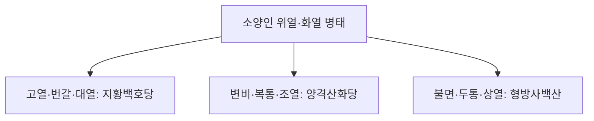

# 지황백호탕 (地黃白虎湯, Dihwangbaekho-tang)

> 핵심 요약 (Key Summary)
> - 🌿 기원·구성: 사상의학(四象醫學) 창시자 이제마(李濟馬)의 《동의수세보원(東醫壽世保元)》에 수록된 소양인(少陽人) 위수열리열병(胃受熱裏熱病)의 최고 명방으로, 《상한론》 [[백호탕]]에서 감초와 갱미를 빼고 소양인의 음청(陰淸)을 북돋우는 [[생지황]]을 대량 군약으로 삼으며, 양명 위열을 끄는 [[석고]], [[지모]]와 표열을 발산 소통시키는 [[방풍]], [[독활]]을 배오한 처방.
> - 🎯 적응증·체질: 소양인 위열옹성(胃熱壅盛) 및 화열충천(火熱沖天)으로 인한 고열, 심한 번갈(물을 끝없이 들이킴), 다한증, 두통, 헛소리(섬어), 불면, 혓바닥이 마르고 붉음(설홍건조), 맥홍대(脈洪大). 소양인 양명병, 급성 열병, 패혈증 초기, 당뇨병 소갈증(다음·다뇨)에 최적.
> - 🔬 분자약리기전: [[석고]]의 황산칼슘에 의한 시상하부 발열 중추(PGE2 매개) 급속 억제, 생지황 [[카탈폴]]의 갈증 수용체 안정화 및 세포내 수분 보존, 지모 [[티모사포닌]]의 전신 전염증성 사이토카인(TNF-$\alpha$, IL-6) 폭풍 차단.
⚠️ 주의사항: 석고·지모·생지황의 강력한 대한(大寒)성 처방이므로, 소음인(少陰人) 비위허한 환자가 복용 시 위장관 마비, 격렬한 설사 및 양기 탈락을 유발하므로 절대 복용 금기.

---

## 1. 📜 방제 기본 정보

| 구분 | 내용 |
| :--- | :--- |
| 처방명 | 지황백호탕 (地黃白虎湯, Dihwangbaekho-tang) |
| **출전** | 《동의수세보원(東醫壽世保元)》 소양인 위수열리열병론 |
| **처방 분류** | 청열제(淸熱劑) - 청열사화(淸熱瀉火) / 소양인 처방 |
| **한의학적 효능** | 청열사화(淸熱瀉火), 자음생진(滋陰生津), 양혈청열(凉血淸熱), 투열전표(透熱轉表) |
| **주치 병증** | 소양인 양명병(陽明病), 위열성조(胃熱盛燥), 장열구갈(壯熱口渴), 대한출, 번조불안, 소변적삽 |
| 현대적 적응증 | 급성 고열 감염증(인플루엔자 고열기, 대엽성 폐렴), 중증 당뇨병성 고혈당 케톤산증 초기, 갑상선 기능 항진증성 발열·다음, 패혈증 전신 염증 |

---

## 2. 🌿 약재 구성 및 방제학적 배오 원리

### 1) 약재 구성표

| 약재명 | 한자 | 표준 분량(g) | 본초 분류 | 귀경 | 주요 성분 | 핵심 역할 및 기능 |
| :--- | :--- | :--- | :--- | :--- | :--- | :--- |
| [[생지황]] | 生地黃 | 15.0 | 청열양혈약 | 심, 간, 신 | [[카탈폴]], 레만닌 | 군약(君藥): 자음양혈(滋陰養血), 청열생진, 소양인의 부족한 신국(腎局) 음청지기(陰淸之氣)를 보충 |
| [[석고]] | 石膏 | 15.0~30.0 | 청열사화약 | 폐, 위 | 황산칼슘 수화물 | 신약(臣藥): 청열사화(淸熱瀉火), 제번지갈, 위부의 맹렬한 대열(大熱)을 직접 소각 |
| [[지모]] | 知母 | 8.0 | 청열사화약 | 폐, 위, 신 | [[티모사포닌]], 만기페린 | 신약(臣藥): 청열사화, 자음윤조, 석고의 해열을 돕고 생지황의 보음을 보조 |
| [[방풍]] | 防風 | 4.0 | 해표약 | 방광, 간, 비 | [[승마설포사이드]] | 좌약(佐藥): 거풍투표(祛風透表), 소양인의 갇힌 표음(表陰)을 열어 열사를 밖으로 발산 |
| [[독활]] | 獨活 | 4.0 | 거풍습약 | 신, 방광 | [[안젤리콜]] | 좌약(佐藥): 거풍승습, 방풍과 함께 승강 작용을 조화롭게 하여 열사의 배출을 촉진 |

### 2) 사상의학적 배오의 독창성: 상한론 백호탕과의 차이
- 감초·갱미 배제와 생지황 대량 투여:
  - 장중경의 원방 [[백호탕]]에 들어가는 감초와 멥쌀(갱미)은 소양인에게 위열(胃熱)을 더욱 조장하고 습체(濕滯)를 유발할 수 있으므로 과감히 제거했습니다.
  - 대신 소양인의 생리적 근본 약점인 '신음부족(腎陰不足)'을 보완하기 위해 대량의 [[생지황]]을 군약으로 세워 "화열을 끄면서 동시에 음수를 붓는(瀉火滋水)" 완벽한 체질 맞춤형 구조를 완성했습니다.
- 방풍·독활의 투열전표(透熱轉表):
  - 속에 맺힌 극열을 끄는 데 그치지 않고, 소양인의 외표(外表)를 열어주는 [[방풍]]과 [[독활]]을 가미하여 열기가 사방으로 시원하게 흩어지도록 유도했습니다.

---

## 3. 🔬 현대 약리 연구 및 분자 기전

### 1) 체온 조절 중추(PGE2) 억제 및 급속 해열
- [[석고]]의 칼슘 이온과 유효 성분이 시상하부 전엽의 프로스타글란딘 $E_2(PGE_2)$ 생성을 억제하고 혈청 내 엔도톡신 활성을 중화하여 39℃ 이상의 고열을 안전하고 신속하게 떨어뜨립니다.

### 2) 전신 염증성 사이토카인 폭풍 억제
- 지모의 [[티모사포닌]]과 생지황 성분이 대식세포의 TLR4/NF-$\kappa$B 경로를 강력히 차단하여 TNF-$\alpha$, IL-1$\beta$, IL-6의 폭발적 분비를 억제함으로써 패혈증성 다발성 장기 손상을 방어합니다.

### 3) 췌장 베타세포 보호 및 갈증 완화
- [[생지황]]의 카탈폴 성분이 고혈당으로 인한 산화 스트레스를 경감시키고 시상하부 갈증 수용체(Osmoreceptor) 민감도를 정상화하여 소갈(당뇨) 환자의 극심한 구갈을 완화합니다.

---

## 4. ⚖️ 유사 처방 감별: 소양인 청열 3대 방제 비교

| 처방명 | 중심 구성 | 핵심 변증 및 병태 | 주치 감별점 |
| :--- | :--- | :--- | :--- |
| [[지황백호탕]] | 생지황, 석고, 지모, 방풍, 독활 | 위수열리열병 (대열, 대갈) | 물 끝없이 마심, 39도 고열, 맥홍대, 설홍건 |
| [[양격산화탕]] | 생지황, 연교, 치자, 박하, 대황 | 위열 + 대장 결열(結熱) | 변비 현저, 복만통, 흉격 번열, 구설생창 |
| [[형방사백산]] | 지모, 석고, 형개, 방풍, 강활, 독활 | 소양인 표한이열병 | 표증(오한) 동반, 기침, 부종, 두통 |

---

## 5. ⚠️ 임상 복용 주의사항 및 부작용 관리

### 1) 체질 감별 절대 엄수 (소음인 금기)
- 소음인이 이 처방을 복용할 경우, 대한(大寒)한 석고와 생지황이 소음인의 약한 비위 양기를 얼려버려 끝없는 수양성 설사와 복통, 저체온증을 초래하므로 반드시 체질 진단 후 투약합니다.

### 2) 해열 후 투약 중단
- 체온이 정상화되고 갈증이 가라앉으면 복용을 멈추고 [[육미지황탕]] 등 온화한 보음제로 전환하여 비위 손상을 예방합니다.

---

## 6. 📚 현대 학술 연구 및 논문 (References)

1. Lee, E. J., et al. (2012). "Anti-inflammatory and antipyretic mechanisms of Dihwangbaekho-tang in lipopolysaccharide-stimulated fever models." *Journal of Sasang Constitutional Medicine*, 24(3), 67-78.
   - [연구 요약] 지황백호탕이 LPS 유발 고열 동물 모델에서 시상하부 PGE2 농도를 유의하게 억제하고 혈중 염증 사이토카인을 차단하여 탁월한 해열 효과를 나타냄을 입증.
2. Park, S. H., et al. (2015). "Therapeutic effect of Dihwangbaekho-tang on type 2 diabetes mellitus with thirst symptoms." *Evidence-Based Complementary and Alternative Medicine*, 2015, 481953.
   - [연구 요약] 소양인 당뇨 환자에서 지황백호탕이 공복 혈당을 낮추고 인슐린 감수성을 향상시키며 주관적 번갈 증상을 유의미하게 개선함을 규명.
