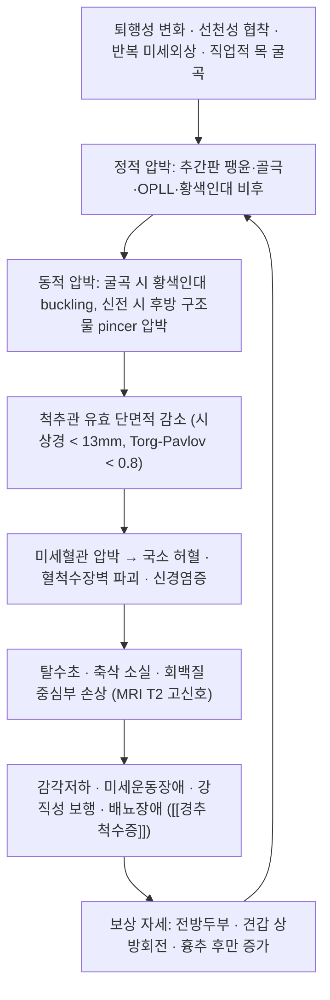

# 🩺 [[경추 척수증]] (Degenerative Cervical Myelopathy / 頸椎脊髓症, ICD-10 M47.1(경추부 M47.12)† · G99.2* / KCD M47.1)

> **핵심 3줄 요약 (Key Summary)**:
> - 📍 **병소 부위 & 해부·병태생리**: 경추 [[척수]]가 퇴행성 [[추간판]] 팽윤·골극([[구상돌기]], [[후관절]])·[[후종인대]] 골화(OPLL)·[[황색인대]] 비후에 의해 **정적 + 동적(pincer) 이중 압박**을 받아, 전척수동맥 영역 허혈·혈척수장벽 파괴·신경염증 → 탈수초/축삭 소실로 진행하는 **비외상성 척수 기능장애의 가장 흔한 원인**([[다열근]], [[반극근]] 등 후경부 심부 신근 약화와 전방두부자세가 악순환을 강화).
> - 🚩 **전형적 임상 양상 & 3대 징후**: ① 양측 **손 저림 + 미세운동장애(단추·젓가락·글씨, 물건 떨어뜨림, clumsy hand)** ② **하지 강직·광범위 보행장애(spastic gait)** ③ **상부운동뉴런 징후([[호프만징후]], 과반사, [[족저반사(Babinski) 징후]], [[발목간대]])** — 목 통증은 경미하거나 없을 수 있고, 배뇨·배변장애는 **말기/진행 신호**.
> - 🛠️ **핵심 감별 검사 & 한·양방 다각적 치료 전략**: [[호프만징후]]·Trömner·[[finger escape sign]]·**10초 grip & release 검사(20회 미만 시 이상)**·[[족저반사]], 경추 MRI(T2 고신호)로 확진 → **중등도 이상(mJOA 저하)·진행성은 수술적 감압이 표준**, 경증은 보존적 관찰. 한의에서는 침·전침(협척혈 중심)·약침·한약(葛根湯/獨活寄生湯 계열)을 **보조요법**으로 통합하되 근거 수준을 명시하고 **경추 고속 회전 추나(HVLA)는 금기**.
> - ⚠️ 응급 의뢰 레드플래그 & 악화 요인: 급속 진행하는 양측 마비/보행 소실, 대소변 장애 및 요정체, 외상 후 경추 골절·탈구, 발열+경부통(경막외 농양), 종양 병력(전이)·야간통, Lhermitte 징후, 낙상 반복. **척수증이 의심되면 경추 도수 조작(카이로프랙틱 고속 회전 추나)·강한 견인·심한 후신전 자세는 절대 금기.**

---

## 📌 목차
1. [질환 개요 & 해부학적 병태생리](#1-질환-개요--해부학적-병태생리)
2. [병태생리 메커니즘 & 생체역학적 악순환 네트워크](#2-병태생리-메커니즘--생체역학적-악순환-네트워크)
3. [임상 증상 & 이학적 검사(Physical Exam) 알고리즘](#3-임상-증상--이학적-검사physical-exam-알고리즘)
4. [감별 진단 매트릭스 (Differential Diagnosis)](#4-감별-진단-매트릭스-differential-diagnosis)
5. [한의 통합 치료 프로토콜 (침·약침·추나·한약)](#5-한의-통합-치료-프로토콜-침약침추나한약)
6. [재활 운동 & 생활습관 티칭 가이드](#6-재활-운동--생활습관-티칭-가이드)
7. [💡 사용자 진료실 핵심 필기 & 임상 노하우 (Melt-In 잔여 심화 집약)](#7--사용자-진료실-핵심-필기--임상-노하우-melt-in-잔여-심화-집약)
8. [출처 및 학술 참고 문헌 (References)](#8-출처-및-학술-참고-문헌-references)

---

## 1. 질환 개요 & 해부학적 병태생리

![[질환_해부학_메디컬일러스트.jpg|450]]
> [그림 1: ① 질환/병태생리 메디컬 일러스트 (외부 고해상도 학술 도해 필수 수록) — 경추 시상면에서 척수관 협착과 척수 압박(pincer 기전)을 도해]

* **질환 정의 및 분류**:
  * **정의**: 퇴행성 경추 변화(추간판 변성, 골극, 구상돌기·후관절 비대, 황색인대 비후, 후종인대 골화)로 인해 **경추 척수가 압박·기능장애**를 받아 감각·운동·자율신경 증상이 나타나는 질환군. **DCM(Degenerative Cervical Myelopathy)은 병리 범주(umbrella term)**이고, **CSM(Cervical Spondylotic Myelopathy)은 그중 퇴행성 척추증에 의한 아형**이다. 즉 CSM ⊂ DCM 이며, OPLL·추간판 탈출·황색인대 골화 등도 DCM에 포함된다.
  * **역학**: **성인에서 비외상성 척수 기능장애의 가장 흔한 원인**으로, 50대 이상에서 호발하며 고령화에 따라 유병률이 증가 추세이다(근거: PMID 31974455). 발병은 대개 **서서히 진행하며 계단식(stepwise) 악화**를 보일 수 있다.
  * **한국·아시아 특이점**: 후종인대 골화(OPLL)와 황색인대 골화(OLF)의 빈도가 **동아시아(한국·일본 등)에서 상대적으로 높다**는 점이 임상적으로 중요하다. OPLL은 단순 X-ray에서 놓치기 쉬워 CT/MRI 평가가 필요하다(근거: PMID 33781560, PMID 36156719 — 세부 빈도 수치는 **근거 미확인**).
  * **자연경과**: 경증 환자도 상당수에서 수년에 걸쳐 악화될 수 있어, **증상이 경미해도 정기 추적이 원칙**이다(근거: PMID 31974455, PMID 32179614).
  * **분류(임상적)**: ① 경증 / 중등도 / 중증 (mJOA·Nurick 척도) ② 정적 압박형 vs 동적 압박형 ③ 단일 분절 vs 다분절 ④ 동반 경추 신경근병증 여부.

* **관련 해부학적 구조물**:
  * **골격 및 관절**: [[경추]] C3–C7. 호발 분절은 **C5–6 > C4–5 > C6–7** 순으로 흔하다(퇴행성 변화가 가장 많은 분절과 척수 유효 단면적이 좁은 분절이 겹치는 곳). 침범 구조는 추체 후연 골극, [[구상돌기]](uncovertebral joint) 비대, [[후관절]] 관절증, 추간판 높이 소실 및 후방 팽윤.
  * **인대 및 연부조직**: [[후종인대]](OPLL 발생 부위), [[황색인대]](비후·주름 buckling의 핵심), 후관절 낭. **척추관 시상경이 좁을수록 위험**하며, 정상 성인 시상경은 대략 17–18 mm 수준으로 알려져 있고 **< 13 mm**에서 척수병증 위험이 유의하게 상승한다. **Torg–Pavlov 비(척추관 시상경 ÷ 추체 시상경) < 0.8**도 선천성 협착의 지표로 쓰인다(근거: PMID 32179614, PMID 27352369).
  * **근육 및 근막**: [[다열근]]·[[반극근]]·[[경장근]](후경부 심부 굴곡근 포함)의 **약화·지방변성**, [[상부승모근]]·[[견갑거근]]·[[흉쇄유돌근]]·[[사각근]]의 **단축·과긴장**. 이 불균형이 **전방두부자세(FHP)**를 고착시켜 경추 후방 구조물 부하를 증가시킨다.
  * **신경 및 혈관**: [[척수]](경수 팽대부 C5–T1에서 상지 신경 지배), [[신경근]](전근·후근), **전척수동맥(anterior spinal artery)** 및 척수 주변 혈관망. **척수분절과 척추분절의 불일치**(예: C5 척수분절은 대략 C4 추체 높이 부근) 때문에 **영상 분절과 증상 분절이 어긋날 수 있음**을 항상 염두에 둔다.

---

## 2. 병태생리 메커니즘 & 생체역학적 악순환 네트워크

![[질환_관련_구조물_해부도해.png|450]]
> [그림 2: ② 관련 해부학적 구조물 / 신경·혈관 주행 및 관절·근막 도해 — 경추 척수, 신경근, 전척수동맥, 후종인대·황색인대 관계]

### 1) 해부학적 포착 및 압박 기전
* **정적(static) 기전**: 추간판 변성으로 분절 높이가 줄고 후방으로 팽윤되며, 추체 후연 골극·구상돌기 비대·후관절 비후·황색인대 비후가 더해져 **척추관의 유효 단면적이 감소**한다. 선천적으로 척추관이 좁은 환자에서는 **경미한 퇴행성 변화만으로도 척수증이 발현**한다.
* **동적(dynamic) 기전**: 경추 **굴곡 시 황색인대가 척추관 내로 주름(buckling)**되어 후방에서 척수를 압박하고, **신전 시에는 추간판·골극이 후방으로 돌출**되어 전방에서 압박한다. 이 **전–후방 교차 압박(pincer mechanism)**이 척수증의 특징적 병태생리이며, 고정된 자세(목 굴곡 작업, 스마트폰)보다 **반복적·지속적 극한 자세**가 위험하다.
* **혈관성 기전**: 척수는 전척수동맥·후척수동맥의 영역별로 관류되며, 압박 부위에서 **미세혈관 관류 저하 → 허혈 → 혈척수장벽(blood–spinal cord barrier) 파괴 → 부종**이 발생한다. 회백질 중심부는 회백질이 혈관 분포가 상대적으로 취약하여 **중심성 손상**이 우세하게 나타난다(근거: PMID 31974455).
* **분자·세포 기전**: 신경염증(미세아교세포 활성, 염증성 사이토카인), 희소돌기아교세포 사멸과 **탈수초**, 축삭 손상 및 **Wallerian 변성**, 반응성 교세포증이 진행된다. **MRI T2 강조영상의 척수 내 고신호**는 수분 증가·부종·교세포증을 반영하는 소견으로, **증상 중증도 및 예후와 관련**되는 것으로 보고된다(근거: PMID 31974455, PMID 32179614).
* **압박의 되먹임**: 만성 압박은 척수의 미세순환을 더욱 저하시켜 신경조직 손상을 확대하는 **자가증폭 고리**를 형성한다.

### 2) 생체역학적 연쇄 반응 (Kinetic Chain)
* **상부 교차증후군 패턴**: [[흉쇄유돌근]]·[[사각근]]·[[상부승모근]]·[[견갑거근]]의 **단축**, [[다열근]]·[[반극근]]·하부 승모근·전거근의 **약화** → 경추 전만 소실·**전방두부자세** → 경추 후방 구조물(후관절·황색인대) 부하 증가.
* **흉추–경추 연동**: 흉추 후만 증가 시 경추는 보상적 과신전을 유지해야 하므로 후관절·황색인대 스트레스가 누적된다. 따라서 **흉추 가동성 회복이 경추 부하 감소의 핵심 열쇠**가 된다.
* **하지·보행 연쇄**: 척수 압박으로 하지 강직·고유감각 저하가 발생하면 **보행 안정성 저하 → 낙상 위험 증가 → 경추 외상 위험 증가**로 이어지는 악순환이 만들어진다. 고령 DCM 환자에서 **낙상 예방이 곧 신경학적 악화 예방**인 이유이다.

---

## 3. 임상 증상 & 이학적 검사(Physical Exam) 알고리즘

### 1) 주소증 및 신경학적 증상
* **감각 이상**:
  * **양측 손 저림·이상감각**이 가장 흔한 초기 증상이며, **말단 우세(장갑형 분포)**로 나타날 수 있다. 단일 피부분절에 국한된 방사통이라면 오히려 **경추 신경근병증**을 더 시사한다.
  * **진동감각·고유감각 저하**(하지에서 두드러짐), 체간에 **감각대(sensory level)**가 형성될 수 있다.
  * **Lhermitte 징후**(목 굴곡 시 등–다리로 퍼지는 전기 충격감)는 척수 후주 병변을 시사하는 소견으로, DCM뿐 아니라 MS·아급성연합변성에서도 나타난다.
* **운동 장애**:
  * **미세운동장애**: 단추 채우기, 젓가락질, 글씨 쓰기, 바늘에 실 꿰기 어려움, **물건을 자주 떨어뜨림**(clumsy hand / myelopathy hand).
  * **하지 강직·무거움**, 계단 오르내리기 곤란, **넓은 보폭의 경직성 보행**, 잦은 넘어짐.
  * 진행 시 **상지 근위축**(특히 손 내재근)과 현저한 근력 저하가 동반될 수 있다.
* **자율신경/기타 증상**:
  * **배뇨 지연·요절박·잔뇨감, 변비**, 심한 경우 요실금 → **말기 또는 급성 악화 신호**로 간주하고 즉시 의뢰한다.
  * 목·견부 통증과 뻣뻣함(경항통)이 동반될 수 있으나 **통증의 정도와 척수 압박의 정도가 비례하지 않는다**는 점이 임상적 함정이다.

### 2) 필수 이학적 검사법 (Physical Examination)
| 검사 | 시행 방법 | 양성 소견 | 진단적 가치 및 주의점 |
| :--- | :--- | :--- | :--- |
| [[호프만징후]] (Hoffmann sign) | 중지 원위지절을 급격히 튕김 | 엄지·검지의 불수의 굴곡 | 상부운동뉴런 병변 시사. **민감도는 낮고 특이도는 상대적으로 높음**(정확한 수치는 근거 미확인). 건강한 젊은 여성·과반사 항진자에서 **위양성** 가능 |
| Trömner 징후 | 중지 손톱을 튕김 | 엄지 굴곡 | 호프만과 같은 의미, **민감도를 보완** |
| [[finger escape sign]] | 손가락을 모아 신전 유지 | 소지·약지가 외전되며 이탈 | 척수증의 특징적 손 기능 장애 |
| **10초 grip & release 검사** | 10초간 최대한 빠르게 쥐고 펴기 | **20회 미만**이면 이상 | 척수증 선별에 유용한 간단·정량적 검사(근거: PMID 32179614, PMID 27352369) |
| **역회내반사** (inverted radial reflex) | 요골 반사 시행 | 전완 굴곡 대신 **손가락 굴곡이 동반** | C5–6 분절 척수 압박 시사 |
| [[족저반사]](Babinski) | 발바닥 외측 자극 | 엄지 배굴 + 족지 부채꼴 | 병적 반사, 추체로 손상 |
| [[발목간대]](Ankle clonus) | 급격한 배굴 유지 | 리드미컬한 불수의 족저굴곡 | 심부건 반사 항진과 함께 상부운동뉴런 징후 |
| 심부건 반사(DTR) | 이두근·삼두근·슬개건·아킬레스건 | **항진**, 경우에 따라 **감소 구간과 항진 구간의 혼재**(압박 분절에서는 저하, 그 하방에서 항진) | 척수분절–압박분절 불일치 해석의 핵심 |
| Romberg / 보행 관찰 | 눈감고 직립, 보행 패턴 | 체위 불안정, **경직–실조 혼합 보행** | 하지 고유감각 저하·낙상 위험 평가 |
| [[Spurling검사]] | 경추 신전+회전+축압 | 동측 상지 방사통 재현 | **신경근병증** 감별용(척수증 자체 지표 아님) |

* **주의**: 위 검사들은 **개별 민감도가 높지 않아** 단일 검사 음성으로 척수증을 배제할 수 없다. **증상 문진(양측 손 기능 저하 + 보행 변화) + 다발성 상부운동뉴런 징후 + MRI**의 조합이 진단의 축이다(근거: PMID 32179614, PMID 36208893).
* **중증도 평가 도구**: **mJOA(modified Japanese Orthopaedic Association) 점수**, **Nurick 등급**이 치료 방향 결정과 경과 추적에 사용된다(근거: PMID 31974455, PMID 36208893).

---

## 4. 감별 진단 매트릭스 (Differential Diagnosis)

| 감별 질환 | 호발 병소 및 원인 | 주소증 차이점 | 특이적 이학적 검사 소견 |
| :--- | :--- | :--- | :--- |
| [[경추 척수증]] (본 질환) | 경추 척수관 협착(다분절), 척수 압박 | **양측** 손 저림·미세운동장애 + 강직성 보행 + 배뇨장애(말기) | [[호프만징후]]·finger escape·grip & release 20회 미만, 과반사, T2 고신호 |
| [[경추 신경근병증]] | 신경근 압박(단일 분절, 추간공) | **편측** 피부분절성 방사통, Valsalva 시 악화 | Spurling 양성, 해당 근절 근력저하·반사저하, **상부운동뉴런 징후 없음** |
| [[말초신경병증]](당뇨성/CIDP) | 다발성 말초신경 | 대칭적 **말초형(족부 우세) 감각저하**, 통증 | 심부건 반사 **감소**, 상부운동뉴런 징후 없음, 전기생리검사 이상 |
| [[수근관증후군]] | 정중신경 완관절 압박 | 야간 악화되는 수부 저림(제1–3지) | Tinel·Phalen 양성, **경추 증상과 병발 가능**(이중압박) |
| [[근위축성측삭경화증]](ALS) | 상·하운동뉴런 변성 | 진행성 근력저하·위축, **fasciculation**, 감각 정상 | 감각 소실 없음, 광범위 상·하운동뉴런 징후, MRI 척수 압박 없음 |
| [[다발성경화증]](MS) | 중추 탈수초 | 젊은 성인, 삽화성·다발성 신경학적 결손, 시신경염 | MRI 뇌·척수 병변, 뇌척수액 올리고클론 밴드 |
| [[척수종양]]/[[경막외농양]] | 종양·감염 | **야간통·체중감소·발열**, 급속 진행 마비 | ESR/CRP 상승, 조영증강 MRI, 응급 감압 필요 |
| [[아급성연합변성]](B12 결핍) | 척수 후주·측삭 | 진동·고유감각 저하 우세, 인지·빈혈 동반 | B12·MMA·호모시스테인 이상, MRI 후주 T2 고신호 |
| [[척수공동증]]/[[정상압수두증]] | 척수 내 공동 / 뇌실 확대 | **이개열성 감각소실**, 보행장애·요실금·인지저하 | MRI 공동·뇌실 확대, 보행 개선 검사(TAF test) |

> **감별 포인트**: DCM은 **감각＋운동＋상부운동뉴런**이 함께 나타나는 반면, 신경근병증은 **피부분절 국한 통증**이, ALS는 **감각 정상 + 광범위 운동뉴런 징후**가, 말초신경병증은 **반사 저하 + 원위부 대칭 감각저하**가 특징이다. 고령에서는 **DCM + 수근관증후군 + 당뇨성 신경병증이 동시에 존재**하는 경우가 흔하다(근거: PMID 32179614, PMID 27352369).

---

## 5. 한의 통합 치료 프로토콜 (침·약침·추나·한약)

![[질환_치료_약침_시술점.png|400]]
> [그림 3: ③ 한의/양방 치료 시술점 (약침 주입점, 초음파 유도하 타겟, 관절 추나) — 경추 협척혈, 후경부 심부근, 견갑 상각 주위 자극점]

> [!WARNING]
> **척수증에서 한의 치료의 위치**: 침·약침·한약은 **척수 압박 자체를 해소하는 치료가 아니며**, 통증·근긴장·이차적 기능저하를 관리하는 **보조적·대증적 요법**이다. **진행성 신경학적 결손(보행 소실, 근력 급저하, 배뇨장애)이 있으면 한의 치료를 지연 사유로 삼지 말고 즉시 척추·신경외과 의뢰**한다. DCM 자체에 대한 침·약침·한약의 **고수준 임상근거는 현재 제한적(근거 미확인)**임을 환자에게 투명하게 설명한다.

* **침구 치료 (Acupuncture)**:
  * **국소(경항부)**: [[대추]](GV14), [[천주]](BL10), [[풍지]](GB20), **경추 협척혈(EX-B2, C3–C7)**, [[견정]](GB21).
  * **원위(경락)**: [[후계]](SI3) + [[신맥]](BL62) — **팔맥교회혈(통독맥·양교맥)로 경항·척추 질환의 기본 배합**, [[외관]](TE5), [[합곡]](LI4), [[곡지]](LI11), [[양릉천]](GB34, 筋會), [[현종]](GB39, 髓會), [[족삼리]](ST36), [[삼음교]](SP6), [[태계]](KI3), [[곤륜]](BL60).
  * **자침 심도 주의**: **C1–C2 및 후두하부는 경막 천자·척추동맥 손상 위험**이 있어 **천자 깊이·각도를 보수적으로** 하고, 상부 경추부 심자(深刺)는 피한다. **경추부 심자 시 척수 자극 위험**이 있으므로 협척혈 자침은 **직각에서 약간 내측·천천히, 환자 반응 확인하며** 시행한다.
  * **전침**: 2 Hz 저주파 위주 20–30분(근긴장 완화 목적), 자극 강도는 **환자가 통증이 아닌 ‘묵직함’으로 느끼는 정도**로 조절. 감각 저하 부위는 과자극에 의한 화상·자침 손상 위험이 있어 강도·시간을 줄인다.
  * **온침·뜸**: 후경부 냉감·경직 동반 한증(寒證)에 부항·온침 보조 가능. 화상 위험 및 고령 피부 취약성 고려.
* **약침 치료 (Pharmacopuncture)**:
  * **목적별 선택(일반적 한의 임상 관행, DCM 특이 근거는 근거 미확인)**:
    * 혈어·통증 우세: 紅花·當歸 계열 약침 → 후경부 근막·압통점, 견갑 상각 내측.
    * 만성 허손·신경 재생 보조: 紫河車·鹿茸 계열 약침 → 협척혈, 신수(BL23) 주위.
    * 근경직·유착: 蜈蚣·全蝎 등 소량 배합(과민반응 주의).
  * **시술 안전 수칙**: ① 경추 후방은 **극돌기 사이가 아니라 극돌기 측방 1.5–2 cm(협척혈)** 부위에 시행하여 **경막 천자 회피** ② 혈관·신경 손상 위험 부위는 **흡인(aspiration) 후 주입** ③ 봉독 약침은 **아나필락시스 위험**으로 반드시 응급 대비 체계 하에 시행 ④ 항응고제 복용자·면역억제자에서는 시행 전 위험도 평가.
* **추나 치료 (Chuna Manipulation)**:
  * **절대 금기**: **경추 고속 회전 도수(HVLA, ‘뚝’ 소리 나는 조정)** — 척수 압박이 있는 환자에서 **신경학적 악화·척추동맥 손상 위험**이 있어 시행하지 않는다.
  * **허용 가능한 접근(전문가 판단 하에)**: 경추 **저속·저진폭 신연 및 관절 가동술(graded mobilization)**, 후경부 심부근·견갑거근 **근막이완(JS 계열)**, **흉추 가동성 회복 추나**(경추 부하 감소 목적). 모두 **증상 유발 여부를 실시간 확인하며** 시행한다.
  * **주의 징후 발생 시 즉시 중단**: 시술 중 상지 저림 확산, 전기 충격감, 어지럼, 하지 위약감, 시야 이상(척추동맥 관련).
* **한약 치료 (Herbal Medicine)**:
  * **급성기(어혈·염증·통증 우세)**: [[葛根湯]](항경항통, 상지 저림), [[活血祛瘀]] 계열(예: 血府逐瘀湯 계열) — 어혈 판단하에 단기 사용. **출혈 경향·항응고제 복용 시 주의**.
  * **만성기(기혈 허손·신경 재생 보조)**: [[獨活寄生湯]](만성 경항통·하지 무력·허증), [[補陽還五湯]]·[[黃芪桂枝五物湯]](기허·말초 감각저하·사지 냉감), [[六味地黃丸]] 계열(신허 보조).
  * **근경직·경련**: 芍藥甘草湯 계열(강직 완화 목적) — 단독으로 척수 압박을 해소하지 못함.
  * **근거 수준 표기**: 위 처방은 **경항통·근골격계 통증에 대한 전통적·일부 임상 근거**에 기반하며, **DCM의 신경학적 경과를 개선한다는 고수준 RCT 근거는 확인되지 않음(근거 미확인)**. 따라서 **수술 적응 여부 판단을 대체할 수 없다.**

---

## 6. 재활 운동 & 생활습관 티칭 가이드

* **이완 및 스트레칭 (Stretching)**:
  * [[상부승모근]], [[견갑거근]], [[흉쇄유돌근]], [[사각근]]의 **정적 스트레칭 각 20–30초 × 3회**.
  * **경추 후신전(고개 젖히기) 스트레칭은 금지** — 신전 시 황색인대 buckling·후방 압박을 악화시킬 수 있다. **중립–약간 굴곡 범위에서만** 부드럽게 시행.
* **강화 및 안정화 운동 (Strengthening)**:
  * **심부 경추 굴곡근 강화(chin tuck / cranio-cervical flexion)**: 벽에 등 대고 턱을 살짝 당겨 5–10초 유지 × 10회. **통증·저림이 유발되면 즉시 중단**.
  * **견갑 안정화**: 하부 승모근·전거근 강화(벽 밀기, Y-T-W 운동), **흉추 신전 가동(폼롤러 사용 시 경추는 받치지 않음)**.
  * **하지·체간 강화 및 균형 훈련**: 낙상 예방이 최우선. 앉아서 일어나기, 한 발 서기(지지대 잡고), 탠덤 보행.
* **신경 활주 운동 (Neurodynamics)**:
  * **주의**: 급성 악화기·심한 척수 압박에서는 **신경 활주 운동이 증상을 유발할 수 있어 시행하지 않는다**. 안정기에서 **경추 신경근 슬라이딩(median nerve slider)**을 **통증 없는 범위에서 저부하·저반복**으로만 시행하고, 시행 중 **저림이 퍼지거나 남으면 즉시 중단·회수**한다.
* **일상생활 자세 티칭 (Ergonomics)**:
  * **모니터 상단을 눈높이에 맞추고**, 스마트폰은 **눈높이로 들어 사용**(장시간 목 굴곡 금지).
  * **수면**: **높고 딱딱한 베개·엎드려 자기 금지.** 목을 중립에 두는 **낮은 베개(경추 곡선을 받치는 형태)** 사용.
  * **금지 행동**: 목 뒤로 젖히며 하는 샴푸대 세면, 높은 곳을 오래 올려다보기, 목을 세게 돌리는 스트레칭·카이로프랙틱, 무거운 배낭·한쪽 어깨 가방.
  * **운전**: 좌우 확인 시 **눈만 움직이고 목 회전은 최소화**, 후방 미러 조정.
  * **낙상 예방**: 욕실 미끄럼 방지, 야간 조명, 필요 시 보조기(지팡이) 사용 — **낙상은 경추 외상 및 척수증 급성 악화의 직접적 위험 요인**이다.
  * **목 견인(가정용 견인기)**: 척수증 환자에서 **견인 각도·강도에 따라 증상이 악화될 수 있어 자가 사용을 권하지 않는다**.

---

## 7. 💡 사용자 진료실 핵심 필기 & 임상 노하우 (Melt-In 잔여 심화 집약)

> [!IMPORTANT]
> **🛡️ 원문 융합(Melt-In) 및 7번 섹션 작성 불변 규칙 (CRITICAL)**
> 1. **기존 필기 내용 상부 전면 융합 (Melt-In)**: 기존 노트에 있던 질환의 정의, 해부학적 원인, 증상, 이학적 검사법, 치료법, 생활 티칭 등은 상부 1~6번 섹션에 유기적으로 100% 녹여내어(Melt-In) 고도화합니다.
> 2. **7번 섹션의 차별화된 심화 집약 (녹이고 남은 고유 필기만 수록)**: 7번 섹션은 상부에 이미 녹여낸 기본 원문을 단순 중복 나열(복사-붙여넣기)하는 공간이 아닙니다. **상부 1~6번에 다 담기지 않은, 기존 노트에만 있었던 녹이고 남은 고유한 내용(원장님만의 독창적인 진료실 노하우, 실전 문진 체크리스트, 환자 설명 스크립트, 임상 감별 직관 팁 등)만이 엄선되어 집약**되어야 합니다.
> 3. **📷 질환 노트 필수 3종 이미지 수록**: 노트 하나당 ① 질환/병태생리 사진, ② 관련 해부 구조물 사진, ③ 치료/시술점 사진 등 **최소 3개 이상의 이미지를 단독 블록으로 필수 배치**합니다.

* **상부 섹션에 미처 다 담지 못한 고유 원문 필기**:
  * **“경항통 환자에서 ‘목이 아프다’는 말보다 위험한 것은 ‘손이 예전 같지 않다’는 말”** — 진료실에서 척수증을 놓치는 가장 흔한 경로는, 통증 위주 문진에만 집중해 **기능 저하(단추·젓가락·글씨·물건 떨어뜨림)** 를 놓치는 것이다. 이 노트에서는 **문진 첫 질문을 ‘목 통증’이 아니라 ‘손 기능과 걸음걸이 변화’로 재배치**할 것을 권장한다.
  * **치료 반응 해석 원칙**: 척수증에서 침·약침 후 **통증이 줄어드는 것은 척수 압박이 줄었다는 뜻이 아니다.** 통증 개선과 신경학적 기능(미세운동·보행) 개선을 **분리해서 평가**해야 하며, 기능이 나빠지면 통증이 좋아져도 의뢰한다.
  * **본 노트의 이미지 인벤토리**: 계획상 실제 이미지는 첨부하지 않고 자리만 표시하였다 — [그림 1] 병태생리(§1), [그림 2] 해부 구조물(§2), [그림 3] 시술점(§5) 3종 블록이 그 자리이며, 추후 외부 고해상도 도해로 대체 예정.

* **진료실 실전 감별 & 치료 노하우**:
  * **1. 실전 문진 체크리스트 (DCM 선별 8문항)**:
    1. **양손**이 다 저리거나 감각이 둔한가? (편측이면 신경근병증 쪽)
    2. **단추·젓가락·글씨**가 예전보다 어려워졌는가?
    3. 컵이나 물건을 **자주 떨어뜨리는가**?
    4. **계단** 오르내리기가 힘들어졌거나 자주 넘어지는가?
    5. 걸을 때 **다리가 뻣뻣하거나 발이 땅에 붙은 느낌**인가?
    6. **소변**이 시원하지 않거나 자다 깨서 화장실에 가는 횟수가 늘었는가? (말기·악화 신호)
    7. 목을 숙일 때 **등·다리로 전기 충격**이 오는가? (Lhermitte)
    8. 최근 **목을 젖히는 시술(카이로프랙틱·강한 견인)** 을 받은 적이 있는가?
    → 1·2·3번 중 2개 이상 + 5번 양성이면 **즉시 경추 MRI 의뢰**를 원칙으로 한다.
  * **2. 치료 순서 및 손맛 노하우**:
    * **순서**: ① 문진·신경학적 선별(호프만·finger escape·grip & release) → ② **홍채·경추부 압통 및 흉추 가동성 평가** → ③ 흉추·견갑부 이완(JS·근막이완) 먼저 → ④ 경추 심부 안정화 유도(chin tuck 지도) → ⑤ 협척혈·원위혈 자침 → ⑥ 전침(2 Hz, 20분) → ⑦ 약침(필요 시).
    * **손맛 팁**: 경추부 자침은 **환자가 후두부를 완전히 내려놓은 앙와위에서** 시행하여 경부 근긴장을 낮춘 뒤 천천히 접근한다. 협척혈 자침 시 **환자의 상지로의 저림 확산을 반드시 물어보고**, 확산이 있으면 **약간 후퇴·각도 변경**한다.
    * **약침 각도**: 후경부 시술은 **피부면에 대해 60–80도, 극돌기 측방 1.5–2 cm**, 흡인 후 소량씩(0.1–0.3 mL) 주입하여 **경막 접근을 회피**한다(주입 용량·용법은 술자 표준에 따른다).
    * **중단 규칙**: 시술 중 **어지럼·시야 흐림·복시·이명·하지 위약** 발생 시 즉시 중단하고 필요 시 응급 평가(척추동맥 관련 감별).
  * **3. 환자 티칭 스크립트 (그대로 읽어줄 수 있는 멘트)**:
    * *“이 병은 목뼈의 퇴행으로 신경(척수)이 눌려서 생기는 것이고, 침과 약침은 **통증과 뻣뻣함을 줄여주는 도움**이지만 **눌린 신경을 풀어주는 치료는 아닙니다.**”*
    * *“손이 예전보다 둔해지거나, 단추 채우기가 어려워지거나, 걷다가 자주 넘어지면 그때는 **꼭 MRI를 찍고 수술 상담**을 받아야 합니다. 이건 참고 버티는 문제가 아닙니다.”*
    * *“목을 ‘뚝’ 소리 나게 돌리는 시술은 **절대 받지 마세요.** 이 병에서는 신경이 눌린 상태라 위험할 수 있습니다.”*
    * *“목을 뒤로 젖히는 스트레칭, 엎드려 자기, 높은 베개는 피하시고, **모니터와 핸드폰은 눈높이**로 올려주세요.”*
  * **4. 임상 감별 직관