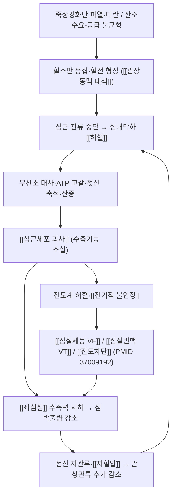

# 🩺 [[심근경색증]] (Myocardial Infarction / 心筋梗塞症, ICD-10 I21 / KCD I21)

> **핵심 3줄 요약 (Key Summary)**:
> - 📍 병소 부위 & 해부·병태생리: **[[관상동맥]]**([[좌전하행지 LAD]], [[좌회선지 LCx]], [[우관상동맥 RCA]])의 죽상경화반 파열·미란 → 혈전성 폐색 → 관류영역 **[[심근]]**의 심내막하→전층 허혈·괴사. 허혈이 [[심장전도계]]([[동방결절]], [[방실결절]])를 침범하면 부정맥·전도장애가 동반된다.
> - 🚩 전형적 임상 양상 & 3대 징후: ① 20분 이상 지속되는 흉골후방 압박성 흉통([[흉통]]) ② 방사통(좌측 팔·어깨·턱·등·상복부) ③ 자율신경 증상(식은땀·오심·구토·창백). 12유도 [[심전도]]의 ST 변화와 [[고감도 트로포닌]](hs-cTn) 상승·하강이 진단 축이다.
> - 🛠️ 핵심 감별 검사 & 한·양방 다각적 치료 전략: [[12유도 심전도]](내원 10분 내), [[고감도 트로포닌]] 연속 측정, [[관상동맥조영술]]. **양방 재관류 요법(PCI/혈전용해)이 최우선**이며, 한의 치료는 급성기를 지나 안정화된 **회복·재활기 보조 요법**으로 한정한다(침·한약 중심).
> - ⚠️ 응급 의뢰 레드플래그 & 악화 요인: 지속 흉통 + 식은땀/호흡곤란/실신, ST 상승 또는 새 좌각차단, 혈역학 불안정(저혈압·빈맥·청색증), 악성 [[심실부정맥]](VT/VF) — **즉시 119 이송, 한의원 내원 중 발생 시 모든 시술 즉시 중단.**

---

## 📌 목차
1. [질환 개요 & 해부학적 병태생리](#1-질환-개요--해부학적-병태생리)
2. [병태생리 메커니즘 & 생체역학적 악순환 네트워크](#2-병태생리-메커니즘--생체역학적-악순환-네트워크)
3. [임상 증상 & 이학적 검사(Physical Exam) 알고리즘](#3-임상-증상--이학적-검사physical-exam-알고리즘)
4. [감별 진단 매트릭스 (Differential Diagnosis)](#4-감별-진단-매트릭스-differential-diagnosis)
5. [한의 통합 치료 프로토콜 (침·약침·추나·한약)](#5-한의-통합-치료-프로토콜-침약침추나한약)
6. [재활 운동 & 생활습관 티칭 가이드](#6-재활-운동--생활습관-티칭-가이드)
7. [💡 사용자 진료실 핵심 필기 & 임상 노하우 (Melt-In 잔여 심화 집약)](#7--사용자-진료실-핵심-필기--임상-노하우-melt-in-잔여-심화-집약)
8. [출처 및 학술 참고 문헌 (References)](#8-출처-및-학술-참고-문헌-references)

---

## 1. 질환 개요 & 해부학적 병태생리

> [그림 1: ① 심근경색증 병태생리 메디컬 일러스트 — 관상동맥 죽상경화반 파열 및 혈전 형성, 심근 관류영역(전벽/측벽/하벽) 표시 도해] *(이미지 미수록 — 자리 확보)*

* **질환 정의 및 분류**:
  * **정의**: 심근경색증(myocardial infarction, MI)은 **심근 허혈에 의해 심근세포의 손상 및/괴사가 발생한 임상 상태**다. 제4차 세계 통합 정의(Fourth Universal Definition of Myocardial Infarction, 2018)에 따르면, 진단은 ⓐ **심근손상 바이오마커(심근 트로포닌)의 상승 및/또는 하강**과 ⓑ **급성 심근 허혈의 임상적 증거**(허혈성 흉통, 심전도 허혈 변화, 관상동맥 조영/영상 소견 등)의 **조합**으로 성립한다(PMID: 30571511).
  * **병태생리학적 분류(제4차 통합정의)** — 급성 관상동맥 증후군([[ACS]])과의 관계를 이해하는 핵심 표다.

| 유형 | 명칭 | 발생 기전 | 임상적 맥락 |
| :--- | :--- | :--- | :--- |
| **Type 1** | 죽상혈전성 MI (Spontaneous) | 죽상경화반 파열·미란 → 관상동맥 내 혈전성 폐색 | 전형적 STEMI/NSTEMI, 재관류 요법 대상 |
| **Type 2** | 수요-공급 불균형 MI | 관상동맥 폐색 **없이** 산소 공급↓ 또는 수요↑ (빈맥·빈혈·저혈압·연축·내피기능장애 등) | 치료는 원인 교정이 본질, 항혈전 전략 이견 |
| **Type 3** | 치명적 MI (바이오마커 확인 전 사망) | 허혈 증거 + 사망, 채혈 전 사망 | 부검·임상 정황으로 판정 |
| **Type 4a/4b/4c** | PCI 관련 MI | 경피적 관상동맥중재술 중/후 | 시술 합병증, 스텐트 혈전증, 재협착 |
| **Type 5** | CABG 관련 MI | 관상동맥우회술 중/후 | 수술 합병증 |

  * **Type 2 MI의 중요성**: Type 2는 죽상혈전성 폐색이 아니므로 **항혈소판·항응고 치료의 이득이 불확실**하고, 예후는 오히려 Type 1과 유사하게 나쁠 수 있다. 임상에서는 "트로포닌이 올랐는데 관상동맥이 깨끗한" 상황에서 Type 2를 먼저 고려해야 한다(PMID: 30975302).
  * **호발 연령/성별/직업군(역학)**: 허혈성 심장질환은 전 세계 주요 사망 원인으로 알려져 있으나, **본 노트에 제공된 논문들에서는 구체적 발생률·연령·성별 통계 수치가 제시되지 않았다 → 수치 근거 미확인.** 다만 노인, 당뇨병·고혈압·이상지질혈증 환자, 흡연자에서 비전형적 양상으로 발현되는 빈도가 높다는 서술이 일차진료 문헌에서 강조된다(PMID: 10918673, PMID: 38278573).

* **관련 해부학적 구조물**:
  * **골격 및 관절**: 심장은 **[[흉골]]** 후방, **[[종격동]]** 내에 위치한다. 심첨(apex)은 좌측 제5늑간·쇄골중앙선 부근에 닿고, **[[늑골궁]]**·**[[검상돌기]]**는 심장 통증의 체성 방사 부위(검상돌기·상복부)와 해부학적으로 겹친다. 이 때문에 하벽 MI가 "위가 아프다(체했다)"로 오인되는 해부학적 배경이 된다.
  * **근육 및 근막**: 실제 이환 조직은 심장근(**[[심근]]**)이다. 좌심실 전벽·전중격·측벽·하벽으로 관류영역이 나뉘며, 허혈이 심내막하에서 심외막 방향으로 진행하며 벽운동 이상(hypokinesia → akinesia)을 만든다. 흉벽의 **[[대흉근]]**, **[[전거근]]**, **[[늑간근]]**, **[[사각근]]** 등은 흉통의 **근골격계 감별 대상**이지 MI의 원인 근육이 아니다 — 감별 시 혼동 주의.
  * **신경 및 혈관**: 관상동맥은 좌주간지(LM) → **[[좌전하행지(LAD)]]**(전벽·전중격), **[[좌회선지(LCx)]]**(측벽), **[[우관상동맥(RCA)]]**(하벽·우심실 및 대개 방실결절 공급)으로 분지한다. 심장 통증의 구심성 신경은 **[[교감신경]]** T1–T5 분절을 통해 전달되므로, T1–T5 피부분절(경부·어깨·좌측 팔 내측·상복부)로 **방사통**이 나타난다. 이것이 어깨·팔 통증을 근골격계 문제로 오진하게 되는 핵심 해부학적 함정이다.

---

## 2. 병태생리 메커니즘 & 생체역학적 악순환 네트워크

> [그림 2: ② 관상동맥 분지 및 심근 관류영역 / 심장전도계 주행 도해 — LAD·LCx·RCA와 SA node·AV node·His-Purkinje 계] *(이미지 미수록 — 자리 확보)*

### 1) 관상동맥 폐색 및 심근 괴사 기전
* **Type 1 MI의 핵심**: 취약성 죽상경화반(vulnerable plaque)의 **파열 또는 미란** → 내皮下 콜라겐 노출 → 혈소판 부착·활성화·응집 → **혈전성 폐색**. 폐색이 완전하면 관류영역 전층이 괴사하는 **ST 상승 MI(STEMI)**로, 부분 폐색이면 **비ST상승 MI(NSTEMI)**로 발현한다(PMID: 38278573).
* **허혈 손상의 시간 경과**: 관류 중단 후 심내막하(혈류 공급의 최말단)부터 허혈이 시작되어 심외막 방향으로 진행한다(확장성 경색, wavefront necrosis). 실험적 시간 수치는 본 논문들에서 확인되지 않아 **수치 근거 미확인** — 다만 "시간이 곧 심근(save time is muscle)"이라는 원칙과 조기 재관류의 예후 개선 효과가 강조된다(PMID: 10918673).
* **Type 2 MI의 기전**: 관상동맥 폐색 없이 **산소 공급/수요 불균등**으로 심근손상이 발생한다. 빈맥·고혈압성 수요 증가, 빈혈·저산소증·저혈압에 의한 공급 감소, 관상동맥 연축·내피기능장애 등이 대표적이다(PMID: 30975302).

### 2) 전기생리학적 연쇄 반응 (부정맥 발생)
* 심근경색 후 부정맥은 **허혈·재관류·전해질 이상·자율신경 불균형**이 겹쳐 발생한다. 심실성 부정맥(VT/VF)은 급성기 돌연사의 주요 원인이며, 심방세동(AF)·서맥·방실차단도 흔하다(PMID: 37009192).
* **RCA 폐색(하벽 MI)**은 방실결절 혈류를 함께 차단해 **서맥·완전 방실차단**을 만들고, **LAD 폐색(전벽 MI)**은 광범위 심근 소실로 **심인성 쇼크·심부전**으로 이어지기 쉽다(PMID: 37009192). → 노트 5번 표에서 ECG 유도별 영역과 병소 혈관을 반드시 매칭해 기억한다.

### 3) 재관류 손상 및 심실 리모델링
* 폐색 혈관을 재개통해도 산화스트레스·칼슘 과부하·염증으로 추가 손상(**재관류 손상**)이 발생할 수 있으며, 괴사 후 심실벽이 얇아지고 확장되는 **심실 리모델링**이 심부전·심실류(aneurysm)·심실중격 파열로 이어진다. (구체 분자기전 세부는 **근거 미확인**, 개괄 개념 수준)

---

## 3. 임상 증상 & 이학적 검사(Physical Exam) 알고리즘

### 1) 주소증 및 신경학적 증상
* **감각 이상(허혈성 통증)**:
  * **전형적 흉통**: 흉골후방의 압박감·조임·쥐어짜는 느낌으로 **20분 이상 지속**되며, 안정이나 니트로글리세린에 **완전히 소실되지 않는** 것이 협심증과의 감별점이다(PMID: 10918673, PMID: 38278573).
  * **방사통**: 좌측 팔 내측·어깨·턱·후경부·등·상복부로 퍼진다(교감신경 T1–T5 분절 경유).
  * **비전형 발현**: 호흡곤란 단독, 소화불량·속쓰림, 발한, 실신, 극심한 피로. **노인·여성·당뇨병 환자**에서 흔하다(PMID: 10918673, PMID: 38278573).
* **운동 장애(혈역학적 증상)**: 심박출량 저하에 따른 어지럼·실신, 전신 쇠약, 운동 시 악화되는 호흡곤란. 광범위 전벽 경색에서는 급성 심부전·폐부종·심인성 쇼크로 진행한다.
* **혈관/자율신경 증상**: **식은땀(diaphoresis)**, 오심·구토, 창백, 피부 냉감, 말초 맥박 약화, 청색증. 하벽 MI에서는 미주신경 항진에 의한 **서맥·저혈압**이 동반될 수 있다(PMID: 37009192).

### 2) 필수 이학적 검사법 (Physical Examination)
* [[활력징후 측정]]: 혈압(가능하면 **양팔 혈압** — 차이가 크면 대동맥 박리 감별), 맥박수·리듬(불규칙 시 AF/이탈박동), 호흡수, SpO₂, 체온.
* [[12유도 심전도 (ECG)]]: **내원 후 10분 이내 시행**이 표준. 확인 항목 — ① 연속된 두 개 이상 유도에서의 ST 분절 상승(STEMI), ② ST 분절 하강·T파 역전(허혈/NSTEMI), ③ 병적 Q파(기왕 경색), ④ **새로운 좌각차단(LBBB)**, ⑤ 후벽 MI 의심 시 V1–V3의 ST 하강·높은 R파, ⑥ **우심실 MI 의심 시 V4R 추가 유도**(PMID: 30571511, PMID: 38278573). *ST 상승의 정확한 mm 기준은 V2–V3에서 연령·성별별 기준이 적용된다(PMID: 30571511).*
* [[고감도 트로포닌]] 연속 측정: 상승값만으로는 부족하고 **상승·하강(delta) 패턴**을 확인해야 허혈성 급성 손상과 만성 심근손상을 구분한다. 0/1h 또는 0/2h 알고리즘이 사용된다(PMID: 30571511, PMID: 30975302).
* [[심초음파]]: 국소 벽운동 이상, 좌심실 기능, 기계적 합병증(심실중격 파열·유두근 파열·심실류) 확인. 단, **혈역학적으로 안정된 상태에서** 시행한다.
* [[흉부 청진]]: 폐 바닥 수포음(폐울혈), 새로운 수축기 심잡기(허혈성 승모판 역류), S3/S4 gallop, 경정맥압 상승 여부 — **Killip 분류**(폐울혈/쇼크 동반 여부)로 위험도 층화.
* [[관상동맥조영술]]: 확정 진단 및 즉시 재관류(PCI) 결정을 위한 표준 검사.
* ⚠️ **하지 말아야 할 것**: 원인 불명의 급성 흉통 환자에게 **운동부하검사·흉추 강력 추나·흉벽 압박 자극**을 먼저 시행하지 않는다. MI가 배제되기 전에는 "근골격계 통증"으로 단정하지 않는다.

---

## 4. 감별 진단 매트릭스 (Differential Diagnosis)

| 감별 질환 | 호발 병소 및 원인 | 주소증 차이점 | 특이적 이학적 검사 소견 |
| :--- | :--- | :--- | :--- |
| [[심근경색증]] (본 질환) | 관상동맥 죽상혈전성 폐색(Type 1) 또는 수요-공급 불균형(Type 2) | 20분 이상 지속되는 흉골후방 압박통, 안정·NTG로 불완전 완화, 식은땀·오심 동반 | [[12유도 심전도]] ST 변화 + [[고감도 트로포닌]] 상승·하강 |
| [[협심증]] (불안정형 포함) | 관상동맥 협착(부분 폐색) | 수 분 지속 후 **안정/NTG로 소실**, 유발 요인 명확 | ECG 정상 또는 일시적 ST 하강, 트로포닌 정상 또는 미미한 변동 |
| [[대동맥박리]] | 대동맥 내막 파열(상행 우세) | **등·배로 찢어지는 듯한 극심한 통증**, 좌우 이동성 | **양팔 혈압 차**, 맥박 결손, 신경학적 결손 동반 |
| [[폐색전증]] | 폐동맥 혈전 색전 | 갑작스러운 호흡곤란·흉막성 흉통, 심박수 증가 | 저산소증, 우심부전 징후, D-dimer↑, CT 폐혈관조영 |
| [[급성 심낭염]] / [[심근염]] | 심낭·심근 염증(바이러스 등) | **자세·호흡에 따라 변하는** 흉통, 누우면 악화 | 광범위 ST 상승·PR 하강, 마찰음, 트로포닌 소폭 상승 |
| [[기흉]] | 흉막강 공기 누출 | 갑작스러운 편측 흉통 + 호흡곤란 | 편측 호흡음 소실, 타진 과공명 |
| [[위식도역류질환]] / [[식도경련]] | 위산 역류·식도 운동 이상 | 식후·와위 악화, 속쓰림, 제산제로 완화 | 복부 압통, ECG·트로포닌 정상 |
| [[담낭염]] / [[담석증]] | 담낭 염증·결석 | 우상복부 통증, 지방식 후 악화, 발열 | Murphy sign 양성, 초음파 담낭벽 비후 |
| [[췌장염]] | 췌장 염증(알코올·담석) | 상복부 통증이 **등으로 뻗침**, 누우면 악화 | 혈청 아밀라아제·리파아제 상승 |
| [[늑연골염]] / [[흉추 근막통]] | 늑연골·흉벽 근막 자극 | **국소 압통이 재현**되고 손끝으로 짚어짐, 자세·동작 연관 | 압통점 재현 양성, ECG·트로포닌 정상 |
| [[대상포진]] (발진 전기) | 신경절 바이러스 재활성 | 편측 피부분절을 따라 화끈거림, 피부 자극과민 | 발진 출현 전에는 감각 이상만, 추후 수포 |

> **감별 핵심 원칙**: **"흉통의 원인이 근골격계로 확실히 재현된다"는 사실만으로 MI를 배제하지 않는다.** 위험인자(고혈압·당뇨·이상지질혈증·흡연·가족력)가 있는 40세 이상 환자, 혹은 비전형 증상(호흡곤란·상복부 불편·발한)을 보이는 고령자·여성·당뇨 환자에서는 **ECG와 트로포닌이 우선**이다(PMID: 10918673, PMID: 38278573).

---

## 5. 한의 통합 치료 프로토콜 (침·약침·추나·한약)

> [그림 3: ③ 회복기 한의 보조 치료 시술점 — [[내관]](PC6)·[[신문]](HT7)·[[단중]](CV17)·[[거궐]](CV14) 및 흉추 주위 배혈] *(이미지 미수록 — 자리 확보)*

> [!WARNING]
> **🔴 절대 원칙 (Lifesaving Priority)**
> 심근경색증은 **분 단위로 심근이 소실되는 시간 의존적 응급질환**이다. **급성기(흉통 발생 수 시간 이내, 혈역학 불안정, ST 상승/부정맥 동반)에는 한의 치료가 일차 치료가 될 수 없으며**, 즉시 119 이송 및 **양방 재관류 요법(PCI/혈전용해)**이 최우선이다(PMID: 30571511, PMID: 38278573). 아래 한의 프로토콜은 **재관류 후 안정화된 회복기·재활기 환자**를 대상으로 한 **보조적·지지적 접근**이다.
> 또한 **항혈소판제·항응고제 복용 환자**에서는 침·약침·추나 시 **출혈 위험**이 증가하므로, 시술 전 반드시 복용 약물(아스피린, 클로피도그렐, 티카그렐러, 와파린, DOAC 등)과 INR/응고 상태를 확인한다.

* **침구 치료 (Acupuncture) — 회복기 한정**:
  * **작용 목표**: 흉부 긴장 완화, 자율신경 안정(교감 항진 완화), 불안·수면 개선, 운동 재개 시 지구력 보조.
  * **배혈(예시)**: [[내관]](PC6), [[신문]](HT7) — 심계·불안·수면, [[단중]](CV17), [[거궐]](CV14) — 흉부 기기 완화, [[족삼리]](ST36), [[삼음교]](SP6) — 기혈 보충, [[태충]](LR3) — 소간이기. 흉추 주위 [[협척혈]](T3–T5) 배혈.
  * **전침 세팅**: 저빈도(2–4 Hz) 위주로 자율신경 안정 목적. 강한 자극(고빈도·강전류)은 **교감신경 항진 및 심박수 증가**를 유발할 수 있어 회복기 초기에는 피한다. *(설정값별 심혈관 반응에 대한 정량적 근거는 본 노트 제공 논문에 없음 → **근거 미확인**, 임상 경험적 접근)*
  * **금기**: 급성기 흉통, 부정맥 확인 시, 항응고 치료 중(요혈·혈종 위험), 심박조율기/PICC 등 삽입 기기 주변.
* **약침 치료 (Pharmacopuncture)**:
  * 심혈관 응급질환에서의 약침 무작위대조시험(RCT)은 **본 노트 제공 논문 범위에서 확인되지 않음 → 근거 미확인.**
  * 회복기에 시행할 경우에도 **항응고·항혈소판제 복용 중에는 주입 부위 출혈·혈종·감염 위험**이 크므로, 흉추 주위 심부 주입은 피하고 표재성·소량 자극으로 제한한다. 인체에 유효성·안전성 근거가 확립되기 전에는 신중 적용한다.
* **추나 치료 (Chuna Manipulation)**:
  * **급성기 절대 금기.** 회복기 안정화(사건 후 최소 수 주, 담당 순환기 주치의 허가 후) 상태에서 **가벼운 연부조직 이완(JS 기법), 흉추 가동(mobilization)**만 시행한다.
  * **금기 수기**: 흉추 고속 저진폭 조정(HVLA thrust), 늑골 압박 조작, 경추 회전 조정 — **항응고제 복용자에서는 척추 경막외 혈종·늑골 골절 위험**이 있어 금지한다.
  * 주의: 흉추 조정 후 흉통이 증가하면 즉시 중단하고 심장 평가로 전환한다.
* **한약 치료 (Herbal Medicine)**:
  * **급성기에는 한약 단독 사용 금지.** 응급실 이송 지연으로 인한 예후 악화 위험이 크다.
  * **회복기 접근(변증 기준)**: 흉비(胸痺) 변증에 준하여 어혈·기체·담탁을 다룬다. 어혈 중심에는 [[혈부축어탕]], 기음양허·심계불안에는 [[생맥산]] 계열, 기혈허·회복기 피로에는 [[보익제]] 계열을 고려하는 것이 전통적 접근이다.
  * ⚠️ **양약 상호작용 경고**: 혈부축어탕·당귀·단삼 등 **활혈거어제(活血祛瘀劑)**는 항혈소판·항응고제와 병용 시 **출혈 경향을 가중**시킬 수 있으므로, 복용 중인 심혈관 약물과 반드시 조정한다. *(구체적 상호작용 강도·출혈 사건률 수치는 **근거 미확인** — 병용 시 응고 검사 및 출혈 징후 모니터링 필수)*
  * 결론: **한약은 재관류 후 재활·이차예방의 보조로 위치시키고, 복용 중인 심장 약물을 임의로 중단·변경하지 않도록 환자에게 명확히 교육한다.**

---

## 6. 재활 운동 & 생활습관 티칭 가이드

* **단계별 유산소 재활 (Cardiac Rehabilitation)**:
  * **입원기(급성기)**: 담당 의료진 지침에 따른 조기 이동(bed mobility → sitting → standing). 흉통·호흡곤란·부정맥·혈압 저하 시 즉시 중단.
  * **퇴원 후 초기**: **운동부하검사(또는 6분 보행검사) 결과를 바탕으로** 목표 심박수를 설정한 감독하 유산소 운동(걷기 위주)을 점진 확대한다.
  * **금기·중단 기준(티칭 필수)**: 운동 중 ① 흉통, ② 어지럼·실신, ③ 심한 호흡곤란, ④ 불규칙 심박 — 발생 시 즉시 운동 중단 및 의료기관 연락.
  * *(구체 METs, 목표 심박수 % 수치는 본 노트 제공 논문에 없음 → **근거 미확인**, 개별 심장재활 처방에 따름)*
* **이완 및 스트레칭 (Stretching)**:
  * 단축되기 쉬운 **[[흉근]](대흉근·소흉근)**, **[[사각근]]**, **[[흉추 주위근]]**을 부드럽게 이완(문 앞 스트레칭, 흉추 신전 운동)한다.
  * 강도는 "숨을 참아야 할 정도"가 아닌 **편안한 호흡이 유지되는 수준**으로 제한한다.
* **강화 및 안정화 운동 (Strengthening)**:
  * 심장재활 승인 후 **[[견갑 안정화]]**·**[[복횡근]]**·**[[다열근]]** 중심의 저강도 코어 안정화부터 시작한다.
  * **Valsalva 조작(무거운 들기, 힘주기)** 은 혈압·심박을 급격히 올리므로 회복기 초기 금지 → **가벼운 무게·많은 반복·호기 시 힘주기** 원칙으로 교육한다.
* **신경 활주 운동 (Neurodynamics)**:
  * 방사통의 잔여 감각 이상이 있을 때 상지 신경 활주(median·ulnar nerve slider)를 부드럽게 적용한다.
  * ⚠️ 단, **흉통이 재현되거나 방사통이 심해지면 심장성 통증과의 감별이 우선** — 운동 중단 후 심장 평가.
* **일상생활 자세 티칭 (Ergonomics)**:
  * 모니터 높이를 눈높이에 맞춰 **흉추 과굴곡 자세**를 줄이고, 장시간 앉기 시 30–40분마다 흉추 신전·견갑 후인 스트레칭.
  * **수면 자세**: 좌측위(lateral decubitus) 혹은 상체를 30° 거상한 자세로 흉부 압박 완화. (심부전 동반 시 상체 거상이 특히 도움이 된다.)
  * **환경 수정**: 흡연·음주 중단, 카페인 과다 섭취 제한, 야간 과식 회피, 실내외 온도 급변(한랭 자극) 회피 — **추위는 관상동맥 연축·혈압 상승을 유발**할 수 있다.
* **이차예방 교육(핵심 5항목)**: ① **금연**(가장 강력한 단일 중재), ② 혈압·혈당·LDL 조절 목표 유지, ③ **규칙적 복약**(임의 중단 금지 — 스텐트 혈전증 위험), ④ 심장재활 프로그램 참여, ⑤ **흉통 재발 시 행동 프로토콜**(니트로 보유 시 복용 후 즉시 119) 숙지.

---

## 7. 💡 사용자 진료실 핵심 필기 & 임상 노하우 (Melt-In 잔여 심화 집약)

> [!IMPORTANT]
> **🛡️ 7번 섹션 작성 원칙**
> 1. 상부 1~6번에는 정의·해부·병태생리·이학적 검사·치료·티칭의 **기본 골격을 전부 녹여냈다(Melt-In)**.
> 2. 본 섹션은 **상부에 담기지 않은 고유 필기(실전 문진 순서·손맛·티칭 스크립트·감별 직관)만** 집약한다.
> 3. ⚠️ 본 노트는 **이미지 미수록 상태**이며, 아래 3개 이미지 블록(① 병태생리 ② 해부구조 ③ 치료/시술점)의 **자리만 확보**해 두었다. 실제 노트 완성 시 반드시 채워 넣는다.

* **상부 섹션에 미처 다 담지 못한 고유 원문 필기**:
  * **한의원 시점에서의 본질 인식**: 심근경색은 "한의원에서 치료할 질환"이 아니라 **"한의원에서 절대 놓치면 안 되는 질환"**이다. 즉 이 노트의 실질적 목적은 치료 프로토콜이 아니라 **레드플래그 스크리닝 능력**이다.
  * **한방 변증과의 연결**: 전통적으로 심통(心痛)·흉비(胸痺)의 범주로 다루어졌고, 병인은 氣滯·血瘀·痰濁·寒凝·氣陰兩虛 등으로 설명되어 왔다. 그러나 **변증 소견이 아무리 어혈·담음으로 보여도, 급성 흉통의 응급성 판단을 대체할 수는 없다.**
  * **가장 위험한 오진 시나리오**: 오십견(유착성 관절낭염) · 늑간신경통 · 담적(체증)으로 진단되어 침·부항 치료를 받던 중 실제로는 MI였던 경우 — 특히 **좌측 어깨 통증 + 식은땀 + 오심** 조합은 견갑 통증 환자 문진 시 반드시 확인한다.

* **진료실 실전 감별 & 치료 노하우**:

  * **1. 실전 문진 체크리스트 (OPQRST + 레드플래그 4문)**
    * **O(발생)**: 언제 시작되었는가? 갑작스러운가, 점진적인가?
    * **P(유발/완화)**: 안정 시에도 지속되는가? 니트로글리세린·제산제로 완전히 사라지는가? (완전 소실 = MI 가능성 낮음, **부분 완화 = 불안정 협심증/MI 경계**)
    * **Q(양상)**: "쥐어짜는", "돌덩이 같은", "짓누르는" 표현인가, "찌르는·화끈거리는" 표현인가?
    * **R(방사)**: 팔·턱·등·상복부로 퍼지는가?
    * **S(중증도)**: 10점 척도, 이전 협심증 발작과 비교해 **더 심하고 더 오래 지속**되는가?
    * **T(시간)**: **20분 이상 지속**되는가? (협심증과의 결정적 갈림길)
    * 🔴 **추가 4문(레드플래그)**: ① 식은땀이 났는가? ② 숨이 찼는가/어지러웠는가? ③ 과거 심장병·고혈압·당뇨·고지혈증 병력 및 흡연력은? ④ 가족 중 55세 이전 심장병 사망자가 있는가?

  * **2. 진료실 내 발생 시 즉시 행동 프로토콜 (순서 암기)**
    1. **중단(Cease)** — 모든 침·약침·추나·전침 시술 즉시 중단, 환자 체위를 **반좌위(상체 30–45°)**로 안정.
    2. **판단(Assess)** — 흉통 지속 여부, 의식·호흡·맥박·피부 관류 확인, 가능하면 **12유도 ECG 및 혈압 측정**.
    3. **신고(Call)** — **119 즉시 신고.** "흉통 20분 이상 지속, 심근경색 의심"이라고 명확히 전달. (스스로 운전해 가는 것 금지)
    4. **보조(Support)** — 금기(출혈·알레르기·활동성 출혈)가 없다면 **아스피린 씹어 먹이기**를 CPR/응급 지침에 준해 고려(의료인 판단), 산소 투여는 저산소증 확인 시, AED 위치 파악 및 필요 시 사용 준비. → **구체적 약물 용량·적응은 응급의학 지침 기준 확인 필요(근거 미확인).**
    5. **기록(Document)** — 발병 시각, 문진 소견, 활력징후, 시행한 처치를 정확히 기록해 이송 의료진에게 인계.

  * **3. 치료 순서 및 손맛 노하우 (회복기 환자 한정)**
    * **자침 순서**: 먼저 원위 취혈([[내관]]·[[신문]]·[[족삼리]])로 자율신경을 안정시킨 뒤, 마지막에 흉부 배혈([[단중]]·[[거궐]])을 **얕게** 자침한다. 흉부는 자침 심도를 얕게 잡아야 하며(기흉 위험), **환자가 숨을 편안히 쉬는지 계속 관찰**한다.
    * **자극 강도**: 회복기 초기에는 **강자극·강전침 금지**. 자침 후 환자가 어지럼·식은땀을 호소하면 즉시 발침하고 활력징후를 확인한다(혈관미주신경 반응과 심장성 증상 감별 필수).
    * **부항·사혈**: **항혈소판·항응고제 복용 환자에서는 사혈·강한 부항 금지**(출혈·멍·감염). 꼭 필요하면 환자에게 사전 고지 후 최소 범위.
    * **복약 확인 습관**: 시술 전 "아스피린·와파린 계열 드시는 약 있으세요?"를 **반드시** 묻는다. 이 한 마디가 시술 사고를 막는다.

  * **4. 환자 티칭 스크립트 (그대로 읽어줄 수 있는 멘트)**
    * **(응급 상황 시)** "지금 증상은 근육통일 수도 있지만, 혹시라도 심장 문제일 수 있어서 한의원에서 판단하기 어렵습니다. **지금 바로 119 불러서 큰 병원 심장내과에서 심전도와 피검사를 받으셔야 합니다.** 저희가 치료를 미룰 문제가 아닙니다."
    * **(퇴원 후 관리)** "심장은 한 번 다치면 다시 살아나지 않습니다. 그래서 **약을 끊는 게 제일 위험**합니다. 스텐트를 넣으셨다면 항혈소판제를 임의로 중단했을 때 혈관이 다시 막힐 수 있습니다."
    * **(흉통 재발 시)** "집에서 가슴이 아프고 식은땀이 나면, 참지 말고 **즉시 119**입니다. 저희 한의원에 먼저 오시는 게 아닙니다."
    * **(운동)** "숨이 차서 말을 못 할 정도로는 절대 하지 마시고, **노래는 부를 수 있을 정도**로만 하세요. 그 이상은 심장에 무리입니다."
    * **(금연)** "약을 잘 드시는 것보다, 담배를 끊는 것이 심장에 더 큰 도움이 됩니다."

> [!TIP]
> **🎯 감별 직관 요약 (3초 룰)**
> **"20분 + 식은땀 + 방사통 → 무조건 심장."**
> **"손끝으로 짚어지는 압통 + 자세·동작 연관 + 전신 증상 없음 → 근골격계 우선."**
> 이 두 문장만으로도 진료실에서의 치명적 오진을 크게 줄일 수 있다.

---

## 8. 출처 및 학술 참고 문헌 (References)

1. **Frampton J, Ortengren AR (2023)**. *Arrhythmias After Acute Myocardial Infarction*. **Yale J Biol Med**. PMID: 37009192
   - **[연구 요약]**: 급성 심근경색 후 발생하는 부정맥(심실세동/심실빈맥, 심방세동, 서맥 및 방실차단 등)의 발생 기전과 임상 관리 전략을 정리한 종설. 허혈·재관류·전도계 침범이 부정맥 발생의 핵심 축이며, **관상동맥 재개통과 전해질·자율신경 관리가 부정맥 예방의 중심**임을 강조한다.
2. **Thygesen K, Alpert JS (2018)**. *Fourth Universal Definition of Myocardial Infarction (2018)*. **Circulation**. PMID: 30571511
   - **[연구 요약]**: 심근경색증 진단의 국제 표준 합의문. **심근손상 바이오마커(트로포닌)의 상승/하강 + 급성 심근 허혈의 임상적 증거**라는 이원적 진단틀을 확립하고, Type 1–5 분류 및 ST 상승 기준(V2–V3의 연령·성별별 기준 포함), PCI/CABG 관련 MI 정의를 정립했다.
3. **Pollard TJ (2000)**. *The acute myocardial infarction*. **Prim Care**. PMID: 10918673
   - **[연구 요약]**: 일차진료 맥락에서의 급성 심근경색증 접근을 다룬 문헌. **비전형적 발현과 조기 인지의 중요성**, 초기 평가 및 처치 흐름을 제시한다.
4. **Sandoval Y, Jaffe AS (2019)**. *Type 2 Myocardial Infarction: JACC Review Topic of the Week*. **J Am Coll Cardiol**. PMID: 30975302
   - **[연구 요약]**: Type 2 심근경색증의 정의, 수요-공급 불균형 기전, Type 1과의 감별 및 예후를 정리한 리뷰. **관상동맥 폐색이 없는 상황에서의 트로포닌 상승 해석**과 치료 전략의 불확실성을 논한다.
5. **Nohria R, Antono B (2024)**. *Acute Coronary Syndrome*. **Prim Care**. PMID: 38278573
   - **[연구 요약]**: 급성 관상동맥 증후군의 최신 일차진료 접근 리뷰. **STEMI vs NSTEMI/불안정 협심증의 구분, 초기 심전도·트로포닌 평가, 재관류 및 항혈전 치료 원칙**을 정리한다.
6. **Gach O, El HZ (2018)**. *[Acute coronary syndrome]*. **Rev Med Liege**. PMID: 29926562
   - **[연구 요약]**: 급성 관상동맥 증후군의 병태생리·진단·치료를 개괄한 불어권 종설. 관상동맥 죽상혈전성 폐색을 중심으로 한 임상 접근을 요약한다.

> **⚠️ 근거 한계 명시**: 본 노트에 인용된 6편의 논문은 **양방 순환기·응급의학 문헌**으로, **심근경색증에 대한 한의학적 침·약침·추나·한약의 유효성·안전성 근거는 포함하지 않는다.** 따라서 5번 섹션의 한의 치료 내용은 전통 변증 이론 및 임상적 안전 원칙에 근거한 **보조적 제안**이며, 정량적 근거가 필요한 항목은 본문에 **"근거 미확인"**으로 명시하였다.