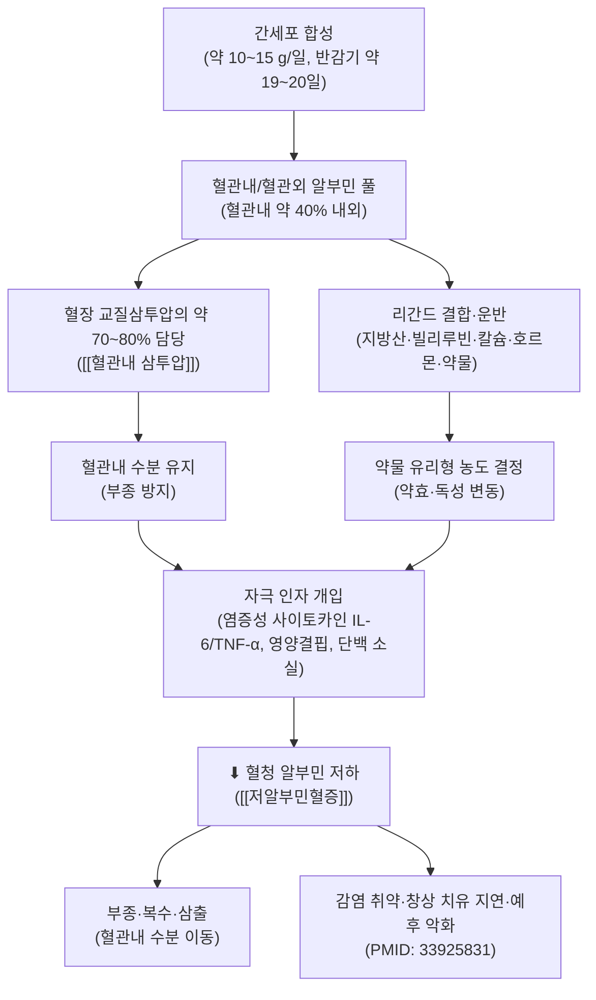
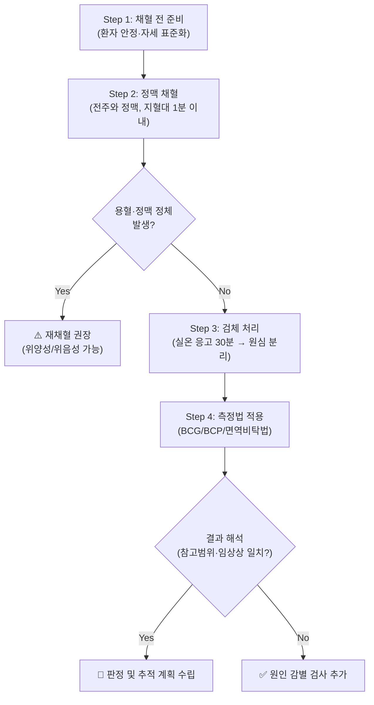
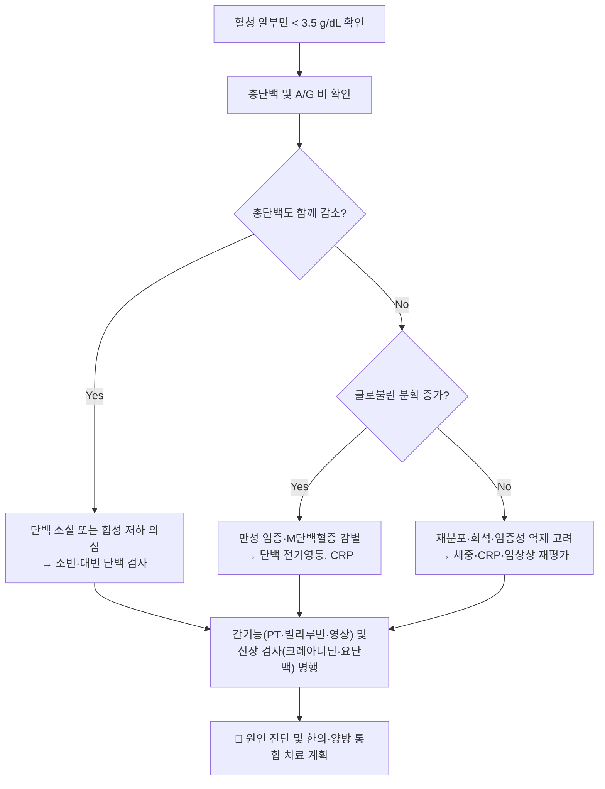

# 🩺 [[알부민]] (Albumin / 白蛋白, Alb)

> **핵심 3줄 요약 (Key Summary)**:
> - 🎯 검사 목적 & 타겟 병소: 혈청 내 가장 풍부한 운반·삼투 조절 단백질을 정량하여 **간 합성능 저하**([[간경변]], [[간부전]]), **단백 소실**([[신증후군]], [[단백소실성 장병증]], 화상), **염증성 재분포**([[패혈증]], [[급성 염증]])를 선별·추적한다. 병소는 [[간]](합성), [[신장]]·[[장관]]·모세혈관벽·[[림프계]](소실·분포)이다.
> - 🔍 검사 시행 프로토콜 & 양성 반응: 표준 정맥 채혈(전주와 정맥, 지혈대 1분 이내 해제) 후 혈청 분리 → BCG/BCP 색소결합법 또는 면역비탁법으로 정량. "양성"에 해당하는 이상 소견은 **참고범위 하한 미만(저알부민혈증)**이며, 수치 자체가 진단명이 아니라 **병태생리의 대리 지표(surrogate marker)**이다.
> - 📊 진단 정확도(민감도·특이도) & 임상적 의의: 단일 질환에 대한 민감도·특이도 개념이 성립하지 않는 **비특이적 전신 지표**이다(질환별 민감도/특이도·LR+ 수치 **근거 미확인**). 추적 검사로서 질병 경과·예후·수술 위험도 평가에 유용하며, 저알부민혈증은 감염 및 사망률 증가와 연관된다(PMID: 33925831, PMID: 30288759).
> - ⚠️ 위양성/위음성 요인 & 검사 금기: 탈수·기립 자세·정맥 정체(지혈대 장시간)는 **위양성 상승**을, 과수화·임신·급성 염증은 **위음성(실제보다 낮게 또는 정상으로 보임)**을 유발한다. 채혈 자체의 절대 금기는 없으나 항응고제 투여 환자에서 출혈·혈종 위험, 말초 정맥 상태 불량 시 채혈 부위 주의. 저알부민혈증은 원인이 아니라 결과이므로 수치만으로 간질환·영양실조로 단정하지 말 것.

---

## 📌 목차
1. [검사 기본 정보 & 진단 목적 (Diagnostic Overview)](#1-검사-기본-정보--진단-목적-diagnostic-overview)
2. [해부학적 유발 메커니즘 & 생체역학적 원리 (Biomechanical Mechanism)](#2-해부학적-유발-메커니즘--생체역학적-원리-biomechanical-mechanism)
3. [표준 검사 시행 절차 (Step-by-Step Clinical Protocol)](#3-표준-검사-시행-절차-step-by-step-clinical-protocol)
4. [양성 반응 판정 기준 & 신경근/조직별 감별 맵핑 (Diagnostic Criteria & Mapping)](#4-양성-반응-판정-기준--신경근조직별-감별-맵핑-diagnostic-criteria--mapping)
5. [연관 검사군 비교 & 다단계 감별 알고리즘 (Differential Battery & Algorithm)](#5-연관-검사군-비교--다단계-감별-알고리즘-differential-battery--algorithm)
6. [양성 소견 시 한의 임상 연계 치료 전략 (Integrative Korean Medicine)](#6-양성-소견-시-한의-임상-연계-치료-전략-integrative-korean-medicine)
7. [💡 사용자 진료실 핵심 필기 & 실전 임상 팁 (원문 보존)](#7--사용자-진료실-핵심-필기--실전-임상-팁-원문-보존)
8. [출처 및 학술 참고 문헌 (References)](#8-출처-및-학술-참고-문헌-references)

> ※ 본 노트는 이학적 검사 템플릿을 **혈액 검사(생화학 검사)** 항목에 맞게 전용(轉用)한 것이다. 따라서 "환자 자세·점진적 부하·양성 유발" 같은 항목은 **채혈 전처치·검체 처리·판정 역치**로 치환하여 서술한다.

---

## 1. 검사 기본 정보 & 진단 목적 (Diagnostic Overview)

| 항목 | 상세 내용 |
| :--- | :--- |
| **검사명 (Test Name)** | Serum Albumin (혈청 알부민 / 白蛋白, Alb) |
| **분류 (Category)** | 혈청 생화학 검사 / 혈장 단백질 정량 / 영양·염증·합성능 스크리닝 지표 |
| **타겟 병소 (Target)** | [[간]] (합성), [[신장]] (사구체·세뇨관 소실), [[장관]] (단백소실성 장병증), 모세혈관 내피 (누출), [[림프계]] (재순환), [[혈관내 삼투압]] |
| **의심 질환 (Suspected Pathologies)** | [[저알부민혈증]], [[간경변]], [[간부전]], [[신증후군]], [[단백소실성 장병증]], [[영양실조]], [[패혈증]], [[만성 염증]], [[화상]], [[아밀로이드증]] |
| **검체 및 용기** | 혈청(SST 응고촉진관) 3–5 mL 또는 혈장(Li-heparin) — **EDTA 혈장은 일부 색소결합법에서 간섭 가능** |
| **참고범위 (Reference Range)** | 통상 **3.5 – 5.0 g/dL** (35 – 50 g/L), 검사실·측정법에 따라 상이 • 경도 저알부민혈증: 3.0 – 3.5 g/dL • 중등도: 2.5 – 3.0 g/dL • 중증: < 2.5 g/dL |
| **진단 정확도 (Diagnostic Accuracy)** | • **민감도 (Sensitivity)**: 단일 질환 대상 수치 **근거 미확인** (비특이적 지표) • **특이도 (Specificity)**: 수치 **근거 미확인** • **양성 우도비 (LR+)**: 해당 없음 — 질환 확진용이 아니라 **경과 추적·위험도 계층화용** |
| **시연 영상 (Video Guide)** | 해당 없음 (표준 정맥 채혈 술기로 대체) |

### 1) 임상적 활용 포인트
* **간 합성능 평가**: 알부민은 반감기가 길어(약 19–20일) **급성 간손상에서는 정상**일 수 있고, 만성 [[간경변]]에서 주로 감소한다. 따라서 급성 간기능 악화 판정에는 [[프로트롬빈 시간]](PT)이 더 민감하다.
* **단백 소실 vs 합성 저하 감별**: [[소변 단백 정량]](24시간 요단백, 요 알부민/크레아티닌 비)과 [[총단백]], [[A/G 비]]를 함께 봐야 소실성인지 합성저하인지 구분된다.
* **영양 지표의 함정**: 알부민은 **음성 급성기 반응단백(negative acute phase reactant)**이므로, 실제 영양결핍이 없어도 염증·감염·수술 직후에 급격히 감소한다. 저알부민혈증을 곧 "영양 부족"으로 등치시키면 오진이 된다(PMID: 30288759).
* **약물 동태 감시**: 알부민은 다수의 산성·소수성 약물의 결합 운반체로서, 저알부민혈증 시 **유리형(free fraction) 약물 농도가 상승**하여 독성이 나타날 수 있다(PMID: 7027277).

---

## 2. 해부학적 유발 메커니즘 & 생체역학적 원리 (Biomechanical Mechanism)

> 이학적 검사 템플릿의 "기계적 압박 → 신경 허혈" 도식을 **"합성 → 분포 → 삼투·운반 기능 → 병태생리"** 흐름으로 치환한 다이어그램이다.

### 1) 알부민의 분자·생리학적 배경
* 알부민은 **585개 아미노산 단일 폴리펩타이드**, 분자량 약 **66.5 kDa**의 구형 단백질로, 전기영동상 α 분획 중 가장 앞쪽(음극에서 빠르게 이동)에 위치한다(PMID: 4919632).
* 간세포에서 합성되어 혈관내·혈관외 구획을 순환하며, 혈관내 삼투압의 대부분을 담당하고 다양한 내인성·외인성 리간드를 가역적으로 결합·운반한다(PMID: 4919632, PMID: 4898690).
* 리간드 결합의 분자적 측면(결합 부위 이질성, 다중 결합 자리, 입체적 상호작용)은 Kragh-Hansen(1981)이 정리하였다(PMID: 7027277). 최근에는 나프탈이미드 계열 형광단 접합체를 이용해 알부민 결합 양상을 분광학·분자 도킹으로 규명하는 연구도 진행되었다(PMID: 38676621).

### 2) 저알부민혈증 발생의 병태생리학적 기전
| 기전 | 대표 상황 | 기전 요약 |
| :--- | :--- | :--- |
| **① 합성 저하** | [[간경변]], [[만성 간염]], [[영양실조]], [[단백질 결핍]] | 기능적 간세포 질량 감소 + 아미노산 공급 부족 |
| **② 염증성 재분포·합성 억제** | [[패혈증]], [[급성 염증]], 수술·외상 후 | IL-6·TNF-α 등이 알부민 유전자 전사를 억제하고 모세혈관 투과성을 증가시켜 혈관외 이동을 촉진(PMID: 30288759) |
| **③ 단백 소실** | [[신증후군]], [[단백소실성 장병증]], [[화상]], [[투석]] | 신장·장관·피부를 통한 직접 소실 |
| **④ 희석** | 대량 수액 요법, 과수화, [[저나트륨혈증]] 상황 | 혈장량 증가에 따른 상대적 농도 저하 |
| **⑤ 분포 이상** | [[간경변]] 복수, [[부종]] | 혈관외 구획(복수·간질액)으로의 재분포 |

* Soeters & Wolfe(2019)는 저알부민혈증이 단순 영양 지표가 아니라 **전신 염증과 질환 중증도의 통합 지표**임을 강조하였다(PMID: 30288759).
* Wiedermann(2021)은 저알부민혈증이 감염의 **대리 지표(surrogate)이면서 동시에 감염 취약성을 높이는 원인적 인자(culprit)**로 작용할 수 있음을 정리하였다(PMID: 33925831).

### 3) 통증 유발의 신경생리학적 기전 → 임상 증상 발생 기전으로의 치환
* 알부민 저하 자체는 통증을 유발하지 않는다. 임상 증상은 **삼투압 붕괴에 따른 부종**(하지 부종, 폐부종, 복수, 흉수)과 **순환혈장량 감소에 따른 저혈압·신관류 저하**로 나타난다.
* 저알부민혈증이 지속되면 창상 치유 지연, 장부종에 의한 흡수 장애(악순환), 면역 기능 저하가 동반된다. 정확한 인과 기전의 세부 경로는 개별 질환별로 이질적이므로 **근거 미확인** 항목이 많다.

---

## 3. 표준 검사 시행 절차 (Step-by-Step Clinical Protocol)

### Step 1: 환자 준비 및 채혈 전 세팅 (Starting Position)
* 환자는 **최소 5분 이상 앉거나 누운 상태로 안정**한 뒤 채혈한다. 기립 자세를 오래 유지하면 혈장량 감소로 혈청 단백 농도가 실제보다 **다소 높게** 측정될 수 있다.
* 통상 **공복은 필수는 아니나**, 같은 환자를 추적할 때는 **동일 시간대·동일 자세·동일 검사실**에서 채혈하는 것이 변동을 줄인다.
* 탈수·과수화 상태, 최근 수액 투여 여부, 수혈 여부를 반드시 기록한다.

### Step 2: 정맥 채혈 (Venipuncture)
* 전주와 정맥(antecubital vein)을 우선 사용한다. **지혈대(tourniquet)는 1분 이내에 해제**해야 하며, 오래 묶으면 정맥 정체로 단백 농도가 상승(위양성 상승)한다.
* 주먹 쥐기(fist clenching)를 반복적으로 과도하게 시키면 칼륨·근육 효소가 상승하고 용혈 위험이 커지므로 삼간다.
* **용혈(hemolysis)** 은 색소결합법(BCG 등)에서 간섭을 일으킬 수 있으므로 격렬한 흡인을 피한다.

### Step 3: 검체 처리 및 보관 (Specimen Handling)
* SST 튜브는 **실온에서 완전 응고(약 30분)** 후 원심 분리한다.
* 분리된 혈청은 즉시 검사하거나 2–8 ℃ 냉장 보관(장기 보관 시 냉동)한다. 장시간 상온 방치 시 단백 변성·증발에 의한 농축이 일어난다.

### Step 4: 측정법 및 결과 해석 (Measurement & Interpretation)
| 측정법 | 원리 | 임상적 유의점 |
| :--- | :--- | :--- |
| **BCG 색소결합법** | Bromocresol green이 알부민과 결합 → 흡광도 측정 | 널리 쓰이나, 저알부민 영역에서 **과대평가**될 수 있고 다른 단백과의 비특이적 결합 가능성 |
| **BCP 색소결합법** | Bromocresol purple 결합 | 알부민에 더 특이적이나, 일부 상황에서 과소평가 보고 |
| **면역비탁법/면역혼탁법** | 항알부민 항체와의 반응 | 표준화가 잘 되어 있고 자동화에 적합 |
| **단백 전기영동** | 분획 정량 | [[다발성 골수종]], [[M단백혈증]] 감별에 필요 |

* **중요**: 검사법 간 편차가 존재하므로, **수치의 절대값보다 추세(trend)와 임상상의 일치 여부**를 우선한다.

### Step 5: 반응 평가 및 추적 (Follow-up & Safety)
* 저알부민혈증이 확인되면 원인 감별을 위한 2차 검사([[간기능 검사]], [[신기능 검사]], [[소변 단백 정량]], [[C반응성 단백]], [[영양 평가]])를 즉시 설계한다.
* 알부민 수치는 반감기가 길어 **수일 내 급격한 변화는 체액 이동·수액 요법·염증에 의한 것**일 가능성이 크다. 단기간 추적으로 임상 결정을 내리지 않는다.

---

## 4. 양성 반응 판정 기준 & 신경근/조직별 감별 맵핑 (Diagnostic Criteria & Mapping)

> 본 검사에서 "양성"은 이학적 검사의 유발 통증이 아니라 **참고범위를 벗어난 이상 수치**를 의미하며, 맵핑 표는 신경근 분절 대신 **원인 장기별 감별**로 치환한다.

* **양성(이상) 반응 (True Positive)**:
  * 혈청 알부민 **3.5 g/dL 미만**으로 측정되고, 임상적으로 부종·복수·체중 변화·창상 치유 지연 등 부합하는 소견이 동반될 때.
* **정상 반응 (Negative)**:
  * 참고범위 내이며, [[총단백]]·[[A/G 비]]·[[C반응성 단백]] 등 연관 지표도 정상 범위일 때.
* **가양성(False Positive) — 실제보다 낮게 나오는 경우**:
  * 과수화·대량 수액·임신·장시간 와위, 검체 희석 오류, 급성 염증기(음성 급성기 반응).
* **가음성(False Negative) — 실제보다 높게 나오는 경우**:
  * 탈수, 장시간 지혈대 사용, 기립 자세 채혈, 검체 증발·농축, BCG법의 저알부민 과대평가.

### 원인 장기/기전별 감별 맵핑

| 주된 병소 / 기전 | 전형적 동반 소견 | 확인해야 할 지표 | 감별 포인트 |
| :--- | :--- | :--- | :--- |
| **[[간]] 합성 저하** | 황달, 복수, 식도정맥류, 혈액응고 지연 | [[AST]]/[[ALT]], [[빌리루빈]], [[프로트롬빈 시간]], [[혈소판]] | 알부민 단독보다 PT 연장·혈소판 감소 동반 시 간경변 시사 |
| **[[신장]] 소실** | 안검 부종, 전신 부종, 거품뇨 | [[24시간 요단백]], 요 알부민/크레아티닌 비, [[혈청 크레아티닌]] | 총단백도 함께 감소, 혈청 콜레스테롤 상승 |
| **[[장관]] 소실** | 만성 설사, 체중 감소, 부종 | 대변 α1-항트립신 청소율, 내시경 | 간·신장 이상 없이 알부민만 감소 |
| **[[염증]]·[[감염]]** | 발열, CRP 상승, 백혈구 변화 | [[C반응성 단백]], [[프로칼시토닌]], [[적혈구침강속도]] | 영양 상태와 무관하게 수치 급감(PMID: 30288759, PMID: 33925831) |
| **영양 결핍** | 근감소, 체중 감소, 피부·모발 변화 | [[전알부민]], [[림프구 수]], 체성분 평가 | 단독 영양 결핍만으로는 알부민이 크게 떨어지지 않는 경우가 많음 |
| **재분포·희석** | 부종, 복수, 체중 증가 | 체중 추이, [[헤마토크리트]], 중심정맥압 | 총단백 대비 A/G 비 변화가 단서 |

---

## 5. 연관 검사군 비교 & 다단계 감별 알고리즘 (Differential Battery & Algorithm)

| 검사명 | 검사 수기 및 동작 | 병태생리적 원리 | 임상적 역할 (선별 vs 확진) |
| :--- | :--- | :--- | :--- |
| [[알부민]] (본 검사) | 정맥 채혈 → 혈청 단백 정량 | 합성·소실·분포의 통합 반영 | **경과 추적·위험도 계층화** (비특이적) |
| [[총단백]] | 동일 검체에서 함께 측정 | 알부민 + 글로불린 총합 | 알부민 단독 저하인지, 전반적 단백 저하인지 감별 |
| [[A/G 비]] | 총단백 − 알부민으로 계산 | 글로불린 증가(염증·골수종) 감별 | [[M단백혈증]], [[만성 염증]] 선별 |
| [[전알부민]] (Prealbumin) | 혈청 정량 | 반감기가 매우 짧아 **영양·염증의 급성 변화**를 더 빨리 반영 | 급성 영양 상태 추적에 유리(정확한 반감기 수치는 검사실 참고치 확인) |
| [[C반응성 단백]] (CRP) | 혈청 정량 | 급성기 반응단백 | 알부민 저하가 **염증성인지 영양성인지** 감별 |
| [[24시간 요단백]] / 요 알부민·크레아티닌 비 | 24시간 요 수집 또는 임의뇨 | 신사구체 단백 소실 정량 | [[신증후군]] 확진 방향 |
| [[프로트롬빈 시간]] (PT/INR) | 혈장 응고 시간 측정 | 단반감기 응고인자(VII) 합성 반영 | **급성 간 합성능 저하** 판정에 우수 |
| [[복부 초음파]] / [[간 탄성도 검사]] | 영상 검사 | 간 실질·문맥압 반영 | 간경변·복수 평가 |

### 다단계 감별 알고리즘 (요약)

---

## 6. 양성 소견 시 한의 임상 연계 치료 전략 (Integrative Korean Medicine)

> ⚠️ 아래 내용은 **한의학적 변증 논리에 근거한 일반적 임상 전략**이다. 제공된 논문(PMID: 4919632, 4898690, 7027277, 38676621, 30288759, 33925831)은 알부민의 생화학·병태생리를 다룬 것으로, **한약·침구가 혈청 알부민 수치를 직접 상승시킨다는 RCT 근거는 확인되지 않았다(근거 미확인)**. 따라서 한의 치료는 "수치 교정"이 아니라 **부종·소화기 증상·전신 상태(기허·습담·어혈) 개선**을 목표로 삼고, 원인 질환에 대한 양방 검사·치료를 병행해야 한다.

* **침구 및 전침 치료 (Acupuncture & EA)**:
  * 부종·소화기 허약 변증에서 [[족삼리]](ST36), [[삼음교]](SP6), [[음릉천]](SP9), [[수분]](CV9), [[기해]](CV6), [[중완]](CV12), [[복溜]] 등을 배합.
  * 복수·전신 부종 시 [[수도]](CV5)·[[기해]](CV6) 부위 자침 시 **복벽 천자 깊이에 주의**하며, 간경변 환자는 출혈 경향([[혈소판]]·PT 확인)을 반드시 사전 평가한다.
  * 전침은 환자 상태에 맞춰 저빈도·저강도로 적용하여 국소 순환 개선을 도모한다.
* **약침 요법 (Pharmacopuncture)**:
  * 변증에 따른 약침을 부종 부위·복부 경혈·배수혈에 소량 주입하는 방식이 임상에서 활용되나, **저알부민혈증 자체를 적응증으로 한 근거는 확인되지 않음**. 감염 위험이 높은 환자(저알부민혈증 자체가 감염 취약 인자임, PMID: 33925831)에서는 **무균 조작을 최우선**으로 한다.
* **추나 치료 (Chuna Therapy)**:
  * 복수·부종으로 복부 팽만이 심하거나 식도정맥류·혈소판 감소가 있는 간경변 환자에서는 **복부 직접 압박 기법은 금기**. 흉추·요추 이완, 횡격막 가동을 돕는 **경도의 수기 이완** 정도가 안전하다.
  * 전신 부종 환자는 체위 변환 시 저혈압 위험이 있으므로 급격한 체위 변경을 피한다.
* **한약 치료 (Herbal Medicine)** — 변증별 예시:
  * 기허·비위허약: [[보중익기탕]], [[사군자탕]], [[육군자탕]], [[십전대보탕]] (인삼·황기·백출·복령·당귀 등).
  * 수습·부종: [[오령산]], [[저령탕]], [[오림산]], [[방기황기탕]] (이수·삼습 목적).
  * 어혈·간울: [[시호소간산]], [[혈부축어탕]] 계열 — 단, **간기능 저하 환자에서 간독성 우려 약물(예: 일부 자극성 생약)의 사용은 피하고 감량·단기 사용**.
  * **중요 안전 사항**: 간경변·신증후군 환자에서 한약을 투여할 때는 정기적으로 [[알부민]], [[AST]]/[[ALT]], [[빌리루빈]], [[프로트롬빈 시간]], [[신기능 검사]]를 추적하여 악화 여부를 반드시 감시한다.
* **약물·영양 상담 (보조 전략)**:
  * 저알부민혈증 시 **단백결합률이 높은 약물**(일부 항응고제, 항경련제, 경구용 혈당강하제 등)의 유리형 농도가 상승할 수 있으므로(PMID: 7027277), 복용 중인 약물의 용량·독성 여부를 양방과 협진하여 확인한다.
  * 단백질·열량 섭취 상담은 필요하나, **염증이 활발한 상태에서는 영양 보충만으로 알부민이 교정되지 않는다**는 점을 환자에게 설명한다(PMID: 30288759).

---

## 7. 💡 사용자 진료실 핵심 필기 & 실전 임상 팁 (원문 보존)

* **사용자 원문 필기 (100% 보존)**:
  * 제공된 사용자 원문 필기는 없음(본 노트 작성 시 별도 수기 자료가 입력되지 않았다). 추후 원장님 필기 원문을 이 항목에 그대로 붙여 넣고 보존할 것.
* **진료실 실전 노하우 & 안전 가이드** (일반 임상 원칙):
  1. **"알부민 낮음 = 영양실조"로 단정 금지**: 알부민은 음성 급성기 반응단백이다. 감기·수술·염증만으로도 일시적으로 떨어진다. [[C반응성 단백]]과 임상상을 항상 함께 본다(PMID: 30288759).
  2. **반감기가 길다는 사실을 기억**: 급성 변화는 대개 체액 이동·수액 요법·검체 문제이지 실제 합성능 변화가 아니다. 추세를 2~4주 간격으로 본다.
  3. **부종 환자에서 원인 3분류 습관화**: ① 간 합성 저하 ② 신장 소실 ③ 염증·재분포. 이 세 갈래로 나눠 [[소변 단백]], [[간기능 검사]], [[C반응성 단백]]을 세트로 주문한다.
  4. **감염 위험 인자로 인식**: 저알부민혈증 자체가 감염에 취약한 상태를 만들 수 있으므로, 침·약침 시술 시 **피부 소독과 무균 조작을 평소보다 강화**한다(PMID: 33925831).
  5. **약물 독성 감시**: 저알부민혈증 환자에게 새 약을 추가하거나 용량을 올릴 때는 단백결합률이 높은 약물인지 확인하고, 필요 시 양방과 상의하여 유리형 농도·부작용을 모니터링한다(PMID: 7027277).
  6. **검사법 간 편차 주의**: 같은 환자라도 검사실·측정법(BCG vs BCP vs 면역비탁법)에 따라 수치가 달라질 수 있으므로, 추적은 **가능하면 동일 검사실**에서 시행한다.
  7. **채혈 술기 기본 준수**: 지혈대 1분 이내 해제, 격렬한 흡인 금지, 용혈 검체 재채혈 — 위양성/위음성의 가장 흔한 원인은 검체 문제이다.

---

## 8. 출처 및 학술 참고 문헌 (References)

1. **Peters T Jr (1970)**. *Serum albumin*. **Adv Clin Chem**. PMID: 4919632
   - **[연구 요약]**: 혈청 알부민의 분자 구조·합성·분해·분포·생리 기능(삼투 조절, 리간드 운반)을 포괄적으로 정리한 고전적 종설. 알부민 검사의 생화학적 토대를 제공한다.
2. **Rothschild MA, Oratz M (1969)**. *Serum albumin*. **Am J Dig Dis**. PMID: 4898690
   - **[연구 요약]**: 알부민의 대사 역학(합성률, 분해율, 구획 간 이동)과 소화기 질환에서의 변화를 다룬 종설. 간 합성능 지표로서의 의의를 논한다.
3. **Kragh-Hansen U (1981)**. *Molecular aspects of ligand binding to serum albumin*. **Pharmacol Rev**. PMID: 7027277
   - **[연구 요약]**: 알부민의 다중 리간드 결합 부위와 결합 특이성·친화도를 분자 수준에서 정리. **저알부민혈증 시 약물 유리형 농도 상승**이라는 임상적 함의의 이론적 근거가 된다.
4. **Gupta R, Paul K (2024)**. *Investigating the Serum Albumin Binding Behavior of Naphthalimide Based Fluorophore Conjugates: Spectroscopic and Molecular Docking Approach*. **ChemMedChem**. PMID: 38676621
   - **[연구 요약]**: 나프탈이미드 기반 형광단 접합체의 혈청 알부민 결합 양상을 분광학 및 분자 도킹으로 분석한 연구. 알부민-리간드 상호작용 연구 방법론과 약물 설계 응용 가능성을 제시한다.
5. **Soeters PB, Wolfe RR (2019)**. *Hypoalbuminemia: Pathogenesis and Clinical Significance*. **JPEN J Parenter Enteral Nutr**. PMID: 30288759
   - **[연구 요약]**: 저알부민혈증의 병태생리를 합성 저하·염증성 억제·모세혈관 누출·재분포로 정리하고, 알부민이 단순 영양 지표가 아니라 **염증·질환 중증도의 지표**임을 강조하였다.
6. **Wiedermann CJ (2021)**. *Hypoalbuminemia as Surrogate and Culprit of Infections*. **Int J Mol Sci**. PMID: 33925831
   - **[연구 요약]**: 저알부민혈증이 감염의 대리 지표이면서 감염 취약성을 증가시키는 원인적 인자로 작용할 수 있음을 검토하였다. 감염 위험이 높은 환자에서의 무균적 시술 원칙과 임상적 주의를 뒷받침한다.