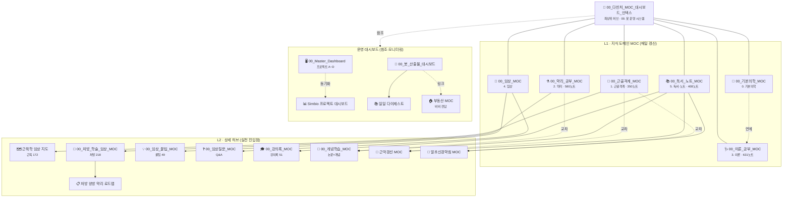

# 🧙 다빈치 관리 MOC & 대시보드 인덱스

> **다빈치(데일리 정원사)가 관리하는 지식 지도의 최상위 허브(Root Hub)**.
> 이 파일 아래로 도메인 MOC → 상세 허브가 **가지(트리) 구조**로 연결됩니다.
> 매일 00:00 크론이 이 인덱스(A·B 목록)를 기준으로 순회하며 MOC를 최신 상태로 유지합니다.
> 항목 추가/변경 시 이 인덱스를 먼저 수정하세요 — 이 파일이 관리 기준(Source of Truth)입니다.

---

## 🌳 전체 구조도 (Root Hub → Branches)



> **범례**: 실선 = 소속(하위) · 점선 = 교차/참조 · `DB` 묶음 = 타 봇·운영 전담(모니터링만)

---

## 🌿 텍스트 트리 (계층 요약)

```
🧙 00_다빈치_MOC_대시보드_인덱스  ← 최상위 허브 (Root Hub)
│
├── 📖 00_기본의학_MOC          (L1 · 기본의학 학습 큐)
│      └─ (학습 큐 8대 모듈 — 화·목·토 브리핑 연계)
│
├── 🦴 00_근골격계_MOC          (L1 · 1. 근골격계 공부)
│      ├─ 🗺️ 근육학 임상 지도    (L2 · 근육 172 상세)
│      ├─ 🧵 근막경선 MOC        (L2 · 교차: 책 기반 학습)
│      └─ 💉 말초신경약침 MOC    (L2 · 교차: 신경·약침)
│
├── ⚗️ 00_약리_공부_MOC          (L1 · 2. 약리 공부)
│      ├─ 📜 00_처방_학술_임상_MOC (L2 · 처방 218)
│      │     └─ 📋 처방 양방 약리 로드맵 (L3 · 진행 기록)
│      └─ 🧪 개념학습 연계        (교차)
│
├── 🩺 00_이론_공부_MOC          (L1 · 3. 이론 공부 — 최대 도메인)
│      └─ (질환 389 · 호르몬 94 · 영양 78 · 의학개념)
│
├── 🏥 00_임상_MOC              (L1 · 4. 임상)
│      ├─ 💡 00_임상_꿀팁_MOC    (L2)
│      └─ ❓ 00_임상질문_MOC     (L2)
│
└── 📚 00_독서_노트_MOC          (L1 · 5. 독서·노트)
       ├─ 🎓 00_강의록_MOC       (L2)
       ├─ 🧪 00_개념학습_MOC     (L2 · 자동 갱신 우선)
       ├─ 🧵 근막경선 MOC        (L2 · 물리 소속)
       ├─ 💉 말초신경약침 MOC    (L2 · 물리 소속)
       └─ 📚 독서 대시보드        (L2 · 대시보드)

※ 병렬 축 (참조): 🖥️ Master_Dashboard(프로젝트) · 🤖 봇 산출물 대시보드(산출물) · 📊 Simbio 프로젝트 대시보드
```

---

## 🗺️ A. 지식 도메인 MOC — L1 (매일 갱신 대상)

| MOC | 위치 | 담당 영역 | 비고 |
| :--- | :--- | :--- | :--- |
| ⭐ [[00_근골격계_MOC]] | `1. 근골격계 공부/` | 근육 172 · 신경 73 · 이학적 검사 87 · 추나 | 2026-09-04 신설 |
| ⭐ [[00_약리_공부_MOC]] | `2. 약리 공부/` | 본초 252 · 처방 218 · 성분 91 · 양약 16 | 2026-09-04 신설 |
| ⭐ [[00_이론_공부_MOC]] | `3. 이론 공부/` | 질환 389 · 호르몬 94 · 영양 78 · 의학개념 | 2026-09-04 신설 (최대) |
| ⭐ [[00_임상_MOC]] | `4. 임상/` | 꿀팁·Q&A·실습 진료 허브 | 2026-09-04 신설 |
| ⭐ [[00_독서_노트_MOC]] | `5. 독서, 노트/` | 강의록·논문·독서·일일노트 총괄 | 2026-09-04 신설 |
| ⭐ [[00_일일노트_MOC]] | `00. 봇 운영 시스템/일일노트/` | 실사용 일일 기록 허브 (2026-09/1주차 등) | 2026-09-04 신설·재작성 · 매일 최근 목록 갱신 |
| [[00_기본의학_MOC]] | `0. 기본의학 공부/` | 기본의학 학습 큐 (8대 모듈) | 화·목·토 12:30 브리핑 |
| [[00_처방_학술_임상_MOC]] | `2. 약리 공부/처방/` | 처방 218종 · 12대 중심 계통수 | L2 (약리 MOC 하위) |
| [[00_임상_꿀팁_MOC]] | `4. 임상/임상 꿀팁 & 실전 노하우/` | 임상 꿀팁 49종 | L2 (임상 MOC 하위) |
| [[00_임상질문_MOC]] | `4. 임상/임상 질문 아카이브/` | 닥터 허 Q&A | L2 (임상 MOC 하위) |
| [[00_개념학습_MOC]] | `5. 독서, 노트/논문 리뷰/` | 논문×개념 학습 | L2 · **자동 갱신 명시 — 우선** |
| [[00_강의록_MOC]] | `5. 독서, 노트/강의록/` | 강의록 51편 통합 | L2 (독서노트 MOC 하위) |
| [[00_근막경선해부학_MOC]] | `5. 독서, 노트/독서/근막경선/` | Anatomy Trains | L2 · 교차: 근골격 |
| [[00_말초신경약침의학_MOC]] | `5. 독서, 노트/독서/말초신경약침의학/` | 말초신경 약침 | L2 · 교차: 근골격 |

### 📍 특수 허브 (파일명에 MOC가 없어도 실질 MOC)

| 노트 | 위치 | 담당 영역 | 비고 |
| :--- | :--- | :--- | :--- |
| [[00_Simbio_근육학_임상_지도]] | `00. 인박스/` | 근육 172 · 2,834 링크 | L2 · ⚠️ `1. 근골격계 공부/` 이동 검토 |
| [[00_처방_양방_약리_로드맵_기록]] | `2. 약리 공부/처방/` | 처방 현대화 진행 | L3 · 참조·무단 수정 금지 |

### 👀 타 봇 전담 (모니터링·제안만)

| 노트 | 위치 | 전담 |
| :--- | :--- | :--- |
| [[부동산 MOC]] | `00. 봇 운영 시스템/보고서/부동산 브리핑/` | 비비 |

---

## 📊 B. 운영·프로젝트 대시보드 (참조·모니터링)

> 다빈치 산출물 링크 누락 확인 시에만 추가 가능. 타 봇 전담/자동 갱신분은 직접 수정 금지.

| 대시보드 | 위치 | 관리 주체 | 갱신 상태 |
| :--- | :--- | :--- | :--- |
| [[00_Master_Dashboard]] | `_AI_OS/` | 4대 프로젝트 A~D 통합 제어판 | dataview 자동 |
| [[00_Simbio_프로젝트_대시보드]] | `00. 인박스/` | 지식 볼트+AI OS 종합 | ⚠️ 2026-08-31 이후 미갱신 |
| [[00_Project_A_Master_Roadmap]] | `_AI_OS/10_Projects/Project_A_Medical/` | Project A 로드맵 | — |
| [[A-1-1_Muscle_Knowledge_Tracker]] | `_AI_OS/10_Projects/Project_A_Medical/` | 근육 지식 진도표 | — |
| [[00_봇_산출물_대시보드]] | `00. 봇 운영 시스템/` | 전체 봇 산출물 허브 | 카이 22:00 자동 |
| [[00. 봇 운영 시스템/일일 다이제스트\|일일 다이제스트]] | `00. 봇 운영 시스템/` | 일자별 산출물 링크 | 크론 저장 시 자동 |
| [[📊 주식 브리핑 대시보드]] | `00. 봇 운영 시스템/보고서/주식 브리핑/` | 비비 | — |
| [[00. 봇 운영 시스템/생활관리/대시보드\|생활관리 대시보드]] | `00. 봇 운영 시스템/생활관리/` | 아린·비오 | — |
| [[계획표 대시보드]] | `00. 봇 운영 시스템/일정관리/` | 아린 | — |
| [[📚 독서 대시보드]] | `5. 독서, 노트/독서/` | 비오 | — |

---

## 🔎 설계 검토 결과 (2026-09-04)

**확정 구조**: 이 인덱스가 **다빈치 지식 큐레이션의 최상위 허브(Root Hub)** → L1 지식 도메인 MOC 6개 → L2 상세 허브로 뻗는 트리.

1. **볼트 최상위 3대 축과의 관계**: 볼트 운영에는 서로 평행한 3개 최상위 허브가 존재
   - 🖥️ `00_Master_Dashboard` — 프로젝트(A~D) 제어 축
   - 🤖 `00_봇_산출물_대시보드` — 산출물 허브 축
   - 🧙 **이 인덱스** — 지식 MOC·큐레이션 축
   → 이 인덱스는 **지식 지도 영역의 루트**이며, 다른 두 축과는 점선 참조로 연결.

2. **물리 위치 vs 지식 소속**: `근막경선·말초신경약침 MOC`는 물리적으로 `5. 독서(책 학습)`에 있고, 내용상 근골격계와 강하게 교차 → 트리상 **이중 연결(소속 + 교차 점선)**으로 표현.

3. **개선 제안 (승인 시 진행)**:
   - 근육학 지도를 `00. 인박스` → `1. 근골격계 공부/`로 이동 (L2 위치 정합)
   - `00_Simbio_프로젝트_대시보드`의 8/31 이후 정체 상태 갱신
   - 기본의학 MOC ↔ 이론 공부 MOC의 학습 경계 명확화 (연계선 표기 완료)

---

## ⏰ C. 다빈치 일일 루틴 (크론 5종)

| 시각 | 크론 | 산출물 위치 |
| :--- | :--- | :--- |
| 00:00 | 정원 가꾸기 (고아 노트 · MOC 동기화 · 공백 분석 · 인덱스 유지보수) | `_AI_OS/30_Sprint_Logs/YYYY-MM-DD_일일_정원사_및_MOC_리포트.md` |
| 00:30 | B-7 학술 논문·PubChem MoA 패치 | 약리/본초/성분 노트 하단 |
| 00:50 | 일일 회고 & 큐레이션 리포트 | `_AI_OS/30_Sprint_Logs/` |
| 08:20 | 아침 브리핑 | — |
| 14:00 | Clinical Master-Dive | `30_Sprint_Logs/Clinical_Master_Dive_YYYYMMDD.md` |

---

## 📌 작업 규칙

1. **관리 기준**: 이 인덱스(A·B)를 기준으로 00시 크론이 순회.
2. **새 허브 발견 시**: 이 인덱스에 등록 → 크론이 자동 인지.
3. **백링크 규칙**: 모든 노트명은 `[[ ]]` 위키링크.
4. **보존 원칙**: 사용자 내용 100% 보존 (non-destructive).
5. **무단 수정 금지**: 타 봇 전담분은 제안만.

---
_🕐 최초 구축: 2026-09-04 (다빈치) — 이 인덱스도 00시 크론이 최신 상태로 유지_
