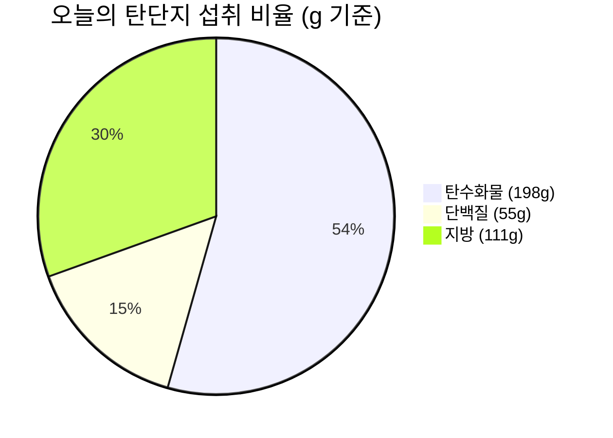

# 👑 비오님의 프리미엄 자기관리 대시보드

> [!success] 🎯 오늘의 건강 목표 및 규칙
> - 🌅 **아침**: 공복 유지 (클린 단식)
> - ☀️ **점심**: 12:00 ~ 13:00 (든든한 클린 식단)
> - 🌙 **저녁**: 18:00 이후 (가볍고 영양가 있는 식단)
> - 💧 **수분 섭취**: 목표 2.0L (8잔)
> - 🚶 **운동 · 걸음**: 목표 10,000보
> - 🔥 **운동 · 소모**: 목표 600 kcal
> - ⏱️ **운동 · 시간**: 목표 30분

---

## 🏃 운동 & 활동량 (Exercise)

> 📌 **2026-09 1주차 운동 현황** (이번 주 4일 활동 · 총 걸음 9,444보 · 총 소모 6,067 kcal)

| 항목 | 주간 목표 | 달성 | 달성률 | 게이지 |
| :---: | :---: | :---: | :---: | :--- |
| 🚶 걸음 | 70,000 | 9,444 | <progress value="13" max="100"></progress> 13% | ⚪⚪⚪⚪⚪ |
| 🔥 소모 칼로리 | 4,200 kcal | 6,067 | <progress value="100" max="100"></progress> 100% | 🟩🟩🟩🟩🟩 |
| ⏱️ 운동 시간 | 210분 | 85분 | <progress value="40" max="100"></progress> 40% | 🟩🟩⚪⚪⚪ |

### 🗓️ 이번 주 일별 운동 기록

| 날짜 | 요일 | 걸음 | 소모 kcal | 시간 | 목표 달성 |
| :---: | :---: | :---: | :---: | :---: | :---: |
| 09-01 | 화 | 3,110 | 1,995 | 45분 | <progress value="65" max="100" style="accent-color: #8b5cf6;"></progress> 65% |
| 09-02 | 수 | 1,626 | 1,675 | - | <progress value="58" max="100" style="accent-color: #8b5cf6;"></progress> 58% |
| 09-03 | 목 | 3,693 | 1,507 | 40분 | <progress value="68" max="100" style="accent-color: #8b5cf6;"></progress> 68% |
| 09-04 | 금 | 1,015 | 890 | - | <progress value="55" max="100" style="accent-color: #8b5cf6;"></progress> 55% |
| 09-05 | 토 | - | - | - | ⬜ (이후) |
| 09-06 | 일 | - | - | - | ⬜ (이후) |
| 09-07 | 월 | - | - | - | ⬜ (이후) |

## 📈 이번 주 영양 & 칼로리 달성 현황 (Weekly Progress)

| 요일 | 날짜 | 섭취 칼로리 | 탄수화물 | 단백질 | 지방 | 물 섭취 | 컨디션 |
| :---: | :---: | :---: | :---: | :---: | :---: | :---: | :---: |
| **월** | 08-31 | - | - | - | - | - | - |
| **화** | 09-01 | 1,612 kcal | 217g | 49g | 61g | 💧 (3/8) | 양호 |
| **수** | 09-02 | 1,250 kcal | 136g | 65g | 38g | 💧 (0/8) | 양호 |
| **목** | 09-03 | 1,970 kcal | 241g | 69g | 57g | 💧 (3/8) | - |
| **금** | 09-04 | 2,855 kcal | 198g | 55g | 111g | - | - |
| **토** | 09-05 | - | - | - | - | - | - |
| **일** | 09-06 | - | - | - | - | - | - |

---

## 🍽️ 오늘의 식사 기록 (2026-09-04 · 금)

| 끼니 | 시간 | 메뉴 | kcal |
| :---: | :---: | :--- | :---: |
| 🌅 아침 | - | 공복 유지 ✅ | - |
| ☀️ 점심 | 13:30 | 햇반 210g + 햄 200g + 계란 2개 | 1,005 |
| 🍰 간식 | 20:30 | 케이크 3조각 | 1,050 |
| 🌙 저녁 | 23:00 | 소주 (2병) | 800 |

📄 [[식단기록/2026-09/1주차/2026-09-04|오늘의 상세 식단 기록 보러가기]]

---

## 🔋 영양성분 및 탄단지 비율 분석 (Macro Nutrition Breakdown)

> [!tip] 💡 오늘의 영양 섭취 요약
> 점심+케이크+소주로 2,855 kcal — 목표(1,600)를 꽤 넘었어요. 오늘은 금요일이니까… 내일은 가볍게!

### 1. 영양소별 상세 달성률
- **🔥 칼로리 (목표 1,600 kcal)**
  🔥🔥🔥🔥🔥🔥🔥🔥🔥🔥🔥🔥🔥🔥🔥🔥🔥🔥⚪ **178%** (2,855 / 1,600 kcal)

- **🍞 탄수화물 (목표 200g)**
  🟦🟦🟦🟦🟦🟦🟦🟦🟦🟦⚪ **99%** (198g / 200g)

- **🥩 단백질 (목표 130g)**
  🟪🟪🟪🟪⚪⚪⚪⚪⚪⚪ **42%** (55g / 130g)

- **🟡 지방 (목표 60g)**
  🟨🟨🟨🟨🟨🟨🟨🟨🟨🟨🟨🟨🟨🟨🟨🟨🟨🟨🟨⚪ **185%** (111g / 60g)

### 2. 탄단지 비율 파이 차트

---

## 📂 빠른 이동 (Quick Links)
- [[식단기록/2026-09/1주차/2026-09-04|오늘의 상세 식단 기록 보러가기]]
