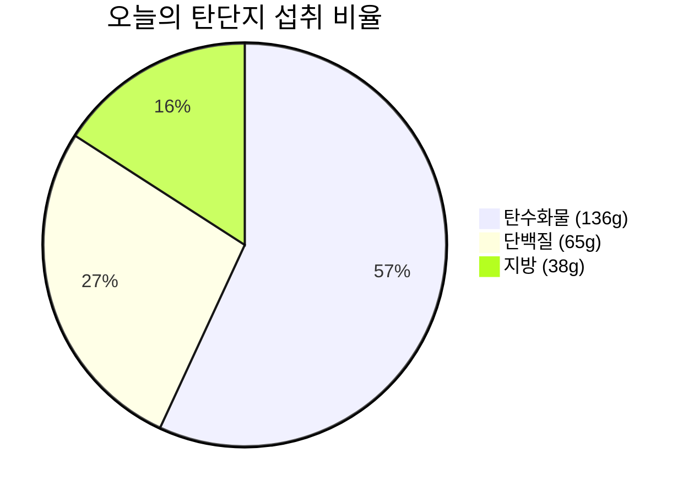

# 🥗 2026-09-02 (수) 비오님의 식단 & 영양 리포트

> [!info] 📋 오늘 한눈에 보기
>
> | 항목 | 현재 / 목표 | 달성률 |
> | :--- | :--- | :---: |
> | 🔥 칼로리 | 1,250 / 1,600 kcal | 78% |
> | 🍞 탄수화물 | 136g / 200g | 68% |
> | 🥩 단백질 | 65g / 130g | 50% |
> | 🟡 지방 | 38g / 60g | 63% |
> | 💧 수분 | 0 / 8잔 | - |
> | 😊 컨디션 | 양호 | - |

- **상위 대시보드**: [[../대시보드|👑 대시보드로 돌아가기]]

---

## 🍽️ 끼니별 상세 기록

### 🌅 아침 — 공복 유지 ✅
클린 단식 유지 (식사 없음)

### ☀️ 점심 식사 (12:30)
| 구분 | 내용 |
| :---: | :--- |
| 🍚 메뉴 | 흑미밥 130g + 계란후라이 3개 + 김 |
| 🔥 칼로리 | ~410 kcal |
| 🍞 탄수화물 | 38g |
| 🥩 단백질 | 21g |
| 🟡 지방 | 15g |
| 📝 메모 | 계란 3개로 단백질 든든한 점심! 🍳 |

### 🌙 저녁 식사
| 구분 | 내용 |
| :---: | :--- |
| 🍕 메뉴 | 피자 1조각 + 치킨텐더 3조각 + 새우초밥 8피스 |
| 🔥 칼로리 | ~840 kcal |
| 🍞 탄수화물 | 98g |
| 🥩 단백질 | 44g |
| 🟡 지방 | 23g |
| 📝 메모 | 피자, 치킨텐더, 새우초밥 맛있는 저녁 한 끼! 🍕🍤 |

---

## 🎯 오늘의 목표 달성률

- **🔥 칼로리 (목표 1,600 kcal)**
  🔥🔥🔥🔥🔥🔥🔥🔥⚪⚪ **78%** (1,250 / 1,600 kcal)

- **🍞 탄수화물 (목표 200g)**
  🟦🟦🟦🟦🟦🟦🟦⚪⚪⚪ **68%** (136g / 200g)

- **🥩 단백질 (목표 130g)**
  🟪🟪🟪🟪🟪⚪⚪⚪⚪⚪ **50%** (65g / 130g)

- **🟡 지방 (목표 60g)**
  🟨🟨🟨🟨🟨🟨⚪⚪⚪⚪ **63%** (38g / 60g)

### 🥧 탄단지 비율 (g 기준)

---

## 💧 수분 섭취 (목표 2.0L / 8잔)
- 현재 **0잔**

## 🏋️ 운동 & 컨디션
- **운동**: —
- **컨디션**: 양호
- **수면**: —
- 📂 [[../운동및컨디션/index|운동 및 컨디션 아카이브]]

## 📝 오늘의 메모
- 점심(흑미밥+계란)과 저녁(피자+치킨텐더+새우초밥) 식단 기록 완료!

---
_🕐 마지막 갱신: 2026-09-02 20:30 (KST)_
