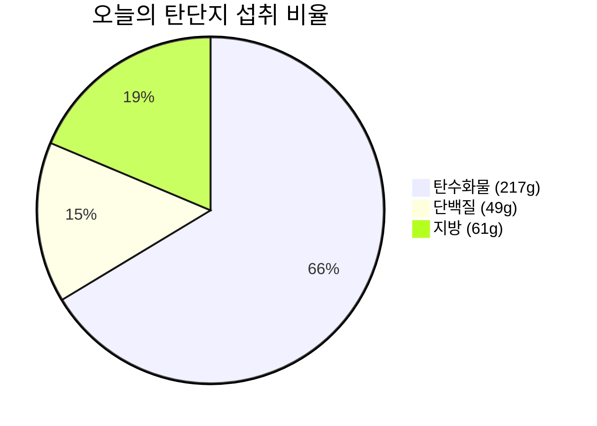

# 🥗 2026-09-01 (화) 비오님의 식단 & 영양 리포트

> [!info] 📋 오늘 한눈에 보기
>
> | 항목 | 현재 / 목표 | 달성률 |
> | :--- | :--- | :---: |
> | 🔥 칼로리 | 1,612 / 1,600 kcal | 101% |
> | 🍞 탄수화물 | 217g / 200g | 109% |
> | 🥩 단백질 | 49g / 130g | 38% |
> | 🟡 지방 | 61g / 60g | 102% |
> | 💧 수분 | 3 / 8잔 | 38% |
> | 😊 컨디션 | 양호 | - |

- **상위 대시보드**: [[../../대시보드|👑 대시보드로 돌아가기]]

---

## 🍽️ 끼니별 상세 기록

### 🌅 아침 — 공복 유지 ✅
클린 단식 유지 (식사 없음)

### ☀️ 점심 식사 (12:44)
| 구분 | 내용 |
| :---: | :--- |
| 🍜 메뉴 | 짜파게티 1개 + 계란후라이 2개 |
| 🔥 칼로리 | ~790 kcal |
| 🍞 탄수화물 | 98g |
| 🥩 단백질 | 23g |
| 🟡 지방 | 34g |
| 📝 메모 | 든든한 중화풍 점심 한 끼! 🍜 |

### 🌙 저녁 식사
| 구분 | 내용 |
| :---: | :--- |
| 🍜 메뉴 | 삼양라면 + 흑미밥 130g + 계란 2개 |
| 🔥 칼로리 | ~822 kcal |
| 🍞 탄수화물 | 119g |
| 🥩 단백질 | 26g |
| 🟡 지방 | 27g |
| 📝 메모 | 얼큰한 라면과 흑미밥, 계란 든든한 저녁 조합! 🍳 |

---

## 🎯 오늘의 목표 달성률

- **🔥 칼로리 (목표 1,600 kcal)**
  🔥🔥🔥🔥🔥🔥🔥🔥🔥 **101%** (1,612 / 1,600 kcal)

- **🍞 탄수화물 (목표 200g)**
  🟦🟦🟦🟦🟦🟦🟦🟦🟦🟦 **109%** (217g / 200g)

- **🥩 단백질 (목표 130g)**
  🟪🟪🟪⚪⚪⚪⚪⚪⚪⚪ **38%** (49g / 130g)

- **🟡 지방 (목표 60g)**
  🟨🟨🟨🟨🟨🟨🟨🟨🟨🟨 **102%** (61g / 60g)

### 🥧 탄단지 비율 (g 기준)

---

## 💧 수분 섭취 (목표 2.0L / 8잔)
- 현재 **3잔** 🚰

## 🏋️ 컨디션 & 수면
- **컨디션**: 양호
- **수면**: -
- 📂 [[../../대시보드|👑 통합 대시보드에서 운동 & 식단 한눈에 보기]]

## 📝 오늘의 메모
- 목표 칼로리 1,600 kcal에 딱 맞춰 알차게 채우셨네요!

---
_🕐 마지막 갱신: 2026-09-01 20:30 (KST)_
