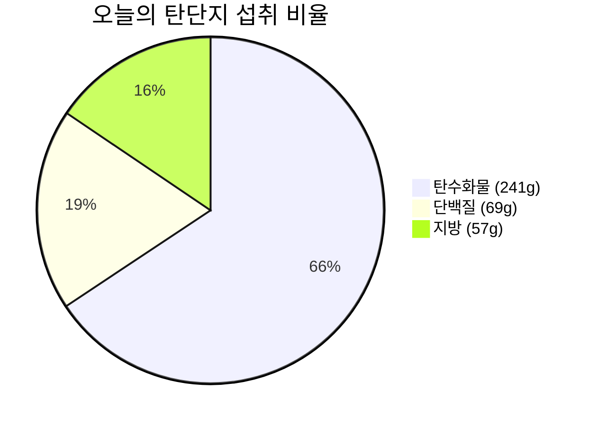

# 🥗 2026-09-03 (목) 비오님의 식단 & 영양 리포트

> [!info] 📋 오늘 한눈에 보기
>
> | 항목 | 현재 / 목표 | 달성률 |
> | :--- | :--- | :---: |
> | 🔥 칼로리 | 1,970 / 1,600 kcal | 123% |
> | 🍞 탄수화물 | 241g / 200g | 121% |
> | 🥩 단백질 | 69g / 130g | 53% |
> | 🟡 지방 | 57g / 60g | 95% |
> | 💧 수분 | 3 / 8잔 | 38% |
> | 😊 컨디션 | 기록 안 됨 | - |

- **상위 대시보드**: [[../../대시보드|👑 대시보드로 돌아가기]]

---

## 🍽️ 끼니별 상세 기록

### 🌅 아침 — 공복 유지 ✅
클린 단식 유지 (식사 없음)

### ☀️ 점심 식사 (13:40)
| 구분 | 내용 |
| :---: | :--- |
| 🍱 메뉴 | 편의점 도시락 + 스위트 아메리카노 500ml |
| 🔥 칼로리 | ~920 kcal (추정) |
| 🍞 탄수화물 | 122g (추정) |
| 🥩 단백질 | 26g (추정) |
| 🟡 지방 | 24g (추정) |
| 📝 메모 | 바쁜 날엔 편의점 한 끼도 든든! 스윗 아메리카노로 달달하게 ☕ |

### 🌙 저녁 식사 (20:32)
| 구분 | 내용 |
| :---: | :--- |
| 🍕 메뉴 | 큰 피자 2조각 + 햇반 흑미 130g + 치킨텐더 3조각 |
| 🔥 칼로리 | ~1,050 kcal (추정) |
| 🍞 탄수화물 | 119g (추정) |
| 🥩 단백질 | 43g (추정) |
| 🟡 지방 | 33g (추정) |
| 📝 메모 | 든든한 저녁! 피자+흑미밥+치킨텐더 조합 🍕🍗 |

---

## 🎯 오늘의 목표 달성률

- **🔥 칼로리 (목표 1,600 kcal)**
  🔥🔥🔥🔥🔥🔥🔥🔥🔥🔥🔥🔥⚪ **123%** (1,970 / 1,600 kcal)

- **🍞 탄수화물 (목표 200g)**
  🟦🟦🟦🟦🟦🟦🟦🟦🟦🟦🟦🟦⚪ **121%** (241g / 200g)

- **🥩 단백질 (목표 130g)**
  🟪🟪🟪🟪🟪🟪⚪⚪⚪⚪ **53%** (69g / 130g)

- **🟡 지방 (목표 60g)**
  🟨🟨🟨🟨🟨🟨🟨🟨🟨🟨⚪⚪ **95%** (57g / 60g)

### 🥧 탄단지 비율 (g 기준)

---

## 💧 수분 섭취 (목표 2.0L / 8잔)
- 현재 **3잔** (비오님 확인)

## 🏋️ 컨디션 & 수면
- **컨디션**: -
- **수면**: -
- 📂 [[../../대시보드|👑 통합 대시보드에서 운동 & 식단 한눈에 보기]]

## 📝 오늘의 메모
- 점심(편의점 도시락+스윗아메리카노) + 저녁(피자+흑미밥+치킨텐더) 식단 기록 완료!

---
_🕐 마지막 갱신: 2026-09-03 20:32 (KST)_
