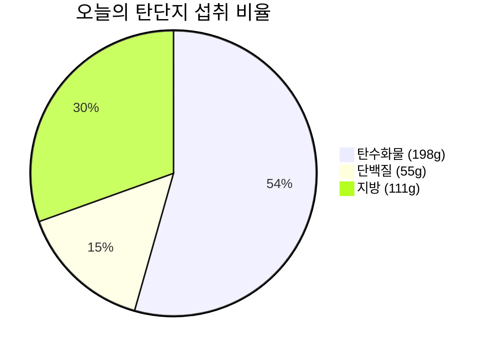

# 🥗 2026-09-04 (금) 비오님의 식단 & 영양 리포트

> [!info] 📋 오늘 한눈에 보기
>
> | 항목 | 현재 / 목표 | 달성률 |
> | :--- | :--- | :---: |
> | 🔥 칼로리 | 2,855 / 1,600 kcal | 178% |
> | 🍞 탄수화물 | 198g / 200g | 99% |
> | 🥩 단백질 | 55g / 130g | 42% |
> | 🟡 지방 | 111g / 60g | 185% |
> | 💧 수분 | - / 8잔 | - |
> | 😊 컨디션 | 기록 안 됨 | - |

- **상위 대시보드**: [[../../대시보드|👑 대시보드로 돌아가기]]

---

## 🍽️ 끼니별 상세 기록

### 🌅 아침 — 공복 유지 ✅
클린 단식 유지 (식사 없음)

### ☀️ 점심 식사 (13:30)
| 구분 | 내용 |
| :---: | :--- |
| 🍜 메뉴 | 햇반 210g + 햄 200g + 계란 2개 |
| 🔥 칼로리 | ~1,005 kcal (추정) |
| 🍞 탄수화물 | 78g |
| 🥩 단백질 | 43g |
| 🟡 지방 | 51g |
| 📝 메모 | 든든한 단백질+탄수 조합 |

### 🍰 간식 (20:30)
| 구분 | 내용 |
| :---: | :--- |
| 🍜 메뉴 | 케이크 3조각 |
| 🔥 칼로리 | ~1,050 kcal (추정) |
| 🍞 탄수화물 | 120g |
| 🥩 단백질 | 12g |
| 🟡 지방 | 60g |
| 📝 메모 | 심심풀이 디저트 🍰 |

### 🌙 저녁 (23:00)
| 구분 | 내용 |
| :---: | :--- |
| 🍜 메뉴 | 소주 (2병째 마시는 중) |
| 🔥 칼로리 | ~800 kcal (2병 기준, 추정) |
| 🍞 탄수화물 | 0g |
| 🥩 단백질 | 0g |
| 🟡 지방 | 0g |
| 📝 메모 | 심심해서 시작한 소주… 마당에서 시원한 바람과 함께 🍶

---

## 🎯 오늘의 목표 달성률

- **🔥 칼로리 (목표 1,600 kcal)**
  🔥🔥🔥🔥🔥🔥🔥🔥🔥🔥🔥🔥🔥🔥🔥🔥🔥🔥⚪ **178%** (2,855 / 1,600 kcal)

- **🍞 탄수화물 (목표 200g)**
  🟦🟦🟦🟦🟦🟦🟦🟦🟦🟦⚪ **99%** (198g / 200g)

- **🥩 단백질 (목표 130g)**
  🟪🟪🟪🟪⚪⚪⚪⚪⚪⚪ **42%** (55g / 130g)

- **🟡 지방 (목표 60g)**
  🟨🟨🟨🟨🟨🟨🟨🟨🟨🟨🟨🟨🟨🟨🟨🟨🟨🟨🟨⚪ **185%** (111g / 60g)

### 🥧 탄단지 비율 (g 기준)

---

## 💧 수분 섭취 (목표 2.0L / 8잔)
- 현재 **-잔**

## 🏋️ 컨디션 & 수면
- **컨디션**: -
- **수면**: -
- 📂 [[../../대시보드|👑 통합 대시보드에서 운동 & 식단 한눈에 보기]]

## 📝 오늘의 메모
-

---
_🕐 마지막 갱신: 2026-09-04 23:02 (KST)_
