# 🗂️ 볼트 재구성 제안 — 봇 운영 시스템 중심

> **범위**: `-메모장`, `5. 독서, 노트`, `6. 개발, 자산`, `7. 기타 자료`, `8. 잡다한거`, `Ai 작업`
> **제외**: `1~4. 공부자료` (비오님이 직접 분류), `_AI_OS` (안티그래비티 프로젝트), `시스템` (닥터가이던스/복약관리)
> **목표**: 봇들이 ① 보고서를 제대로 작성하고 ② 일정을 조율하며 ③ 생활 관리를 돕는 체계

---

## 🧭 핵심 원칙

1. **봇 산출물은 "누가 만들었는지" 기준으로 라우팅** → 대시보드에서 자동 집계
2. **분류 전 파일은 `0. 인박스`에** → 아린이 주 1회 정리 (일요일 루틴)
3. **기존 위키링크를 최대한 보존** → 폴더 대이동 최소화, 규칙과 태그로 해결
4. **공부자료(1~4)는 건드리지 않음**

---

## 🗺️ 현재 → 목표 구조 (Mermaid)

```mermaid
flowchart TD
    subgraph NOW["현재 (흩어짐)"]
        A["-메모장<br/>(가계부·계획표·운동·요리·단축키...)"]
        B["5. 독서, 노트<br/>일정관리 · 자기관리 · 헤르메스<br/>유튜브 브리핑 · 여행"]
        C["6. 개발, 자산<br/>코딩 · 주식 · GitHub 리포트 · 공공데이터 API"]
        D["7. 기타 자료<br/>첨부파일(이미지)"]
        E["8. 잡다한거<br/>(의료봉사·할거)"]
        F["Ai 작업<br/>(마스터플랜·지피티 계획)"]
    end

    subgraph TARGET["목표 (봇 시스템 허브)"]
        I0["0. 인박스 (신설)<br/>분류 전 임시 + 주1회 정리"]
        B5["5. 독서, 노트 (유지)<br/>강의록·논문·독서·생각·여행·일일노트"]
        C6["6. 개발, 자산 (유지)<br/>코딩·주식·연말정산"]
        SYS["00. 봇 운영 시스템 (신설·허브)"]
        SYS --> S1["일정관리<br/>← -메모장/계획표 통합<br/>아린 담당"]
        SYS --> S2["생활관리<br/>← 자기관리 + 가계부·운동·요리<br/>아린 담당"]
        SYS --> S3["브리핑·리포트<br/>← 유튜브·주식·GitHub 리포트<br/>봇별 자동 라우팅"]
        SYS --> S4["헤르메스 작업기록<br/>(카이 세션 로그)"]
        SYS --> S5["프로젝트·AI 계획<br/>← Ai 작업 통합"]
        D7["7. 자료 (유지)<br/>첨부파일 보관"]
        ARC["8. 보관 (구버전/안쓰는 것)"]
    end

    A --> I0
    E --> I0
    F --> S5
```

## 📋 구체적 이동 계획

### 1️⃣ `0. 인박스` 신설 (분류 대기열)
- **흡수**: `-메모장` 전체 + `8. 잡다한거` (의료봉사·할거)
- **아린의 주간 루틴**: 매주 일요일 인박스 비우기 (아래 분류 맵 기준)
- `-메모장` 내부 자료 분류 맵:

| 파일 | 이동 대상 |
| :--- | :--- |
| 가계부.md | 00. 봇 운영 시스템/생활관리/가계부 |
| 계획표.md | 00. 봇 운영 시스템/일정관리 (기존 계획표.md와 병합) |
| 운동.md | 00. 봇 운영 시스템/생활관리/운동및컨디션 |
| 요리.md | 00. 봇 운영 시스템/생활관리/요리 |
| 단축키 모음.md | 6. 개발, 자산/코딩 |
| 로컬 실습.md | 6. 개발, 자산/코딩 |
| 양방병리 공부.md | ⏳ 사용자 분류 대기 (공부자료) |
| 지소 처방.md | ⏳ 사용자 분류 대기 (임상) |
| 고민해볼것.md | 00. 봇 운영 시스템/일정관리 (TODO) |
| 인수인계.md | ⏳ 내용 확인 후 분류 |

### 2️⃣ `Ai 작업` → `6. 개발, 자산/AI 프로젝트`
- `Ai 프로그램.md`, `Simbio_임상지식_고도화_마스터플랜.md`, `지피티 계획.md`
- 이유: AI 시스템 개발 계획이므로 "개발·자산" 도메인에 속함

### 3️⃣ `00. 봇 운영 시스템` 신설 (허브)
- `일정관리/` — `5.독서,노트/일정관리` 이전 + 계획표 병합 (아린 전담)
- `생활관리/` — `5.독서,노트/자기관리` 이전 + 가계부·운동·요리 통합 (아린 전담)
- `브리핑/` — 유튜브 브리핑·주식 브리핑·GitHub 리포트의 **링크 허브** (파일은 기존 위치 유지, 대시보드로 연결)
- `헤르메스/` — 작업기록 (현 위치 유지 가능, 링크로 연결)
- `프로젝트/` — AI 프로젝트 계획 링크

> 💡 **대이동 최소화**: 일정관리·자기관리·헤르메스는 기존 위치(`5.독서,노트`)에 두고, `00. 봇 운영 시스템`에서는 **위키링크 허브** 역할만 하게 해도 됨 (기존 링크 안 깨짐)

### 4️⃣ `7. 기타 자료` → `7. 자료` (첨부파일 전용)
- 이름만 정리, 구조는 유지 (이미지/첨부 보관소)
- 옵시디언 설정에서 첨부파일 폴더를 여기로 지정하면 자동 보관됨

### 5️⃣ `8. 잡다한거` 폐지
- `0. 인박스`로 흡수 후 빈 폴더 삭제

---

## 🤖 봇별 담당 & 산출물 규약

| 봇 | 담당 | 산출물 위치 | 태그 |
| :--- | :--- | :--- | :--- |
| **아린** | 일정·생활·여행 | 일정관리/, 생활관리/, 여행/ | #출처/아린 |
| **카이** | 개발·GitHub·API·세션로그 | 6.개발자산/, 헤르메스/작업기록/ | #출처/카이 |
| **비비** | 주식 브리핑 | 6.개발자산/주식 브리핑/ | #출처/비비 |
| **닥터허** | 의학 브리핑·복약관리 | 시스템/ (기존 유지) | #출처/닥터허 |

**공통 규칙**:
1. 모든 봇 산출물 frontmatter에 `작성자: <봇명>` + `#출처/<봇명>` 태그 필수
2. 정기 보고서 파일명: `YYYY-MM-DD_제목.md`
3. 대시보드(`00_봇_산출물_대시보드`)를 유일한 출발점으로 유지 — 새 산출물 생기면 대시보드에 링크 추가
4. 일정은 아린이 `일정관리/일정표.md` (구글 캘린더 미러) + `계획표.md`로 통합 관리

---

## ✅ 실행 순서 (승인 후)

1. `0. 인박스` 폴더 생성 + `-메모장`·`8. 잡다한거` 이동
2. `Ai 작업` → `6. 개발, 자산/AI 프로젝트` 이동
3. `-메모장` 내부 파일 분류 이동 (위 맵 기준)
4. `00. 봇 운영 시스템` 생성 (링크 허브 + 규약 문서)
5. 대시보드 업데이트 + dataview 집계 추가
6. 아린에게 주간 인박스 정리 크론잡/리마인더 설정

---

## ✅ 실행 완료 (2026-09-01, 카이)

- [x] `0. 인박스` 생성 — `-메모장`(11개 파일) + `8. 잡다한거` 흡수
- [x] 분류 이동: 가계부→생활관리/가계부 · 계획표→일정관리(구버전 별도 보존) · 운동→생활관리/운동및컨디션 · 요리→생활관리/요리 · 단축키/로컬실습→6.개발자산/코딩 · 고민해볼것/할것→일정관리
- [x] `8. 잡다한거` 폐지, `-메모장` 폴더 삭제
- [x] `Ai 작업` → `6. 개발, 자산/AI 프로젝트` 이동
- [x] `00. 봇 운영 시스템` 생성 — 일정관리·생활관리 이전 + 허브·규칙 문서 작성
- [x] 대시보드 링크 전부 새 구조로 갱신
- [x] 인박스 분류 대기 4건: 양방병리 공부 · 지소 처방 · 인수인계 · 의료봉사
- [ ] (보류) 아린 주간 인박스 정리 크론잡 — 아린 프로필에서 설정 필요
