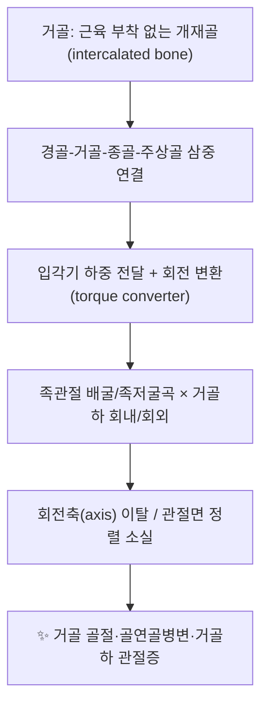

![[거골_2.jpg|540]]
> [그림 1: Snowboarders ankle - McCrory.jpg]

# 🦴 [[구조물/골격/거골]] (Talus)

> **핵심 요약 (Key Summary)**:
> [[거골]]은 [[경골]]·[[비골]]·[[종골]]·[[주상골]] 사이에 끼어 하중을 전달하는 **개재골(intercalated bone)** 로, 근육·건이 직접 부착하지 않아 골 자체의 능동적 움직임은 없다.
> 혈류가 원위부에서 근위부로 **역행성(retrograde)** 으로 공급되기 때문에 [[거골 경부 골절]]·[[거골 체부 골절]] 후 [[무혈성괴사]](AVN) 위험이 구조적으로 높다(Hamilton 2024; Al-Jabri 2021).
> 임상적으로는 [[거골 골절]], [[거골 골연골병변]](OLT), [[거골하 관절증]], [[후방 충돌 증후군]]이 핵심 타깃이며, 치료는 정확한 정렬 회복과 [[족관절]]·[[거골하관절]] 가동성 확보를 축으로 한다(Al-Jabri 2021; Nguyen 2024).

---
## 📌 목차
1. [해부학적 정밀 구조 및 지배 신경/혈관](#1-해부학적-정밀-구조-및-지배-신경혈관)
2. [생체역학·토크 분석 & 근막 사슬 (Biomechanical Synergy)](#2-생체역학토크-분석--근막-사슬-biomechanical-synergy)
3. [근막통증증후군(TP) & 연관통 패턴 (Travell & Simons)](#3-근막통증증후군tp--연관통-패턴-travell--simons)
4. [초음파 해부학(Sonoanatomy) 및 중재 시술 랜드마크](#4-초음파-해부학sonoanatomy-및-중재-시술-랜드마크)
5. [⭐ 원장님 심층 임상 고찰 및 원본 필기 (Clinical Pearls)](#5--원장님-심층-임상-고찰-및-원본-필기-clinical-pearls)
6. [관련 임상 질환 및 운동손상 증후군 총괄](#6-관련-임상-질환-및-운동손상-증후군-총괄)
7. [추나·도수치료(MET/PIR) & 침구·약침·재활 프로토콜](#7-추나도수치료metpir--침구약침재활-프로토콜)
8. [출처 및 학술 참고 문헌 (References)](#8-출처-및-학술-참고-문헌-references)

---
## 1. 해부학적 정밀 구조 및 지배 신경/혈관

| 항목 | 상세 내용 |
| :--- | :--- |
| **기시 (Origin)** | 해당 없음 — 거골에는 근육이 기시하지 않는다(골 자체에 건 부착부가 없는 대표적 골) |
| **정지 (Insertion)** | 해당 없음 — 상동 |
| **신경 지배** | 거골 자체의 근 지배는 없고, **관절 분지(distribution to joints)** 만 존재: [[심부비골신경]](족관절 전방·거골동굴부), [[경골신경]](족관절 후방·거골관부), [[복재신경]](내측), [[비복신경]](외측) |
| **혈관 공급** | ① [[거골관 동맥]](artery of the tarsal canal, [[후경골동맥]] 분지) ② [[거골동굴 동맥]](artery of the tarsal sinus, [[족배동맥]]·천공비골동맥 계열) ③ [[삼각인대]] 통과 분지 등 3계통이 문합하며, 주된 유입이 원위부(경부·두부)이므로 **역행성 혈류** 양상(Hegazy 2023; Al-Jabri 2021) |

### 🔬 세부 골 구조 (두부 · 경부 · 체부)

| 구획 | 해부학적 특징 | 임상적 의미 |
| :--- | :--- | :--- |
| **두부 (Head)** | 전방으로 돌출, [[주상골]]과 [[거주상관절]]을 형성하는 볼록한 관절면 | 거주상관절 탈구·골연골 손상 시 침범 |
| **경부 (Neck)** | 두부와 체부 사이의 가장 좁은 부위, 내측으로 약간 경사 | **골절 최호발부**이며 혈류의 병목 → AVN 위험의 핵심(Hamilton 2024; Al-Jabri 2021) |
| **체부 (Body)** | 상방 **도르래(trochlea)** 로 [[경골]] 천장과 족관절 형성, 하방 3개 면(전·중·후 거골하 관절면)으로 [[종골]]과 접촉 | 족관절 하중 전달의 중심, 체부 골절 시 족관절 정렬 붕괴 |
| **외측돌기 (Lateral process)** | 체부 외측 하방, [[비골]]과 인접 | **스노보더 골절(snowboarder's ankle)** 의 호발 부위 |
| **후방돌기 (Posterior process)** | 내·외측 결절로 구성, 외측 결절이 미유합되면 [[삼각골]](os trigonum) | **후방 충돌 증후군** 및 [[장족지굴근|FHL]] 건 초과 골화·자극과 연관 |

* **관절 구성(3중 연결)**: 거골은 [[족관절]](tibiotalar), [[거골하관절]](talocalcaneal, subtalar), [[거주상관절]](talonavicular)에 동시 관여하며, 이 세 관절을 묶어 **삼중관절(triple joint)** 로 부른다. 거골하관절과 거주상관절은 기능적으로 결합되어 하나의 복합체(acetabulum pedis)처럼 움직인다.
* **인대 결박**: 내측은 [[삼각인대]](deltoid ligament), 외측은 [[전거비인대]]·[[종비인대]]·[[후거비인대]] 복합체가 지지한다. 이 인대들의 손상은 거골의 미세 전위를 유발하여 이차적 관절증으로 이어진다.
* **해부학적 변이(Hegazy 2023)**: 거골의 형태·관절면 분할 양상·후방돌기 유합 여부 등에는 정상 변이가 존재하며, 이러한 변이가 임상 증상(충돌, 관절증, 삼각골 증후군)과 상관관계를 가질 수 있다고 보고된다. 개별 변이의 정확한 발생률 수치는 제공 논문에서 직접 확인되지 않아 **근거 미확인**.

---
## 2. 생체역학·토크 분석 & 근막 사슬 (Biomechanical Synergy)

* **개재골로서의 특성**: 거골에는 근육·건이 부착하지 않으므로, 운동은 전적으로 인접 관절([[족관절]]·[[거골하관절]])과 주변 건(전경골근·후경골근·비골근·삼두근·FHL)의 견인이 만드는 **수동적 회전 변환**의 결과다. 즉 거골은 "힘을 만드는 뼈"가 아니라 "힘을 전달·변환하는 뼈"다.
* **족관절 하중 전달**: 입각기에서 체중의 배수에 해당하는 압축력이 족관절을 통과한다는 것이 일반 생체역학 문헌의 기술이나, 제공 논문에서 구체적 배수·비율을 직접 제시하지는 않아 **근거 미확인**. 다만 하중이 경골 천장-거골 도르래-종골로 이어지는 축성 전달 구조라는 점은 해부학적으로 확립된 사실이다(Hegazy 2023).
* **거골하 축의 3평면 운동**: 거골하관절의 회전축은 사선(oblique)으로, 회내(pronation)/회외(supination)와 함께 배굴·족저굴곡 및 내·외전 성분이 결합된 **triplanar motion**을 만든다. 따라서 종골의 내·외반 제한은 거골-경골 간 회전 요구를 증가시켜 족관절과 슬관절·경골 회전 부하로 전이된다.
* **근막 사슬 연계 (Myers Anatomy Trains 관점)**: 거골은 직접적인 근막 부착점이 아니라 사슬 상의 **도르래(pulley)** 로 기능한다. [[전경골근]]이 족부 내측에서 거상·거치하고 [[비골근]]이 외측에서 활차처럼 돌아가는 **나선선(spiral line)** 의 흐름, 그리고 [[후경골근]]·[[장족지굴근]]·[[가자미근]]이 만드는 **심부후방선(deep back line)** 의 하단부가 거골을 중심으로 교차한다. 이 사슬의 긴장 불균형은 거골의 위치(전방/후방 전위, 내·외반 편위)를 변화시켜 임상적 충돌과 통증을 만든다.

---
## 3. 근막통증증후군(TP) & 연관통 패턴 (Travell & Simons)

* **거골 자체에는 발통점(TrP)이 형성되지 않는다**: 골에는 근섬유가 없으므로 Travell & Simons의 TrP 개념이 직접 적용되지 않는다. 거골 부위 압통은 **골·관절 병변(골절, 골연골병변, 활액막염, 삼각골 증후군)** 또는 **주변 근육 TrP의 연관통**으로 해석해야 한다.
* **연관 근육과 연관통 패턴(Travell & Simons 기준, 병변별 세부 지도는 근거 미확인)**:

| 관련 근육 | 발통점 위치 | 연관통(방사) 양상 | 거골과의 관계 |
| :--- | :--- | :--- | :--- |
| [[가자미근]] / [[비복근]] | 하퇴 후방 | 장딴지, 아킬레스건 주변, 족부 후방 | 후방 충돌·족저굴곡 제한 시 보상 과활성 |
| [[후경골근]] | 하퇴 내측 심부 | 내측 종아리, 내측 족저·[[거골하관절]]부 | 내측 아치 붕괴 시 거골 회외·내반 편위 악화 |
| [[장족지굴근]] (FHL) | 하퇴 후내측 심부 | 종골 후방, 모지 족저 | 삼각골·후방돌기 자극의 핵심 건(후방 충돌) |
| [[비골근]] (장·단) | 하퇴 외측 | 외측 족관절, 외측 족배부 | 반복 염좌 후 외측 불안정성 → 거골 외측 충돌 |
| [[전경골근]] | 하퇴 전외측 | 전방 족관절·족배부 | 전방 충돌·족관절 배굴 제한 시 과활성 |

* **임상적 정리**: 거골 통증 환자에서 촉진은 (1) 거골동굴(sinus tarsi), (2) 외측돌기, (3) 후방돌기·아킬레스건 전방, (4) 거주상관절 배부를 중심으로 시행하고, 골 압통과 근 TrP 압통을 반드시 구분한다. 이 구분이 치료 방향(관절 정렬·부하 관리 vs 근 이완)을 결정한다.

---
## 4. 초음파 해부학(Sonoanatomy) 및 중재 시술 랜드마크

* **전방 종단 스캔(anterior longitudinal)**: [[족관절]] 전방에서 경골 천장–거골 도르래 관절간극을 확인. 심부에 [[심부비골신경]]과 [[족배동맥]](족배부에서 촉지 가능)이 주행하므로 내측 또는 외측으로 5–10 mm 편향하여 접근하는 것이 안전하다.
* **외측 스캔(lateral/sinus tarsi view)**: 비골 외과 전하방의 **거골동굴(sinus tarsi)** 은 거골 골연골병변(외측형) 및 거골하 관절 병변의 초음파 창(window)이다. 천부에 [[천부비골신경]] 분지가 있으므로 예민한 감각 이상을 확인하며 접근한다.
* **후방 스캔(posterior view)**: 아킬레스건–후방돌기–[[장족지굴근]] 건 순으로 확인. [[삼각골]] 유무와 후방 충돌을 감별한다. 심부에 [[경골신경]]·[[후경골동맥]]이 있으므로 내측 심부 자침은 초음파 유도 하에 시행한다.
* **내측(거골관부) 접근**: [[삼각인대]] 하방에 거골관 동맥계가 위치하므로 내측 심부 조작 시 혈관 손상에 주의한다(Hegazy 2023의 혈관 해부 참조).
* **약침·주사 시 안전 마진 원칙**: ① 족배동맥·경골신경의 도플러 확인 ② 골연골병변 병변 내 주사는 영상 유도 하에만 ③ 감각 이상·박동성 통증 발생 시 즉시 중단. 거골 병변에 대한 초음파 유도 중재의 구체적 각도·용량 프로토콜은 제공 논문에서 다루지 않아 **근거 미확인**.

---
## 5. ⭐ 원장님 심층 임상 고찰 및 원본 필기 (Clinical Pearls)

> ※ 아래는 제공된 문헌(거골 해부·골절·골연골병변 리뷰)과 해부학적 추론을 정리한 임상 고찰 영역이다. 별도로 제공된 원본 필기 데이터는 없어, 문헌 근거가 아닌 항목은 **근거 미확인**으로 표기한다.

* **① 손상 기전을 먼저 읽어라.** 거골 골절은 대개 **축성 부하 + 강한 배굴(족관절 배굴-경부 골절)** 또는 **족관절 고정 상태에서의 회전력**으로 발생한다. 스노보드·낙상·교통사고 등 에너지 크기를 청취하면 골절 유형(경부/체부/외측돌기/후방돌기)을 예측할 수 있고, 이는 AVN·관절증 위험 상담의 근거가 된다(Hamilton 2024; Al-Jabri 2021).
* **② "거골 경부 = 무혈성 괴사 위험"이라는 공식을 항상 기억한다.** 역행성 혈류 구조상 골절 편위가 커질수록 AVN 위험이 증가한다(Hawkins 분류에 따른 위험 증가 경향이 보고됨). 개별 단계별 정확한 AVN 발생률 수치는 제공 논문에서 직접 인용되지 않아 **근거 미확인**. 임상적으로는 추시 영상에서 골경화·함몰, **Hawkins sign(골절 후 수주 내 도르래 하방의 연부조직 골감소 음영)** 소실 여부를 확인하는 흐름이 사용된다(근거 미확인: 제공 논문 외 영상 기법).
* **③ 골연골병변(OLT)은 "삐었다" 이후 지속되는 심부 통증의 핵심 감별진단이다.** 반복 염좌 후에도 거골동굴·내측 심부 통증이 남으면 OLT를 의심해야 하며, 영상(MRI) 및 관절경적 평가가 표준으로 논의된다(Nguyen 2024). 보존적 치료로 반응이 없을 때 미세골절술·골연골 이식 등이 논의되나, 적응증과 시점은 병변 크기·위치·연골하 골 낭종 여부에 따라 달라진다(Nguyen 2024).
* **④ 후방 충돌은 거골 후방돌기·삼각골·FHL 건의 삼각관계로 접근한다.** 발레·축구·스노보드 등 반복 극대 족저굴곡 동작에서 후방 통증이 발생하면, FHL 건초염·삼각골 증후군을 우선 감별하고 초음파 및 부하 검사(족저굴곡 유발 검사)를 병행한다.
* **⑤ 치료의 축은 "정렬 → 가동성 → 부하 재교육"이다.** 급성기에는 거골하 관절의 부종·보호, 아급성기에는 거골하/거주상관절의 가동성 회복(특히 회내·회외), 이후 종골-거골 정렬과 족부 내재근·후경골근 강화로 재발을 관리한다. 이 순서를 뒤집으면(가동성 없이 부하부터 증가) 만성 거골하 관절증으로 이어진다(해부·생체역학 기반 추론, **근거 미확인**).
* **⑥ 한의학적 관점**: 거골부는 [[족소음신경]]·[[족태양방광경]]·[[족소양담경]]·[[족양명위경]]이 교차하는 족근부에 해당하며, 외상 후 "어혈(瘀血)–기체(氣滯)" 병리로 설명되어 [[곤륜]](BL60)·[[구허]](GB40)·[[해계]](ST41)·[[태계]](KI3) 등이 통증·부종 관리에 활용되어 왔다. 다만 거골 골절·AVN에 대한 침구·약침의 유효성은 제공 논문에서 다루지 않아 **근거 미확인**이며, 골절 자체의 정형외과적 관리(정복·고정·수술)가 우선이다.

---
## 6. 관련 임상 질환 및 운동손상 증후군 총괄

| 임상 질환 / 증후군 | 병리적 연관 기전 | 주요 증상 및 이학적 검사 | 핵심 교정 타깃 |
| :--- | :--- | :--- | :--- |
| [[거골 경부 골절]] | 축성 부하 + 배굴, 경부 혈류 병목 | 족관절·거골하 동통, 부종, 체중부하 불가, Hawkins 분류로 편위 평가(Hamilton 2024; Al-Jabri 2021) | 정복·고정 후 거골하 가동성 회복, AVN 추시 |
| [[거골 체부 골절]] | 고에너지 손상, 족관절 하중축 붕괴 | 족관절 내 동통·삼출, 정렬 이상 | 족관절 정렬 회복, 비골·경골 정합성 |
| [[거골 외측돌기 골절]](Snowboarder's ankle) | 착지 시 배굴+외반 축성 부하 | 외측돌기 국소 압통, 외측 족관절 통증, 염좌와 감별 필요(그림 1 참조) | 외측 인대 복합체 안정화, 비골근 강화 |
| [[거골 후방돌기 골절]] / [[삼각골 증후군]] | 반복 극대 족저굴곡, FHL 건 충돌 | 후방 압통, 족저굴곡 유발 통증, 아킬레스건 전방 통증 | FHL 건 활주 회복, 후방 가동성 |
| [[거골 골연골병변]](OLT) | 외상 후 연골·연골하골 손상, 내측·외측형 | 만성 심부 통증, 거골동굴 압통, MRI/관절경 평가(Nguyen 2024) | 연골하 골 부하 분산, 거골하 정렬 |
| [[거골 무혈성괴사]](AVN) | 역행성 혈류 차단, 편위 골절 후 | 추시 영상에서 골경화·함몰, 지속 통증 | 체중부하 관리, 수술적 판단 우선 |
| [[거골하 관절증]] | 외상 후 관절면 불일치, 반복 회내 | 종골동굴 압통, 내·외반 제한, 사면 보행 시 통증 | 거골하 가동성·종골 정렬 |
| [[거골 주위 탈구]](peritalar dislocation) | 고에너지 염좌-탈구 기전 | 심한 변형, 정복 응급도 | 정복 후 인대 안정성 회복 |
| [[거골하 골결합]](tarsal coalition) | 선천적 섬유성·연골성 결합 | 강직성 평발, 거골하 가동 소실 | 가동성 확보 및 근력 재교육 |
| [[후방 충돌 증후군]] | 삼각골·후방돌기·FHL의 공간 협소 | 족저굴곡 시 후방 통증 | FHL 이완, 족저굴곡 조절 |

---
## 7. 추나·도수치료(MET/PIR) & 침구·약침·재활 프로토콜

* **한의학 경혈 매핑**: [[곤륜]](BL60), [[구허]](GB40), [[해계]](ST41), [[신맥]](BL62), [[조해]](KI6), [[상구]](SP5), [[태계]](KI3), [[현종]](GB39), [[위중]](BL40), [[족삼리]](ST36), [[양릉천]](GB34). 족관절 주위 및 거골동굴·거골하 관절 주변의 압통점을 함께 취혈한다.
* **도수치료 원칙(거골은 직접 수동 조작 대상이 아니라 "결과"를 조정하는 대상)**:
  1. **거골하 관절 견인·활주**: 종골을 고정하고 거골을 대상으로 한 관절내 활주로 회내/회외 제한을 회복한다(급성 골절·AVN 의심 시 금기).
  2. **근에너지기법(MET)**: [[후경골근]]·[[가자미근]]·[[비골근]]에 등척성 수축(5–10초, 3–5회) 후 호기 시 부드러운 신장. 족관절 배굴 제한의 흔한 원인인 심부 후방 근군의 과긴장을 다룬다.
  3. **PIR(수축-이완 후 이완)**: FHL 및 심부 후방 근군에 적용하여 후방 충돌 증상 완화를 도모한다(효과 수준은 **근거 미확인**).
  4. **근막 사슬 정리**: 나선선(전경골근–비골근), 심부후방선(후경골근–가자미근–FHL) 순으로 이완과 활성화를 교대 적용한다.
* **약침·침 치료**: 급성 염좌·만성 거골하 관절증의 통증 관리 목적으로 [[홍화약침]]·[[오공약침]]·[[자하거약침]] 등이 임상에서 사용되어 왔으나, 거골 골절·OLT·AVN에 대한 특정 약침의 유효성·용량은 **근거 미확인**(제공 논문에서 다루지 않음). 골절이 확인된 경우 정형외과적 고정·수술이 우선이며, 침구 치료는 보조적 통증 관리로 한정한다.
* **재활 프로토콜(개념적 3단계)**:
  | 단계 | 목표 | 주요 내용 |
  | :--- | :--- | :--- |
  | 1단계 (보호·부종 관리) | 통증·부종 감소, 체중부하 조절 | 골절 시 정형외과 프로토콜 우선, 거상·냉각·비체중부하 |
  | 2단계 (가동성 회복) | 거골하·족관절 가동범위 회복 | 수동·능동 관절가동, MET, 저부하 사이클 |
  | 3단계 (부하 재교육) | 정렬 유지 및 재발 방지 | 후경골근·비골근·족부 내재근 강화, 균형·고유수용감각 훈련 |

---
## 8. 출처 및 학술 참고 문헌 (References)

1. **Standring, S. (2020)**. *Gray's Anatomy: The Anatomical Basis of Clinical Practice* (42nd ed.). Elsevier.
2. **Travell, J. G., & Simons, D. G. (1999)**. *Myofascial Pain and Dysfunction: The Trigger Point Manual*, Vol. 1.
3. **Hamilton, G. A., & Doyle, M. D. (2024)**. Management of Talus Fractures. *Clin Podiatr Med Surg*. PMID: 38789164
4. **Nguyen, K., & Cooperman, S. (2024)**. Osteochondral Injuries of the Talus. *Clin Podiatr Med Surg*. PMID: 38789163
5. **Al-Jabri, T., & Muthian, S. (2021)**. Talus Fractures: All I need to know. *Injury*. PMID: 34740388
6. **Hegazy, M. A., & Khairy, H. M. (2023)**. Talus bone: normal anatomy, anatomical variations and clinical correlations. *Anat Sci Int*. PMID: 37017903

<!-- 보관 태그(1회용·링크오류, 필요시 복원): 거골, 거골하관절 -->
