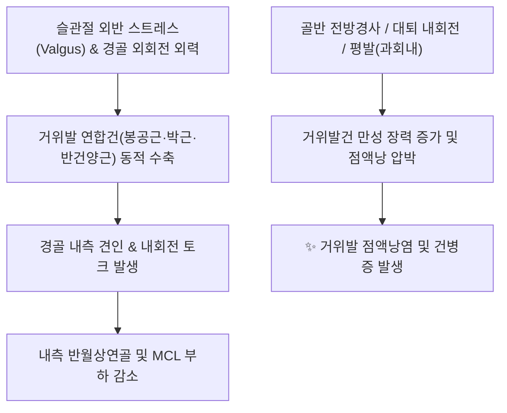

# 🦵 [[거위발]] (Pes Anserinus)

> **핵심 요약 (Key Summary)**:
> 경골 조면 내측 상부에 부착하는 봉공근, 박근, 반건양근의 3개 건이 거위의 물갈퀴 모양으로 합쳐진 연합건 복합체.
> 슬관절의 내측 안정성 유지, 내회전력 제공 및 외반 스트레스에 대항하는 동적 제어기로 기능하며 하부에 거위발 점액낭이 위치.
> 퇴행성 관절염, 외반슬(X자 다리), 과도한 보행 시 거위발 점액낭염 및 건병증이 호발하여 경골 내측 통증 유발 및 침구·추나 치료의 표적.

---
## 📌 목차
1. [해부학적 정밀 구조 및 구성 건(SGT)](#1-해부학적-정밀-구조-및-구성-건sgt)
2. [생체역학적 기능 & 외반(Valgus) 저항 메커니즘](#2-생체역학적-기능--외반valgus-저항-메커니즘)
3. [거위발 점액낭염(Pes Anserine Bursitis) 병태생리](#3-거위발-점액낭염pes-anserine-bursitis-병태생리)
4. [초음파 해부학(Sonoanatomy) 및 감별 진단](#4-초음파-해부학sonoanatomy-및-감별-진단)
5. [추나·도수치료(근막 이완 & 골반-무릎 정렬) & 한의 치료 프로토콜](#5-추나도수치료근막-이완--골반-무릎-정렬--한의-치료-프로토콜)
6. [출처 및 학술 참고 문헌 (References)](#6-출처-및-학술-참고-문헌-references)

---
## 1. 해부학적 정밀 구조 및 구성 건(SGT)

| 구성 근육 건 | 기시부 | 신경 지배 | 주 작용 |
| :--- | :--- | :--- | :--- |
| **[[봉공근]] (Sartorius)** | [[ASIS]] (상전장골극) | 대퇴신경 (Femoral n., L2-L4) | 고관절 굴곡·외전·외회전, 슬관절 굴곡·내회전 |
| **[[박근]] (Gracilis)** | [[치골]] 결합 외측 하지 | 폐쇄신경 (Obturator n., L2-L4) | 고관절 내전, 슬관절 굴곡·내회전 |
| **[[반건양근]] (Semitendinosus)** | [[좌골결절]] (Ischial tuberosity) | 좌골신경 경골신경지 (L5-S2) | 고관절 신전, 슬관절 굴곡·내회전 |

* **정지부 및 층(Layer) 구조**:
  * 경골 결절(경골 조면) 내측 약 3~4cm 하방의 경골 전내측 표면에 거위 발가락 모양으로 층을 이루어 부착합니다.
  * 전방/천층에 [[봉공근]]건이 위치하고, 그 후하방/심층에 [[박근]]과 [[반건양근]]건이 주행하여 합류합니다.
* **거위발 점액낭 (Pes Anserine Bursa)**:
  * 거위발 연합건과 심층의 내측측부인대(MCL) 및 경골 골막 사이에 위치하는 활액낭으로 건과 골막/인대 간의 마찰을 완충합니다.

---
## 2. 생체역학적 기능 & 외반(Valgus) 저항 메커니즘

* **동적 내측 안정자 (Dynamic Medial Stabilizer)**:
  * 정적 안정자인 내측측부인대(MCL)와 협력하여 무릎이 안쪽으로 꺾이는 외반 붕괴(Valgus collapse)를 저지합니다.
* **3각 신경 지배의 생체역학적 의의**:
  * 세 근육은 각각 서로 다른 세 개의 주 신경(대퇴신경, 폐쇄신경, 좌골신경)의 지배를 받으므로, 신경 손상 시에도 슬관절 내측의 동적 보호 기능이 완전히 상실되지 않도록 중복 보장(Redundancy)된 진화적 구조입니다.

---
## 3. 거위발 점액낭염(Pes Anserine Bursitis) 병태생리

* **호발 요인**:
  * **골관절염(Knee OA)**: 무릎 퇴행성 변화로 인한 관절 간격 협착 및 내반/외반 변형 시 2차성 발생.
  * **비만 및 여성**: 넓은 Q-각(Q-angle)으로 인해 보행 시 경골 내측 견인 스트레스 증가.
  * **달리기 및 계단 오르내리기**: 반복적인 무릎 굴신 운동에 따른 마찰.
* **임상 증상**:
  * 관절선(Joint line) 하방 3~5cm 부위의 국소적 압통 및 부종.
  * 계단 하강 시, 의자에서 일어날 때, 야간 취침 시 양 무릎이 맞닿을 때 통증 심화.
* **감별 진단**:
  * **내측 반월상연골 파열**: 압통점이 관절선 자체에 위치하며 McMurray 검사 양성.
  * **퇴행성 관절염**: 관절선 골극 형성 및 방사선학적 간격 협착.
  * **내측측부인대(MCL) 손상**: 외반 스트레스 검사 시 통증 및 불안정성.

---
## 4. 초음파 해부학(Sonoanatomy) 및 감별 진단

* **초음파 종단/횡단 스캔**:
  * 탐촉자를 경골 근위 내측에 장축으로 거치하면, 고에코의 피질골 라인 위로 저에코성 밴드의 MCL이 보이고, 그 표재부에 세 개의 건(SGT)이 편평한 밴드 형태로 정지하는 것을 확인합니다.
  * 염증 시 거위발 점액낭 내부의 저에코 또는 무에코 삼출액(Effusion) 저류와 비후된 활액막이 관찰됩니다.
* **초음파 유도하 약침 치료**:
  * 면내(In-plane) 기법으로 건과 골막 사이 점액낭 공간으로 접근하여 삼출액 흡인 및 항염증 약침을 정밀 투여합니다.

---
## 5. 추나·도수치료(근막 이완 & 골반-무릎 정렬) & 한의 치료 프로토콜

### 1) 추나 및 연부조직 이완 요법
* **근막이완술 (Myofascial Release)**:
  * [[봉공근]](대퇴 전외측에서 내측), [[박근]](대퇴 내측), [[반건양근]](대퇴 후내측) 주행을 따라 과긴장된 근복을 허혈성 압박 및 신장.
* **하지 바이오메카닉 교정 (골반-고관절-족부)**:
  * 고관절 내회전 및 족부 회내(Pronation)를 동반한 기능적 외반슬 교정.
  * 거골하관절(Subtalar joint) 가동술 및 비골두/골반 부정렬 추나 적용.

### 2) 침구 및 약침 치료
* **혈위**:
  * 음릉천(陰陵泉, SP9): 경골 내측과 하방 함요처. 거위발 부착부 직상방으로 국소 부종과 습열(濕熱) 제거.
  * 곡천(曲泉, LR8), 슬관(膝關, LR7), 혈해(SP10) 배합.
* **약침 처방**:
  * 급성 염증 및 종창기: 황련해독탕 약침 또는 중성어혈 약침.
  * 만성 건병증 및 조직 퇴행: 자하거(신경/건 재생), 봉약침(강력한 항염증 및 혈류 촉진).

---
## 6. 출처 및 학술 참고 문헌 (References)

* Neumann DA. *Kinesiology of the Musculoskeletal System: Foundations for Rehabilitation*. 3rd ed. Elsevier; 2017.
  * `[연구 요약]` 거위발 구성 세 근육의 고유 신경 지배와 슬관절 외반 부하 및 회전 제어 메커니즘의 운동형상학적 분석.
* Helfenstein M Jr, Kuromoto J. Anserine syndrome. *Rev Bras Reumatol*. 2010;50(3):313-327.
  * `[연구 요약]` 거위발 점액낭염 및 건병증의 병태생리, 무릎 골관절염과의 상관성 및 초음파학적 진단·중재 시술 검토.
* 대한약침학회 학술위원회. *약침학*. 엘스비어코리아; 2011.
  * `[연구 요약]` 음릉천 및 경골 내측 거위발 부착부 병변에 대한 봉약침과 황련해독탕 약침의 항염증·진통 임상 연구.
