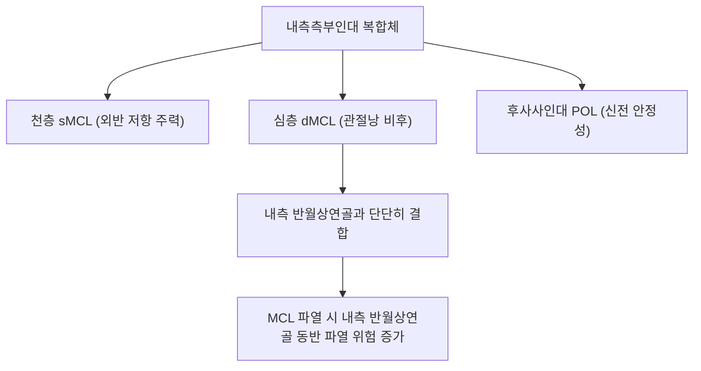

# 🦴 [[내측측부인대]] (Medial Collateral Ligament, MCL)

> **핵심 요약 (Key Summary)**:
> 대퇴골 내측상과에서 기시하여 경골 근위 내측면에 넓게 정지하는 슬관절 내측의 핵심 띠 모양 인대.
> 슬관절 외반 스트레스에 대항하는 1차 정적 억제기로 천층과 내측 반월상연골과 유착된 심층으로 구성되어 관절을 보호.
> 무릎 외측 충돌 및 외반 염좌 시 호발하며 외반 스트레스 검사 양성 및 풍부한 혈류로 인한 우수한 자연 치유력을 바탕으로 약침·추나 치료의 표적.

---
## 📌 목차
1. [해부학적 구조: 천층(sMCL)과 심층(dMCL)의 층상 배열](#1-해부학적-구조-천층smcl과-심층dmcl의-층상-배열)
2. [생체역학적 기능 & 외반(Valgus) 부하 제어 메커니즘](#2-생체역학적-기능--외반valgus-부하-제어-메커니즘)
3. [손상 기전 및 손상 등급 분류 (Grade I, II, III)](#3-손상-기전-및-손상-등급-분류-grade-i-ii-iii)
4. [이학적 진단 검사 (외반 스트레스 검사, Valgus Stress Test)](#4-이학적-진단-검사-외반-스트레스-검사-valgus-stress-test)
5. [초음파 해부학(Sonoanatomy) 및 혈류 평가](#5-초음파-해부학sonoanatomy-및-혈류-평가)
6. [추나·도수치료(슬관절 정렬 교정) & 침구·약침 재생 치료 프로토콜](#6-추나도수치료슬관절-정렬-교정--침구약침-재생-치료-프로토콜)
7. [출처 및 학술 참고 문헌 (References)](#7-출처-및-학술-참고-문헌-references)

---
## 1. 해부학적 구조: 천층(sMCL)과 심층(dMCL)의 층상 배열

| 층별 구분 | 기시부 | 정지부 | 주요 특징 및 관절 연계 |
| :--- | :--- | :--- | :--- |
| **천층 MCL (sMCL)** | [[대퇴골]] 내측상과(Medial epicondyle) 함요부 | [[경골]] 관절선 하방 약 4~6cm 부위 내측 능선 | 길이 약 10~12cm의 넓고 강인한 섬유성 띠, 거위발건 심층에 위치 |
| **심층 MCL (dMCL)** | 대퇴골 원위 관절낭 연골 경계 | 경골 관절낭 연골 경계 | 관절낭 비후 구조물로 [[내측반월상연골]] 체부와 단단히 융합(관절낭-반월상연골 인대) |
| **후내측 관절낭 (POL)** | 대퇴 내과 결절 후방 | 경골 후내측 능선 및 반막양근건 | 후사사인대(Posterior oblique ligament)로 신전 시 외반 및 내회전 보조 제어 |

---
## 2. 생체역학적 기능 & 외반(Valgus) 부하 제어 메커니즘

* **1차 외반 억제기 (Primary Restraint to Valgus Stress)**:
  * 슬관절 25도 굴곡 상태에서 외반력의 약 78%를 천층 MCL이 전담합니다.
  * 완전 신전(0도) 상태에서는 후방 관절낭, 후사사인대(POL), ACL/PCL이 협력하여 MCL의 부담이 약 57%로 분산됩니다.
* **경골 외회전 제어**:
  * 굴곡 각도 전반에 걸쳐 경골의 과도한 외회전을 정적으로 억제합니다.
* **풍부한 혈관망과 자연 치유 잠재력**:
  * 활액막 외부에 위치하며 상내측슬동맥 및 하내측슬동맥으로부터 풍부한 혈액을 공급받아 십자인대에 비해 손상 후 반흔 형성 및 인대 자가 재생력이 매우 뛰어납니다.

---
## 3. 손상 기전 및 손상 등급 분류 (Grade I, II, III)

* **손상 기전**:
  * 축구, 럭비, 스키 등에서 대퇴 외측에 직접 충격이 가해지는 클리핑(Clipping) 손상.
  * 발이 지면에 고정된 상태에서 무릎이 안쪽으로 꺾이는 비접촉성 외반-외회전 비틀림.
* **손상 등급 분류**:
  * **1도 (Grade I, 경도 염좌)**: 인대 섬유의 미세 손상, 압통은 있으나 관절 이완(Laxity) 없음.
  * **2도 (Grade II, 부분 파열)**: 인대 섬유 불완전 파열, 외반 검사 시 관절 열림(3~5mm) 관찰되나 명확한 종말감(Endpoint) 존재.
  * **3도 (Grade III, 완전 파열)**: 인대 섬유의 완전 단열, 외반 검사 시 10mm 이상의 심한 관절 열림과 종말감 소실. 대부분 ACL 파열 동반.

---
## 4. 이학적 진단 검사 (외반 스트레스 검사, Valgus Stress Test)

* **30도 굴곡 외반 스트레스 검사**:
  * 슬관절을 30도 굴곡하여 후방 관절낭과 십자인대를 이완시킨 후, 외반력을 가하여 내측 관절선의 벌어짐과 통증을 확인.
  * MCL 단독 손상을 평가하는 가장 민감한 표준 검사.
* **0도 완전 신전 외반 스트레스 검사**:
  * 완전 신전 상태에서 외반 검사 시 관절이 벌어진다면 MCL 완전 파열뿐만 아니라 [[후방십자인대]] 또는 [[전방십자인대]], 후사사인대의 복합 파열을 강력히 시사.

---
## 5. 초음파 해부학(Sonoanatomy) 및 혈류 평가

* **초음파 장축 스캔 (Longitudinal View)**:
  * 대퇴 내과에서 경골 근위부로 이어지는 세 겹의 층상 구조(천층 sMCL, 고에코 지방층, 심층 dMCL 및 내측 반월상연골 외연)를 관찰합니다.
  * 손상 시 섬유의 연속성 소실, 저에코성 혈종 및 인대 비후, 동적 외반 스트레스 시 관절 간격 개대 확인.
* **도플러(Power Doppler) 검사**:
  * 급성기 및 아급성기 치유 과정에서 신생 모세혈관 증식에 의한 혈류 신호 증가 관찰.

---
## 6. 추나·도수치료(슬관절 정렬 교정) & 침구·약침 재생 치료 프로토콜

### 1) 한의 보존적 재활 및 추나요법
* **초기 보호 (보조기 착용)**:
  * 1~2도 손상의 경우 경첩형 무릎 보조기(Hinged knee brace)를 착용하여 외반 스트레스를 차단하고 조기 체중 부하 및 굴신 관절 운동 유도.
* **슬관절 및 골반 부정렬 추나 교정**:
  * 족부 과회내(Overpronation) 및 고관절 내회전 변위를 교정하여 보행 시 무릎 내측에 가해지는 동적 외반 부하를 원천 차단.
  * 경골-대퇴골 관절면의 미세 외회전 아탈구를 중립 위치로 복원하는 부드러운 관절가동술.

### 2) 침구 및 약침 치료
* **주요 혈위**:
  * 곡천(曲泉, LR8), 음릉천(SP9), 슬관(膝關, LR7): MCL 주행로 상의 주요 혈위.
  * 혈해(SP10), 족삼리(ST36) 배합.
* **약침 프로토콜**:
  * 대퇴 내측상과 기시부 및 경골 정지부의 파열 부위에 신바로 약침, 중성어혈 약침 또는 자하거 약침을 0.3~0.5cc 정밀 주입하여 콜라겐 섬유 합성 촉진 및 인대 인장력 회복.

---
## 7. 출처 및 학술 참고 문헌 (References)

* Neumann DA. *Kinesiology of the Musculoskeletal System: Foundations for Rehabilitation*. 3rd ed. Elsevier; 2017.
  * `[연구 요약]` 슬관절 내측측부인대의 천층 및 심층 생체역학적 기능, 굴곡 각도별 외반 하중 분담률 및 자연 치유 생리학.
* Wijdicks CA, Griffith CJ, Johansen S, et al. Injuries to the medial collateral ligament and associated medial structures of the knee. *J Bone Joint Surg Am*. 2010;92(5):1266-1280.
  * `[연구 요약]` MCL 손상의 해부학적 등급 분류, 불행삼총사 복합 손상 기전 및 보존적 치료의 우수한 임상 결과 검토.
* 대한침구의학회 교재편찬위원회. *침구의학*. 집문당; 2020.
  * `[연구 요약]` 곡천·음릉천 혈위를 활용한 슬관절 내측 인대 손상 환자의 통증 경감 및 관절 가동역 개선 침구 치료 임상 연구.
