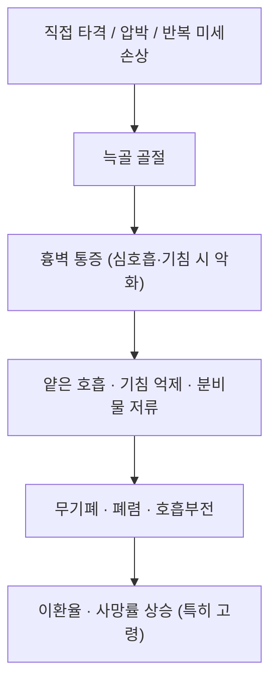

# 🫁 [[늑골 골절]] (Rib Fracture)

> **핵심 요약 (Key Summary)**:
> 늑골은 흉추(T1–T12)에서 기시하여 흉골·늑연골로 이어지는 흉곽의 골성 리브(rib cage)로, 늑간신경(T1–T11, 제12는 늑하신경 T12)과 늑간혈관(늑골구 내 VAN)의 보호 통로를 이룬다.
> 골절 자체보다 **심한 흉벽 통증 → 얕은 호흡·기침 억제 → 무기폐·폐렴**으로 이어지는 합병증 연쇄가 예후를 결정하며, 고령·다발성 골절·[[폐좌상]] 동반 시 사망 위험이 상승한다.
> 치료의 축은 **조기 진통(경구/정맥 진통제, 늑간신경 차단·[[전거근 평면 차단]] 등) + 호흡 관리(심호흡·기침 유도)**이며, 한의학적으로는 급성기 골절부 직접 자극을 피한 채 [[내관]]·[[기문]]·[[폐수]] 등을 활용한 통증·호흡 관리와 회복기 흉추–늑추 가동성 회복(추나·도수)이 핵심 타깃이다.

---
## 📌 목차
1. [해부학적 정밀 구조 및 지배 신경/혈관](#1-해부학적-정밀-구조-및-지배-신경혈관)
2. [생체역학·토크 분석 & 근막 사슬 (Biomechanical Synergy)](#2-생체역학토크-분석--근막-사슬-biomechanical-synergy)
3. [근막통증증후군(TP) & 연관통 패턴 (Travell & Simons)](#3-근막통증증후군tp--연관통-패턴-travell--simons)
4. [초음파 해부학(Sonoanatomy) 및 중재 시술 랜드마크](#4-초음파-해부학sonoanatomy-및-중재-시술-랜드마크)
5. [⭐ 원장님 심층 임상 고찰 및 원본 필기 (Clinical Pearls)](#5-원장님-심층-임상-고찰-및-원본-필기-clinical-pearls)
6. [관련 임상 질환 및 운동손상 증후군 총괄](#6-관련-임상-질환-및-운동손상-증후군-총괄)
7. [추나·도수치료(MET/PIR) & 침구·약침·재활 프로토콜](#7-추나도수치료metpir--침구약침재활-프로토콜)
8. [출처 및 학술 참고 문헌 (References)](#8-출처-및-학술-참고-문헌-references)

---
## 1. 해부학적 정밀 구조 및 지배 신경/혈관

늑골 골절은 "근육–힘줄"이 아닌 **골성 흉곽(thoracic cage)의 구조적 붕괴** 문제이므로, 본 섹션에서는 늑골의 부착·주행 구조와 신경혈관 통로를 근육 노트의 기시/정지 항목에 대응시켜 정리한다.

| 항목 | 상세 내용 |
| :--- | :--- |
| **후방 부착 (기시 상당)** | 늑골두(caput costae)가 흉추의 상·하 늑골와와 추간판에 접합, 늑골결절(tuberculum costae)이 횡돌기 늑골와와 늑골횡돌기인대로 결합 — T1–T12 흉추와 직접 연결 |
| **전방 부착 (정지 상당)** | 제1–7늑골 = 정늑골(true ribs), 흉골에 직접 부착 / 제8–10늑골 = 가늑골, 상위 늑연골에 접합 / 제11–12늑골 = 부늑골(floating ribs), 전방 유리 |
| **주요 구성** | 늑골두 → 늑골경 → 늑골결절 → 늑골각 → 늑골체 → 늑연골. 늑골체 하연 내면에 **늑골구(costal groove)** 존재 |
| **신경 지배** | [[늑간신경]] (intercostal nerve, T1–T11 전지) — 늑골구 내 주행, 골막에 분포하여 골절 시 극심한 통증 발생. 제12늑골 하방은 [[늑하신경]] (subcostal n., T12) |
| **혈관 공급** | 후늑간동맥·정맥(늑골구 내 주행, 늑간정맥–늑간동맥–늑간신경 = **VAN** 순), 전방은 내흉동맥 및 근격횡격동맥 계열 (교과서 해부 기준) |
| **호발 골절 위치** | 늑골각(lateral arc) 및 측후방 늑골체가 생역학적 응력 집중부로 호발. 제4–9늑골이 가장 흔함 (Baiu & Spain, 2019) |

### 🔬 해부학 도해 및 단면도
*(이미지 없음 — 이미지 자리 비워둠)*
> [Wikipedia 공중도메인 해부학 도해]: 늑골구 내 늑간정맥·늑간동맥·늑간신경(VAN)의 주행 순서 및 늑골두–흉추 부착부. 시술 시 늑골 **하연(hanging edge)** 을 목표로 하면 늑간혈관·신경 손상 위험을 줄일 수 있다는 점이 중재의 핵심 원칙이다.

---
## 2. 생체역학·토크 분석 & 근막 사슬 (Biomechanical Synergy)

늑골 골절의 생체역학은 "골절 → 통증 → 호흡 역학 붕괴 → 폐 합병증"의 악순환 구조로 이해하는 것이 임상적으로 가장 유용하다.

* **흉곽의 호흡 역학 (pump-handle / bucket-handle)**: 상부 늑골은 흉골을 전상방으로 밀어올리는 pump-handle 운동, 하부 늑골은 측방 확장하는 bucket-handle 운동을 한다. 늑골 골절 시 이 기계적 확장이 통증으로 제한되면서 **섬모 청소기능 저하·무기폐**가 유발된다 (Baiu & Spain, 2019; Jontz, 2025).
* **분절화와 역설 운동 (paradoxical motion)**: 인접 늑골이 다발성으로 골절되어 늑골 분절이 형성되면 흡기 시 함몰·호기 시 팽융하는 **역설적 운동(flail chest)** 이 발생하며, 이는 폐좌상과 함께 독립적인 호흡부전 위험인자다 (Jontz, 2025).
* **늑간근–횡격막 짝힘(coupling) 손실**: 늑간외근·늑연골간근의 흡기 시 흉곽 고정 기능과, 늑간내근의 호기 시 흉곽 안정화 기능이 통증으로 억제되면 횡격막 단독 호흡으로 전환되고 호흡일(work of breathing)이 급증한다. *(분절별 모멘트 암·토크 수치에 대한 정량 자료는 제공된 문헌에서 **근거 미확인**)*
* **근막 사슬 연계 (Myers Anatomy Trains 관점, 개념적 매핑)**: 전거근–외복사근–복사근 대각선, 광배근–흉요근막의 나선선, 흉근–복직근의 심부전방선이 흉곽과 견갑·체간을 연결한다. 늑골 골절 후 견갑흉추 리듬(견갑상완 리듬) 저하와 동측 어깨 거상 보상이 전형적으로 나타난다. *(근막 사슬과 늑골 골절의 직접 인과는 본 문헌들에서 **근거 미확인** — 임상 관찰 기반 개념 정리)*

---
## 3. 근막통증증후군(TP) & 연관통 패턴 (Travell & Simons)

*(이미지 없음 — 이미지 자리 비워둠)*
> [트라벨 근막통증증후군 책의 이미지]: 해당 근육의 정밀 부착부 및 인접 신경혈관 주행 관계. (적절한 것이 없으면 넘겨도 됨)

* **발통점 및 연관통**: 급성 골절기에는 TrP 유발 검사보다 **골절·기흉·복부손상 등 레드플래그 배제가 우선**이다. 회복기(골유합 후)에 다음 근육의 위성 발통점이 잔존 통증의 원인이 될 수 있다.
  * **늑간근(intercostal mm.)**: 골절 분절 주변의 보호성 긴장 → 국소 압통 및 해당 늑간을 따른 분절성 통증.
  * **전거근(serratus anterior)**: 측흉벽 및 견갑 내측연, 상완 내측으로의 연관통 패턴. *(Travell & Simons 기준 서술)*
  * **흉최장근·후하거근·회선근(흉추 심부 신근)**: 흉추 주변 통증 및 호흡 시 당김.
  * **광배근·대흉근**: 흉벽 압박감, 동측 상지 방사성 당김.
* **감별 포인트**: 늑골 골절의 통증은 **국소 압통 + 늑골 압박 시 통증 + 심호흡·기침 시 악화**가 특징이며, 단순 TrP 통증은 골절선 압통·crepitus·호흡 연동 악화가 없다. *(늑골 골절에서 TrP 유발의 진단적 정확도에 대한 연구는 **근거 미확인**)*

---
## 4. 초음파 해부학(Sonoanatomy) 및 중재 시술 랜드마크

* **골절 진단 초음파**: 흉벽 종주 스캔(longitudinal scan)에서 늑골 피질선의 단절(cortical step-off)과 주변 연부조직 부종을 확인. 흉막선(pleural line) 소실·폐활주(lung sliding) 소실은 [[기흉]] 시사 → 즉시 흉부영상·전문과 협진. *(bedside 초음파의 민감도/특이도 수치는 제공 문헌에서 **근거 미확인**)*
* **[[전거근 평면 차단]] (Serratus Anterior Plane Block, SAPB)**:
  * 랜드마크: 액와중선 제5늑골 부근, 초음파로 **광배근(latissimus dorsi) → 전거근(serratus anterior) → 늑골·흉막** 순 확인 후 전거근 표면(superficial) 또는 심부(deep) 평면에 국소마취제 주입.
  * 근거: 조기 늑골 골절 통증 관리에서 SAPB를 평가한 무작위 임상시험(SABRE)이 수행되었으며(Partyka & Asha, 2024), 늑골 골절 진통 전략 전반에 대한 서술적 고찰(van Zyl & Ho, 2024)에서도 근막 평면 차단이 주요 옵션으로 다뤄진다. *(구체적 통증감소·오피오이드 절감 효과크기는 원문 확인 필요 — **근거 미확인**)*
* **안전 마진 (한의 임상 적용 시 핵심)**:
  * 늑간신경 차단·약침 시 자침점은 **늑골 하연(hanging edge)** 에 두고, 늑골 상연 주행부(늑간혈관)와 흉막을 회피한다.
  * 고령·COPD·마른 체형은 흉벽 두께가 얇아 **기흉 위험 증가** — 흉부 심부 자침(견정–천종–견갑부 심자)은 각도·깊이를 보수적으로 조정.
  * 항응고제 복용자는 혈흉 위험 → 시술 전 확인.

---
## 5. ⭐ 원장님 심층 임상 고찰 및 원본 필기 (Clinical Pearls)

> ⚠️ **레드플래그 선별 (최우선)**
> * 호흡곤란·저산소혈증, 청진 시 호흡음 감소/타진 청탁(단타) → **기흉·혈흉 의심 → 즉시 응급 이송**
> * **연쇄 흉곽(flail chest)** 및 역설적 호흡운동 → 호흡부전 위험
> * 제1늑골 골절 → 대혈관·신경 손상 동반 가능성 평가
> * **하부 늑골(9–12번) 골절 → 간·비장 등 복강 내 장기 손상** 평가 필요
> * **고령 환자(노인)** 는 단일 골절이라도 사망률·폐렴 위험이 유의하게 상승 — 입원/모니터링 기준 보수적으로 적용
> *(Baiu & Spain, 2019; Jontz, 2025)*

* **"골절을 치료하는 것이 아니라, 호흡을 치료한다"**: 늑골 골절 관리의 핵심은 골절 유합 자체가 아니라 **통증 조절 → 심호흡·기침 유지 → 무기폐·폐렴 예방**의 사슬 끊기다 (Baiu & Spain, 2019). 한의 외래에서도 침 치료 직후 환자에게 심호흡·유도 폐활량계(incentive spirometry)를 함께 지도하는 것이 이론적으로 합당하다.
* **폐좌상은 "보이지 않는 주범"**: 흉벽 손상 환자에서 폐좌상은 골절 개수와 독립적으로 산소화를 악화시키는 병변으로, 초기 흉부 청진·산소포화도가 정상이어도 경과 관찰이 필요하다 (Jontz, 2025).
* **진통 전략의 위계**: 경구/정맥 진통제를 기본으로 하고, 국소 차단(늑간신경 차단, SAPB, 경막외·부척추근 차단 등)을 다층적으로 조합하는 접근이 권고된다 (van Zyl & Ho, 2024). 한의 임상에서는 침·약침이 이 진통 사다리의 **보조 축**으로 위치한다고 보는 것이 안전하다.
* **수술적 늑골 고정(SSRF)은 논쟁 중**: 연쇄 흉곽·다발성 전위 골절 등 선택된 환자에서 이득 가능성이 논의되지만, 적응증과 대상 선정에 대한 결론은 정립 중이다 (Doben & Schubl, 2022). 따라서 외래 환자에서 "수술해야 한다/필요 없다"를 단정하지 않는다.
* **선수 층 특이성**: 늑골 골절은 조정(rowers), 골프, 접촉 스포츠 등에서 **스트레스 골절** 형태로도 발생하며, 급성 외상과 감별·훈련량 조절이 치료의 축이다 (Miles & Barrett, 1991).
* **한의학적 병기 매핑(개념)**: 급성기 = 打撲損傷으로 인한 **瘀血阻絡·氣滯**, 아급성기 = **瘀血未盡 + 氣滯**, 회복기 = **氣血兩虛·肝腎不足**. *(고전 문헌 기반 개념 정리이며, 늑골 골절에 대한 침·약침의 RCT 근거는 제공 문헌에서 **근거 미확인**)*

---
## 6. 관련 임상 질환 및 운동손상 증후군 총괄

| 임상 질환 / 증후군 | 병리적 연관 기전 | 주요 증상 및 이학적 검사 | 핵심 교정 타깃 |
| :--- | :--- | :--- | :--- |
| [[다발성 늑골 골절]] | 골절 개수 증가 → 폐 합병증·사망 위험 상승 | 국소 압통, 늑골 압박 시 통증, 기침 시 악화 | 조기 진통·호흡 관리 (Baiu & Spain, 2019) |
| [[연쇄 흉곽]] (Flail chest) | 다발성 분절화 → 역설적 호흡운동 | 흡기 시 함몰·호기 시 팽융, 호흡부전 | 양압환기·SSRF 고려 (Jontz, 2025; Doben & Schubl, 2022) |
| [[폐좌상]] (Pulmonary contusion) | 폐실질 손상 → 산소화 장애 | 저산소혈증, 흉부 CT 병변 | 산소요법·분비물 관리·호흡 재활 |
| [[기흉]] / [[혈흉]] | 골절단에 의한 흉막·혈관 손상 | 호흡음 감소, 타진 청탁, 폐활주 소실 | 즉시 흉관 배액·응급 이송 |
| [[늑골 스트레스 골절]] | 반복 미세손상(조정·골프·과훈련) | 국소 압통, 활동 시 통증, 초기 영상 음성 | 훈련량 조절·회복 (Miles & Barrett, 1991) |
| [[늑간신경통]] | 골절 후 신경 자극·반흔 유착 | 피부 분절 방사통, 늑간 주행 압통 | 신경 주변부 이완·통증 조절 |
| [[흉추 기능부전]] | 보호성 자세 → 흉추 신전·회전 제한 | 흉추 가동성 저하, 견갑흉추 리듬 저하 | 흉추 가동성 회복 (회복기 도수치료) |

---
## 7. 추나·도수치료(MET/PIR) & 침구·약침·재활 프로토콜

### ⛔ 절대 원칙 (Timing)
* **급성기(골절 후 약 0–4주, 골유합 전)**: 골절부 직접 압박·추나·강한 도수 **금지**. 흉곽 압박 검사도 진단 목적 외 반복 시행하지 않는다.
* **회복기(골유합 확인 후, 통상 4–6주 이후)**: 영상·임상 소견상 안정성 확인 후 단계적 적용. *(구체적 골유합 시점 기준은 개별 환자·연령·골절 수에 따라 다르며 제공 문헌에서 **근거 미확인**)*

### 🧘 호흡 재활 (급성기부터 즉시)
1. 심호흡(diaphragmatic + lateral costal expansion) 10회 × 5세트/일
2. 유도 폐활량계(incentive spirometry) 또는 풍선 불기 — 무기폐 예방
3. 통증 조절 하 기침 유도(쿠션으로 골절부 압박 지지 = splinting)
4. 조기 이상(early mobilization) — 와상 기간 최소화 (Jontz, 2025)

### 🖐 도수치료 / MET / PIR (회복기)
* **흉추 신전–회전 가동성 회복**: 앉은 자세에서 흉추 분절 가동, MET 방식의 등척성 수축–이완(호기 시 부드러운 신장).
* **늑골–흉추 관절(costovertebral / costotransverse joint) 가동**: 회복기 제한이 남은 분절에 대해 저강도 관절가동. 골절선 직접 압박 없이 주변부만 접근.
* **전거근·늑간근 PIR**: 통증 없는 범위에서 등척성 수축 후 이완, 늑골 확장 방향으로 유도.
* **견갑흉추 리듬 회복**: 전거근·하부 승모근 활성화(강화), 흉근·광배근 이완.
* *(늑골 골절 후 도수치료/MET의 효과에 대한 임상시험 근거는 제공 문헌에서 **근거 미확인** — 해부학·생체역학 기반 접근)*

### 🪡 침구 경혈 매핑 (통증·호흡 관리 목적)
| 부위 | 경혈 | 응용 |
| :--- | :--- | :--- |
| 원위 | [[내관]](PC6), [[합곡]](LI4), [[태충]](LR3), [[양릉천]](GB34, 筋會), [[족삼리]](ST36) | 전신 진통·기혈 조절, 골절 회복 보조 |
| 흉부 국소 | [[전중]](CV17), [[기문]](LR14), [[장문]](LR13), [[대포]](SP21) | 흉민·흉통·기침. **자침 각도는 흉벽에 평자(平刺)하여 흉막 천자 회피 — 기흉 예방 필수** |
| 배부 | [[폐수]](BL13), [[격수]](BL17), [[심수]](BL15) | 血會 膈兪 활용 어혈·통증 관리 |
| 견갑·측흉 | [[천종]](SI11), [[견정]](GB21) 주변 | 견갑흉추 리듬 회복. **견정·견갑부 심자는 기흉 위험 — 보수적 깊이/각도** |

### 💉 약침
* 회복기 근긴장·잔존 통증에 대해 골절선을 피해 **주변부(늑간근·전거근·흉추 심근)** 에 소량 자극. **골절선 내 직접 주입은 금지**.
* 특정 약침(자하거·봉독 등)의 늑골 골절 골유합 촉진·진통 효과는 제공 문헌에서 **근거 미확인** — 원내 임상 판단 및 환자 동의 기반 적용.

---
## 8. 출처 및 학술 참고 문헌 (References)

1. **Baiu I, Spain D (2019)**. Rib Fractures. *JAMA*. PMID: **31087024**
2. **Miles JW, Barrett GR (1991)**. Rib fractures in athletes. *Sports Med*. PMID: **1925189**
3. **Doben AR, Schubl SD (2022)**. Surgical rib fixation in traumatic rib fractures: is it warranted? *Curr Opin Anaesthesiol*. PMID: **35175960**
4. **Jontz AE (2025)**. Chest Wall Trauma: Rib Fractures and Pulmonary Contusions. *Crit Care Nurs Clin North Am*. PMID: **40849170**
5. **Partyka C, Asha S (2024)**. Serratus Anterior Plane Blocks for Early Rib Fracture Pain Management: The SABRE Randomized Clinical Trial. *JAMA Surg*. PMID: **38691350**
6. **van Zyl T, Ho AM (2024)**. Analgesia for rib fractures: a narrative review. *Can J Anaesth*. PMID: **38459368**

*(교과서 참조)*
7. **Standring, S. (2020)**. *Gray's Anatomy: The Anatomical Basis of Clinical Practice* (42nd ed.). Elsevier.
8. **Travell, J. G., & Simons, D. G. (1999)**. *Myofascial Pain and Dysfunction: The Trigger Point Manual*, Vol. 1.

> **근거 수준 표기 원칙**: 본 노트에서 "근거 미확인"으로 표시한 항목은 제공된 6편의 논문 및 교과서 해부학 범위에서 직접 확인되지 않은 서술(한의학 병기 매핑, 약침의 골유합 촉진 효과, 도수치료/MET의 늑골 골절 특이적 효과, 수치적 민감도·효과크기 등)이다. 임상 적용 시에는 최신 원문 확인과 환자별 위험–이득 평가가 필요하다.