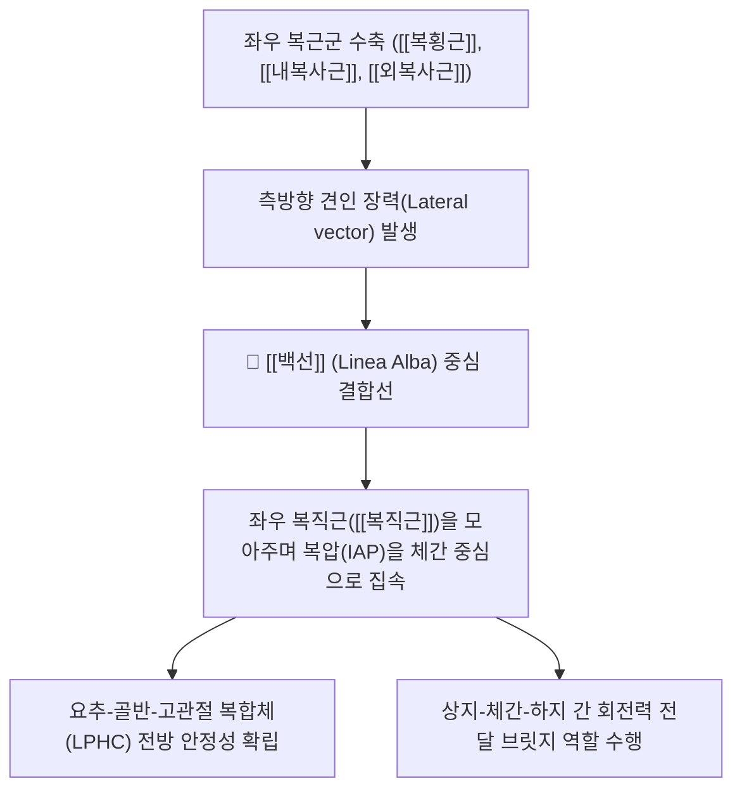

---
aliases:
  - 백선
  - Linea alba
  - 복부 백선
  - 하얀선
tags:
  - 해부학
  - 근막
  - 체간
  - 복벽
  - 복직근
  - 코어생체역학
  - 복직근이개
---
# 🦴 [[백선]] (Linea Alba, 하얀선)

> **핵심 요약 (Key Summary)**:
> 흉골 검상돌기(Xiphoid process)에서 치골결합(Pubic symphysis)까지 전복벽의 정중선을 수직으로 주행하는 단단한 백색 섬유성 건막 융합 구조물.
> 좌우 [[외복사근]], [[내복사근]], [[복횡근]]의 건막 섬유가 중앙에서 다층적(3차원 그물망)으로 교차하며 형성되어 복직근초(Rectus sheath)를 중앙에서 단단히 결합.
> 복강 내압(IAP) 형성, 체간 굴곡·회전 토크 전달의 핵심 축이며, 임신 및 복압 과부하 시 [[복직근 이개]](Diastasis recti) 및 백선 탈장(Epigastric hernia)이 호발.

---

## 📌 목차
1. [해부학적 구조 및 건막 교차 패턴](#1-해부학적-구조-및-건막-교차-패턴)
2. [생체역학적 기능 & 복강내압(IAP) 전달 축](#2-생체역학적-기능--복강내압iap-전달-축)
3. [주요 임상 질환군 (복직근 이개, 백선 탈장)](#3-주요-임상-질환군-복직근-이개-백선-탈장)
4. [이학적 평가 및 초음파 계측 (IRD)](#4-이학적-평가-및-초음파-계측-ird)
5. [추나·산후 코어 재활 & 침구 임상 프로토콜](#5-추나산후-코어-재활--침구-임상-프로토콜)
6. [출처 및 학술 참고 문헌 (References)](#6-출처-및-학술-참고-문헌-references)

---

## 1. 해부학적 구조 및 건막 교차 패턴

| 구분 | 해부학적 상세 특징 |
| :--- | :--- |
| **상부 부착점** | 흉골 검상돌기 (Xiphoid process) |
| **하부 부착점** | 치골결합 (Pubic symphysis) 및 치골능 |
| **구성 건막 섬유** | 좌우 [[외복사근]], [[내복사근]], [[복횡근]] 건막의 중앙 정중선 교차 |
| **부위별 폭(너비) 차이** | • 제대 상부 (Epigastric): 폭이 넓고 평평함 (약 1.5~2.0 cm) • 제대부 (Umbilical): 가장 넓고 결손에 취약 (약 2.0~2.5 cm) • 제대 하부 (Hypogastric): 매우 좁고 팽팽한 선형으로 수축 (수 mm 이내) |

* **3차원 섬유 교차망 (3D Meshwork)**:
  * 단순한 맞물림이 아니라, 얕은층·중간층·깊은층 섬유가 45°~90° 각도로 다채롭게 엇갈리며 교차하여 장력과 신장력에 저항하는 강력한 콜라겐(Type I & III) 직물 구조를 형성.

---

## 2. 생체역학적 기능 & 복강내압(IAP) 전달 축

* **복벽 텐세그리티(Tensegrity)의 중앙 앵커**:
  * 복횡근과 복사근이 수축할 때 발생하는 수평 장력을 백선이 버텨줌으로써 복강 내압(Intra-abdominal pressure, IAP)을 상승시켜 요추의 전방 전위를 방어.
* **보행 및 달리기 시 회전 토크 분산**:
  * 한쪽 외복사근과 반대쪽 내복사근이 전방 사선 사슬(Anterior Oblique Sling)을 이룰 때, 그 교차점이 바로 백선이 되어 회전 에너지를 전달.

---

## 3. 주요 임상 질환군 (복직근 이개, 백선 탈장)

* **복직근 이개 (Diastasis Recti Abdominis, DRA)**:
  * 임신 말기 호르몬(릴랙신) 및 복압 팽창, 또는 만성 복부 비만으로 백선이 얇아지고 좌우 복직근 사이가 2cm 이상 벌어지는 현상.
  * 복벽 지지력 상실로 만성 요통, 골반저근 약화(요실금), 제대 돌출을 초래.
* **상복부 백선 탈장 (Epigastric Hernia)**:
  * 제대와 검상돌기 사이 백선의 섬유 교차 틈새로 복막외 지방이나 소장이 삐져나오는 탈장.
* **흑선 (Linea Nigra)**:
  * 임신 중 멜라닌세포 자극 호르몬([[ACTH]], MSH) 증가로 백선 부위 피부가 짙은 갈색 선으로 변색되는 생리적 징후.

---

## 4. 이학적 평가 및 초음파 계측 (IRD)

* **복직근 간격(Inter-recti Distance, IRD) 촉진 검사**:
  * 환자가 누운 상태에서 머리와 어깨를 가볍게 들어 올리는 컬업(Curl-up) 동작 시, 제대 상부 3cm 부위에서 손가락이 2마디(2cm) 이상 쑥 들어가는지 확인.
* **초음파 정밀 계측 (Sono-imaging)**:
  * 고주파 트랜스듀서로 백선의 두께와 양측 복직근 내측연 사이의 거리를 측정하여 근막 파열 유무 확인.

---

## 5. 추나·산후 코어 재활 & 침구 임상 프로토콜

* **호흡과 연동된 심부 코어 재활 (Hypopressive Exercise)**:
  * 무작정 윗몸일으키기(Crunch)를 하면 복압이 앞으로 쏠려 백선이 더 찢어지므로 절대 금기.
  * 날숨에 복횡근과 골반저근을 먼저 조여 백선을 중심부로 끌어당기는 드로우인(Draw-in) 호흡 훈련 적용.
* **침구 및 임맥(任脈) 혈자리 연계**:
  * 한의학에서 백선의 주행로는 기혈이 모이는 **임맥(任脈)**과 완벽히 일치.
  * 중완(CV12), 하완(CV10), 수분(CV9), 신궐(CV8), 기해(CV6), 관원(CV4) 등의 혈자리에 침 자극을 주어 복벽 결합조직 탄력 재생 촉진.

---

## 6. 출처 및 학술 참고 문헌 (References)

* Axer, H., et al. (2001). Collagen fibers in the linea alba: an orientation-sensitive study using polarized light microscopy. *Journal of Anatomy*, 199(3), 275-282.
  * `[연구 요약]` 편광 현미경을 통해 백선의 복잡한 3차원 콜라겐 섬유 다층 교차 구조와 장력 분산 원리를 규명.
* Benjamin, P. J., et al. (2014). Effects of exercise on diastasis of the rectus abdominis muscle in the antenatal and postnatal periods: a systematic review. *Physiotherapy*, 100(1), 1-8.
  * `[연구 요약]` 산전·산후 복직근 이개 환자에서 백선의 기능 회복을 위한 복횡근 기반 운동 재활 치료의 유효성 검증.
