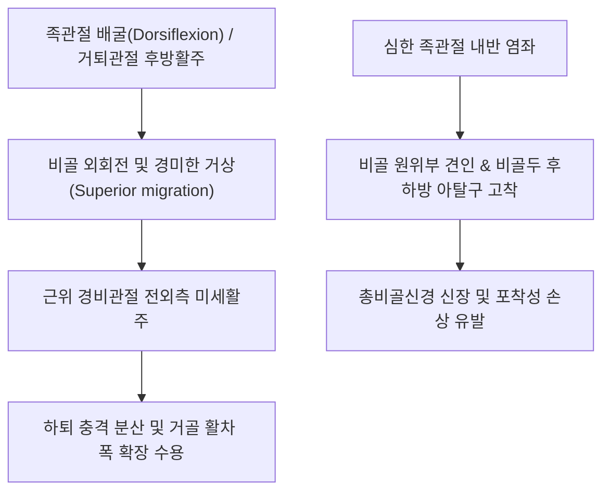

# 🦴 [[비골두]] (Head of Fibula)

> **핵심 요약 (Key Summary)**:
> 하퇴 외측 비골의 근위부 팽대부로 경골 외측과와 함께 근위 경비관절을 형성하고 대퇴이두근건 및 외측측부인대가 정지하는 해부학적 랜드마크.
> 비골두 경부 후외측을 감아 도는 총비골신경의 표재성 주행으로 인해 압박성 신경병증(족하수) 및 발목 내반 염좌 시 견인 손상 호발 부위.
> 근위 경비관절 기능이상 시 슬관절 외측 통증 및 족관절 운동 제한을 유발하여 추나요법 가동술 및 비골신경 포착 해소 약침 치료의 핵심 타깃.

---
## 📌 목차
1. [해부학적 정밀 구조 및 인접 신경·인대·근육](#1-해부학적-정밀-구조-및-인접-신경인대근육)
2. [생체역학·운동형상학 & 관절 역학](#2-생체역학운동형상학--관절-역학)
3. [총비골신경 포착 및 신경학적 임상 평가](#3-총비골신경-포착-및-신경학적-임상-평가)
4. [초음파 해부학(Sonoanatomy) 및 중재 시술 랜드마크](#4-초음파-해부학sonoanatomy-및-중재-시술-랜드마크)
5. [관련 임상 질환 및 손상 기전](#5-관련-임상-질환-및-손상-기전)
6. [추나·도수치료(근위 경비관절 가동술) & 침구·약침 프로토콜](#6-추나도수치료근위-경비관절-가동술--침구약침-프로토콜)
7. [출처 및 학술 참고 문헌 (References)](#7-출처-및-학술-참고-문헌-references)

---
## 1. 해부학적 정밀 구조 및 인접 신경·인대·근육

| 항목 | 상세 내용 |
| :--- | :--- |
| **위치 및 관절 형성** | 하퇴 외측 근위부, 경골 외측과 후하면과 활액성 평면관절인 근위 경비관절(Proximal tibiofibular joint) 형성 |
| **근육 부착부 (정지)** | [[대퇴이두근]]건(Biceps femoris tendon)의 주 정지부, 비골두 첨부(Apex/Styloid process)에 부착 |
| **근육 부착부 (기시)** | [[장비골근]](Peroneus longus), [[가자미근]](Soleus) 전외측 섬유, [[장지신근]](Extensor digitorum longus) 기시 |
| **인대 부착부** | 외측측부인대(LCL, Fibular collateral ligament), 전/후근위경비인대(Anterior/Posterior proximal tibiofibular ligaments), 활액낭궁상인대 복합체 |
| **인접 신경 주행** | [[총비골신경]](Common peroneal nerve)이 비골두 후하방 경부(Neck of fibula)를 감싸며 천비골신경과 심비골신경으로 분지 |
| **혈관 공급** | 전경골재발동맥(Anterior tibial recurrent artery), 하외측슬동맥(Inferior lateral genicular artery)의 관절지 망 |

---
## 2. 생체역학·운동형상학 & 관절 역학

* **체중 부하 및 보행 시의 운동형상학**:
  * 비골은 하지 체중의 약 6~10%를 부하하며, 족관절 거퇴관절(Talocrural joint)의 회전과 배굴/저굴에 맞춰 근위 경비관절에서 전후방 및 상하 미세 활주를 수행합니다.
  * 족관절 배굴 시 거골 활차(Trochlea)의 전방 폭이 넓어지면서 원위 비골이 외측으로 벌어지고 비골두는 약간 상방·외회전됩니다.
* **외측 안정화 복합체(Lateral Stabilizing Complex)**:
  * 대퇴이두근건과 LCL이 비골두에 conjoint tendon 형태로 부착하여 슬관절의 내반(Varus) 스트레스 및 외회전에 대한 주된 동적/정적 제어기 역할을 합니다.

---
## 3. 총비골신경 포착 및 신경학적 임상 평가

* **비골터널 증후군 (Fibular Tunnel Syndrome)**:
  * 총비골신경은 비골 경부의 골막 직상부를 주행하며, 장비골근 기시부의 섬유성 건궁(Fibrous arch) 하부를 통과합니다.
  * 이 부위는 피하지방이 얇아 깁스 석고 압박, 다리 꼬기 습관, 장시간 쪼그려 앉기, 수술 중 측와위 압박 등에 매우 취약합니다.
* **신경학적 증상 및 징후**:
  * **감각 장애**: 하퇴 전외측 및 족배부 감각 저하, 저림, 이상감각.
  * **운동 마비 (Foot Drop)**: [[전경골근]], [[장무지신근]], [[장비골근]] 약화로 인한 족관절 배굴 및 외반 장애, 계상 보행(Steppage gait).
  * **Tinel 징후**: 비골두 직하방 경부를 가볍게 타진 시 족배부로 찌릿한 방사통 발생.

---
## 4. 초음파 해부학(Sonoanatomy) 및 중재 시술 랜드마크

* **초음파 횡단 스캔 (Transverse View)**:
  * 탐촉자를 비골두 레벨에 대고 아래로 이동시키면 비골 경부의 고에코 골 표면 위로 타원형의 저에코 다발성 총비골신경(CPN) 단면을 관찰할 수 있습니다.
  * 장비골근 근막 아래로 진입하며 천비골신경(SPN)과 심비골신경(DPN)으로 분지되는 분기점을 확인합니다.
* **초음파 유도하 약침 및 수압박리술(Hydrodissection)**:
  * **자침 안전 궤적**: Out-of-plane 또는 In-plane 후전방 접근으로 신경 주위 결합조직과 장비골근 건궁 사이에 바늘을 위치시킵니다.
  * **약침 주입**: [[신경포착]] 해소 및 혈류 개선을 위해 황련해독탕 약침 또는 중성어혈 약침을 신경 상하막 외측에 안전하게 분주합니다.

---
## 5. 관련 임상 질환 및 손상 기전

1. **근위 경비관절 아탈구 및 기능부전**:
   * 주로 발목 내반 염좌 시 비골이 하방 견인되면서 비골두가 후하방으로 변위되어 고착됩니다. 슬관절 굴곡 시 외측 통증이 심해지고 계단 보행 시 불안정성을 호소합니다.
2. **총비골신경 마비 (Peroneal Neuropathy)**:
   * 압박, 외상, 견인에 의해 급성 또는 만성 족하수 유발.
3. **대퇴이두근 건염 및 견열 골절**:
   * 육상, 축구 등 전력 질주 시 햄스트링의 원심성 수축 부하로 인해 비골두 정지부의 견열 골절(Avulsion fracture) 또는 만성 건병증 호발.

---
## 6. 추나·도수치료(근위 경비관절 가동술) & 침구·약침 프로토콜

### 1) 추나요법 관절 가동술 (Mobilization)
* **후방 변위 교정 기법 (Posterior-to-Anterior Glide)**:
  * 환자 앙와위 또는 측와위에서 시술자의 모지구(Thenar)를 후방 변위된 비골두 후면에 접촉.
  * 슬관절을 약 90도 굴곡하여 LCL과 대퇴이두근건을 이완시킨 후, 전외측(Anterolateral) 방향으로 부드러운 진동식 견인 가동술 또는 저진폭 고속 추나(HVLA) 적용.
* **전방 변위 교정 기법 (Anterior-to-Posterior Glide)**:
  * 비골두 전면에 무지구를 접촉하고 후내측 방향으로 후방 활주 유도.

### 2) 침구 및 약침 치료
* **주요 혈위**:
  * 양릉천(陽陵泉, GB34): 비골두 전하방 함요처. 근회(筋會)로서 하퇴 전외측 및 비골근 긴장 해소.
  * 구허(丘墟, GB40), 족삼리(ST36) 배합.
* **약침 프로토콜**:
  * 비골두 주변 인대 이완 및 압박성 신경 염증 완화를 위해 봉약침(10% BV) 또는 자하거 약침을 LCL 부착부 및 비골 신경 주행부에 분주.

---
## 7. 출처 및 학술 참고 문헌 (References)

* Neumann DA. *Kinesiology of the Musculoskeletal System: Foundations for Rehabilitation*. 3rd ed. Elsevier; 2017.
  * `[연구 요약]` 하퇴 및 족관절 운동 시 비골두 및 근위 경비관절의 미세 삼차원 활주 운동과 체중 분산 기능의 생체역학적 분석.
* Baima J, Krivickas L. Evaluation and treatment of peroneal neuropathy. *Curr Sports Med Rep*. 2008;7(1):35-40.
  * `[연구 요약]` 비골두 경부에서의 총비골신경 포착 기전, 전기진단학적 감별 검사 및 초음파 유도하 비수술적 중재 시술 프로토콜.
* 대한침구의학회 교재편찬위원회. *침구의학*. 집문당; 2020.
  * `[연구 요약]` 양릉천(GB34) 혈위의 해부학적 구조(비골두 전하방)와 하지 마비, 족하수 및 슬관절 외측 통증에 대한 침구 치료 임상 응용.
