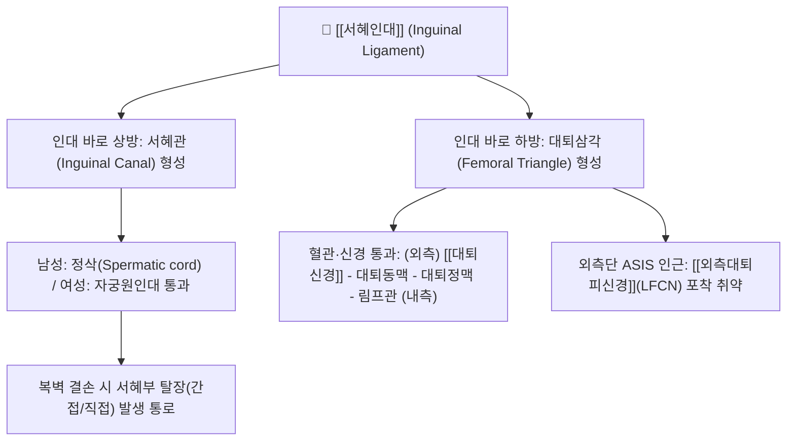

---
aliases:
  - 서혜인대
  - 사타구니인대
  - Inguinal ligament
  - Poupart's ligament
  - 푸파르인대
tags:
  - 해부학
  - 인대
  - 골반
  - 서혜부
  - 복벽
  - 대퇴삼각
  - 서혜관
  - 탈장
---
# 🦴 [[서혜인대]] (Inguinal Ligament, Poupart's Ligament)

> **핵심 요약 (Key Summary)**:
> 상전장골극(ASIS)에서 치골결절(Pubic tubercle)까지 팽팽하게 이어지는 [[외복사근]] 건막의 아래쪽 자유연이 안쪽으로 말려 접힌 섬유성 인대 구조물.
> 복부와 하지를 경계 짓는 핵심 해부학적 랜드마크로, 심부로는 대퇴신경·대퇴동맥·대퇴정맥이 지나는 대퇴삼각(Femoral triangle)의 상계를 형성.
> 인대 상방으로는 정삭/자궁원인대가 통과하는 서혜관(Inguinal canal)이 위치하여 서혜부 탈장(Hernia) 및 [[외측대퇴피신경]] 포착(지각이상성 대퇴신경통)의 핵심 병소.

---

## 📌 목차
1. [해부학적 구조 및 경계 랜드마크](#1-해부학적-구조-및-경계-랜드마크)
2. [서혜관(Inguinal Canal) 및 대퇴삼각과의 삼차원적 관계](#2-서혜관inguinal-canal-및-대퇴삼각과의-삼차원적-관계)
3. [생체역학적 기능 & 복압 지지 사슬](#3-생체역학적-기능--복압-지지-사슬)
4. [관련 임상 질환군 (서혜부 탈장, 지각이상성 대퇴신경통, 스포츠 탈장)](#4-관련-임상-질환군-서혜부-탈장-지각이상성-대퇴신경통-스포츠-탈장)
5. [이학적 검사 및 추나·침구 임상 접근법](#5-이학적-검사-및-추나침구-임상-접근법)
6. [출처 및 학술 참고 문헌 (References)](#6-출처-및-학술-참고-문헌-references)

---

## 1. 해부학적 구조 및 경계 랜드마크

| 항목 | 상세 내용 |
| :--- | :--- |
| **기시 부착부** | 상전장골극 ([[ASIS]], Anterior Superior Iliac Spine) |
| **정지 부착부** | 치골결절 (Pubic tubercle) |
| **해부학적 본질** | [[외복사근]](External oblique muscle) 복벽 건막의 하연이 두꺼워져 후상방으로 말려 들어간(Rolled-in) 건막성 결합조직 |
| **확장 인대 구조** | • **열공인대 (Lacunar ligament, Gimbernat's lig.)**: 치골치근선으로 반전 부착 • **치골근선인대 (Pectineal ligament, Cooper's lig.)**: 치골치근선을 따라 외측으로 연장 |

---

## 2. 서혜관(Inguinal Canal) 및 대퇴삼각과의 삼차원적 관계

* **서혜관 (Inguinal Canal)의 바닥(Floor)**:
  * 서혜인대가 서혜관의 바닥을 이루며, 천서혜륜(Superficial ring)과 심서혜륜(Deep ring) 사이로 복벽을 비스듬히 관통하는 약 4cm 길이의 터널.
* **대퇴삼각 (Femoral Triangle)의 상계(Superior border)**:
  * 서혜인대 하부의 공간(Retro-inguinal space)을 통해 골반 내에서 하지로 주요 혈관과 신경이 주행:
    * 외측$\rightarrow$내측 순서: **N-A-V-E-L** ([[대퇴신경]] - 대퇴동맥 - 대퇴정맥 - 대퇴관/림프관).

---

## 3. 생체역학적 기능 & 복압 지지 사슬

* **복벽과 하지의 생체역학적 힘 전달 브릿지**:
  * 복부 근육군([[복직근]], [[외복사근]], [[내복사근]], [[복횡근]])의 장력을 골반과 대퇴부로 분산.
* **보행 및 달리기 시 복압 유지**:
  * 골반의 전방 경사 및 고관절 신전 시 팽팽하게 긴장되어 복강 내 장기가 하지 쪽으로 밀려 내려오지 않도록 물리적 장벽 역할 수행.

---

## 4. 관련 임상 질환군 (서혜부 탈장, 지각이상성 대퇴신경통, 스포츠 탈장)

* **서혜부 탈장 (Inguinal Hernia)**:
  * **간접 탈장(Indirect)**: 심서혜륜을 통해 정삭을 타고 음낭 쪽으로 돌출 (선천적 초상돌기 미폐쇄).
  * **직접 탈장(Direct)**: 서혜인대 바로 위 복벽 허약 부위(Hesselbach 삼각)를 뚫고 전방으로 돌출 (노화 및 복압 상승).
* **지각이상성 대퇴신경통 (Meralgia Paresthetica)**:
  * [[외측대퇴피신경]](LFCN)이 ASIS 바로 안쪽에서 서혜인대 아래를 통과할 때, 꽉 끼는 바지, 비만, 임신, 벨트 압박으로 포착되어 대퇴 전외측의 감각 저하, 타는 듯한 작열통(Burning pain) 유발.
* **스포츠 탈장 (Sports Hernia, 운동선수 서혜부 통증)**:
  * 진성 탈장은 아니나, 축구나 하키 등 급격한 방향 전환 시 서혜인대 부착부 건막과 치골 결합부의 미세 파열로 만성 서혜부 통증 초래.

---

## 5. 이학적 검사 및 추나·침구 임상 접근법

* **외측대퇴피신경 포착 유발 검사**:
  * ASIS 내측 하방 1cm 부위 서혜인대 압박 시 대퇴 외측으로 찌릿한 방사통 유발 (Tinel sign 양성).
* **골반 비틀림 교정 및 서혜인대 장력 정상화 추나**:
  * 장골의 후회전 또는 전회전 변위를 교정하여 서혜인대에 걸리는 비대칭적 견인 스트레스를 해소.
  * [[장요근]] 및 치골근의 단축을 PIR 기법으로 이완.
* **침구 혈자리**:
  * 충문(SP12, 서혜인대 중앙 대퇴동맥 맥동처 외측), 기충(ST30, 치골결합 상연 서혜부), 오리(LR10).

---

## 6. 출처 및 학술 참고 문헌 (References)

* Skandalakis, J. E., et al. (1995). Surgical anatomy of the inguinal canal. *World Journal of Surgery*, 19(4), 522-530.
  * `[연구 요약]` 서혜인대를 축으로 하는 서혜관의 정밀 3차원 외과 해부학 및 탈장 예방 구조를 체계화.
* Harney, D., & Patijn, J. (2007). Meralgia paresthetica: diagnosis and management. *Techniques in Regional Anesthesia and Pain Management*, 11(2), 102-108.
  * `[연구 요약]` 서혜인대 하부 외측대퇴피신경 포착의 임상 양상, 감별 진단 및 국소 주사·도수 중재 프로토콜을 규명.
