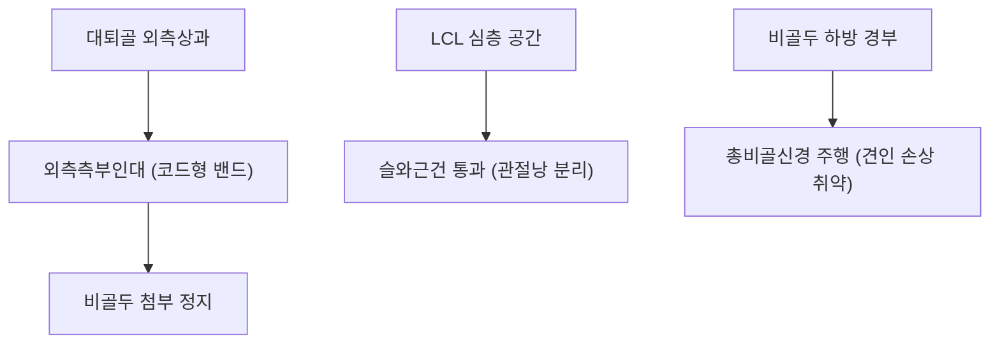

# 🦴 [[외측측부인대]] (Lateral Collateral Ligament, LCL)

> **핵심 요약 (Key Summary)**:
> 대퇴골 외측상과에서 기시하여 비골두 외측면에 정지하는 밧줄 모양의 독립된 슬관절 외측 안정화 인대.
> 슬관절 내반 스트레스에 대항하는 주된 1차 정적 억제기이며 외측 관절낭 및 반월상연골과 분리된 관절낭 외 주행을 형성.
> 무릎 내측 충돌 및 과신전 외상 시 호발하며 손상 시 인접한 총비골신경 마비 위험이 높아 비골두 교정 추나와 양릉천 약침의 핵심 표적.

---
## 📌 목차
1. [해부학적 기원·정지 및 관절낭 외(Extracapsular) 주행 특성](#1-해부학적-기원정지-및-관절낭-외extracapsular-주행-특성)
2. [생체역학적 기능 & 내반(Varus) 스트레스 제어 메커니즘](#2-생체역학적-기능--내반varus-스트레스-제어-메커니즘)
3. [후외측 복합체(PLC) 구성 및 총비골신경 손상 위험성](#3-후외측-복합체plc-구성-및-총비골신경-손상-위험성)
4. [이학적 진단 검사 (내반 스트레스 검사, Varus Stress Test)](#4-이학적-진단-검사-내반-스트레스-검사-varus-stress-test)
5. [초음파 해부학(Sonoanatomy) 및 중재 시술 랜드마크](#5-초음파-해부학sonoanatomy-및-중재-시술-랜드마크)
6. [추나·도수치료(비골두 정렬 교정) & 침구·약침 치료 프로토콜](#6-추나도수치료비골두-정렬-교정--침구약침-치료-프로토콜)
7. [출처 및 학술 참고 문헌 (References)](#7-출처-및-학술-참고-문헌-references)

---
## 1. 해부학적 기원·정지 및 관절낭 외(Extracapsular) 주행 특성

| 해부학적 항목 | 상세 내용 |
| :--- | :--- |
| **대퇴 기시부** | [[대퇴골]] 외측상과(Lateral epicondyle) 상외측 결절 |
| **비골 정지부** | [[비골두]](Head of fibula) 외측면 첨부(Apex/Styloid process) |
| **형태 및 굵기** | 길이 약 5~6cm의 둥글고 단단한 코드형(Cord-like) 독립 밴드 구조 |
| **관절낭과의 관계** | 관절낭 외 인대(Extracapsular)로 외측 반월상연골과 완전히 분리되어 유착되지 않음 |
| **인접 구조물 주행** | LCL 심층으로 [[슬와근]](Popliteus)건과 하외측슬동맥이 통과, 표재부에 [[대퇴이두근]]건 부착 |

---
## 2. 생체역학적 기능 & 내반(Varus) 스트레스 제어 메커니즘

* **1차 내반 억제기 (Primary Restraint to Varus Stress)**:
  * 슬관절 25도 굴곡 상태에서 내반 토크 저항의 약 69%를 LCL이 단독으로 담당합니다.
  * 완전 신전 시에는 후방 관절낭 및 장경인대, 십자인대가 협력하여 LCL의 분담률이 약 55%로 조절됩니다.
* **외회전 및 후방 전위 보조 억제**:
  * 슬관절 굴곡 전반에 걸쳐 경골의 과도한 외회전을 제어하는 데 기여합니다.

---
## 3. 후외측 복합체(PLC) 구성 및 총비골신경 손상 위험성

* **후외측 복합체 (Posterolateral Corner, PLC)**:
  * LCL, 슬와근건(Popliteus tendon), 슬와비골인대(Popliteofibular ligament, PFL), 궁상인대 복합체로 구성.
  * LCL 완전 파열 시 흔히 PLC가 동반 손상되어 심각한 후외측 회전 불안정성(Posterolateral rotatory instability)을 초래합니다.
* **[[총비골신경]] (CPN) 동반 손상 위험 (CRITICAL)**:
  * 총비골신경은 비골두 경부 바로 아래를 휘감아 도는 표재성 경로를 갖습니다.
  * 심한 내반 및 과신전 외력으로 LCL이 파열되거나 비골두 견열 골절이 발생할 때 총비골신경이 심하게 견인되어 족하수(Foot drop) 및 하퇴 외측 감각 마비가 동반될 수 있습니다.

---
## 4. 이학적 진단 검사 (내반 스트레스 검사, Varus Stress Test)

1. **30도 굴곡 내반 스트레스 검사**:
   * 슬관절을 30도 굴곡하여 후방 관절낭과 십자인대를 느슨하게 만든 상태에서 내반력을 가함.
   * 외측 관절선의 벌어짐과 통증, 종말감(Endpoint) 유무를 평가하여 LCL 단독 손상 진단.
2. **0도 완전 신전 내반 스트레스 검사**:
   * 완전 신전 상태에서 내반 검사 시 외측 관절이 열린다면 LCL 파열뿐만 아니라 [[전방십자인대]] 또는 [[후방십자인대]], PLC의 광범위한 복합 파열을 의미.
3. **Dial 검사 (외회전 검사)**:
   * 30도 및 90도 굴곡에서 경골 외회전 각도를 대조측과 비교하여 PLC 복합 손상 감별.

---
## 5. 초음파 해부학(Sonoanatomy) 및 중재 시술 랜드마크

* **초음파 장축 스캔**:
  * 탐촉자를 대퇴 외측상과에서 비골두로 비스듬히 거치하면 팽팽한 고에코의 코드 모양 밴드로 뚜렷하게 관찰됩니다.
  * 인대 바로 아래로 슬와근건이 가로질러 지나가는 무에코/저에코 공간을 확인합니다.
* **초음파 유도하 약침 시술**:
  * 비골두 정지부 및 대퇴 기시부의 손상 부위로 정밀 접근하며, 비골 경부의 총비골신경 주행을 도플러로 확인하여 신경 손상을 예방합니다.

---
## 6. 추나·도수치료(비골두 정렬 교정) & 침구·약침 치료 프로토콜

### 1) 추나요법 (Chuna Manual Therapy)
* **비골두 후하방 아탈구 교정 가동술**:
  * LCL 손상 시 동반되는 비골두의 후하방 변위를 전상방으로 정복시키는 저속 관절가동술 적용.
* **외반 고관절-슬관절 바이오메카닉 조절**:
  * 내반 변형(O자 다리, Genu varum)으로 인해 LCL에 만성 인장 스트레스가 가해지는 것을 방지하기 위해 중둔근 강화 및 족부 외측 지지 추나 적용.

### 2) 침구 및 약침 치료
* **주요 혈위**:
  * 양릉천(陽陵泉, GB34): 비골두 전하방 함요처로 LCL 정지부 및 총비골신경 진입로 근접 핵심 혈위.
  * 무릎 외측 관절선(GB33 슬양관), 독비(ST35), 구허(GB40).
* **약침 프로토콜**:
  * LCL 기시·정지부 및 슬와근건 부착부에 신바로 약침 또는 중성어혈 약침을 0.3~0.5cc 분주하여 염증 흡수 및 인대 섬유 재생 유도.
  * 총비골신경 견인 증상이 동반된 경우 자하거 약침을 신경 주위로 수압박리 주입.

---
## 7. 출처 및 학술 참고 문헌 (References)

* Neumann DA. *Kinesiology of the Musculoskeletal System: Foundations for Rehabilitation*. 3rd ed. Elsevier; 2017.
  * `[연구 요약]` 외측측부인대의 코드형 해부학적 구조, 내반 토크 제어 역학 및 후외측 복합체와의 기능적 협응 분석.
* LaPrade RF, Ly TV, Wentorf FA. The posterolateral knee: An overview of its anatomy, biomechanics, and surgical treatment. *Instr Course Lect*. 2005;54:265-273.
  * `[연구 요약]` 외측측부인대 및 후외측 복합체의 정밀 해부학, 이학적 진단법 및 총비골신경 동반 손상의 임상적 평가.
* 대한침구의학회 교재편찬위원회. *침구의학*. 집문당; 2020.
  * `[연구 요약]` 양릉천(GB34) 및 족소양담경 혈위의 슬관절 외측 인대 손상과 하지 마비에 대한 침구 임상 응용.
