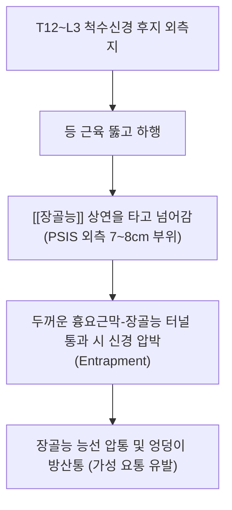

---
aliases:
  - 장골능
  - 엉덩뼈능선
  - Iliac crest
tags:
  - 골격
  - 골반
  - 해부학
  - 랜드마크
  - 추나
  - 야코비선
---
# 🦴 [[장골능]] (腸骨稜, Iliac Crest, 엉덩뼈능선)

> **핵심 요약 (Key Summary)**:
> 장골익(Ilium)의 상부 경계를 이루는 두꺼운 S자형 능선으로 전방의 ASIS(전상장골극)에서 후방의 PSIS(후상장골극)까지 주행합니다.
> 외순, 중간선, 내순으로 나뉘어 복근 3층판([[외복사근]], [[내복사근]], [[복횡근]])과 [[요방형근]], [[광배근]], [[둔근군]]이 부착하는 체간-골반 근막의 허브입니다.
> 양측 최상단을 연결한 야코비선(Jacoby line)이 L4-L5 추간 공간을 가리키는 척추 진단의 최고 기준점이며 상둔피신경 포착과 장늑인대 증후군의 호발 부위입니다.

---

## 📌 목차
1. [해부학적 구조 및 3개 입술선 (Landmarks)](#1-해부학적-구조-및-3개-입술선-landmarks)
2. [근육 및 근막 부착부 (Attachments)](#2-근육-및-근막-부착부-attachments)
3. [척추-골반 진단의 절대 기준: 야코비선 (Jacoby's Line)](#3-척추-골반-진단의-절대-기준-야코비선-jacobys-line)
4. [신경 주행: 상둔피신경(SCN) 포착 증후군](#4-신경-주행-상둔피신경scn-포착-증후군)
5. [호발 임상 질환 및 감별 진단](#5-호발-임상-질환-및-감별-진단)
6. [추나 치료 & 침도·약침 프로토콜](#6-추나-치료--침도약침-프로토콜)
7. [출처 및 학술 참고 문헌 (References)](#7-출처-및-학술-참고-문헌-references)

---

## 1. 해부학적 구조 및 3개 입술선 (Landmarks)

장골능은 피부 바로 아래에서 전 주행 경로를 손가락으로 촉진할 수 있는 대표적인 표면 해부학적 랜드마크입니다.

```
 [전상장골극 (ASIS)] ─── 장골능 결절 ─── [장골능 최상단 (L4-L5)] ─── [후상장골극 (PSIS)]
        │                                                                   │
  봉공근·TFL 기시                                                      배측 천장인대 부착
```

* **외순 (Outer lip)**:
  * 외측 모서리로 [[외복사근]], [[광배근]], [[대퇴근막장근]](TFL) 부착.
  * ASIS 후방 약 5cm 부위에 바깥으로 돌출된 **장골능 결절(Iliac tubercle)** 존재.
* **중간선 (Intermediate line)**:
  * 능선 중앙 고랑으로 [[내복사근]] 기시.
* **내순 (Inner lip)**:
  * 내측 모서리로 [[복횡근]], [[요방형근]], [[장골근]], 흉요근막 부착.

---

## 2. 근육 및 근막 부착부 (Attachments)

| 구분 | 근육/인대명 | 장골능 부착 부위 및 기능 |
| :--- | :--- | :--- |
| **복벽근 (외측)** | [[외복사근]] | 외순 전반부 / 체간 굴곡 및 반대측 회전 |
| **복벽근 (중간)** | [[내복사근]] | 중간선 전방 2/3 / 체간 동측 회전 및 복압 형성 |
| **복벽근 (내측)** | [[복횡근]] | 내순 전방 2/3 / 복부 코어 안정화 |
| **후복벽 심부근** | [[요방형근]] | 내순 후방 1/3 및 장늑인대 / 요추 측굴 및 골반 거상 |
| **둔부 대근육** | [[대둔근]], [[중둔근]] | 외순 후방 및 장골 외측면 / 고관절 외전 및 신전 |
| **등 근육** | [[광배근]] | 외순 후방 1/3 (흉요근막) / 상완골 신전 및 골반 안정 |

---

## 3. 척추-골반 진단의 절대 기준: 야코비선 (Jacoby's Line)

* **정의**: 양측 장골능의 가장 높은 정점(Highest point)을 수평으로 연결한 가상선 (투피에 선, Tuffier's line).
* **해부학적 지표**:
  * 정상 성인에서 **제4요추(L4) 극돌기 또는 L4-L5 극간 공간(Interspinous space)**과 정확히 일치.
  * 요추 천자(Lumbar puncture), 척수 마취, 요추 추나요법의 레벨 감별, 요추 엑스레이 판독의 절대적 기준점.

---

## 4. 신경 주행: 상둔피신경(SCN) 포착 증후군



* **임상 의의**:
  * 디스크 질환(HIVD)으로 오인되기 쉬우며, 장골능 후방 모서리를 손가락으로 압박할 때 전기가 통하듯 둔부로 뻗치는 압통점(Trigger point) 확인 가능.

---

## 5. 호발 임상 질환 및 감별 진단

* **상둔피신경 포착 증후군 (Superior Cluneal Nerve Entrapment)**:
  * 허리를 뒤로 젖히거나 회전할 때 장골능 부위가 끊어질 듯 아픈 질환.
* **장늑인대 증후군 (Iliolumbar Syndrome)**:
  * L5 횡돌기와 장골능 내순을 잇는 장늑인대 손상으로 인한 골반 능선 통증.
* **요방형근 건병증 (Quadratus Lumborum Tendinopathy)**:
  * 골반 거상 부하 및 짝다리 짚기 습관으로 인한 장골능 상연 부착부 건초염.

---

## 6. 추나 치료 & 침도·약침 프로토콜

* **장골능 부착 근막 이완 추나**:
  * 측와위에서 요방형근과 내·외복사근 부착부를 손가락 갈고리(Hooking) 기법으로 장골능선에서 박리 신장.
* **침도 및 약침 치료**:
  * **상둔피신경 포착 부위(장골능 후외측)**: 소침도로 장골능 상연의 비후된 흉요근막 터널을 미세 절개 박리.
  * **약침 처방**: 장골능 압통 부위에 [[신바로약침]] 또는 [[황련해독탕]] 약침 0.5~1.0ml를 주입하여 국소 염증과 신경 자극 해소.

---

## 7. 출처 및 학술 참고 문헌 (References)
* Standring S. *Gray's Anatomy: The Anatomical Basis of Clinical Practice*. 42nd ed. Elsevier, 2020: 1318-1321.
  * `[연구 요약]`: 장골능의 3순 구조, 복벽근·등근육 부착 및 야코비선 해부학.
* Kuniya H, et al. Anatomical study of superior cluneal nerve entrapment neuropathy. *Surg Radiol Anat*. 2014;36(5):479-485.
  * `[연구 요약]`: 장골능 상연을 통과하는 상둔피신경의 주행 및 골막-근막 터널 포착 병태생리 분석.
