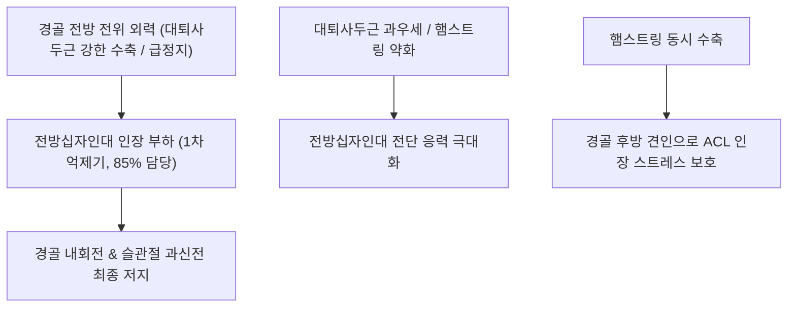

# 🦴 [[전방십자인대]] (Anterior Cruciate Ligament, ACL)

> **핵심 요약 (Key Summary)**:
> 대퇴골 외과 내측면에서 기시하여 경골 과간구 전방에 정지하는 슬관절 심부의 십자형 중심 인대.
> 경골의 전방 전위를 85% 이상 제어하고 슬관절 회전 및 과신전을 억제하는 핵심 수동 안정자이자 전내측·후외측 2개 다발로 구성.
> 비접촉성 감속·피벗 손상 시 호발하여 혈관절증을 동반하며 Lachman 검사 양성 및 관절 안정화를 위한 햄스트링 강화 재활과 약침 치료의 표적.

---
## 📌 목차
1. [해부학적 기원·정지 및 2중 다발(AM/PL Bundle) 구조](#1-해부학적-기원정지-및-2중-다발ampl-bundle-구조)
2. [생체역학적 기능 & 경골 전방 전위 제어](#2-생체역학적-기능--경골-전방-전위-제어)
3. [손상 기전(외반-외회전 토크) 및 불행삼총사(O'Donoghue's Triad)](#3-손상-기전외반-외회전-토크-및-불행삼총사odonoghues-triad)
4. [이학적 진단 검사 (Lachman / Pivot-shift / Anterior Drawer)](#4-이학적-진단-검사-lachman--pivot-shift--anterior-drawer)
5. [초음파 및 MRI 영상의학적 평가](#5-초음파-및-mri-영상의학적-평가)
6. [추나·도수치료(슬관절 관절가동술) & 한의 재활·약침 프로토콜](#6-추나도수치료슬관절-관절가동술--한의-재활약침-프로토콜)
7. [출처 및 학술 참고 문헌 (References)](#7-출처-및-학술-참고-문헌-references)

---
## 1. 해부학적 기원·정지 및 2중 다발(AM/PL Bundle) 구조

| 해부학적 항목 | 전내측 다발 (AM Bundle) | 후외측 다발 (PL Bundle) |
| :--- | :--- | :--- |
| **대퇴 기시부** | [[대퇴골]] 외과(Lateral condyle) 내측면의 근위-후방 | 대퇴골 외과 내측면의 원위-전방 |
| **경골 정지부** | [[경골]] 과간융기(Intercondylar eminence) 전내측 | 경골 과간융기 후외측 |
| **굴곡 시 장력** | 슬관절 굴곡 시 긴장(Taut), 신전 시 이완 | 슬관절 굴곡 시 이완, 신전 시 긴장(Taut) |
| **주요 역할** | 굴곡 상태에서 경골 전방 전위 제어 | 신전 부근에서 회전 안정성(Rotational stability) 제공 |

* **활액막외 주행 (Intracapsular, Extrasynovial)**:
  * 관절낭 내에 존재하지만 활액막의 반출막(Synovial sheath)에 싸여 있어 활액액과는 직접 접촉하지 않는 구조를 띱니다.
* **혈관 및 신경 공급**:
  * 중슬동맥(Middle genicular artery)에서 혈류를 공급받으며, 경골신경 유래 관절지에서 풍부한 루피니(Ruffini), 파치니(Pacinian) 고유수용기를 제공받아 슬관절 위치 감각을 유지합니다.

---
## 2. 생체역학적 기능 & 경골 전방 전위 제어

* **1차 억제기 (Primary Restraint)**:
  * 경골이 대퇴골에 대해 전방으로 밀려나는 힘을 약 85~87% 차단합니다.
* **근육 협동근과 길항근**:
  * **길항 작용 (Antagonist)**: [[대퇴사두근]]은 수축 시 경골을 전방으로 당겨 ACL에 인장 스트레스를 가중시킵니다.
  * **보호 협동 작용 (Synergist)**: [[슬괵근]](햄스트링)은 경골을 후방으로 끌어당겨 ACL의 인장 부하를 직접 감압합니다.

---
## 3. 손상 기전(외반-외회전 토크) 및 불행삼총사(O'Donoghue's Triad)

* **비접촉성 감속 및 피벗 손상 (Non-contact Pivoting)**:
  * 농구, 축구, 스키 등에서 착지 시 또는 급격한 방향 전환 시 슬관절이 약간 굴곡된 상태에서 외반(Valgus) 스트레스와 대퇴골의 내회전(경골의 상대적 외회전)이 가해질 때 호발.
  * 수상 순간 관절 내부에서 '툭'하는 파열음(Pop sound)과 함께 급격한 통증 발생.
* **급성 혈관절증 (Hemarthrosis)**:
  * 파열 후 2~6시간 이내에 관절 내 출혈로 무릎이 심하게 팽만되고 굴곡 장애 발생.
* **불행삼총사 (O'Donoghue's Triad)**:
  * 심한 외반 및 외회전 외력에 의해 [[전방십자인대]] 파열, [[내측측부인대]] 파열, [[내측반월상연골]](또는 외측 반월상연골) 파열이 동시에 발생하는 복합 관절 손상.

---
## 4. 이학적 진단 검사 (Lachman / Pivot-shift / Anterior Drawer)

1. **Lachman 검사 (Lachman Test)**:
   * 슬관절 20~30도 굴곡 상태에서 대퇴 원위부를 고정하고 경골 근위부를 전방으로 당김.
   * **민감도 85%, 특이도 94%**로 ACL 파열 진단의 표준(Gold Standard) 검사. 단단한 종말감(Hard endpoint) 소실 시 양성.
2. **피벗 시프트 검사 (Pivot-Shift Test)**:
   * 슬관절 신전 상태에서 외반력과 내회전력을 가하며 서서히 굴곡시킬 때, 20~30도 부근에서 아탈구된 경골이 정복되며 '덜컥'거림 발생. 회전 불안정성 평가에 가장 특이도가 높음.
3. **전방 전위 검사 (Anterior Drawer Test)**:
   * 슬관절 90도 굴곡 상태에서 경골을 전방 견인. 햄스트링 경련이나 후각 반월상연골 쐐기 효과로 위음성 가능성 존재.

---
## 5. 초음파 및 MRI 영상의학적 평가

* **MRI 진단 (정확도 >95%)**:
  * 시상면(Sagittal view)에서 Blumensaat 선(대퇴 과간와 천장선)과 평행하게 주행하는 저신호 강도의 연속성 있는 밴드가 소실되고 미만성 고신호 강도 또는 불연속성 관찰.
* **초음파 평가**:
  * 심부 위치로 인해 인대 전체 관찰은 제한되나, 슬개하 활액낭 삼출액(Effusion) 저류, 과간구 내 혈종 및 관절 가동 시 비정상 전방 이동 동적 확인 가능.

---
## 6. 추나·도수치료(슬관절 관절가동술) & 한의 재활·약침 프로토콜

### 1) 한의 보존적 재활 및 추나요법
* **초기 보호 및 부종 흡수**:
  * PRICE 원칙 적용, 무릎 관절 흡인 및 압박 고정.
* **관절가동술 (Gentle Mobilization)**:
  * 급성기 경과 후 슬개골 상하/좌우 활주 기법을 통해 관절 유착 방지.
  * 경골의 비틀림 변위(외회전 아탈구)를 정상 중립 위치로 유도하는 미세 가동술 적용.
* **신경근 제어 및 재활 운동**:
  * 햄스트링 근력 강화(경골 후방 전위 지지력 확보) 및 대퇴사두근 폐쇄사슬 운동(Closed Kinetic Chain, Squat).
  * 밸런스 패드를 활용한 고유수용성 감각(Proprioception) 회복 훈련.

### 2) 침구 및 약침 치료
* **주요 혈위**:
  * 슬안(독비 ST35, 내슬안 EX-LE4): 슬개건 양측 함요처로 관절강 내 삼출액 배출 및 염증 조절.
  * 양릉천(GB34), 음릉천(SP9), 혈해(SP10), 양구(ST34).
* **약침 프로토콜**:
  * 급성기: 황련해독탕 약침 또는 중성어혈 약침을 관절강 주위 인대 부착부에 투여하여 혈종 흡수 촉진.
  * 만성/재활기: 신바로 약침, 자하거 약침을 투여하여 관절 연골 마모 방지 및 2차 관절염 예방.

---
## 7. 출처 및 학술 참고 문헌 (References)

* Neumann DA. *Kinesiology of the Musculoskeletal System: Foundations for Rehabilitation*. 3rd ed. Elsevier; 2017.
  * `[연구 요약]` 전방십자인대의 전내측 및 후외측 다발의 굴곡 각도별 장력 변화와 대퇴사두근-햄스트링 간의 짝힘 생체역학.
* Petersen W, Zantop T. Anatomy of the anterior cruciate ligament with regard to its two bundles. *Clin Orthop Relat Res*. 2007;454:35-47.
  * `[연구 요약]` 전방십자인대 AM 및 PL 다발의 미세 해부학, 회전 안정성 제어 기전 및 재건술 시 해부학적 고려점.
* 대한침구의학회 교재편찬위원회. *침구의학*. 집문당; 2020.
  * `[연구 요약]` 슬관절 인대 손상 및 외상성 관절염에 대한 슬안혈 중심 침구 치료와 한의 재활 프로토콜.
