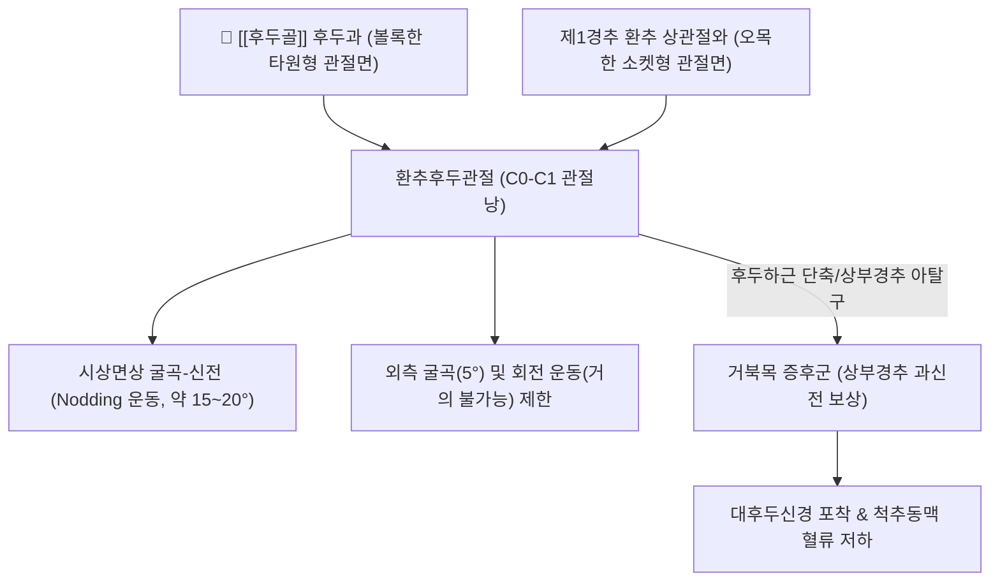

---
aliases:
  - 후두골
  - 뒤통수뼈
  - Occipital bone
  - Occiput
tags:
  - 해부학
  - 골격
  - 두개골
  - 두경부
  - 경추두개접합부
  - 대후두공
  - 후두하근
  - 추나
---
# 🦴 [[후두골]] (Occipital Bone, 뒤통수뼈)

> **핵심 요약 (Key Summary)**:
> 뇌두개(Neurocranium)의 후하부를 형성하는 마름모꼴의 단일 골격 구조물.
> 중앙에 연수가 척수로 이어지는 대후두공(Foramen magnum)을 품고 있으며, 외측의 후두과(Occipital condyle)를 통해 제1경추 환추([[환추]])와 환추후두관절(C0-C1)을 형성하여 두개골의 굴곡-신전 끄덕임(Nodding) 운동 축을 담당.
> 외후두융기(EOP), 상·하후두선에 [[승모근]], [[두판상근]], [[후두하근]]군이 부착하여 경추성 두통, 턱관절 장애, 후두신경통 및 두개천골요법(CST)의 핵심 치료 랜드마크.

---

## 📌 목차
1. [해부학적 정밀 구조 및 골성 랜드마크](#1-해부학적-정밀-구조-및-골성-랜드마크)
2. [생체역학·관절학적 운동성 (C0-C1 환추후두관절)](#2-생체역학관절학적-운동성-c0-c1-환추후두관절)
3. [부착 근육군 및 신경·혈관 통과 구조](#3-부착-근육군-및-신경혈관-통과-구조)
4. [관련 임상 질환군 (경추성 두통, 후두신경통)](#4-관련-임상-질환군-경추성-두통-후두신경통)
5. [추나·두개천골치료(CST) & 침구 임상 프로토콜](#5-추나두개천골치료cst--침구-임상-프로토콜)
6. [출처 및 학술 참고 문헌 (References)](#6-출처-및-학술-참고-문헌-references)

---

## 1. 해부학적 정밀 구조 및 골성 랜드마크

| 구분 | 주요 골성 구조 | 해부학적 의의 및 연결 |
| :--- | :--- | :--- |
| **인부 (Squamous part)** | 외후두융기 (EOP, Inion) | 항인대(Ligamentum nuchae) 및 승모근 기시점, 촉진의 기준점 |
| | 상후두선 (Superior nuchal line) | [[두판상근]], [[승모근]], [[흉쇄유돌근]] 부착부 |
| | 하후두선 (Inferior nuchal line) | [[대후두직근]], [[소후두직근]], [[상두사근]] 부착부 |
| **기저부 (Basilar part)** | 인두결절 (Pharyngeal tubercle) | 접형골(Sphenoid)과 접형후두연골결합(SBS) 형성 |
| **외측부 (Lateral parts)** | 대후두공 (Foramen magnum) | 척수, 척추동맥(Vertebral artery), 부신경(CN XI) 척수근 통과 |
| | 후두과 (Occipital condyles) | 제1경추 상관절와와 접촉하여 C0-C1 관절면 형성 |
| | 설하신경관 (Hypoglossal canal) | 설하신경(CN XII) 통과 통로 |

---

## 2. 생체역학·관절학적 운동성 (C0-C1 환추후두관절)

* **두개골 끄덕임(Yes-joint)의 주동 관절**:
  * 후두과가 환추 상면에서 전후로 구르고 미끄러지며(Roll & Glide) 고개를 끄덕이는 굴곡-신전 운동을 전담.
* **접형후두연골결합 (Sphenobasilar Synchondrosis, SBS)**:
  * 두개천골계(Craniosacral System)의 핵심 관절로, 일차 호흡 메커니즘(PRM)에 의해 굴곡/신전 미세 파동을 생성하며 뇌척수액(CSF) 순환을 펌핑.

---

## 3. 부착 근육군 및 신경·혈관 통과 구조

* **후두하근 복합체 (Suboccipital Muscle Group)**:
  * [[대후두직근]], [[소후두직근]], [[상두사근]]이 후두골 하후두선에 정지하여 두개골의 미세 자세 조절 및 고유수용성 감각(근방추 밀도 최고) 피드백 제공.
* **통과 신경 및 혈관**:
  * **[[대후두신경]](Greater occipital nerve, C2 뒤가지)**: 하두사근 아래에서 나와 승모근 건을 뚫고 상후두선을 넘어 두정부로 주행.
  * **[[제3후두신경]](C3)** 및 **[[소후두신경]](C2, C3 앞가지)**: 후두골 외측 및 유양돌기 후방 감각 지배.
  * **척추동맥(Vertebral artery)**: 대후두공을 통해 두개강 내로 진입하여 기저동맥(Basilar a.)을 형성.

---

## 4. 관련 임상 질환군 (경추성 두통, 후두신경통)

* **경추성 두통 (Cervicogenic Headache)**:
  * C0-C1-C2 분절의 생체역학적 기능부전으로 인해 삼차신경-경신경 복합체(Trigeminocervical complex)가 흥분하여 후두부에서 안구 뒤쪽까지 뻗치는 두통.
* **후두신경통 (Occipital Neuralgia)**:
  * 후두골 부착부에서 승모근 및 두판상근의 만성 긴장으로 대후두신경이 압박되어 뒤통수가 찌릿하고 바늘로 찌르는 듯한 발작성 신경통.
* **Arnold-Chiari 기형 (아놀드-키아리 기형)**:
  * 선천적으로 후두골 기저부가 좁아 소뇌 편도가 대후두공 아래로 탈출되어 척수공동증 및 뇌신경 마비를 초래.

---

## 5. 추나·두개천골치료(CST) & 침구 임상 프로토콜

* **후두하근 이완 및 후두골 견인 기법 (Suboccipital Release)**:
  * 앙와위에서 시술자의 손가락 끝을 후두골 하후두선 아래에 걸고 환자의 머리 무게를 이용하여 후두골을 상방으로 부드럽게 견인함으로써 C0-C1 감압.
* **CV-4 기법 (Compression of the 4th Ventricle)**:
  * 후두골 인부를 모아 쥐고 제4뇌실을 압박하여 뇌척수액 순환을 리셋하고 자율신경계 교감신경을 진정.
* **침구 및 약침 혈자리**:
  * 풍지(GB20, 하후두선 아래 오목한 곳), 천주(BL10, 승모근 외연 후두골 부착부), 뇌호(GV17, EOP 상방), 아문(GV15).
  * 후두신경 포착점에 [[중성어혈약침]]을 주입하여 신경 주위 근막 유착 박리.

---

## 6. 출처 및 학술 참고 문헌 (References)

* Bogduk, N., & Govind, J. (2009). Cervicogenic headache: an assessment of the evidence on clinical diagnosis, invasive tests, and treatment. *The Lancet Neurology*, 8(10), 959-968.
  * `[연구 요약]` 후두골-상부경추 분절의 신경학적 수렴 메커니즘과 경추성 두통의 해부병리학적 진단 기준을 제시.
* Upledger, J. E., & Vredevoogd, J. D. (1983). *Craniosacral Therapy*. Eastland Press.
  * `[연구 요약]` 후두골의 접형후두연골결합(SBS) 가동성 및 대후두공 주변 경막 이완(CV-4)을 통한 자율신경계 조절 기전을 정립.
