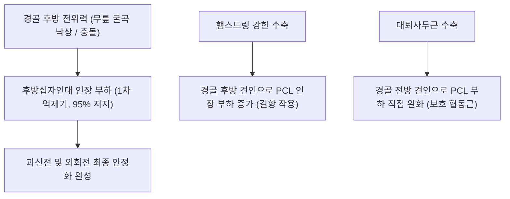

# 🦴 [[후방십자인대]] (Posterior Cruciate Ligament, PCL)

> **핵심 요약 (Key Summary)**:
> 대퇴골 내과 외측면에서 기시하여 경골 과간구 후방면에 정지하는 슬관절 최강의 중심 안정화 인대.
> 경골의 후방 전위를 95% 차단하며 전외측 다발과 후내측 다발로 구성되어 굴곡 상태에서 대퇴사두근과 협력하여 관절을 보호.
> 교통사고 시 대시보드 충격 및 과굴곡 손상으로 호발하며 Posterior Sag Sign 양성 및 대퇴사두근 강화 재활과 약침 치료의 표적.

---
## 📌 목차
1. [해부학적 기원·정지 및 2중 다발(AL/PM Bundle)과 반월대퇴인대](#1-해부학적-기원정지-및-2중-다발alpm-bundle과-반월대퇴인대)
2. [생체역학적 기능 & 경골 후방 전위 제어](#2-생체역학적-기능--경골-후방-전위-제어)
3. [손상 기전: 대시보드 손상(Dashboard Injury) 및 과굴곡 외상](#3-손상-기전-대시보드-손상dashboard-injury-및-과굴곡-외상)
4. [이학적 진단 검사 (Posterior Drawer / Sag Sign / Quadriceps Active)](#4-이학적-진단-검사-posterior-drawer--sag-sign--quadriceps-active)
5. [MRI 영상의학적 평가 및 단독/복합 손상 분류](#5-mri-영상의학적-평가-및-단독복합-손상-분류)
6. [추나·도수치료(경골 전방 변위 회복) & 대퇴사두근 재활 프로토콜](#6-추나도수치료경골-전방-변위-회복--대퇴사두근-재활-프로토콜)
7. [출처 및 학술 참고 문헌 (References)](#7-출처-및-학술-참고-문헌-references)

---
## 1. 해부학적 기원·정지 및 2중 다발(AL/PM Bundle)과 반월대퇴인대

| 해부학적 항목 | 전외측 다발 (AL Bundle) | 후내측 다발 (PM Bundle) |
| :--- | :--- | :--- |
| **대퇴 기시부** | [[대퇴골]] 내과(Medial condyle) 외측면의 전하방 | 대퇴골 내과 외측면의 후상방 |
| **경골 정지부** | [[경골]] 후방 관절면 아래 약 1cm 부위의 과간와 | 경골 과간와 후외측 능선 |
| **인대 직경/강도** | PCL의 약 65~70% 용적 차지, 주력 다발 | PCL의 약 30~35% 차지, 보조 다발 |
| **굴곡 시 장력** | 슬관절 굴곡(Flexion) 시 긴장(Taut) | 슬관절 신전(Extension) 시 긴장(Taut) |

* **반월대퇴인대 (Meniscofemoral Ligaments)**:
  * 외측 반월상연골 후각에서 기시하여 PCL을 따라 대퇴골 내과로 주행하는 두 개의 부속 인대가 존재합니다.
  * **험프리 인대(Ligament of Humphry)**: PCL 전면을 통과(전반월대퇴인대).
  * **리스버그 인대(Ligament of Wrisberg)**: PCL 후면을 통과(후반월대퇴인대).

---
## 2. 생체역학적 기능 & 경골 후방 전위 제어

* **인체 슬관절 최강의 인대**:
  * 단면적이 ACL의 약 1.5~2배에 달하며, 인장 강도가 약 2,500~3,000 N에 이릅니다.
  * 모든 굴곡 각도에서 경골이 대퇴골 후방으로 밀려나는 힘을 약 95% 저지합니다.
* **대퇴사두근과 햄스트링의 역학적 반전**:
  * ACL과 정반대로, [[대퇴사두근]]은 경골을 앞으로 당겨 PCL의 긴장을 줄여주는 **핵심 보호근(Protector)**입니다.
  * 반면 [[슬괵근]](햄스트링)은 경골을 뒤로 끌어당기므로 급성 손상기에는 PCL의 **길항근(Antagonist)**으로 작용합니다.

---
## 3. 손상 기전: 대시보드 손상(Dashboard Injury) 및 과굴곡 외상

* **대시보드 손상 (Dashboard Injury)**:
  * 차량 충돌 사고 시 무릎을 90도 굴곡한 상태에서 경골 조면(Tibial tuberosity)이 차량 계기판(대시보드)에 정면 충돌하여 경골이 후방으로 밀려나며 파열.
* **무릎 꿇고 낙상 (Fall onto Flexed Knee)**:
  * 발목을 족저굴곡한 상태에서 무릎을 꿇으며 지면에 경골 근위부가 직접 충돌할 때 호발.
* **동반 손상 주의 (후외측 회전 불안정성, PLC)**:
  * 외측측부인대(LCL), 슬와근건(Popliteus tendon), 슬와비골인대(PFL) 등 후외측 복합체(Posterolateral Corner, PLC) 파열이 동반될 경우 심각한 후외측 회전 불안정성을 초래합니다.

---
## 4. 이학적 진단 검사 (Posterior Drawer / Sag Sign / Quadriceps Active)

1. **후방 전위 검사 (Posterior Drawer Test)**:
   * 슬관절 90도 굴곡 상태에서 경골 근위부를 후방으로 밀어 전위 정도 평가.
   * 등급: 1도(0~5mm 전위, 경골 내측과가 여전히 대퇴 내과 전방 1cm에 위치), 2도(5~10mm 전위, 평평해짐), 3도(>10mm, 경골이 대퇴과 후방으로 함몰).
2. **후방 처짐 징후 (Posterior Sag Sign / Godfrey Test)**:
   * 고관절과 슬관절을 모두 90도 굴곡한 상태에서 측면에서 관찰 시, 중력에 의해 경골이 후방으로 푹 꺼져 처지는 현상 확인.
3. **대퇴사두근 능동 검사 (Quadriceps Active Test)**:
   * 슬관절 90도 굴곡 상태에서 환자가 대퇴사두근을 수축시킬 때, 후방으로 처져 있던 경골이 정상 위치로 전방 정복되는 것을 확인(특이도 >97%).

---
## 5. MRI 영상의학적 평가 및 단독/복합 손상 분류

* **MRI 시상면(Sagittal T2 강조영상)**:
  * 정상 PCL은 매끄러운 활 모양(Hockey-stick 형태)의 연속적인 균일한 저신호 강도로 뚜렷하게 관찰됩니다.
  * 파열 시 인대 음영의 비후, 미만성 고신호 강도 변화 또는 완전 단열이 명확하게 확인됩니다.
* **단독 손상 vs 복합 손상**:
  * 단독 1~2도 손상은 강력한 혈류 공급과 두터운 관절낭 구조 덕분에 보존적 비수술 한의 치료의 예후가 매우 뛰어납니다.

---
## 6. 추나·도수치료(경골 전방 변위 회복) & 대퇴사두근 재활 프로토콜

### 1) 한의 보존적 재활 및 추나요법
* **경골 전방 견인 관절가동술**:
  * 후방으로 밀려난 경골을 대퇴골에 대해 전방으로 서서히 활주시추는 P-to-A mobilization을 적용하여 관절 내 중심화 유지.
* **초기 슬관절 신전 보조기 고정**:
  * 슬관절 완전 신전 또는 경미한 굴곡(0~15도) 상태를 유지하여 PCL에 가해지는 중력성 후방 인장 부하를 차단.
* **대퇴사두근 중심 근력 재활**:
  * 대퇴사두근 등척성 수축(Quad setting), 하지 직거상(SLR), 폐쇄사슬 레그 프레스 집중 훈련.
  * 초기 6~12주간 열린사슬 햄스트링 컬 운동은 절대 금기(PCL 견인 파열 위험).

### 2) 침구 및 약침 치료
* **주요 혈위**:
  * 위중(委中, BL40), 위양(BL39), 음곡(KI10): 슬와부 후방 관절낭 및 슬와근 긴장 완화.
  * 슬안(독비, 내슬안), 양구(ST34), 복토(ST32): 대퇴사두근 활성화 혈위.
* **약침 처방**:
  * 신바로 약침, 자하거 약침: PCL 인대 부착부 및 관절낭 주위에 분주하여 인대 섬유 모세혈관 신생 및 인장 강도 재생 촉진.

---
## 7. 출처 및 학술 참고 문헌 (References)

* Neumann DA. *Kinesiology of the Musculoskeletal System: Foundations for Rehabilitation*. 3rd ed. Elsevier; 2017.
  * `[연구 요약]` 후방십자인대의 AL 및 PM 다발 운동형상학, 경골 후방 제어 역학 및 대퇴사두근의 보호 협동 작용 분석.
* Logterman SL, Wydra FB, Frank RM. Posterior cruciate ligament: Anatomy and biomechanics. *Curr Rev Musculoskelet Med*. 2018;11(3):510-514.
  * `[연구 요약]` PCL의 미세 해부학, 반월대퇴인대 복합체와의 상관성 및 이학적 검사의 임상적 진단 정확도.
* 대한침구의학회 교재편찬위원회. *침구의학*. 집문당; 2020.
  * `[연구 요약]` 슬관절 십자인대 손상 환자에 대한 위중·슬안혈 침구 치료와 보존적 관절 기능 회복 연구.
