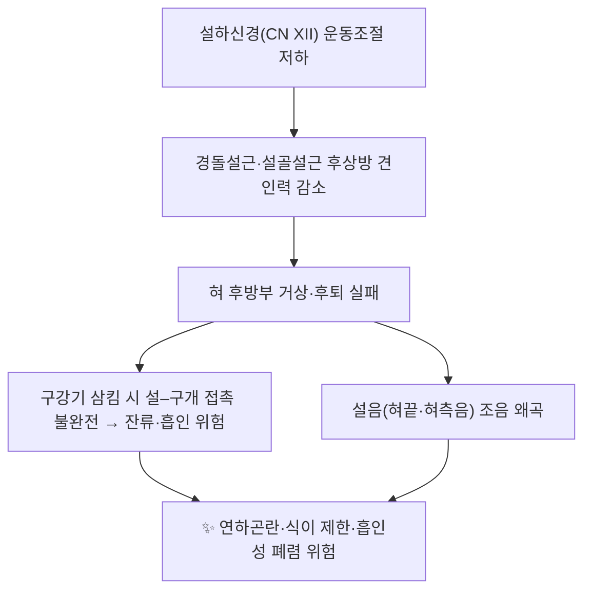

# 🫁 [[경돌설근]] (Styloglossus muscle)

> **핵심 요약 (Key Summary)**:
> [[경돌설근]](Styloglossus)은 측두골 [[경돌돌기]]에서 기시하여 혀의 측면과 설골체로 들어가는 [[외재설근]](extrinsic tongue muscle)으로, [[설하신경]](CN XII)의 단독 운동 지배를 받는다.
> 주된 작용은 혀를 **후상방으로 견인(후퇴 + 거상)**하여 구강기 삼킴의 설–구개 접촉과 조음 시 혀 후방 자세를 형성하는 것이며, 두경부 종양학에서는 구강설(oral tongue)과 설기저부(oropharynx)를 가르는 **수술적 핵심 랜드마크**로 취급된다(Laccourreye 2018).
> 임상적으로는 [[설하신경 마비]], 구강기 [[연하곤란]], [[경돌돌기 증후군]] 및 두경부 종양 절제 범위 결정과 연계되며, 치료 타깃은 구강내 [[근막이완]]·[[MET]] 및 [[설하신경]] 기능 회복을 위한 재활 프로토콜이다.

---
## 📌 목차
1. [해부학적 정밀 구조 및 지배 신경/혈관](#1-해부학적-정밀-구조-및-지배-신경혈관)
2. [생체역학·토크 분석 & 근막 사슬 (Biomechanical Synergy)](#2-생체역학토크-분석--근막-사슬-biomechanical-synergy)
3. [근막통증증후군(TP) & 연관통 패턴 (Travell & Simons)](#3-근막통증증후군tp--연관통-패턴-travell--simons)
4. [초음파 해부학(Sonoanatomy) 및 중재 시술 랜드마크](#4-초음파-해부학sonoanatomy-및-중재-시술-랜드마크)
5. [⭐ 원장님 심층 임상 고찰 및 원본 필기 (Clinical Pearls)](#5-원장님-심층-임상-고찰-및-원본-필기-clinical-pearls)
6. [관련 임상 질환 및 운동손상 증후군 총괄](#6-관련-임상-질환-및-운동손상-증후군-총괄)
7. [추나·도수치료(MET/PIR) & 침구·약침·재활 프로토콜](#7-추나도수치료metpir--침구약침재활-프로토콜)
8. [출처 및 학술 참고 문헌 (References)](#8-출처-및-학술-참고-문헌-references)

---
## 1. 해부학적 정밀 구조 및 지배 신경/혈관

![[경돌설근_1.jpg|540]]
> [그림 1: Anatomy of the cat (1991) (17573447263).jpg]

| 항목 | 상세 내용 |
| :--- | :--- |
| **기시 (Origin)** | 측두골 [[경돌돌기]](styloid process)의 **전외측면, 끝부분(apex) 부근**, 그리고 [[경돌하악인대]](stylomandibular ligament)의 상부 섬유 |
| **정지 (Insertion)** | 혀의 **측면(설측연) 후방부**에서 [[설골설근]]과 교차하며 내재설근(intrinsic muscles) 섬유와 교직(interdigitation); 일부 섬유는 [[설골]](hyoid) 체부 및 혀 끝(apex) 방향까지 도달 |
| **신경 지배** | [[설하신경]] (Hypoglossal nerve, **CN XII**) — 연수의 설하신경핵에서 기원하는 **운동 단독 지배** |
| **혈관 공급** | [[설동맥]](lingual artery)의 설하분지, [[상행인두동맥]](ascending pharyngeal a.), [[안면동맥]]의 편도분지·상행구개분지 (교과서 수준 기술, 논문별 세부 혈관 분포는 **근거 미확인**) |
| **근군 분류** | [[경돌근군]](styloid muscle group): 경돌설근 · [[경돌설골근]] · [[경돌인두근]] — 모두 [[경돌돌기]] 기시 |
| **주행 관계** | 경돌돌기에서 **전하방**으로 주행 → 하악지 내측·구강저 상방을 지나 혀 측면으로 진입. 경돌돌기는 내경동맥과 외경동맥 사이 공간과 밀접하며, 경돌돌기 **후방에 내경동맥**이 위치한다(교과서 기술) |
| **조직학적 특징** | 골격근(횡문근)으로, 혀 내에서 내재설근 및 [[설골설근]] 섬유와 혼합되어 뚜렷한 근막 경계가 불분명한 복합체를 형성 |

### 🔬 해부학 도해 및 단면도

경돌설근은 **외재설근(extrinsic tongue muscles) 4개** 중 하나로, 나머지 세 근육([[설설근]](genioglossus), [[설골설근]](hyoglossus), [[구개설근]](palatoglossus))과 함께 혀의 위치·형태를 결정한다. 해부학적으로 다음 세 가지가 임상적으로 중요하다.

1. **경돌 근군의 공통 기시**: 경돌설근은 경돌설골근·경돌인두근과 함께 경돌돌기에서 출발하므로, 경돌돌기의 길이·석회화(예: [[이글 증후군]])는 이 근군 전체의 긴장 상태와 증상 발현에 영향을 줄 수 있다(기전 수준의 인과는 **근거 미확인**).
2. **설하신경과의 밀접 관계**: CN XII는 하악하 삼각(submandibular triangle)에서 [[설골설근]] 표면을 따라 전방 주행한 뒤 혀 내로 진입하는데, 이 경로는 경돌설근이 혀 측면으로 들어가는 부위와 인접한다. 따라서 구강저·설근 수술 및 시술 시 설하신경 보호가 필수적이다.
3. **구강설–설기저부 경계**: Laccourreye 등(2018)은 경돌설근을 **두경부 종양학에서의 핵심 랜드마크**로 보고하였다. 즉, 이 근육은 해부학적 경계(구강설과 설기저부/구인두)를 규정하는 지표로서 종양의 절제 범위·림프 배수 평가에 실질적인 기준을 제공한다.

---
## 2. 생체역학·토크 분석 & 근막 사슬 (Biomechanical Synergy)

* **작용의 본질과 모멘트 특성**: 혀는 뼈에 고정된 전형적 지렛대 구조가 아니라 **근성 정수압 기관(muscular hydrostat)**이다. 경돌설근은 경돌돌기라는 고정점에서 혀 측면·후방을 **후상방으로 당기며**, [[설설근]]의 전방 돌출(protrusion), [[설골설근]]의 후하방 견인, [[구개설근]]의 거상과 길항·협응한다. 즉 순수 굽힘 토크보다 "혀 내부 부피 재분배를 통한 자세 제어"의 관점에서 이해하는 것이 실제 임상에 부합한다.
* **구획 모델(Compartmental Tongue)**: Wrench(2024)는 혀를 단일 근육 덩어리로 보지 않고 **여러 구획(compartment)으로 구분**하는 개념을 제시하며, 외재설근과 내재설근의 상호작용이 조음·삼킴 기능의 구조적 기반이 됨을 논의하였다. 경돌설근은 이 구획 체계에서 혀 후방·측방의 자세를 결정하는 외부 견인 요소로 작동한다.
* **근막 사슬 연계 (Myers Anatomy Trains 이론)**: 혀–설골–구강저–경부 심부 구조는 **심부전방선(Deep Front Line)**의 상부 구간에 포함된다. 이 관점에서 경돌설근은 **측두골(경돌돌기) → 설골 → 혀**를 잇는 두개–설골–설 연결의 일부로 해석되며, 경추 심부 굴근·호흡 횡격막과의 기능적 연쇄가 임상에서 고려된다(사슬 이론에 근거한 해석으로, 개별 인과는 **근거 미확인**).

---
## 3. 근막통증증후군(TP) & 연관통 패턴 (Travell & Simons)

* **고전 문헌과의 관계**: Travell & Simons의 근막통증 매뉴얼은 주로 교근·측두근·익상근·후두하근 등 두경부 표재·심부 근육을 다루며, **경돌설근 자체의 발통점(TrP) 및 연관통 지도는 고전 기준으로 확립되어 있지 않다(근거 미확인)**.
* **임상적 추정 패턴**: 경돌설근이 과긴장될 경우 구강저 심부와 혀 측면·후방에 국소 압통이 나타날 수 있고, 혀 후방 견인이 제한되면 연하 시 이물감·잔류감으로 이어질 수 있다. 다만 이는 **해부학적 추론이며 논문 근거는 확인되지 않음**을 명시한다.
* **감별 진단**: 구강저의 통증·이물감은 경돌설근 자체보다 ① 경돌돌기 증후군(경돌돌기 과장·경돌인대 석회화), ② 악하선 병변, ③ 설하신경 병변, ④ 구강저 종양을 우선 감별해야 한다. 구강내 검진 시 **악하선관(Wharton's duct)**과 **설신경**의 주행을 반드시 확인한다.

---
## 4. 초음파 해부학(Sonoanatomy) 및 중재 시술 랜드마크

de Sousa Costa & Ventura(2023)는 **설하신경(CN XII)의 초음파 평가**를 체계적으로 정리하였다. 핵심은 다음과 같다.

| 스캔 단계 | 주요 랜드마크 | 임상적 의미 |
| :--- | :--- | :--- |
| 경부 상위(경동맥 분기부 근처) | [[내경동맥]]과 [[내경정맥]] 사이 공간 | 설하신경은 이 두 혈관 사이를 통과하므로 분기부 수준 스캔이 신경 확인의 출발점이 된다 |
| 하악하 삼각 | [[설골설근]], [[악설골근]], [[설동맥]] | 신경은 설골설근 표면을 따라 전방 주행하며 설동맥과 교차한다 |
| 혀 내부(구강내/악하 접근) | 내재설근 구획, [[설설근]] | 혀 구획 평가 및 침습적 시술 시 안전 마진 확보 |

* **경돌설근 자체의 선택적 초음파 표적화**: 경돌설근은 혀 측면 후방·구강저 심부에 위치하여 일상적 표면 스캔에서 다른 설근과 분리 관찰하기 어렵다. 따라서 **경돌설근만을 표적하는 초음파 접근의 표준 프로토콜은 제시된 논문 범위에서 근거 미확인**이다.
* **안전 마진(시술 시)**: 구강저·악하부 접근 시 ① [[설동맥]], ② [[설신경]](미각·감각), ③ [[악하선관]], ④ [[설하신경]]의 운동 분지가 위험 구조물이다. 침구·약침 시에는 도플러로 혈관을 확인한 뒤 심부로 진행하며, 경돌설근은 심부 근육이므로 맹검 자침보다 **초음파 유도 하 접근이 원칙**이다(시술별 안전성 데이터는 **근거 미확인**).

---
## 5. ⭐ 원장님 심층 임상 고찰 및 원본 필기 (Clinical Pearls)

> 아래 항목은 해부학적 사실(제시 논문)과 임상 추론을 구분하여 정리한 것이다. 추론 항목은 명시적으로 표시하였다.

1. **"혀 후방이 안 올라온다"는 호소를 놓치지 말 것** — 구강기 삼킴에서 잔류감·사레를 호소하는 환자에서 혀 전방 돌출(설설근)만 평가하는 경우가 많다. 경돌설근·설골설근의 **후상방 견인력 저하**를 함께 평가해야 한다(임상 추론).
2. **설하신경은 '혀의 운동신경'이 아니라 '경부 주행 신경'으로 먼저 이해할 것** — 내경동맥·내경정맥 사이, 설골설근 표면, 설동맥과의 교차라는 3개 지점을 따라가며 병변 위치를 추정하면 편측 설 위축·섬유속성 연축의 감별에 도움이 된다(de Sousa Costa & Ventura 2023 기반).
3. **두경부 종양 환자의 영상 판독 시 경돌설근을 기준선으로 삼을 것** — 구강설과 설기저부/구인두의 경계를 경돌설근으로 규정하는 관점은 절제 범위와 림프 배수 평가에 직접 연결된다(Laccourreye 등 2018).
4. **구강내 근막이완은 신경·혈관 지도 없이 하지 말 것** — 구강저에서 시행하는 도수 접근은 악하선관·설신경·설동맥과 매우 근접한다. 손가락 끝의 압 방향, 환자의 반응(저림·전기감), 시술 시간을 엄격히 관리한다(안전 원칙).
5. **혀 근육은 '강화'보다 '협응 재교육'이 먼저** — 외재설근은 정수압 기관 내부에서 상호 협응하므로, 단순 저항 강화보다 삼킴·조음 과제와 결합한 협응 훈련이 기능 전이에 유리하다(임상 추론, 프로토콜별 근거 미확인).
6. **경돌돌기 과장이 의심되면 경돌 근군 전체를 본다** — 경돌설근 단독 문제로 접근하기보다 경돌설골근·경돌인두근 및 경돌하악인대 석회화 여부를 함께 평가한다(임상 추론).

---
## 6. 관련 임상 질환 및 운동손상 증후군 총괄

| 임상 질환 / 증후군 | 병리적 연관 기전 | 주요 증상 및 이학적 검사 | 핵심 교정 타깃 |
| :--- | :--- | :--- | :--- |
| [[설하신경 마비]] (CN XII palsy) | 핵상·핵성 병변으로 경돌설근 포함 편측 설근 운동 조절 상실 | 혀를 병변측으로 편위, 편측 위축·섬유속성 연축, 조음·연하 곤란 | 원인 감별(중추 vs 말초) 후 보상적 설근 협응 재교육 |
| [[구강설암]]·[[설기저부 종양]] | 경돌설근이 구강설/구인두 경계를 규정하는 **수술 랜드마크** | 종양 위치·침범 범위 평가, 절제 범위 결정(Laccourreye 2018) | 술전 영상 평가 및 다학제 치료 계획 |
| [[경돌돌기 증후군]] (Eagle syndrome) | 경돌돌기 과장·경돌인대 석회화가 경돌근군 및 주변 구조를 자극(추정 기전, **근거 미확인**) | 경부·인후통, 연하통, 이물감, 경돌돌기 촉진 시 압통 | 경돌 근군 긴장 완화, 필요 시 영상 검사 의뢰 |
| [[연하곤란]] (구강기) | 혀 후방 거상·후퇴 실패로 설–구개 접촉 불완전 | 식후 구강 잔류, 사레, 흡인 위험 | 경돌설근·설골설근 협응 및 삼킴 재활 |
| [[조음장애]] (설음 왜곡) | 혀 측방·후방 자세 제어 저하 | 혀끝·혀측음 발음 왜곡, 발음 피로 | 조음 과제 기반 협응 훈련 |
| [[두경부 방사선 치료 후유증]] | 설근 섬유화·구강건조로 설 운동성 저하(추정, **근거 미확인**) | 개구·설 운동 제한, 연하 곤란 | 점진적 신장·구강 위생 관리 |

---
## 7. 추나·도수치료(MET/PIR) & 침구·약침·재활 프로토콜

* **한의학 경혈 매핑**: [[廉泉]](CV23, 설본·인후 질환의 국소혈), [[金津·玉液]](EX-HN12·13, 설하 정맥 자침), [[啞門]](GV15), [[風池]](GB20), 원격혈로 [[通里]](HT5)·[[照海]](KI6)를 전통적 배혈로 고려한다(전통 이론에 근거한 매핑이며, 경돌설근 특이적 임상 근거는 **근거 미확인**).
* **근에너지기법 (MET)**: 혀는 체성 관절이 없으므로 고전적 MET 적용이 제한된다. 대신 ① 혀 내밀기 등척성 저항(설설근)과 ② 혀 후퇴·거상 등척성 저항(경돌설근·설골설근)을 호기 시 부드럽게 이완–수축하는 방식으로 설계한다.
* **구강내 근막이완**: 구강저와 혀 측면 후방에 대한 지속적 저압 이완 후, 연하·조음 기능을 즉시 재평가하여 반응을 확인한다.
* **약침·침 치료 시 주의**: 구강저 접근 시 [[설동맥]]·[[설신경]]·[[악하선관]]·[[설하신경]]을 회피해야 하며, 경돌설근은 심부에 위치하므로 **초음파 유도 없이 맹검으로 심부 자침하는 것은 권장되지 않는다**(안전 원칙, 시술별 근거 미확인).
* **재활 원칙**: ① 삼킴 과제(구강기 압력 형성)와 ② 조음 과제(혀 후방·측방 자세)를 병행하고, ③ 경부 심부 굴근·호흡 협응을 함께 훈련하여 심부전방선 연쇄를 회복하는 방향으로 구성한다.

---
## 8. 출처 및 학술 참고 문헌 (References)

1. Akbar S, Hohman MH. *Anatomy, Head and Neck, Styloglossus*. StatPearls. 2023. **PMID: 34662012**
2. Laccourreye O, Orosco RK. Styloglossus muscle: a critical landmark in head and neck oncology. *Eur Ann Otorhinolaryngol Head Neck Dis*. 2018. **PMID: 30341015**
3. de Sousa Costa R, Ventura N. The Hypoglossal Nerve. *Semin Ultrasound CT MR*. 2023. **PMID: 37055141**
4. Wrench AA. The Compartmental Tongue. *J Speech Lang Hear Res*. 2024. **PMID: 38959159**

**교과서 기본 참고(템플릿 기본 문헌)**

5. **Standring, S. (2020)**. *Gray's Anatomy: The Anatomical Basis of Clinical Practice* (42nd ed.). Elsevier.
6. **Travell, J. G., & Simons, D. G. (1999)**. *Myofascial Pain and Dysfunction: The Trigger Point Manual*, Vol. 1.