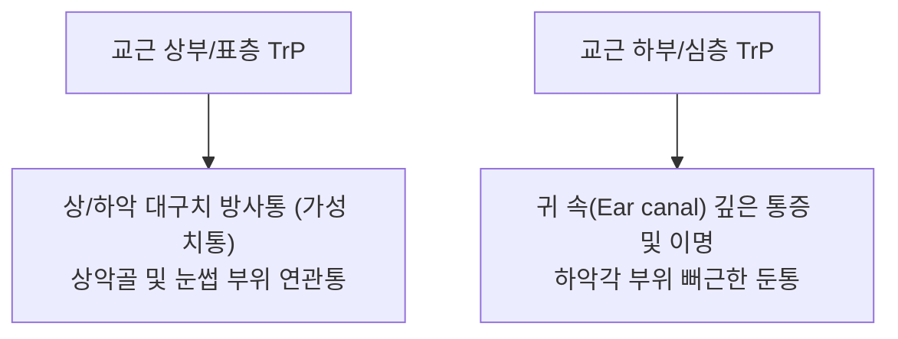

---
aliases:
  - 교근
  - 씹기근육
  - 깨물근
  - Masseter
---
# [[교근]](Masseter)

> **핵심 요약 (Key Summary)**:
> 관골궁(Zygomatic arch) 하연 및 전면에서 기원하여 하악각 및 하악지 외측면에 정지하는 인체 최강의 단위면적당 저작 근육입니다.
> [[삼차신경]](Trigeminal nerve, CN V3) 하악신경 교근가지의 지배를 받으며, **하악골 거상(폐구), 강력한 저작력 발휘 및 턱관절(TMJ)의 시상면 안정성**을 유지합니다.
> [[턱관절 장애(TMD)]], [[이갈이]](Bruxism), 사각턱 비대, 긴장성 편두통, 치아 마모의 핵심 병변근이며, 협거·하관·대영혈 침구가 표적입니다.

---
## 📌 목차
1. [해부학적 정밀 구조 및 지배 신경/혈관](#1-해부학적-정밀-구조-및-지배-신경혈관)
2. [생체역학·토크 분석 & 근막 사슬 (Biomechanical Synergy)](#2-생체역학토크-분석--근막-사슬-biomechanical-synergy)
3. [근막통증증후군(TP) & 연관통 패턴 (Travell & Simons)](#3-근막통증증후군tp--연관통-패턴-travell--simons)
4. [초음파 해부학(Sonoanatomy) 및 중재 시술 랜드마크](#4-초음파-해부학sonoanatomy-및-중재-시술-랜드마크)
5. [⭐ 원장님 심층 임상 고찰 및 원본 필기 (Clinical Pearls)](#5-원장님-심층-임상-고찰-및-원본-필기-clinical-pearls)
6. [관련 임상 질환 및 운동손상 증후군 총괄](#6-관련-임상-질환-및-운동손상-증후군-총괄)
7. [추나·도수치료(MET/PIR) & 침구·약침·재활 프로토콜](#7-추나도수치료metpir--침구약침재활-프로토콜)
8. [출처 및 학술 참고 문헌 (References)](#8-출처-및-학술-참고-문헌-references)

---
## 1. 해부학적 정밀 구조 및 지배 신경/혈관

| 항목 | 상세 내용 |
| :--- | :--- |
| **기시 (Origin)** | • **표층 (Superficial part)**: [[관골궁]](Zygomatic arch) 하연 전방 2/3 • **심층 (Deep part)**: [[관골궁]] 하연 후방 1/3 및 내측면 전체 |
| **정지 (Insertion)** | • **표층**: [[하악각]](Angle of mandible) 외측면 및 하악지 하부 외측면 (후하방 사선 주행) • **심층**: [[하악지]](Mandibular ramus) 상부 외측면 및 오훼돌기(Coronoid process) 기저부 (수직 주행) |
| **신경 지배** | [[삼차신경]](Trigeminal nerve, CN V3)의 전지 분지인 교근신경(Masseteric nerve) |
| **혈관 공급** | 안면동(Facial A.)의 턱밑가지 및 상악동 분지 |

### 🔬 해부학 도해 및 단면도
![[교근-1753860758940.png]]
> [구조적 특징]: 턱의 바깥쪽 각도를 두껍게 감싸며 위아래로 강력한 수직 교합력을 생성하는 저작의 메인 파워하우스입니다.

---
## 2. 생체역학·토크 분석 & 근막 사슬 (Biomechanical Synergy)

* **강력한 하악골 거상 (Mandibular Elevation / Jaw Closure)**:
  * 치아를 꽉 다물어 단단한 음식물을 분쇄하는 핵심 교합력 생성 (최대 70~90kgf).
* **하악골 전방 및 후방 견인 (Protraction & Retraction)**:
  * 표층 섬유는 턱을 앞으로 당기고, 심층 섬유는 턱을 뒤로 당겨 TMJ 디스크를 안정화.
* **측방 연삭 운동 보조 (Lateral Grinding)**:
  * [[측두근]], [[익상근]](내·외익상근)과 교차 수축하여 맷돌질 동작 완성.

---
## 3. 근막통증증후군(TP) & 연관통 패턴 (Travell & Simons)

![[Masseter_TriggerPoints.jpg|450]]
> [Travell & Simons 발통점 지도]: 교근 표층 및 심층의 압통점(TrP)에서 방사되는 상·하악 대구치 가성 치통, 눈썹 부위 및 외이도(귀 안쪽) 심부 연관통 패턴.

* **발통점 위치 및 연관통 특징**:
  * **상부 TrP**: 상하 대구치(어금니) 부근으로 통증을 방사하여 치과적 이상이 없는데도 치통을 유발(가성 치통).
  * **하부 TrP**: 외이도(귓구멍 안쪽) 깊은 곳과 TMJ 관절 부위로 통증을 방사하여 이명, 귀 먹먹함(이충만감) 유발.

---
## 4. 초음파 해부학(Sonoanatomy) 및 중재 시술 랜드마크

* **초음파 스캔 프로토콜**:
  * **프로브 위치**: 하악각과 관골궁 사이 교근 근복에 선형(Linear) 프로브를 수직 또는 종축으로 거치.
  * **소견**: 표층의 두꺼운 고에코 근막 및 평행한 근섬유 정렬, 심층의 수직 주행 섬유 관찰.
* **안전 마진 및 시술 랜드마크**:
  * 교근 후연을 따라 주행하는 [[안면신경]] 협부 가지 및 안면동(Facial A.)의 도플러 혈류를 확인하여 도침 및 약침 시술 시 혈관/신경 손상 회피.

---
## 5. ⭐ 원장님 심층 임상 고찰 및 원본 필기 (Clinical Pearls)

### 1) 턱관절 장애(TMD)와 이갈이(Bruxism) 연쇄 사슬 (원장님 팁)
* 야간 이갈이나 스트레스성 악물기로 교근이 과긴장되면 하악과두(Condyle)가 관절와(Glenoid fossa)를 강하게 압박하여 TMJ 관절원판(디스크) 전방 전위 및 관절음(Click sound) 유발.
* 교근 긴장은 [[측두근]], [[내익상근]], [[승모근]] 상부로 이어지는 연쇄적 두경부 근막통증증후군(MPS)의 시발점.

### 2) 사각턱 비대와 하악골 후방 이동 (원장님 팁 100% 보존)
* 저작근 과사용으로 인한 근비대(Masseter hypertrophy)는 안면 비대칭과 사각턱을 형성 → 협거혈-하관혈 심부 전침 및 도침 치료로 근긴장 완화 및 안면 윤곽 교정.

---
## 6. 관련 임상 질환 및 운동손상 증후군 총괄

| 임상 질환 / 증후군 | 병리적 연관 기전 | 주요 증상 및 이학적 검사 | 핵심 교정 타깃 |
| :--- | :--- | :--- | :--- |
| [[턱관절 장애(TMD)]] | 교근 과긴장 및 하악과두 압박 | 개구 장애, 관절잡음(Click), 저작통 | 협거·하관 도침 및 TMJ 수기 |
| [[이갈이]] (Bruxism) | 중추신경계 각성 및 저작근 항진 | 야간 치아 마모, 아침 기상 시 턱근육 뻐근함 | 교근 이완 및 구강 내 스플린트 연계 |
| 사각턱 비대 (Hypertrophy) | 장기 저작 과사용 및 이갈이 | 하악각 부위 비대칭 및 미관상 각짐 | 협거 도침 및 약침 감압 |

---
## 7. 추나·도수치료(MET/PIR) & 침구·약침·재활 프로토콜

* **한의학 경혈 매핑**: [[협거(頰車)]], [[하관(下關)]], [[대영(大迎)]], [[예풍(翳風)]]
* **침구 및 수기 프로토콜**:
  * 협거(ST6), 하관(ST7) 자침 및 심부 전침 자극.
  * 하악각 부착부 및 관골궁 하연 도침술(교근 근막 이완)과 TMJ 구강 내 수기 추나.

---
## 8. 출처 및 학술 참고 문헌 (References)

1. **Standring, S. (2020)**. *Gray's Anatomy: The Anatomical Basis of Clinical Practice* (42nd ed.). Elsevier, pp. 548-549.
   - **[연구 요약]**: 교근의 표층/심층 기시-정지 구조 및 삼차신경(V3) 교근신경 지배, 교합력 역학 분석.
2. **Travell, J. G., & Simons, D. G. (1999)**. *Myofascial Pain and Dysfunction: The Trigger Point Manual*, Vol. 1 (2nd ed.). Williams & Wilkins.
   - **[연구 요약]**: 교근 TrP에 의한 상/하악 가성 치통, 이명 및 귀 충만감 방사통 패턴 규명.
3. **Okeson, J. P. (2019)**. *Management of Temporomandibular Disorders and Occlusion* (8th ed.). Elsevier, pp. 145-160.
   - **[연구 요약]**: 교근 과긴장과 턱관절 장애(TMD), 이갈이 및 두경부 연관통의 상관관계 규명.
