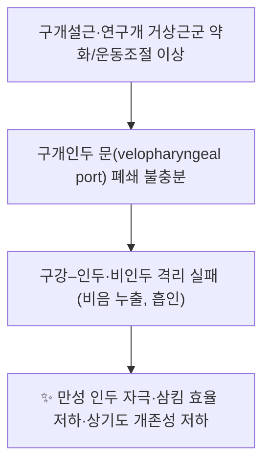

# 🫁 [[구개설근]] (Palatoglossus Muscle)

> **핵심 요약 (Key Summary)**:
> [[구개설근]]은 연구개의 구개건막에서 기시하여 혀 배측·외측연에 정지하는 얇은 근육으로, [[구개설궁]](전구개궁)을 형성하며 연구개 하강과 혀 거상을 통해 [[구개인두 폐쇄]](velopharyngeal closure)와 연하 시 구강–인두 격리를 담당한다.
> 설근(외재설근) 중 유일하게 [[설하신경]](CN XII)이 아닌 [[미주신경]](CN X, 인두신경총) 지배를 받는 근육으로 분류되며, 이는 임상적으로 연구개 근군과 동일 계통으로 취급되는 해부학적 근거가 된다.
> 임상적으로는 [[구개인두 폐쇄부전]], [[연하장애]], [[폐쇄성 수면무호흡]]의 상기도 운동조절, 그리고 [[구인두 편평세포암]](OPSCC)의 T4a 병기 판정(구개설근 침범)에서 핵심 이정표가 된다.

---
## 📌 목차
1. [해부학적 정밀 구조 및 지배 신경/혈관](#1-해부학적-정밀-구조-및-지배-신경혈관)
2. [생체역학·토크 분석 & 근막 사슬 (Biomechanical Synergy)](#2-생체역학토크-분석--근막-사슬-biomechanical-synergy)
3. [근막통증증후군(TP) & 연관통 패턴 (Travell & Simons)](#3-근막통증증후군tp--연관통-패턴-travell--simons)
4. [초음파 해부학(Sonoanatomy) 및 중재 시술 랜드마크](#4-초음파-해부학sonoanatomy-및-중재-시술-랜드마크)
5. [⭐ 원장님 심층 임상 고찰 및 원본 필기 (Clinical Pearls)](#5-원장님-심층-임상-고찰-및-원본-필기-clinical-pearls)
6. [관련 임상 질환 및 운동손상 증후군 총괄](#6-관련-임상-질환-및-운동손상-증후군-총괄)
7. [추나·도수치료(MET/PIR) & 침구·약침·재활 프로토콜](#7-추나도수치료metpir--침구약침재활-프로토콜)
8. [출처 및 학술 참고 문헌 (References)](#8-출처-및-학술-참고-문헌-references)

---
## 1. 해부학적 정밀 구조 및 지배 신경/혈관

| 항목 | 상세 내용 |
| :--- | :--- |
| **기시 (Origin)** | 연구개(soft palate)의 **구개건막(palatine aponeurosis)** — 주로 건막의 중간~후방부이자 **구개설궁(palatoglossal arch, 전구개궁)** 점막 직하방에서 얇은 근섬유 다발로 시작 |
| **정지 (Insertion)** | 혀의 **배측(dorsum) 및 외측연(lateral margin)** 점막하층, 혀의 고유 **횡근(transverse muscle of tongue)** 섬유와 섞여 정지 |
| **신경 지배** | [[미주신경]](CN X) — **인두신경총(pharyngeal plexus)** 경유. 설근(extrinsic tongue muscle) 4근(이설근·설골설근·경상설근·구개설근) 중 **유일하게 [[설하신경]](CN XII) 지배가 아닌 근육** |
| **혈관 공급** | [[상행구개동맥]](ascending palatine artery, 안면동맥 가지), 편도가지(tonsillar branch of facial artery), [[상행인두동맥]](ascending pharyngeal artery), 하행구개동맥(descending palatine artery) 분지 |

### 구조적·기능적 세부 사항

* **점막–근육 복합체**: 구개설근은 연구개 점막에 매우 근접한 **얇은 판상 근육**으로, 근육 자체보다 근육을 덮는 점막 융기가 구개설궁이라는 임상적 랜드마크를 형성한다. 따라서 촉진·시술 시에는 "근육 실질"보다 **궁(march)의 형태학적 변화**를 관찰하는 것이 실용적이다.
* **편도와(tonsillar fossa)와의 관계**: 구개설궁은 편도와의 **전벽**, 구개인두궁(palatopharyngeal arch)은 **후벽**을 이루며, 그 사이에 [[구개편도]](palatine tonsil)가 위치한다. 편도주위 농양(peritonsillar abscess)에서 구개설궁이 **내측·전방으로 편위**되는 소견은 고전적인 이학적 징후이다.
* **연구개 근군 내 위치**: [[구개거상근]](levator veli palatini, CN X), [[구개인두근]](palatopharyngeus, CN X), [[구개수근]](musculus uvulae, CN X), [[구개범장근]](tensor veli palatini, CN V3)과 함께 연구개 근군을 구성한다. 이 중 **구개범장근만 삼차신경 지배**이며, 구개설근은 기능적으로 "혀에 닿는 연구개 근육"이라는 이중적 성격을 갖는다.
* **신경 지배 논쟁**: 교과서적으로는 인두신경총을 통한 미주신경 지배로 기술되나, 일부 문헌에서는 설하신경 성분이 일부 관여할 가능성(및 구개설근을 연구개 근군이 아닌 설근군으로 분류하는 관점)이 제기되어 왔다. 어떤 배포된 요약본에서도 이 논쟁에 대한 **단일 결론은 확립되어 있지 않으며**, 본 노트는 다수 교과서 기준인 **미주신경 지배**를 채택한다(세부 신경섬유 조성 비율: **근거 미확인**).

---
## 2. 생체역학·토크 분석 & 근막 사슬 (Biomechanical Synergy)

* **주 작용 벡터(생체역학 요약)**
  * **연구개 하강**: 구개건막을 후하방으로 당겨 연구개를 혀 쪽으로 근접시킨다.
  * **혀 거상**: 혀 배측·외측연을 후상방으로 끌어올려 구개설궁을 좁히고, 연구개와 혀를 밀착시킨다.
  * **결과적 기능**: 이 두 벡터의 합력으로 **구개인두 문(velopharyngeal port)의 전방 경계**가 좁아지며, 연하(swallowing)의 구강기 후반부에서 **구강과 비인두·구인두를 격리**한다. 발성 시에는 비강 공명(nasal resonance)을 조절하는 보조 역할을 한다.
* **모멘트 암·토크 특성**: 연구개의 길이 방향으로 배치된 근육으로 지렛대(lever)보다 **장력 조절형 띠(tension band)**에 가깝다. 따라서 관절 각도별 모멘트 산출보다 **연구개 길이·경직도·혀 위치에 따른 장력 벡터 변화**로 이해하는 것이 적절하다. 정량적 모멘트 암 수치는 **근거 미확인**.
* **상기도 개존성과 호흡 조절**: [[이설근]](genioglossus)은 대표적인 인두 확장근(pharyngeal dilator)으로 상기도 허탈 방지에 관여하며, 구개설근 역시 **호흡 경로(비호흡 ↔ 구호흡) 변화에 따라 운동조절(활성 패턴)이 달라지는 근육**으로 보고되었다(Jordan & Woods, 2024). 즉 이 두 근육은 수면·각성 상태와 호흡 경로에 따라 상기도 개존성 유지에 관여하는 **호흡성 운동조절(respiratory-related motor control)** 대상이다. 다만 호흡 경로별 활성 진폭·방향성의 정량값은 본 노트에서 **근거 미확인**으로 표시한다.
* **근막 사슬 연계**: 연구개–혀–설골–인두로 이어지는 **구개–설–설골–인두 연속체(palato-glossal-hyoid-pharyngeal continuum)**로 기능한다. 표준 Anatomy Trains(Myers) 노선(사선선·나선선·심부전방선)에 구개설근이 독립 근막선으로 명시되는지 여부는 **근거 미확인**이며, 임상적으로는 "삼킴·발성 단위(swallow–speech unit)"로 묶어 평가하는 것이 실용적이다.

---
## 3. 근막통증증후군(TP) & 연관통 패턴 (Travell & Simons)

* **발통점(TrP) 존재 여부**: 구개설근은 구강 내 심부에 위치한 얇은 근육으로, **Travell & Simons 기준의 전형적 TrP 및 원격 연관통 지도가 확립되어 있지 않다(근거 미확인)**. 연구개·구개설궁 부위의 압통은 존재할 수 있으나, 이를 특정 근육의 TrP로 국한하기는 어렵다.
* **국소 압통 및 촉진법(임상 술기)**
  * 환자를 개구시킨 뒤 설압자 또는 장갑 낀 검지로 **구개설궁(전구개궁)을 따라 부드럽게 촉진**한다.
  * 연구개를 하강시키며 혀를 거상하도록 지시(예: "아-" 발성 또는 삼킴 유도)하면 근육 수축을 촉각으로 확인할 수 있다.
  * **구역 반사(gag reflex)**가 강한 환자에서는 무리한 구강 내 촉진을 피하고, 필요 시 국소 마취 또는 비내시경 관찰로 대체한다.
* **연관통 패턴**: 인두 후벽, 혀 후방, 편도와 부위의 **국소적 통증/이물감**으로 표현될 가능성이 있으나, 원격 방사 패턴(귀·후두·경부 등)은 **근거 미확인**이다. 따라서 "구개설근 TrP"라는 진단명을 남용하기보다, 연구개–인두 복합체의 **근긴장 이상(myofascial dysfunction)**으로 상위 개념화하는 편이 안전하다.

---
## 4. 초음파 해부학(Sonoanatomy) 및 중재 시술 랜드마크

* **경구(transoral) 초음파**: 고주파 탐촉자를 구강 내에 위치시켜 혀 기저부·구개설궁·연구개 주변 연부조직을 평가하는 접근이 구인두 종양 평가 영역에서 논의된다. 구개설궁은 **혀 기저부로 들어가는 해부학적 관문(landmark)** 역할을 하므로, 혀 기저부 병변의 범위 파악 시 참조점이 된다.
* **영상 검사의 우선순위**: 구개설근 침범 평가의 표준은 **MRI(및 CT)**이며, 구개설근 침범은 [[구인두 편평세포암]](OPSCC)의 **T4 범주 판정**에서 중요한 해부학적 이정표로 다루어진다(Tirelli & Gardenal, 2024). 즉 초음파는 보조적·제한적 역할이고, 병기 결정은 단면 영상이 기준이다.
* **안전 마진(위험 구조물)**
  * 동맥: [[상행구개동맥]], 편도가지(안면동맥), [[상행인두동맥]] — 편도와 주변에서 출혈 위험.
  * 신경: 미주신경 인두가지, 설인신경 구개편도가지(감각).
  * 구개설근 자체를 표적으로 하는 **초음파 유도 주사/약침의 표준 프로토콜은 확립되어 있지 않다(근거 미확인)**. 시행 시에는 반드시 구강 내 감염·기침 반사·기도 보호를 고려해야 한다.

---
## 5. ⭐ 원장님 심층 임상 고찰 및 원본 필기 (Clinical Pearls)

> ⚠️ 아래는 **본 노트 작성 시점에 원장님 원본 필기가 제공되지 않아(근거 미확인)**, 위 논문 근거와 해부학적 추론을 바탕으로 정리한 임상 고찰 영역이다. 실제 원장님 필기 확인 후 대체·보강이 필요하다.

* **"삼킴의 문지기(gatekeeper)"로 접근하라**: 구개설근 단독 문제보다 **구개설궁–연구개–혀 기저부–인두 후벽의 폐쇄 사슬** 문제로 보는 시각이 임상적으로 유용하다. 침 흘림, 물 삼킴 시 사레, 콧소리(개방성 비음)가 동반되면 이 사슬을 우선 점검한다.
* **구강 내 시술의 원칙**: 이 부위는 **구역 반사·기도 보호·감염 위험**이 공존하는 취약 구역이다. 무리한 심자(深刺)나 국소 약침은 권장되지 않으며, 원위 취혈 및 연하 재활과의 병용이 우선이다.
* **감별 포인트**: 구개설궁의 **편측 편위 + 발열 + 심한 인후통**은 구개설궁 자체의 근 문제가 아니라 **편도주위 농양**을 시사하는 응급 신호일 수 있으므로 즉시 감별한다.
* **호흡 경로 문진**: 코막힘으로 인한 **구호흡 습관**이 있는 환자에서 상기도 근육 운동조절 이상(코골이, 무호흡)을 함께 문진한다(Jordan & Woods, 2024). 구개설근은 이 조절 회로의 일부로 평가한다.
* **발성·공명 평가**: 개방성 비음이 지속되면 연구개 근군 약화를 의심하고, 단순 보약·추나 처방만으로 마무리하지 말고 **조음·연하 평가 의뢰**를 병행한다.

---
## 6. 관련 임상 질환 및 운동손상 증후군 총괄

| 임상 질환 / 증후군 | 병리적 연관 기전 | 주요 증상 및 이학적 검사 | 핵심 교정 타깃 |
| :--- | :--- | :--- | :--- |
| [[구개인두 폐쇄부전]] (velopharyngeal insufficiency) | 구개설근·구개거상근 약화 또는 마비로 구개인두 문 폐쇄 실패 → 구강–비인두 격리 소실 | 개방성 비음, 비음 누출, 연하 시 비역류; 비내시경, 비강압측정(nasalance) | 구개설근·연구개 거상 훈련, 조음·연하 재활 |
| [[구인두 편평세포암]] (OPSCC) | 종양이 구개설궁·구개설근을 침범 → **T4 범주** 병기 판정의 이정표 | 구개설궁 침윤·궤양, 경부 림프절 종대; MRI/CT, 조직검사 | 종양 절제 범위 결정 및 TNM 병기 정확도 (Tirelli & Gardenal, 2024) |
| [[연하장애]] (dysphagia) | 연하 시 구개설근의 혀 거상·연구개 밀착 실패 → 구강기–인두기 이행 장애 | 사레, 침 흘림, 흡인; VFSS(비디오투시연하검사) | 연구개·혀 거상 재훈련, 자세·식이 조정 |
| [[폐쇄성 수면무호흡]] (OSA) | 호흡 경로 변화에 따른 구개설근·이설근 운동조절 이상과 상기도 허탈 | 코골이, 무호흡, 주간 졸림; 수면다원검사 | 상기도 근육 운동조절, 호흡 경로 교정 (Jordan & Woods, 2024) |
| [[설염]] (glossitis) | 혀 점막 염증·부종이 혀 배측에서 구개설근 정지부·구개설궁에 파급 | 혀 통증·부종·미각 이상; 구강 검사 | 원인 교정(영양·감염·자극물), 염증 조절 (Sharabi & Winters, 2023) |
| [[편도주위 농양]] (peritonsillar abscess) | 구개설궁 직하방 편도와 감염 확산 → 구개설궁 편위 | 편측 인후통, 개구 제한, 구개설궁 내측 편위 | 즉시 감별·배농 및 항생제(근본 치료는 외과적) |

---
## 7. 추나·도수치료(MET/PIR) & 침구·약침·재활 프로토콜

* **한의학 경혈 매핑(인접·기능적 접근)**: 구개설근은 구강 내 심부에 위치하여 직접 자침이 어렵고, 통상 **인접 경혈을 통한 간접 조절**을 사용한다.
  * [[염천]](CV23, 廉泉) — 설골 상방, 혀·인두 기능 조절의 대표 혈.
  * [[천돌]](CV22, 天突) — 흉골상와, 인두·상기도 관련(자침 각도·깊이 주의).
  * [[예풍]](TE17, 翳風) — 이관·인두 주변 자극.
  * [[협거]](ST6, 頰車), [[지창]](ST4, 地倉) — 구강 주변 근군 조절.
  * ※ 구개설근–경혈 간 **해부학적 일대일 대응 근거는 미확인**이며, 위 매핑은 임상적·기능적 인접성에 근거한 전통적 배혈이다.
* **도수치료(MET/PIR) 적용의 한계**
  * 구개설근은 구강 내 심부 근육이므로 **직접적인 MET/PIR 등척성 수축 기법 적용이 어렵다**. 대신 다음의 간접 접근을 사용한다.
  * **구강 내 이완(intraoral release)**: 장갑 착용 후 구개설궁을 따라 아주 가볍게 압박–이완을 반복. 구역 반사가 심한 환자에서는 금기.
  * **설골상부·설하부 연부조직 이완**: [[이설근]]·[[설골설근]]·[[악설골근]](mylohyoid)의 과긴장을 먼저 완화하면 구개설근의 보상적 과활성이 줄어드는 경우가 있다.
  * **호기 유도 이완**: 호기 시 부드러운 신장, 흡기 시 저항을 주지 않는 원칙(상기도 근육은 흡기 시 허탈 위험이 있으므로 강한 등척성 부하를 피한다).
* **재활·운동 프로토콜**
  * **연구개 거상 훈련**: "아-" 발성 유지, 구개 거상 저항 훈련(연하 재활 프로그램).
  * **연하 재활**: Shaker exercise(설골상근군 강화), Mendelsohn maneuver(연하 시 후두 거상 유지).
  * **조음·공명 훈련**: 개방성 비음 감소 훈련(비음/비모음 대비 훈련), 언어치료사 협진.
  * **호흡 경로 교정**: 비폐색 원인(비염·구조적 문제) 치료로 구호흡을 줄이면 구개설근·이설근의 운동조절 부담이 감소할 수 있다(Jordan & Woods, 2024).
* **약침 관련 주의**: 구개설궁·연구개 점막은 **기도와 직결된 취약 부위**로, 이 부위 직접 약침은 흡인·감염·부종에 의한 기도 폐쇄 위험이 있다. 원위 취혈 및 경혈 자극을 우선하고, 국소 시술은 **근거 미확인** 상태로 신중히 접근한다.

---
## 8. 출처 및 학술 참고 문헌 (References)

1. **Jordan AS, Woods MJ (2024)**. Motor control of the palatoglossus and genioglossus during changes in breathing route. *J Appl Physiol (1985)*. PMID: 39323393
2. **Rathee M, Jain P (2023)**. Anatomy, Head and Neck, Palatoglossus Muscle (Glossopalatinus, Palatoglossal). *StatPearls [Internet]*. PMID: 31751013
3. **Tirelli G, Gardenal N (2024)**. Palatoglossus Muscle and T4 Category in the Eighth Edition of TNM Staging System for OPSCC. *Otolaryngol Head Neck Surg*. PMID: 39189151
4. **Sharabi AF, Winters R (2023)**. Glossitis. *StatPearls [Internet]*. PMID: 32809462
5. **Standring, S. (2020)**. *Gray's Anatomy: The Anatomical Basis of Clinical Practice* (42nd ed.). Elsevier.
6. **Travell, J. G., & Simons, D. G. (1999)**. *Myofascial Pain and Dysfunction: The Trigger Point Manual*, Vol. 1.

> 📌 **근거 수준 표기 원칙**: 본 노트에서 "근거 미확인"으로 표기한 항목(구개설근 TrP 연관통 지도, 초음파 유도 중재 표준 프로토콜, 경혈–근육 일대일 대응, 구개설근 신경섬유 조성비, 호흡 경로별 활성 정량값 등)은 제공된 논문 및 표준 교과서 범위에서 확인되지 않은 내용이므로, 인용 시 반드시 원문 확인 후 사용한다.