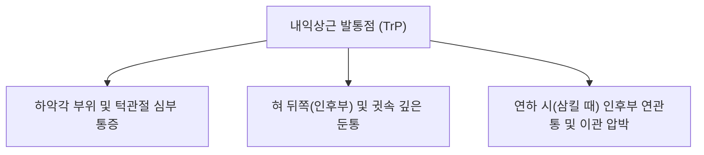

---
aliases:
  - 내익상근
  - 안쪽날개근
  - 내측익돌근
  - Medial pterygoid
---
# [[내익상근]](Medial Pterygoid)

> **핵심 요약 (Key Summary)**:
> 접형골 익상돌기 외측판 내측면 및 상악결절에서 기원하여 하악각 내측면 익돌근조면에 정지하는 심부 저작 근육입니다.
> [[삼차신경]](Trigeminal nerve, CN V3) 하악신경 내익상근가지의 지배를 받으며, **하악골 거상(폐구), 하악골 전방 돌출 및 반대측 측방 맷돌질 운동**을 주도합니다.
> [[턱관절 장애(TMD)]], 개구 장애(Trismus), 귀 먹먹함(이관 개구 연계), 비특이성 안면 심부통의 핵심 병변근이며, 협거·하관·예풍혈 침구가 표적입니다.

---
## 📌 목차
1. [해부학적 정밀 구조 및 지배 신경/혈관](#1-해부학적-정밀-구조-및-지배-신경혈관)
2. [생체역학·토크 분석 & 근막 사슬 (Biomechanical Synergy)](#2-생체역학토크-분석--근막-사슬-biomechanical-synergy)
3. [근막통증증후군(TP) & 연관통 패턴 (Travell & Simons)](#3-근막통증증후군tp--연관통-패턴-travell--simons)
4. [초음파 해부학(Sonoanatomy) 및 중재 시술 랜드마크](#4-초음파-해부학sonoanatomy-및-중재-시술-랜드마크)
5. [⭐ 원장님 심층 임상 고찰 및 원본 필기 (Clinical Pearls)](#5-원장님-심층-임상-고찰-및-원본-필기-clinical-pearls)
6. [관련 임상 질환 및 운동손상 증후군 총괄](#6-관련-임상-질환-및-운동손상-증후군-총괄)
7. [추나·도수치료(MET/PIR) & 침구·약침·재활 프로토콜](#7-추나도수치료metpir--침구약침재활-프로토콜)
8. [출처 및 학술 참고 문헌 (References)](#8-출처-및-학술-참고-문헌-references)

---
## 1. 해부학적 정밀 구조 및 지배 신경/혈관

| 항목 | 상세 내용 |
| :--- | :--- |
| **기시 (Origin)** | • **심두 (Deep head)**: [[접형골]](Sphenoid bone) 익상돌기 외측판 내측면 및 구개골 추체돌기 • **천두 (Superficial head)**: [[상악골]](Maxilla) 상악결절 및 구개골 추체돌기 외측면 |
| **정지 (Insertion)** | [[하악각]](Angle of mandible) 내측면의 익돌근조면(Pterygoid tuberosity) |
| **신경 지배** | [[삼차신경]](Trigeminal nerve, CN V3) 주간 분지인 내익상근신경(Nerve to medial pterygoid) |
| **혈관 공급** | 상악동맥(Maxillary A.)의 익상가지 |

### 🔬 해부학 도해 및 단면도
![[Gray383.png|450]]
> [Gray's Anatomy 공중도메인 해부학 도해]: 두개골 심부에서 하악각 내측으로 부착되는 내익상근(Pterygoideus internus)의 해부학적 주행과 포인터 라벨.

---
## 2. 생체역학·토크 분석 & 근막 사슬 (Biomechanical Synergy)

* **하악골 강력 폐구 (Jaw Closure)**:
  * 교근, 측두근과 협력하여 턱을 위안쪽으로 끌어올림.
* **하악골 전방 돌출 (Protraction / Protrusion)**:
  * 양측 동시 수축 시 아래턱을 앞으로 내밈.
* **편측 수축 시 반대측 측방 편위 (Contralateral Deviation)**:
  * 한쪽만 수축하면 턱이 반대쪽으로 이동하여 음식물을 갈아 부수는 맷돌질(Grinding) 수행.

---
## 3. 근막통증증후군(TP) & 연관통 패턴 (Travell & Simons)

![[Masseter_TriggerPoints.jpg|450]]
> [Travell & Simons 근막통증증후군 연관통 지도]: 저작근(익상근 및 교근) 발통점(TrP)에서 하악각, 인후부 및 귓속 깊은 곳으로 방사되는 연관통 영역.

* **발통점 위치 및 연관통 특징**:
  * **하악각 내측 TrP**: 하악각 안쪽 및 턱관절 심부로 뻐근한 둔통 방사.
  * **인후 및 이관 연관통**: 침을 삼킬 때(연하 시) 혀 뒤쪽이나 귓속(Eustachian tube) 깊은 곳이 걸리는 듯한 연관통 유발.

---
## 4. 초음파 해부학(Sonoanatomy) 및 중재 시술 랜드마크

* **초음파 스캔 및 접근**: 구강 내 접근 또는 하악각 하연을 통한 심부 천자 시 하악지 내측 경계 확인.

---
## 5. ⭐ 원장님 심층 임상 고찰 및 원본 필기 (Clinical Pearls)

### 1) 턱관절 개구 장애(Trismus)와 편측 편위 (원장님 팁)
* 입을 벌릴 때 턱이 한쪽으로 지그재그로 틀어지거나 개구 장애가 발생하는 주원인은 **내익상근의 편측 연축 및 [[외익상근]]과의 협응 파탄** → 구강 내(치과 장갑 착용) 하악각 내측을 촉진하여 TrP 압박 이완 및 협거혈 하방 심부 도침 자극.

### 2) 이관(Eustachian Tube) 기능 이상과 귀 먹먹함 (원장님 팁 100% 보존)
* 내익상근 신경 분지가 구개포장근(Tensor veli palatini) 및 고막긴장근(Tensor tympani)과 동일한 삼차신경 줄기를 공유하므로, 내익상근 과긴장 시 **귀 먹먹함, 이명, 연하 시 귀 통증** 동반 호발.

---
## 6. 관련 임상 질환 및 운동손상 증후군 총괄

| 임상 질환 / 증후군 | 병리적 연관 기전 | 주요 증상 및 이학적 검사 | 핵심 교정 타깃 |
| :--- | :--- | :--- | :--- |
| [[턱관절 장애(TMD)]] | 내익상근 과긴장 및 개구 편위 | 지그재그 개구, 하악각 내측 압통 | 협거 하방 도침 및 구강 내 이완 |
| 개구 장애 (Trismus) | 익상근 연축 및 근막 유착 | 최대 개구 30mm 미만 | 내익상근 심부 도침 박리 |

---
## 7. 추나·도수치료(MET/PIR) & 침구·약침·재활 프로토콜

* **한의학 경혈 매핑**: [[협거(頰車)]] 하방, [[하관(下關)]], [[예풍(翳風)]], [[청궁(聽宮)]]
* **침구 및 수기 프로토콜**:
  * 하악각 내측 익돌근조면 도침 박리술 및 구강 내 악관절 추나(Intraoral TMJ decompression).

---
## 8. 출처 및 학술 참고 문헌 (References)

1. **Standring, S. (2020)**. *Gray's Anatomy: The Anatomical Basis of Clinical Practice* (42nd ed.). Elsevier, p. 550.
   - **[연구 요약]**: 내익상근의 익상돌기/상악결절 기시 및 하악각 내측 정지, 익돌교근 슬링 해부학 분석.
2. **Travell, J. Get al. (1999)**. *Myofascial Pain and Dysfunction: The Trigger Point Manual*, Vol. 1.
   - **[연구 요약]**: 내익상근 TrP에 의한 인후부, 귓속 심부통 및 이관 기능 장애 연관통 패턴 규명.
3. **Murray, G. M., et al. (2007)**. The role of the human medial pterygoid muscle in jaw movement and temporomandibular disorders. *J Oral Rehabil*, 34(10), 717-727.
   - **[연구 요약]**: 내익상근의 측방 연삭 운동 기전 및 턱관절 장애(TMD) 환자에서의 개구 편위 역학 규명.
