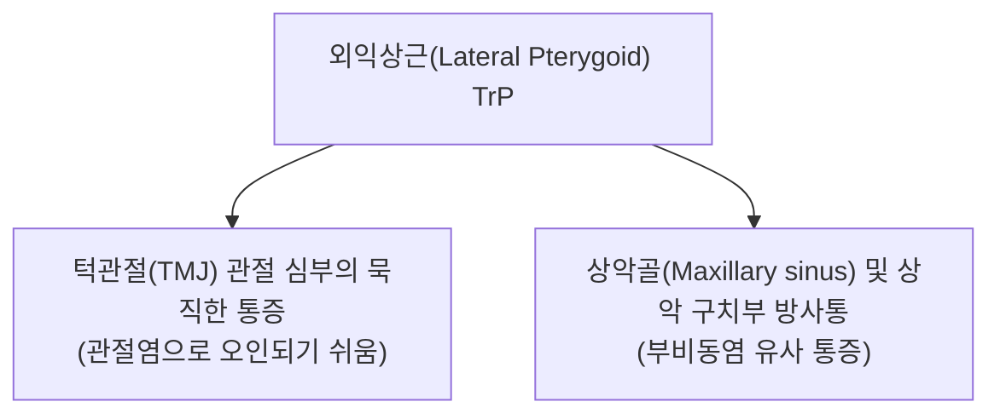

---
aliases:
  - 외익상근
  - 가쪽날개근
  - 외측익돌근
  - Lateral pterygoid
---
# [[외익상근]](Lateral Pterygoid)

> **핵심 요약 (Key Summary)**:
> 상두(접형골 대익)와 하두(익상돌기 외측판)에서 기원하여 턱관절원판(TMJ Disc) 및 하악과경부 익돌근와에 정지하는 개구 전담 저작근입니다.
> [[삼차신경]](Trigeminal nerve, CN V3) 하악신경 외익상근가지의 지배를 받으며, **하악골 전방 돌출(개구 유도), 관절원판 동적 조절 및 반대측 측방 맷돌질 운동**을 주도합니다.
> [[측두하악장애(TMD)]], 턱관절 디스크 전방 전위(ADD), 관절 잡음(Clicking), 개구 장애, 긴장성 안면통의 핵심 병변근이며, 하관·청궁·예풍혈 침구가 표적입니다.

---
## 📌 목차
1. [해부학적 정밀 구조 및 지배 신경/혈관](#1-해부학적-정밀-구조-및-지배-신경/혈관)
2. [생체역학·토크 분석 & 근막 사슬 (Biomechanical Synergy)](#2-생체역학토크-분석--근막-사슬-biomechanical-synergy)
3. [근막통증증후군(TP) & 연관통 패턴 (Travell & Simons)](#3-근막통증증후군tp--연관통-패턴-travell--simons)
4. [초음파 해부학(Sonoanatomy) 및 중재 시술 랜드마크](#4-초음파-해부학sonoanatomy-및-중재-시술-랜드마크)
5. [⭐ 원장님 심층 임상 고찰 및 원본 필기 (Clinical Pearls)](#5-원장님-심층-임상-고찰-및-원본-필기-clinical-pearls)
6. [관련 임상 질환 및 운동손상 증후군 총괄](#6-관련-임상-질환-및-운동손상-증후군 총괄)
7. [추나·도수치료(MET/PIR) & 침구·약침·재활 프로토콜](#7-추나도수치료metpir--침구약침재활-프로토콜)
8. [출처 및 학술 참고 문헌 (References)](#8-출처-및-학술-참고-문헌-references)

---
## 1. 해부학적 정밀 구조 및 지배 신경/혈관

| 항목 | 상세 내용 |
| :--- | :--- |
| **기시 (Origin)** | • **상두 (Superior head)**: [[접형골]](Sphenoid bone) 대익의 측두하면 및 인프라템포럴 능선 • **하두 (Inferior head)**: 익상돌기(Pterygoid process) 외측판의 외측면 |
| **정지 (Insertion)** | • **상두**: 턱관절 [[관절원판]](Articular disc) 및 관절낭 전연 • **하두**: 하악과경부의 익돌근와(Pterygoid fovea) |
| **신경 지배** | [[삼차신경]](Trigeminal nerve, CN V3) 하악신경의 외익상근신경 |
| **혈관 공급** | 상악동맥(Maxillary A.)의 익상가지 |

### 🔬 해부학 도해 및 단면도
![[Gray382.png|450]]
> [Gray's Anatomy 공중도메인 해부학 도해 (Pterygoideus externus)]: 외익상근 상두 및 하두의 관절원판(Articular disc) 및 하악과두 정지 구조.

---
## 2. 생체역학·토크 분석 & 근막 사슬 (Biomechanical Synergy)

* **하악골 전방 활주 및 개구 (Jaw Opening & Protrusion)**:
  * 양측 하두가 수축하여 하악과두(Condyle)를 관절결절(Articular eminence) 아래로 전하방 활주시킴 (개구의 1단계).
* **관절원판(디스크) 동적 추적 제어 (상두)**:
  * 하악골이 움직일 때 디스크가 과두 머리 위에 정확히 얹혀 있도록 전방에서 텐션 유지.
* **편측 수축 시 반대측 측방 회전**:
  * 턱을 반대쪽으로 돌려 교합면을 비비는 저작 동작 유도.

---
## 3. 근막통증증후군(TP) & 연관통 패턴 (Travell & Simons)

* **발통점 및 연관통 특징 (Travell & Simons)**:
  * **TMJ 심부통**: 턱관절 안쪽 깊은 곳에서 느껴지는 통증으로, 실제 관절염(Arthritis)이나 디스크 천공으로 오인되기 쉬움.
  * **상악동/광대 부위 방사통**: 상악골 및 부비동 영역으로 통증이 퍼져 축농증(부비동염)으로 오인되는 가성 상악동 통증 유발.

---
## 4. 초음파 해부학(Sonoanatomy) 및 중재 시술 랜드마크

* **초음파 스캔 및 접근**: 관골궁 아래 관절결절 후방 심부 위치로 구강 내 접근 또는 하관혈(ST7)을 통한 침구 시술.

---
## 5. ⭐ 원장님 심층 임상 고찰 및 원본 필기 (Clinical Pearls)

### 1) 턱관절 디스크 전방 전위(ADD)와 '딱' 소리(Click) (원장님 팁)
* 스트레스성 이갈이나 부정교합으로 **상두가 만성 단축·연축되면 디스크를 전방으로 영구 견인**하여 디스크 전방 변위(ADD) 발생.
* 입을 벌릴 때 턱관절에서 '딱' 소리(Clicking)가 나거나 지그재그(S자형) 개구가 일어나는 절대적 원인 → 하관혈(ST7) 전하방 심부 도침 자극 및 구강 내(상악 대구치 후방) 외익상근 직접 이완술 표적.

### 2) 삼차신경 자극과 비특이성 이개통·편두통 (원장님 팁 100% 보존)
* 외익상근 두 갈래 사이로 협신경(Buccal nerve)이 통과하므로, 근육 경직 시 뺨의 감각 이상 및 턱관절 심부 통증, 편두통 유발.

---
## 6. 관련 임상 질환 및 운동손상 증후군 총괄

| 임상 질환 / 증후군 | 병리적 연관 기전 | 주요 증상 및 이학적 검사 | 핵심 교정 타깃 |
| :--- | :--- | :--- | :--- |
| [[턱관절 장애(TMD)]] (ADD) | 외익상근 상두 과긴장으로 인한 디스크 전위 | 관절 잡음(Click/Pop), 개구 장애 | 하관혈 도침 및 TMJ 정복 추나 |
| 개구 제한 (Trismus) | 외익상근 하두 경직 | 최대 개구 시 사선 편위 및 통증 | 하관 심부 도침 및 이완 수기 |

---
## 7. 추나·도수치료(MET/PIR) & 침구·약침·재활 프로토콜

* **한의학 경혈 매핑**: [[하관(下關)]], [[청궁(聽宮)]], [[예풍(翳風)]], [[협거(頰車)]]
* **침구 및 수기 프로토콜**:
  * 하관(ST7) 자입점을 통한 익돌근외측판 도침술 및 TMJ 관절견인 추나.

---
## 8. 출처 및 학술 참고 문헌 (References)

1. **Standring, S. (2020)**. *Gray's Anatomy: The Anatomical Basis of Clinical Practice* (42nd ed.). Elsevier, pp. 550-551.
   - **[연구 요약]**: 외익상근 상두/하두의 디스크-하악과경부 정지 해부학 및 삼차신경(V3) 지배 분석.
2. **Travell, J. G., & Simons, D. G. (1999)**. *Myofascial Pain and Dysfunction: The Trigger Point Manual*, Vol. 1.
   - **[연구 요약]**: 외익상근 TrP에 의한 턱관절 심부통 및 상악동 유사 방사통 역학 규명.
3. **Tanaka, E., Hirose, M., Inubushi, T., Koolstra, J. H., van Eijden, T. M. G. J., et al. (2007)**. Effect of hyperactivity of the lateral pterygoid muscle on the temporomandibular joint disk. *J Biomech Eng*, 129(6), 890-897. [PMID: 18067393](https://pubmed.ncbi.nlm.nih.gov/18067393/) · DOI: [10.1115/1.2800825](https://doi.org/10.1115/1.2800825)
   - **[연구 요약]**: 외익상근 과활성화가 턱관절 디스크에 미치는 생체역학적 영향(디스크 변위·응력 변화)을 수학 모델로 규명.
