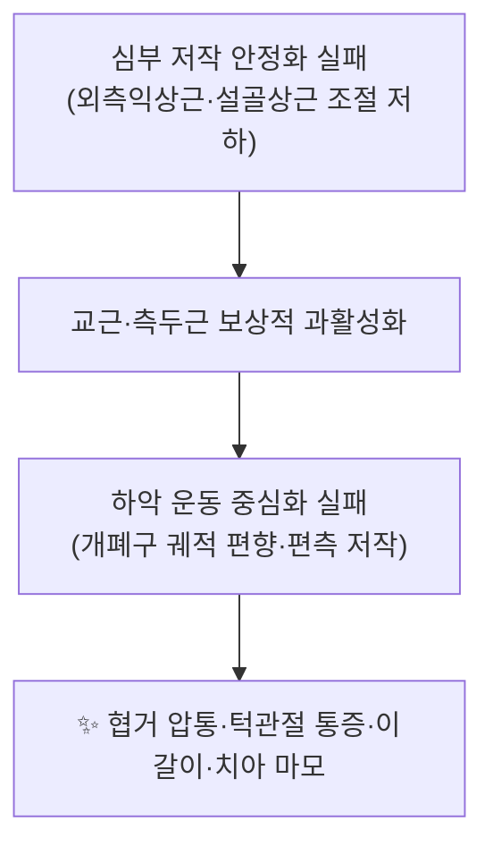

![[협거_2.jpg|540]]
> [그림 1: 1108 Muscle that Move the Lower Jaw.jpg]

# 🫁 [[협거혈]] (ST6, 頰車, Jiache)

> **핵심 요약 (Key Summary)**:
> [[협거혈]](ST6)은 하악각 전상방 약 1횡지, 이(齒)를 악물면 [[교근]]이 융기하는 함요부에 위치한 [[족양명위경]](足陽明胃經)의 경혈로, 표층에서 [[교근]]과 [[하악골지]] 외측면, 그리고 [[삼차신경]] 하악지(V3) 지배 영역에 자침된다.
> [[턱관절장애|턱관절장애(TMD)]] · [[근막통증증후군]](교근 TrP) · [[안면신경마비]](구안와사) · [[이갈이|수면 중 이갈이]] 등 저작계·안면부 질환의 핵심 표적혈이다.
> [[안면신경]] 하악연지 · [[안면동맥]] · [[이하선관]]이 인접하므로 시술 전 위험 구조물 확인과 자침 깊이 조절이 필수다.

---
## 📌 목차
1. [해부학적 정밀 구조 및 지배 신경/혈관](#1-해부학적-정밀-구조-및-지배-신경혈관)
2. [생체역학·토크 분석 & 근막 사슬 (Biomechanical Synergy)](#2-생체역학토크-분석--근막-사슬-biomechanical-synergy)
3. [근막통증증후군(TP) & 연관통 패턴 (Travell & Simons)](#3-근막통증증후군tp--연관통-패턴-travell--simons)
4. [초음파 해부학(Sonoanatomy) 및 중재 시술 랜드마크](#4-초음파-해부학sonoanatomy-및-중재-시술-랜드마크)
5. [⭐ 원장님 심층 임상 고찰 및 원본 필기 (Clinical Pearls)](#5-원장님-심층-임상-고찰-및-원본-필기-clinical-pearls)
6. [관련 임상 질환 및 운동손상 증후군 총괄](#6-관련-임상-질환-및-운동손상-증후군-총괄)
7. [추나·도수치료(MET/PIR) & 침구·약침·재활 프로토콜](#7-추나도수치료metpir--침구약침재활-프로토콜)
8. [출처 및 학술 참고 문헌 (References)](#8-출처-및-학술-참고-문헌-references)

---
## 1. 해부학적 정밀 구조 및 지배 신경/혈관

협거(ST6)는 "근육 위에 놓인 혈"의 전형으로, 표층에서 심층까지 **교근(masseter)을 관통하여 하악골지 외측면에 도달**하는 구조를 가진다. 따라서 이 혈의 임상 효과는 교근의 근긴장도·근막 상태·국소 신경혈관 분포와 직접 연결된다.

| 항목 | 상세 내용 |
| :--- | :--- |
| **표준 위치 (WHO)** | 얼굴에서 [[하악각]](mandibular angle)의 전상방 약 1횡지(가로 손가락 하나, 中指橫指), 어금니를 악물 때 [[교근]]이 가장 융기하는 함요처. 대략 [[하악절흔]](mandibular notch) 높이 부근 |
| **소속 경락 / 혈위** | [[족양명위경]](足陽明胃經) 제6번째 경혈(ST6). 안면부 국소혈이면서 원위 취혈([[합곡]] 등)과 배합되는 임상 빈도가 높음 |
| **표층 → 심층 통과 구조** | 피부 → 피하조직 → [[천층근막(SMAS)]] → 교근 근막 → [[교근]](천층/심층) → [[하악골지]] 외측면 골막 |
| **지배 신경 (운동)** | [[교근신경]](masseteric nerve) — [[삼차신경]] 제3지(V3, 하악신경) 분지 |
| **지배 신경 (감각)** | 국소 피부·근막: [[이개측두신경]](V3), [[협신경]](buccal n., V3), [[대이개신경]](C2–C3, 경총) / 안면 표정근 운동: [[안면신경]](CN VII) 분지 |
| **혈관 공급** | [[안면동맥]](facial a.) 및 [[횡안면동맥]](transverse facial a.) 분지, 동반 정맥 |
| **인접 위험 구조** | [[안면신경]] [[하악연지]](marginal mandibular branch), [[이하선관]](Stensen's duct), [[이하선]](parotid gland) 하극, [[악하선]] |
| **자침법 (교과서 기준)** | 직자 또는 [[지창]](ST4) 방향 투자. 통상 깊이 0.3–0.5촌(직자), 0.5–1촌(투자) 수준으로 기술되나, **개별 환자별 최적 깊이·각도에 대한 정량 근거는 제공 논문에서 확인되지 않음(근거 미확인)** |

### 🔬 층별 해부학 상세

- **천층**: 피부와 피하조직은 비교적 얇고, 그 아래 [[천층근막(SMAS)]]이 교근 근막과 이어져 안면 표정근(광대근·소근 등)과 기능적으로 결합한다. 이 때문에 협거 자극은 단순 근육 자극을 넘어 **안면부 근막 사슬 전체의 긴장 조절**에 영향을 줄 수 있다.
- **근층**: 교근은 천층(표재층)과 심층으로 나뉘며, 천층은 광대활에서 기시하여 하악각 외측면으로, 심층은 광대궁 후방에서 기시하여 하악골지 상부로 주행한다. 협거는 주로 **천층 교근의 하악각 전상방 부위**에 위치한다.
- **심층**: 교근을 지나면 하악골지 외측면 골막에 닿는다. 지나치게 깊거나 후방으로 자침하면 하악각 후방의 [[이하선]] 하극과 [[이하선관]] 경로에 근접할 수 있다.
- **안전 임계 구조**: [[안면신경]]의 **하악연지**는 하악골 하연을 따라 주행하다가 하악각 부근에서 하연보다 위로 올라오는 변이가 있어, 하악각에 너무 근접·심자하는 경우 손상 위험이 거론된다. 국소 감각·자율신경 분포에 관해서는 GB14·ST2·ST6 국소 조직을 대상으로 한 해부학적 연구가 존재하나([Wang & Cui, 2022, PMID: 35579008]), **혈위별 신경섬유 밀도·아형의 정량적 차이는 제공 정보만으로 확인 불가(근거 미확인)**.

---
## 2. 생체역학·토크 분석 & 근막 사슬 (Biomechanical Synergy)

협거가 놓인 [[교근]]은 [[측두근]]·[[내측익상근]]과 함께 **하악 거상(폐구)을 담당하는 주동근군**을 이루고, [[외측익상근]] 및 설골상근군(악이복근 전복·이설근)이 개구와 설골 안정화를 분담한다. 저작계는 좌우 대칭적 짝힘(coupling)으로 하악의 중심위를 유지하므로, 한쪽 교근의 과긴장은 하악 운동 궤적의 편향으로 직결된다.

* **분절별 모멘트 암과 토크**: 교근은 광대활–하악각 사이에 걸쳐 있어 비교적 **짧은 모멘트 암으로 큰 힘을 내는 지렛대**를 형성한다. 즉 적은 근수축 변위로 강한 교합력을 발생시키는 구조이며, 이 때문에 과긴장 시 통증 유발 임계가 낮아지기 쉽다. 교합력의 구체적 수치(N·kg)는 개인차가 크고 **제공 논문에서 직접 확인된 값이 없으므로 근거 미확인**으로 표기한다.
* **근막 사슬 연계 (Myers Anatomy Trains / McGill 관점)**:
  * **저작 사슬**: 교근 ↔ 측두근 ↔ 내측익상근 ↔ 외측익상근 (동측·반대측 교차 조절 포함)
  * **안면–경부 연결**: [[천층근막(SMAS)]]을 매개로 교근–광대근–안륜근 및 경부 근막([[흉쇄유돌근]], 상부 승모근)과 연결
  * **전방 심층선(Deep Front Line)**: 하악–설골–설근–경부 심부굴근으로 이어지는 축. 협거 자극이 설골상근군 긴장 완화와 함께 삼킴·발음 기능 개선에 기여할 가능성이 논의되나, **직접적 인과 근거는 제공 논문에서 확인되지 않음**.

---
## 3. 근막통증증후군(TP) & 연관통 패턴 (Travell & Simons)

[[교근]]은 두경부에서 가장 흔하게 발통점(TrP)이 형성되는 근육 중 하나이며, 협거(ST6)의 위치는 교근 천층 발통점과 해부학적으로 상당 부분 겹친다. 즉 **침구 임상에서의 협거 자침은 기능적으로 교근 발통점 자극과 상당 부분 중첩**된다.

* **발통점 및 연관통 (Travell & Simons 기준)**:

| 교근 발통점 위치 | 특징적 연관통 패턴 | 동반 증상 |
| :--- | :--- | :--- |
| 천층 상부 (광대활 하방, 협거 상방) | 상악 어금니·상악 잇몸, 눈썹 부위, 광대 부위 | 이 악물기 악화, 개구 시 통증 |
| 천층 하부 (하악각 부근, 협거 주위) | 하악·턱 끝, 귀 앞·아래 | [[이명]], 귀 먹먹함, 하악각 압통 |
| 심층 (하악골지 상부) | 귀 깊은 곳, 후방 안면부 | 이충만감, 난청 양상 호소 |

* **임상 감별 포인트**: 연관통이 귀·치아로 방사되므로 [[이과적 질환]]·[[치성 통증]]과의 감별이 필요하다. 이학적으로는 하악 개구 범위(정상 약 40–50mm로 기술되나 개인차 큼 — **수치 근거 미확인**)와 개폐구 시 편향·측방 이동, 교근 촉진 시 국소 연축 반응(local twitch response)을 확인한다.
* **침·건침 근거**: 수면 중 이갈이와 턱관절장애 환자를 대상으로 근막 발통점 **건침(dry needling)**을 시행한 전향적 증례군 연구에서 증상·기능 개선이 보고되었고([Blasco-Bonora & Martín-Pintado-Zugasti, 2017, PMID: 27697769]), 만성 근막통 및 연관통 환자에서 **침 치료와 발통점 주입(trigger point injection)의 병용**이 유효했다는 증례도 보고되었다([Handa & Ichinohe, 2020, PMID: 32507780]). 다만 이들 연구는 증례 수준이므로 일반화에는 주의가 필요하다.

---
## 4. 초음파 해부학(Sonoanatomy) 및 중재 시술 랜드마크

* **스캔 뷰(권장)**:
  * **단축(transverse) 뷰**: 하악각 위·앞에 탐촉자를 수평으로 놓으면 천층 교근의 근복이 방추형 저에코 구조로 확인되고, 그 심부에 하악골지 외측면의 고에코 골막선이 나타난다. 협거는 이 근복 내 목표 지점에 해당한다.
  * **장축(longitudinal) 뷰**: 광대활에서 하악각까지 주행하는 교근 섬유 방향을 따라가며 천층–심층 경계를 확인한다.
* **안전 마진 및 회피 구조**:
  * 후방·하방으로 벗어나면 [[이하선]] 하극과 [[이하선관]] 경로에 접근하므로, **하악각 후방으로의 자침은 피한다**.
  * 하악골 하연을 따라 주행하는 [[안면신경]] 하악연지 및 [[안면동맥]]·[[횡안면동맥]]을 도플러로 확인하여 혈관 내 주입을 방지한다.
  * 심자 시 골막 자극은 강한 방산감을 유발하므로 환자 반응을 관찰하며 깊이를 조절한다.
* **중재 시술 시 유의**: 초음파 유도하 교근 건침·약침 시 목표 깊이와 주입량의 최적값은 **제공 논문에서 확인되지 않음(근거 미확인)**. 국소 해부에 기반한 개별화가 필요하다.
* **안전성 관련 보고**: 침 치료 후 **다발성 뇌신경 손상**이 발생한 증례가 보고된 바 있다([Yan & Li, 2025, PMID: 40518776]). 해당 증례의 구체적 자침 혈위·기전은 제공된 정보만으로는 확인되지 않으나(근거 미확인), 안면·경부 심자 시 해부학적 위험 구조에 대한 숙지의 중요성을 뒷받침한다.

---
## 5. ⭐ 원장님 심층 임상 고찰 및 원본 필기 (Clinical Pearls)

* **(원본 필기 미제공 — 원장님 육필/구술 내용이 확보되는 대로 본 위치에 100% 그대로 보존한다.)**

* **[일반 임상 참고 — 원장님 원본 필기 아님]**
  * 촉진 시 **악물기–이완**을 반복시켜 교근 천층의 융기와 함요를 확인한 뒤 취혈하면 위치 오차가 줄어든다. 하악각을 기준점으로 삼되, 환자마다 하악각 형태·교근 발달 차이가 크므로 "골 기준 + 근 수축 확인"을 병행한다.
  * 개구 제한이 주소인 경우, 협거 단독보다 [[하관]](ST7)·[[청궁]](SI19)·[[예풍]](TE17)과의 배합 및 원위 취혈([[합곡]] LI4, [[태충]] LR3)을 함께 고려한다.
  * 이갈이·악물기 습관이 있는 환자는 야간 보호장치 등 치과적 협진과 병행했을 때 자침 효과의 유지가 좋은 경향이 있으나, **이 병용 효과를 정량적으로 입증한 제공 근거는 없음(근거 미확인)**.
  * 안면부 자침 시 환자의 통증 호소가 강하면 자극량을 줄이고 유침 시간을 단축한다. 시술 후 국소 멍·부종이 흔하므로 사전 설명이 필요하다.

---
## 6. 관련 임상 질환 및 운동손상 증후군 총괄

| 임상 질환 / 증후군 | 병리적 연관 기전 | 주요 증상 및 이학적 검사 | 핵심 교정 타깃 |
| :--- | :--- | :--- | :--- |
| [[안면신경마비|구안와사(말초성 안면신경마비)]] | 안면신경 염증·부종에 따른 표정근 마비. 안면부 경혈 자극이 회복 재활에 활용됨 | 편측 이마 주름 소실, 안구 폐쇄 불완전, 구각 하수 | 협거·지창·사백·예풍 배합, 안면 표정근 재교육 |
| [[턱관절장애]](TMD) | 교근·측두근 과긴장 및 심부 안정화 실패로 하악 운동 중심화 상실 | 개폐구 시 관절음·편향, 하악각 및 관절와 압통 | [[교근]], [[측두근]], [[외측익상근]] 조절 |
| [[수면 이갈이|수면 중 이갈이(Bruxism)]] | 야간 저작근 과활성화 및 중추성 각성 반응 연관 | 아침 턱 피로감, 치아 마모, 교근 비대 | 교근 발통점 건침·이완, 스트레스 관리 |
| [[교근 근막통증증후군]] | 발통점 형성 및 연관통 방사 | 하악각 국소 압통, 귀·치아로의 연관통, 개구 시 통증 | 협거 부위 TrP 자극 및 근막 이완 |
| [[치통]]·[[비정형 안면통증]] | 치성 원인 또는 삼차신경 병리 감별 필요 | 타진 통증, 신경학적 검사 소견 | 원인 감별 후 협거 보조 활용 |
| [[이명]]·[[이충만감]] | 교근 심층 TrP의 귀 부위 연관통 및 측두하악 기능 이상 | 귀 먹먹함, 청력 검사상 특이 소견 없는 경우 많음 | 교근 심층 및 [[예풍]] 병용 |

* **근거 수준 참고**: 구강안면 통증에 대한 침 치료의 효과를 평가한 체계적 문헌고찰 및 메타분석이 보고되었으며, 침 치료 유형에 따라 증상·장애 감소 효과가 다르게 나타났다([Mohamad & de Oliveira-Souza, 2024, PMID: 38357796]). 말초성 안면신경마비에 대해서는 근거 기반 침구 임상 권고가 제시된 바 있다([Zheng & Li, 2009, PMID: 19222110]).

---
## 7. 추나·도수치료(MET/PIR) & 침구·약침·재활 프로토콜

* **한의학 경혈 매핑**:
  * 국소혈: [[협근]](ST6), [[하관]](ST7), [[지창]](ST4), [[사백]](ST2), [[청궁]](SI19), [[예풍]](TE17), [[상관]](GB3)
  * 원위혈: [[합곡]](LI4), [[태충]](LR3), [[족삼리]](ST36), [[내정]](ST44) — 안면부 국소 자극과 원위 자극의 배합
  * 아시혈: 교근 천층·심층 발통점(TrP), 하악각 주변 압통점

* **근에너지기법 (MET) / PIR (수용성 억제 후 이완)**:
  1. 환자 앙와위 또는 좌위에서 하악을 최대 개구한 상태(무통 범위)로 이완시킨다.
  2. 검자는 한 손으로 하악을 고정하고, 환자가 **폐구 방향으로 약 20–30% 힘으로 등척성 수축**하게 하여 5–10초 유지한다.
  3. 호기와 함께 하악을 부드럽게 추가 개구시키며 교근·측두근을 신장하고, 2–3회 반복한다.
  * 개구 제한의 원인이 외측익상근·관절원판 전위 등 관절 내 병리인 경우 단순 신장만으로는 한계가 있으므로 감별이 선행되어야 한다.
  * 저작근 심층(내측·외측 익상근)은 구강 내 접근이 필요해 도수 접근이 제한적이므로, 임상적으로는 **교근·측두근 이완 + 설골상근군(악이복근·이설근) 이완**을 조합한다.

* **침구·약침 프로토콜(개괄)**:
  * **침**: 협거를 중심으로 국소혈 2–3개 + 원위혈 1–2개를 배합, 15–20분 유침. 안면부는 자극량을 낮게, 자침 깊이는 교근 근복 내로 조절.
  * **약침**: 교근 발통점 및 하악각 주변에 소량 주입. **약침의 종류·용량·농도에 대한 정량적 최적 프로토콜은 제공 논문에서 확인되지 않음(근거 미확인)**.
  * **건침**: 교근 발통점을 중심으로 시행. 이갈이·TMD 환자에서 개선 보고가 있으며([Blasco-Bonora & Martín-Pintado-Zugasti, 2017, PMID: 27697769]), 만성 근막통·연관통 환자에서 발통점 주입과의 병용 보고도 있다([Handa & Ichinohe, 2020, PMID: 32507780]).
  * **재활·교육**: 편측 저작 교정, 야간 이악물기 자각 훈련, 개구 운동 범위 자가 측정, 스트레스·수면 관리. 필요 시 치과 교합·보호장치 협진.

---
## 8. 출처 및 학술 참고 문헌 (References)

1. Yan J, Li R (2025). Case of multiple cranial nerve injury. *Zhongguo Zhen Jiu*. PMID: 40518776
2. Wang J, Cui JJ (2022). Sensory and autonomic innervation of the local tissues at traditional acupuncture point locations GB14, ST2 and ST6. *Acupunct Med*. PMID: 35579008
3. Zheng H, Li Y (2009). Evidence based acupuncture practice recommendations for peripheral facial paralysis. *Am J Chin Med*. PMID: 19222110
4. Mohamad N, de Oliveira-Souza AIS (2024). The effectiveness of different types of acupuncture to reduce symptoms and disability for patients with orofacial pain. A systematic review and meta-analysis. *Disabil Rehabil*. PMID: 38357796
5. Handa T, Ichinohe T (2020). Acupuncture Combined with Trigger Point Injection in Patient with Chronic Myofascial and Referred Pain. *Bull Tokyo Dent Coll*. PMID: 32507780
6. Blasco-Bonora PM, Martín-Pintado-Zugasti A (2017). Effects of myofascial trigger point dry needling in patients with sleep bruxism and temporomandibular disorders: a prospective case series. *Acupunct Med*. PMID: 27697769
7. **Standring, S. (2020)**. *Gray's Anatomy: The Anatomical Basis of Clinical Practice* (42nd ed.). Elsevier.
8. **Travell, J. G., & Simons, D. G. (1999)**. *Myofascial Pain and Dysfunction: The Trigger Point Manual*, Vol. 1.

<!-- 보관 태그(1회용·링크오류, 필요시 복원): 교근, 협거, ST6 -->
