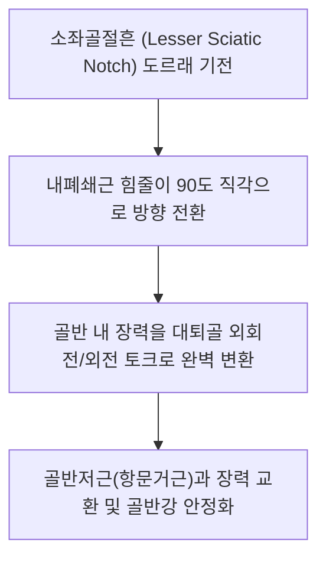

# [[내폐쇄근]](Obturator Internus)

> **핵심 요약 (Key Summary)**:
> [[골반]] 내면의 [[폐쇄막]] 및 치골·좌골지에서 기시하여 소좌골절흔을 도르래 삼아 90도 꺾여 [[대퇴골]] 대전자 전자와에 정지하는 심부 외회전근.
> 고관절 외회전(신전 시), 외전(굴곡 시), 골반저근 지지 및 알콕관(Alcock's canal) 외벽 형성을 주동하며 [[내폐쇄근신경]](L5-S2)의 지배를 받음.
> 심부 둔부 증후군, 좌골신경통, 만성 골반통증 증후군(CPPS)을 초래하며 환도혈 심부 자침 및 삼두관절근 침도의 핵심 타깃임.

---
## 📌 목차
1. [해부학적 정밀 구조 및 지배 신경/혈관](#1-해부학적-정밀-구조-및-지배-신경혈관)
2. [생체역학·토크 분석 & 근막 사슬 (Biomechanical Synergy)](#2-생체역학토크-분석--근막-사슬-biomechanical-synergy)
3. [근막통증증후군(TP) & 연관통 패턴 (Travell & Simons)](#3-근막통증증후군tp--연관통-패턴-travell--simons)
4. [초음파 해부학(Sonoanatomy) 및 중재 시술 랜드마크](#4-초음파-해부학sonoanatomy-및-중재-시술-랜드마크)
5. [⭐ 원장님 심층 임상 고찰 및 원본 필기 (Clinical Pearls)](#5-원장님-심층-임상-고찰-및-원본-필기-clinical-pearls)
6. [관련 임상 질환 및 운동손상 증후군 총괄](#6-관련-임상-질환-및-운동손상-증후군-총괄)
7. [추나·도수치료(MET/PIR) & 침구·약침·재활 프로토콜](#7-추나도수치료metpir--침구약침재활-프로토콜)
8. [출처 및 학술 참고 문헌 (References)](#8-출처-및-학술-참고-문헌-references)

---
## 1. 해부학적 정밀 구조 및 지배 신경/혈관

| 항목 | 상세 내용 |
| :--- | :--- |
| **기시 (Origin)** | [[골반]] 내면의 [[폐쇄막]](Obturator membrane) 내측면 및 이를 둘러싼 [[치골]], [[좌골]] 골반 내면 |
| **정지 (Insertion)** | [[소좌골공]](Lesser sciatic foramen)을 지나 90° 방향 전환 → [[대퇴골]](Femur) 대전자 내측 [[전자와]](Trochanteric fossa) |
| **신경 지배** | [[내폐쇄근신경]](Nerve to obturator internus, L5, S1, S2) |
| **혈관 공급** | 내음부동맥(Internal pudendal a.), 하둔동맥 |

### 🔬 해부학 도해 및 단면도
![[Obturator_internus_anatomy.png|450]]
> [해부학 도해]: 골반 내부에서 시작하여 소좌골절흔을 도르래 삼아 90도 직각으로 꺾여 나와 대퇴골 대전자로 향하는 내폐쇄근.

![[Pasted image 20240116151916.png|450]]
> [구조적 특징]: 상·하쌍자근과 함께 삼두관절근(Triceps coxae)을 완성하며 알콕관 외벽을 형성하는 골반-둔부 연결 기둥.

---
## 2. 생체역학·토크 분석 & 근막 사슬 (Biomechanical Synergy)

* **90도 직각 도르래 기전 (Pulley Mechanism)**: 골반강 안쪽에서 수평으로 달리다가 소좌골절흔을 도르래 삼아 90도 꺾여 둔부로 빠져나오는 독특한 생체역학적 지렛대.
* **알콕관(Alcock's Canal) 외벽 형성**: 내폐쇄근의 근막이 두꺼워져 음부신경관을 형성하므로, 내폐쇄근 경직 시 [[음부신경]]이 압박되어 만성 골반통 유발.
* **근막 사슬 연계 (Anatomy Trains)**: 심부전방선(Deep Front Line)의 핵심 매개체로 골반저근(항문거근)의 건궁(Tendinous arch)과 직접 융합.

---
## 3. 근막통증증후군(TP) & 연관통 패턴 (Travell & Simons)

![[Obturator_internus_TriggerPoints.jpg|450]]
> **[그림 설명]**: 내폐쇄근 및 심부 외회전근군 발통점 및 골반강·둔부 심부·미골통 연관통 영역 (Travell & Simons)

* **발통점 위치**: 소좌골절흔 외측, 좌골신경 바로 심부의 내폐쇄근 건복 부위.
* **연관통 및 신경 압박**:
  * 둔부 중앙의 깊고 지속적인 둔통.
  * [[좌골신경]]을 압박하여 대퇴 후면, 종아리, 발바닥까지 방사통 유발.
  * [[음부신경]] 압박 시 회음부, 항문, 외음부의 화끈거림 및 배뇨통 모사.

---
## 4. 초음파 해부학(Sonoanatomy) 및 중재 시술 랜드마크

* **초음파 스캔**:
  * 대전자와 좌골결절 사이 횡단 스캔에서 좌골신경 바로 아래에 위치한 두꺼운 고에코 내폐쇄근 힘줄 확인.
  * 힘줄 상하를 덮고 있는 상·하쌍자근 식별.
* **자침 안전 마진**: 좌골신경 외측 또는 심부로 안전하게 진입하여 신경 손상 방지.

---
## 5. ⭐ 원장님 심층 임상 고찰 및 원본 필기 (Clinical Pearls)

* **좌골신경 포착과 골반저 연관 (원장님 필기 100% 보존)**:
  * 내폐쇄근의 과긴장 및 비후는 대좌골공 하부 및 소좌골공 주변을 통과하는 좌골신경을 직접 압박하여 디스크 없는 좌골신경통을 유발함.
  * 동시에 골반 내면에서는 음부신경관(알콕관)을 압박하여 회음부 통증과 비세균성 전립선염 증상을 초래하므로, 둔부 통증과 골반통이 동반된 환자에서 내폐쇄근 치료는 필수적임.
* **소좌골절흔 도르래 마찰 손상**:
  * 스쿼트나 런지, 과도한 외회전 스트레칭 시 소좌골절흔 뼈 모서리에서 내폐쇄근 건이 마찰되며 건초염 및 점액낭염 발생.
  * 환도혈 심부에서 소좌골절흔 방향으로 침도 박리 시 통증 즉각 감소.

---
## 6. 관련 임상 질환 및 운동손상 증후군 총괄

| 임상 질환 / 증후군 | 병리적 연관 기전 | 주요 증상 및 이학적 검사 | 핵심 교정 타깃 |
| :--- | :--- | :--- | :--- |
| [[심부 둔부 증후군]](DGS) | 내폐쇄근 비후로 좌골신경 기계적 포착 | 좌식 시 둔통, 다리 저림, [[FAIR 검사]] 양성 | 내폐쇄근 침도 박리, 신경 수력박리 |
| [[음부신경 포착 증후군]] | 알콕관(Alcock's canal) 협착 | 회음부/외음부 통증, 배뇨통, 성교통 | 내폐쇄근 근막 이완, 음부신경 차단술 |
| 만성 골반통증 증후군(CPPS) | 내폐쇄근-골반저근 복합체 과긴장 | 골반 깊은 곳의 뻐근함, 미골통 | 골반저-내폐쇄근 도수, 온열 요법 |
| 고관절 충돌증후군 | 도르래 기전 마찰로 고관절 내회전 제한 | 깊은 스쿼트 시 둔부 통증 | 내폐쇄근 건 PIR 신장 |

---
## 7. 추나·도수치료(MET/PIR) & 침구·약침·재활 프로토콜

* **한의학 경혈 매핑 및 침구 프로토콜**:
  * 담경 환도(GB30), 방광경 질변(BL54), 회음(CV1).
  * 0.35×75mm 침으로 소좌골절흔을 향해 5~6cm 심부 자입 후 약침(황련해독탕/중성어혈) 1.0cc 주입.
* **근에너지기법 (MET/PIR)**:
  * 고관절 90도 굴곡 상태에서 완전 내회전 유도 후 외회전 등척성 저항(7초) → 호기와 함께 내회전 신장.

---
## 8. 출처 및 학술 참고 문헌 (References)

1. **Standring, S.** (2020). *Gray's Anatomy* (42nd ed.). Elsevier.
   - `[연구 요약]`: 내폐쇄근의 90도 도르래 주행 해부학 및 알콕관(음부신경관) 형성 구조 분석.
2. **Martin, H. D., et al.** (2015). Deep gluteal syndrome. *Journal of Hip Preservation Surgery*.
   - `[연구 요약]`: 내폐쇄근과 좌골신경 포착의 상관관계 및 진단학적 가이드라인 제시.
