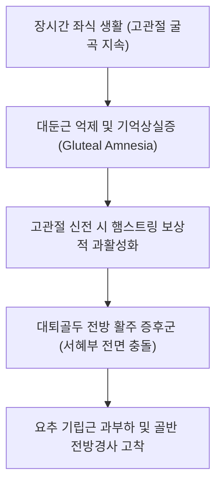

# [[대둔근]](Gluteus Maximus)

> **핵심 요약 (Key Summary)**:
> [[장골]] 후둔선 후방, [[천골]] 및 [[미골]] 후면, [[천결절인대]]에서 기시하여 [[장경인대]] 및 대퇴골 둔근조면에 정지하는 인체 최대의 항중력 신전근.
> 고관절 강력한 신전 및 외회전, 기립 자세 유지, 후방 사선 사슬(POS) 파워를 주동하며 [[하둔신경]](Inferior gluteal n., L5-S2)의 지배를 받음.
> 둔근 기억상실증(Gluteal Amnesia), 대퇴골 전방 활주 증후군, 만성 요통을 초래하며 환도·질변혈 심부 자침 및 힙 힌지(Hip hinge) 재활의 핵심 타깃임.

---
## 📌 목차
1. [해부학적 정밀 구조 및 지배 신경/혈관](#1-해부학적-정밀-구조-및-지배-신경혈관)
2. [생체역학·토크 분석 & 근막 사슬 (Biomechanical Synergy)](#2-생체역학토크-분석--근막-사슬-biomechanical-synergy)
3. [근막통증증후군(TP) & 연관통 패턴 (Travell & Simons)](#3-근막통증증후군tp--연관통-패턴-travell--simons)
4. [초음파 해부학(Sonoanatomy) 및 중재 시술 랜드마크](#4-초음파-해부학sonoanatomy-및-중재-시술-랜드마크)
5. [⭐ 원장님 심층 임상 고찰 및 원본 필기 (Clinical Pearls)](#5-원장님-심층-임상-고찰-및-원본-필기-clinical-pearls)
6. [관련 임상 질환 및 운동손상 증후군 총괄](#6-관련-임상-질환-및-운동손상-증후군-총괄)
7. [추나·도수치료(MET/PIR) & 침구·약침·재활 프로토콜](#7-추나도수치료metpir--침구약침재활-프로토콜)
8. [출처 및 학술 참고 문헌 (References)](#8-출처-및-학술-참고-문헌-references)

---
## 1. 해부학적 정밀 구조 및 지배 신경/혈관

| 항목 | 상세 내용 |
| :--- | :--- |
| **기시 (Origin)** | [[장골]](Ilium) 외측면 후둔선 후방, [[천골]](Sacrum) 및 [[미골]](Coccyx) 후면, [[천결절인대]](Sacrotuberous lig.), [[흉요근막]] |
| **정지 (Insertion)** | 상부/표층 섬유: [[장경인대]](ITB, Iliotibial tract) / 하부/심층 섬유: [[대퇴골]](Femur) 둔근조면(Gluteal tuberosity) |
| **신경 지배** | [[하둔신경]](Inferior gluteal nerve, L5, S1, S2) |
| **혈관 공급** | 상둔동맥(Superior gluteal a.), 하둔동맥(Inferior gluteal a.) |

### 🔬 해부학 도해 및 단면도
![[Gluteus_maximus_anatomy.png|450]]
> [해부학 도해]: 골반 후면 전체를 덮으며 장경인대와 대퇴골로 집중되는 대둔근의 장대한 주행.

![[Pasted image 20240116151916.png|450]]
> [구조적 특징]: 둔부 전체를 덮고 있는 가장 크고 두꺼운 표층 근육으로 흉요근막과 장경인대를 통해 상·하지를 통합.

![[Pasted image 20240119015648.png|351]]
> [근육 층위]: 중둔근과 이상근의 표층을 덮고 있는 대둔근의 섬유 주행 방향.

![[Pasted image 20240307142111.png|450]]
> [임상 단면]: 좌골신경 및 심부 외회전근군을 보호하는 쿠션 층판.

---
## 2. 생체역학·토크 분석 & 근막 사슬 (Biomechanical Synergy)

* **고관절 강력한 신전 엔진 (Prime Extensor)**: 달리기, 계단 오르기, 점프, 스쿼트 시 폭발적인 신전 파워 생성(평지 보행 시에는 약 10% 미만으로만 가볍게 활성화).
* **후방 사선 사슬 (Posterior Oblique Sling: POS)**: 대둔근 → 흉요근막 → 반대측 [[광배근]]으로 이어지는 사선 파워 체인으로 보행 시 천장관절(SI joint)을 강력하게 압박 잠금(Force closure)하여 안정화.
* **대퇴골두 전방 활주 방어**: 대둔근이 적절히 수축하면 대퇴골두를 후방으로 당겨 관절와 내에 중심화시킴.

---
## 3. 근막통증증후군(TP) & 연관통 패턴 (Travell & Simons)

![[Gluteus_maximus_TriggerPoints.jpg|450]]
> **[그림 설명]**: 대둔근(Gluteus Maximus) 발통점(TrP1~TrP3) 및 연관통 영역 (Travell & Simons)

* **TrP 1 (천골 부착부 상부)**: 천장관절 및 둔부 내측, 꼬리뼈 주변으로 퍼지는 묵직한 통증.
* **TrP 2 (좌골결절 상방)**: 둔부 전체에 뻐근함을 유발하며 의자에 앉아 있을 때 엉덩이가 배겨 오래 앉지 못함.
* **TrP 3 (미골 하부 섬유)**: 꼬리뼈 통증(Coccygodynia) 및 항문 괄약근 경련 유사 통증 모사.

---
## 4. 초음파 해부학(Sonoanatomy) 및 중재 시술 랜드마크

* **초음파 후방 스캔**:
  * 둔부 중앙 횡단 스캔에서 가장 표층의 두꺼운 고에코 근막과 굵은 근섬유 다발(대둔근) 확인.
  * 대둔근 심부의 무에코 점액낭(좌골둔근 점액낭 Ischiogluteal bursa, 전자부 점액낭 Trochanteric bursa) 식별.
* **자침 안전 마진**: 대둔근 심부에는 좌골신경(Sciatic nerve)과 상·하둔 신경혈관속이 지나가므로 환도혈 심부 자침 시 방사통 유발 여부 확인.

---
## 5. ⭐ 원장님 심층 임상 고찰 및 원본 필기 (Clinical Pearls)

* **대둔근-광배근 쳐짐과 굽은 등 (원장님 필기 100% 보존)**:
  * 엉덩이가 처지고 허리가 굽은 환자는 대둔근과 광배근이 동시에 약화되고 흉요근막이 과도하게 늘어나 탄성을 잃은 상태임.
  * 이때는 허리 치료만 해서는 안 되며, 후방 사선 사슬(POS: 반대측 광배근 + 동측 대둔근)을 동시에 강화하는 사선 풀링(Pulling) 운동을 병행해야 등이 펴지고 엉덩이가 올라감.
* **대퇴골 전방 활주 증후군(Anterior Femoral Glide)과 햄스트링 보상 (원장님 팁)**:
  * 대둔근이 꺼져 있는 환자는 엎드려 다리를 뒤로 들 때 대둔근 대신 햄스트링이 먼저 수축함.
  * 햄스트링은 대퇴골을 후방에서 지탱하지 못하고 소전자를 지렛대 삼아 대퇴골두를 관절와 앞쪽으로 밀어내므로, 고관절 앞쪽(서혜부)에서 찝히는 충돌통을 유발함.
  * 대둔근 촉진 수축 재교육(Glute squeeze)이 고관절 충돌증후군 치료의 제1원칙임.
* **환도혈(GB30) 자침의 깊이 감각**:
  * 대전자와 천골열공을 잇는 선의 외측 1/3 지점 환도혈은 대둔근을 뚫고 이상근 하공으로 진입하는 요혈임.
  * 0.35×75mm 이상의 장침으로 직자하여 대둔근의 두터운 저항감을 통과할 때 강력한 득기 유도.

---
## 6. 관련 임상 질환 및 운동손상 증후군 총괄

| 임상 질환 / 증후군 | 병리적 연관 기전 | 주요 증상 및 이학적 검사 | 핵심 교정 타깃 |
| :--- | :--- | :--- | :--- |
| [[둔근 기억상실증]](Gluteal Amnesia) | 오랜 좌식으로 인한 상반신경 억제 | 엉덩이 무력감, 계단 오를 때 무릎/허리 통증 | 힙 브릿지, 대둔근 고립 활성화 |
| [[대퇴 전방 활주 증후군]] | 햄스트링 우세로 대퇴골두 전방 밀림 | 고관절 굴곡 시 서혜부 앞쪽 찝힘 | 대둔근 강화, 햄스트링 우세 패턴 교정 |
| [[좌골둔근 점액낭염]] | 좌골결절 부위 대둔근 건 마찰 | 앉을 때 엉덩이뼈 닿는 극심한 통증 | 좌골결절 부착부 소염 약침 |
| 천장관절 증후군 | 대둔근 부전으로 POS 결합력 상실 | 한쪽 엉치 통증, 보행 시 골반 덜컹거림 | 대둔근-광배근 협응 재활, 골반 교정 |

---
## 7. 추나·도수치료(MET/PIR) & 침구·약침·재활 프로토콜

* **한의학 경혈 매핑 및 침구 프로토콜**:
  * 담경 환도(GB30), 거료(GB29), 방광경 질변(BL54), 포황(BL53), 승부(BL36).
  * 0.35×75mm 장침으로 대둔근 근복 및 부착부에 심부 자입 후 전침(2Hz) 적용.
* **근에너지기법 (MET/PIR)**:
  * 앙와위에서 고관절을 최대로 굴곡+내전시킨 상태에서 환자에게 가벼운 신전/외전 저항 7초 후, 호기와 함께 둔근 신장.
* **재활 훈련 (Glute Bridge & Hip Thrust)**:
  * 햄스트링 개입을 줄이기 위해 무릎을 90도 이상 충분히 접은 상태에서 둔근을 조이며 골반을 드는 브릿지 훈련.

---
## 8. 출처 및 학술 참고 문헌 (References)

1. **Lieberman, D. E., Raichlen, D. A., Pontzer, H., Bramble, D. M., & Cutright-Smith, E. (2006)**. The human gluteus maximus and its role in running. *J Exp Biol*, 209(11), 2143-2155. [PMID: 16709916](https://pubmed.ncbi.nlm.nih.gov/16709916/)
   - `[연구 요약]`: 대둔근의 인류 직립 보행 및 달리기 시 몸통 전방 쏠림을 방어하는 결정적 역할 규명.
2. **Sahrmann, S.** (2002). *Diagnosis and Treatment of Movement Impairment Syndromes*. Mosby.
   - `[연구 요약]`: 대둔근 약화 시 발생하는 햄스트링 우세 패턴 및 대퇴골 전방 활주 증후군 바이오메카닉스 분석.
3. **Travell, J. G., & Simons, D. G.** (1999). *Myofascial Pain and Dysfunction*. Williams & Wilkins.
   - `[연구 요약]`: 대둔근 발통점과 천장관절, 좌골결절, 미골 연관통 지도 제시.