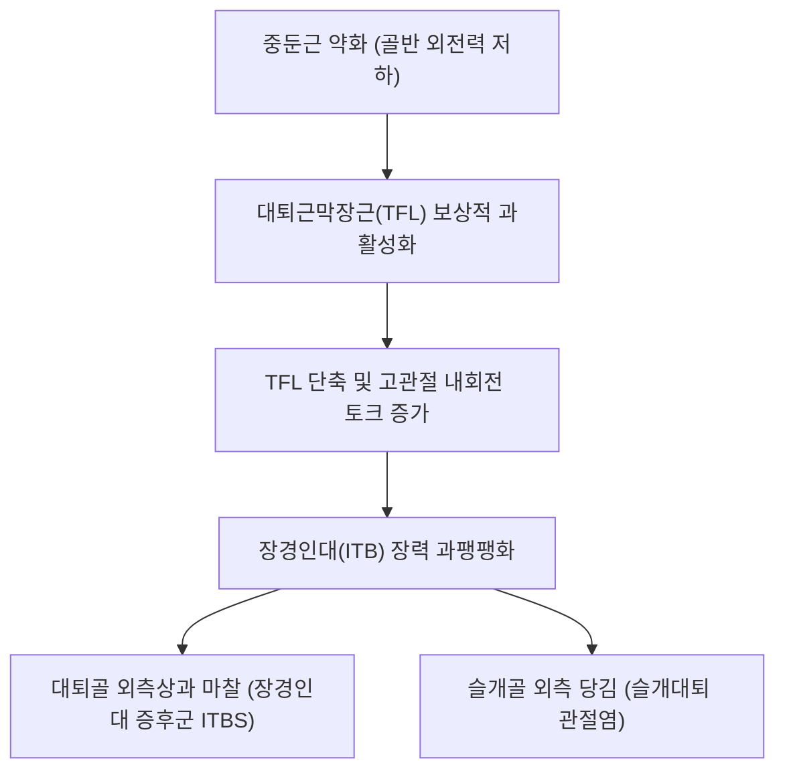

# [[대퇴근막장근]](Tensor Fasciae Latae, TFL)

> **핵심 요약 (Key Summary)**:
> [[장골]]의 [[전상장골극]](ASIS) 외측순에서 기시하여 [[장경인대]](ITB)를 통해 경골 외측 [[게르디 결절]]에 정지하는 대퇴 외측 표재근.
> 고관절 굴곡, 외전, 내회전 및 슬관절 외측 안정화를 주동하며 [[상둔신경]](Superior gluteal n., L4-S1)의 지배를 받음.
> 중둔근 약화 시 보상 과긴장, [[장경인대 증후군]](ITBS), 슬개골 외측 아탈구를 유발하며 오버 검사(Ober test) 및 거료혈 자침의 핵심 타깃임.

---
## 📌 목차
1. [해부학적 정밀 구조 및 지배 신경/혈관](#1-해부학적-정밀-구조-및-지배-신경혈관)
2. [생체역학·토크 분석 & 근막 사슬 (Biomechanical Synergy)](#2-생체역학토크-분석--근막-사슬-biomechanical-synergy)
3. [근막통증증후군(TP) & 연관통 패턴 (Travell & Simons)](#3-근막통증증후군tp--연관통-패턴-travell--simons)
4. [초음파 해부학(Sonoanatomy) 및 중재 시술 랜드마크](#4-초음파-해부학sonoanatomy-및-중재-시술-랜드마크)
5. [⭐ 원장님 심층 임상 고찰 및 원본 필기 (Clinical Pearls)](#5-원장님-심층-임상-고찰-및-원본-필기-clinical-pearls)
6. [관련 임상 질환 및 운동손상 증후군 총괄](#6-관련-임상-질환-및-운동손상-증후군-총괄)
7. [추나·도수치료(MET/PIR) & 침구·약침·재활 프로토콜](#7-추나도수치료metpir--침구약침재활-프로토콜)
8. [출처 및 학술 참고 문헌 (References)](#8-출처-및-학술-참고-문헌-references)

---
## 1. 해부학적 정밀 구조 및 지배 신경/혈관

| 항목 | 상세 내용 |
| :--- | :--- |
| **기시 (Origin)** | [[장골]](Ilium) [[전상장골극]](ASIS) 외측순 및 장골능 전외측 결절 |
| **정지 (Insertion)** | 대퇴 상·중 1/3 경계에서 [[장경인대]](ITB)에 합류 → [[경골]] 외측과의 [[게르디 결절]](Gerdy's tubercle)에 부착 |
| **신경 지배** | [[상둔신경]](Superior gluteal nerve, L4, L5, S1) |
| **혈관 공급** | 외측대퇴회선동맥(Lateral circumflex femoral a.) 상행지, 상둔동맥 |

### 🔬 해부학 도해 및 단면도
![[Tensor_fasciae_latae_anatomy.png|450]]
> [해부학 도해]: ASIS 외측에서 기시하여 짧은 근복을 지나 장경인대로 이어지는 대퇴근막장근의 주행.

![[Pasted image 20240116151916.png|450]]
> [구조적 특징]: 대둔근 전방에서 장경인대를 공유하며 골반-대퇴-무릎 외측을 단단하게 지탱하는 외측 근막 장력선.

---
## 2. 생체역학·토크 분석 & 근막 사슬 (Biomechanical Synergy)

* **3복합 고관절 모멘트**: 고관절 굴곡, 외전, 내회전을 동시에 수행하며 보행 유각기 초기 발을 전외측으로 가속.
* **장경인대(ITB) 장력 조절기 (Tensioner)**: 무릎이 0~30도 굴곡 상태일 때 슬관절 외측 안정성을 제공하며 대퇴골두를 비구 안으로 압박.
* **근막 사슬 연계 (Anatomy Trains)**: 외측선(Lateral Line)의 허브로 비골근군과 연계되어 발목 외측 염좌 후 보상성 과긴장 호발.

---
## 3. 근막통증증후군(TP) & 연관통 패턴 (Travell & Simons)

![[Tensor_fasciae_latae_TriggerPoints.jpg|450]]
> **[그림 설명]**: 대퇴근막장근(TFL) 발통점 및 대퇴 외측·장경인대(ITB) 연관통 영역 (Travell & Simons)

* **발통점 위치**: ASIS 바로 아래 외측 2~3cm 지점의 TFL 근복 중앙.
* **연관통 방사**:
  * 고관절 외측면(대전자 부위)에 집중되는 깊은 쑤심.
  * 대퇴 외측면을 따라 무릎 외측까지 하향 방사(좌골신경통 유사).
* **특징**: 환자가 바로 누워 잘 때 다리를 완전히 펴면 고관절 외측이 당겨 무릎을 구부려야 편안함.

---
## 4. 초음파 해부학(Sonoanatomy) 및 중재 시술 랜드마크

* **초음파 ASIS 외측 횡단 스캔**:
  * 표층의 피하지방 바로 아래 타원형 저에코 TFL 근복 관찰.
  * TFL 내측의 봉공근(Sartorius) 및 대퇴직근(Rectus femoris)과의 근막 경계 확인.
* **자침 안전 마진**: TFL 내측으로는 외측대퇴피신경(LFCN)이 주행하므로 ASIS 내하방을 피해 외측 근복 중앙으로 사자.

---
## 5. ⭐ 원장님 심층 임상 고찰 및 원본 필기 (Clinical Pearls)

* **장경인대 복합체와 슬관절 외측 마찰 (원장님 필기 100% 보존)**:
  * TFL은 얇고 길게 뻗어 장경인대와 결합하므로, TFL의 과긴장은 곧바로 장경인대를 팽팽하게 당겨 대퇴골 외측상과 마찰통([[장경인대 증후군]] / 러너스 니)을 호발시킴.
  * 대퇴근막장근-장경인대-슬관절 외측-골반은 하나의 통합 운동 사슬로 접근해야 하며, 장요근, 중둔근, 외측광근과의 균형 평가가 필수적임.
* **중둔근 부전 시 얌체 보상 패턴**:
  * 앙와위에서 다리를 벌리게 할 때(외전 검사), 다리가 외회전되지 않고 안쪽으로 돌아가며 벌어지면 중둔근이 꺼지고 TFL이 보상하는 전형적인 기능부전임.
  * 이 경우 TFL을 아무리 스트레칭해도 중둔근 후섬유를 활성화하지 않으면 다음 날 다시 굳어버림.
* **오버 검사(Ober's Test) 양성 시 임상적 의미**:
  * 측와위에서 무릎을 굴곡시키고 고관절을 신전·외전한 뒤 아래로 떨어뜨릴 때 하지가 수평선 아래로 떨어지지 않고 공중에 떠 있으면 TFL/ITB 단축 확진.

---
## 6. 관련 임상 질환 및 운동손상 증후군 총괄

| 임상 질환 / 증후군 | 병리적 연관 기전 | 주요 증상 및 이학적 검사 | 핵심 교정 타깃 |
| :--- | :--- | :--- | :--- |
| [[장경인대 증후군]](ITBS) | TFL 단축으로 무릎 외측상과 마찰 | 달리기 시 무릎 외측 찌릿한 통증, [[노블 압박 검사]] 양성 | TFL 근막 침도, 장경인대 롤링 |
| 슬개대퇴 통증 증후군 (PFPS) | ITB 과긴장으로 슬개골 외측 견인 | 무릎 앞쪽 뻐근함, 스쿼트 시 통증 | TFL 이완, 내측광근(VMO) 강화 |
| 대전자 점액낭염 | TFL/ITB가 대전자를 반복 압박 | 옆으로 누워 잘 때 대전자 통증 | 대전자 부위 약침, TFL 스트레칭 |
| 짝다리 자세 증후군 | 한쪽 TFL/ITB에 체중 쏠림 고착 | 서 있을 때 골반 편측 빠짐, 요통 | TFL PIR, 골반 수평 추나 |

---
## 7. 추나·도수치료(MET/PIR) & 침구·약침·재활 프로토콜

* **한의학 경혈 매핑 및 침구 프로토콜**:
  * 담경 거료(GB29), 환도(GB30), 풍시(GB31), 중독(GB32).
  * 0.30×40mm 호침으로 ASIS 외하방 TFL 근복에 45도 후하방 사자.
* **근에너지기법 (MET/PIR - Modified Ober Stretch)**:
  * 환자를 건측 측와위로 눕히고, 시술자가 환측 다리를 신전+내전시켜 장경인대를 긴장시킴.
  * 환자에게 가벼운 외전 저항(20% 힘)을 7초간 요구한 후, 호기와 함께 중력 방향으로 점진적 하향 가압.
* **재활 운동 (Foam Rolling & Glute Med Activation)**:
  * 폼롤러를 이용한 TFL 근복 허혈성 압박 후, 클램쉘 운동으로 중둔근 활성화.

---
## 8. 출처 및 학술 참고 문헌 (References)

1. **Fairclough, J., et al.** (2006). The functional anatomy of the iliotibial band during flexion and extension of the knee: implications for understanding iliotibial band syndrome. *Journal of Anatomy*, 208(3), 309-316.
   - `[연구 요약]`: TFL과 장경인대의 해부학적 연결 및 대퇴골 외측상과에서의 압박/마찰 메커니즘 규명.
2. **Travell, J. G., & Simons, D. G.** (1999). *Myofascial Pain and Dysfunction*. Williams & Wilkins.
   - `[연구 요약]`: 대퇴근막장근 발통점과 대전자 및 대퇴 외측 방사통 지도 분석.
3. **Fredericson, M., et al.** (2000). Hip abductor weakness in distance runners with iliotibial band syndrome. *Clinical Journal of Sport Medicine*, 10(3), 169-175.
   - `[연구 요약]`: 러너의 장경인대 증후군에서 중둔근 약화와 TFL 과보상의 상관관계 입증.
