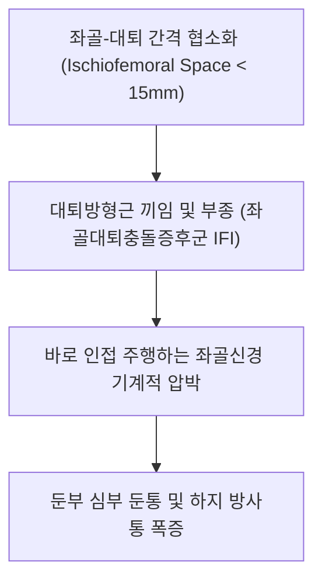

# [[대퇴방형근]](Quadratus Femoris)

> **핵심 요약 (Key Summary)**:
> [[좌골결절]] 상외측연에서 기시하여 [[대퇴골]] 전자간능 방형근 결절에 정지하는 둔부 최하단의 강력한 사각형 외회전근.
> 고관절 순수 외회전, 내전 보조 및 대퇴골두 후방 안착을 주동하며 [[대퇴방형근신경]](Nerve to quadratus femoris, L4-S1)의 지배를 받음.
> 좌골결절과 소전자 사이 협착으로 인한 [[좌골대퇴충돌증후군]](IFI), 좌골신경통, 딥스쿼트 고관절통을 유발하며 환도혈 하방 침도의 핵심 타깃임.

---
## 📌 목차
1. [해부학적 정밀 구조 및 지배 신경/혈관](#1-해부학적-정밀-구조-및-지배-신경혈관)
2. [생체역학·토크 분석 & 근막 사슬 (Biomechanical Synergy)](#2-생체역학토크-분석--근막-사슬-biomechanical-synergy)
3. [근막통증증후군(TP) & 연관통 패턴 (Travell & Simons)](#3-근막통증증후군tp--연관통-패턴-travell--simons)
4. [초음파 해부학(Sonoanatomy) 및 중재 시술 랜드마크](#4-초음파-해부학sonoanatomy-및-중재-시술-랜드마크)
5. [⭐ 원장님 심층 임상 고찰 및 원본 필기 (Clinical Pearls)](#5-원장님-심층-임상-고찰-및-원본-필기-clinical-pearls)
6. [관련 임상 질환 및 운동손상 증후군 총괄](#6-관련-임상-질환-및-운동손상-증후군-총괄)
7. [추나·도수치료(MET/PIR) & 침구·약침·재활 프로토콜](#7-추나도수치료metpir--침구약침재활-프로토콜)
8. [출처 및 학술 참고 문헌 (References)](#8-출처-및-학술-참고-문헌-references)

---
## 1. 해부학적 정밀 구조 및 지배 신경/혈관

| 항목 | 상세 내용 |
| :--- | :--- |
| **기시 (Origin)** | [[좌골결절]](Ischial tuberosity) 상외측연 |
| **정지 (Insertion)** | [[대퇴골]](Femur) 후면의 [[전자간능]](Intertrochanteric crest) 방형근 결절(Quadrate tubercle) |
| **신경 지배** | [[대퇴방형근신경]](Nerve to quadratus femoris, L4, L5, S1) (하쌍자근과 공통 지배) |
| **혈관 공급** | 내측대퇴회선동맥, 하둔동맥 |

### 🔬 해부학 도해 및 단면도
![[Quadratus_femoris_anatomy.png|450]]
> [해부학 도해]: 좌골결절과 대퇴골 전자간능 사이를 수평 사각형 모양으로 단단하게 연결하는 대퇴방형근.

![[Pasted image 20240117005824.png|450]]
> [구조적 특징]: 위로는 하쌍자근, 아래로는 대내전근과 접하며 바로 뒤로 좌골신경이 수직 하강하는 해부학적 위치.

---
## 2. 생체역학·토크 분석 & 근막 사슬 (Biomechanical Synergy)

* **순수한 고관절 외회전 지렛대**: 고관절의 굴곡/신전 각도에 관계없이 0도부터 90도까지 일관되게 가장 강력한 외회전 모멘트를 발생시키는 사각형 근육.
* **좌골대퇴 공간(Ischiofemoral Space)의 핵심 구조물**: 좌골결절과 대퇴골 소전자 사이의 좁은 통로를 채우고 있어 대퇴골 내전 시 충돌에 매우 취약.
* **근막 사슬 연계 (Anatomy Trains)**: 심부전방선(Deep Front Line)의 최하단 후방 앵커로 대내전근 상부와 기능적 연속성 유지.

---
## 3. 근막통증증후군(TP) & 연관통 패턴 (Travell & Simons)

![[Obturator_internus_TriggerPoints.jpg|450]]
> **[그림 설명]**: 대퇴방형근 및 심부 외회전근 복합체 발통점 및 좌골결절 부위 방사통 (Travell & Simons)

* **발통점 위치**: 좌골결절과 대전자 후연 사이의 근복 중앙.
* **연관통 및 충돌 증상**:
  * 엉덩이 맨 아래쪽 둔부 주름 부위에 집중되는 쑤심.
  * 보행 시 발을 뒤로 뻗을 때(고관절 신전+내전) 좌골결절과 소전자가 부딪히며 찌릿한 통증 발생.
  * 의자에 앉을 때 좌골 바로 바깥쪽이 배겨 엉덩이를 비틀고 앉음.

---
## 4. 초음파 해부학(Sonoanatomy) 및 중재 시술 랜드마크

* **초음파 스캔 (좌골대퇴 간격 횡단 스캔)**:
  * 좌골결절(내측 뼈 음영)과 대퇴골 소전자(외측 뼈 음영) 사이에서 사각형 저에코 대퇴방형근 확인.
  * 정상 좌골대퇴 간격(IFS)은 약 20mm 이상이나, IFI 환자는 15mm 이하로 좁아져 있고 근육 내 고에코 부종 관찰.
  * 대퇴방형근 표층을 주행하는 좌골신경 식별.
* **자침 안전 마진**: 좌골신경을 피해 근육 부착부(대퇴골 전자간능 또는 좌골결절 외측연)를 타깃으로 침도 자입.

---
## 5. ⭐ 원장님 심층 임상 고찰 및 원본 필기 (Clinical Pearls)

* **좌골대퇴 충돌과 좌골신경 압박 (원장님 필기 100% 보존)**:
  * 좌골결절과 소전자 사이 간격이 좁아지면 대퇴방형근이 협착·부종을 일으키며, 바로 인접 주행하는 [[좌골신경]]을 압박하여 둔부 심부 둔통 및 하지 방사통 호발.
  * [[내폐쇄근]], [[쌍자근]], [[대둔근]], [[장요근]]과의 협응 불균형 시 만성 긴장 초래.
* **좌골대퇴충돌증후군(IFI)의 임상적 진단 노하우**:
  * 환자를 앙와위로 눕히고 고관절을 신전+내전+외회전시킬 때 둔부 심부에서 찝히는 통증이 재현되면 IFI 양성.
  * 여성에서 골반이 넓고 대퇴골 전경각이 증가한 경우 호발하므로, 골반 정렬 추나와 대퇴방형근 침도 치료가 결정적임.
* **촉진법 (원장님 팁 보존)**:
  * 측와위 또는 복와위에서 좌골결절과 대전자 후연 사이의 수평 함몰부를 엄지손가락으로 깊게 압박하여 국소 압통 및 좌골신경 자극 증상 확인.

---
## 6. 관련 임상 질환 및 운동손상 증후군 총괄

| 임상 질환 / 증후군 | 병리적 연관 기전 | 주요 증상 및 이학적 검사 | 핵심 교정 타깃 |
| :--- | :--- | :--- | :--- |
| [[좌골대퇴충돌증후군]](IFI) | 좌골-소전자 간격 협소화로 대퇴방형근 부종 | 보행 신전 시 둔통, 좌골신경통, 보폭 축소 | 대퇴방형근 침도 박리, 골반 교정 |
| [[심부 둔부 증후군]] | 대퇴방형근 비후로 인한 좌골신경 압박 | 좌식 시 엉덩이 배김, 대퇴 후면 방사통 | 대퇴방형근 심부 약침 수력박리 |
| 딥스쿼트 고관절통 | 깊은 스쿼트 시 좌골대퇴 충돌 | 쪼그려 앉을 때 둔부 후하방 찌릿함 | 고관절 가동성 추나, 스쿼트 스탠스 조절 |

---
## 7. 추나·도수치료(MET/PIR) & 침구·약침·재활 프로토콜

* **한의학 경혈 매핑 및 침구 프로토콜**:
  * 환도(GB30) 하방 2촌, 승부(BL36) 상외측.
  * 0.35×75mm 장침으로 전자간능 뼈면을 향해 5~6cm 심부 직자.
  * 중성어혈약침 또는 신바로약침 1.0cc를 대퇴방형근 근복 및 좌골신경 계면에 주입.
* **근에너지기법 (MET/PIR)**:
  * 고관절 굴곡+내회전 신장 상태에서 외회전 등척성 저항(7초) 후 이완.
* **좌골대퇴 공간 확보 도수치료**:
  * 대퇴골두를 견인하며 외전 방향으로 관절 가동성을 부여하여 좁아진 좌골대퇴 간격 확장.

---
## 8. 출처 및 학술 참고 문헌 (References)

1. **Torriani, M. (2025)**. Ischiofemoral impingement syndrome in 2024: updated concepts and imaging methods. *Magn Reson Imaging Clin N Am*, 33(1), 63-73. [PMID: 39515961](https://pubmed.ncbi.nlm.nih.gov/39515961/)
   - `[연구 요약]`:  대퇴방형근과 소전자-좌골 사이 공간 협소로 발생하는 좌골대퇴 충돌증후군(IFI)의 최신 개념·영상 진단 정리.
3. **Yoon, Y. H., Hwang, J. H., Lee, H. W., et al. (2025)**. Beyond nerve entrapment: a narrative review of muscle-tendon pathologies in deep gluteal syndrome. *Diagnostics (Basel)*, 15(17), 2531. [PMID: 41095750](https://pubmed.ncbi.nlm.nih.gov/41095750/)
   - `[연구 요약]`:  심부 둔부 공간(deep gluteal space)의 근·건 병변과 좌골신경 포착(이상근·내폐쇄근·쌍자근 등 심부외회전근 포함)을 종합한 내러티브 리뷰.