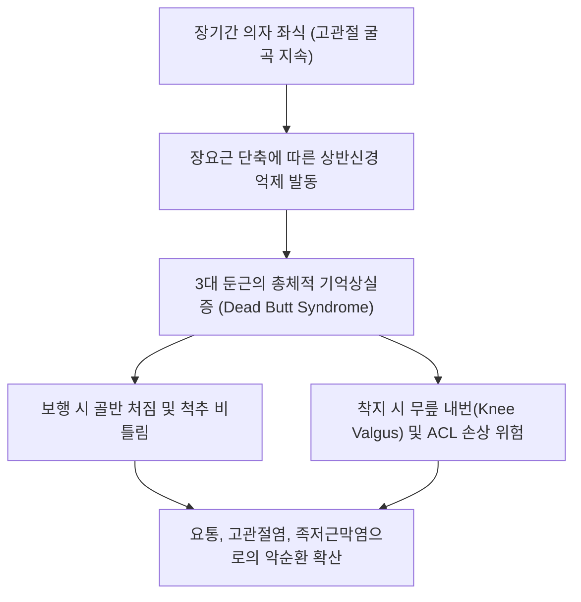

# [[둔근]](Gluteal Muscles)

> **핵심 요약 (Key Summary)**:
> [[대둔근]](표층), [[중둔근]](중간층), [[소둔근]](심층)의 3대 층판으로 구성되어 골반과 대퇴골을 연결하는 인체 최대의 파워 및 안정화 복합체.
> 고관절 신전·외전·회전 제어, 보행 시 골반 수평 유지, 척추 항중력 기립을 주동하며 [[하둔신경]](L5-S2) 및 [[상둔신경]](L4-S1)의 지배를 받음.
> 둔근 기억상실증(Dead Butt Syndrome), 트렌델렌버그 보행, 가성 좌골신경통을 초래하며 둔부 3대 경혈 배혈 및 둔근 사슬 재활의 총괄 타깃임.

---
## 📌 목차
1. [해부학적 정밀 구조 및 지배 신경/혈관](#1-해부학적-정밀-구조-및-지배-신경혈관)
2. [생체역학·토크 분석 & 근막 사슬 (Biomechanical Synergy)](#2-생체역학토크-분석--근막-사슬-biomechanical-synergy)
3. [근막통증증후군(TP) & 연관통 패턴 (Travell & Simons)](#3-근막통증증후군tp--연관통-패턴-travell--simons)
4. [초음파 해부학(Sonoanatomy) 및 중재 시술 랜드마크](#4-초음파-해부학sonoanatomy-및-중재-시술-랜드마크)
5. [⭐ 원장님 심층 임상 고찰 및 원본 필기 (Clinical Pearls)](#5-원장님-심층-임상-고찰-및-원본-필기-clinical-pearls)
6. [관련 임상 질환 및 운동손상 증후군 총괄](#6-관련-임상-질환-및-운동손상-증후군-총괄)
7. [추나·도수치료(MET/PIR) & 침구·약침·재활 프로토콜](#7-추나도수치료metpir--침구약침재활-프로토콜)
8. [출처 및 학술 참고 문헌 (References)](#8-출처-및-학술-참고-문헌-references)

---
## 1. 해부학적 정밀 구조 및 지배 신경/혈관

| 층위 (Layer) | 근육명 | 기시 및 정지 | 지배 신경 | 핵심 역할 |
| :--- | :--- | :--- | :--- | :--- |
| **제1층 (표층)** | [[대둔근]] (Gluteus maximus) | 장골익/천골/천결절인대 → 장경인대, 대퇴골 둔근조면 | [[하둔신경]](L5-S2) | 고관절 강력한 신전 및 외회전, 체간 기립 |
| **제2층 (중간층)** | [[중둔근]] (Gluteus medius) | 장골 외측면 전·후둔선 사이 → 대퇴골 대전자 상외측 | [[상둔신경]](L4-S1) | 고관절 외전, 단각 지지기 반대측 골반 수평 유지 |
| **제3층 (심층)** | [[소둔근]] (Gluteus minimus) | 장골 외측면 전·하둔선 사이 → 대퇴골 대전자 전연 | [[상둔신경]](L4-S1) | 고관절 외전/내회전, 대퇴골두 관절와 안착 |

### 🔬 해부학 도해 및 단면도
![[Gluteus_maximus_anatomy.png|450]]
> [표층 대둔근]: 골반 후면 전체를 덮으며 상하지 장력 축을 잇는 거대한 표층 신전근.

![[Gluteus_medius_anatomy.png|450]]
> [중간층 중둔근]: 장골익에서 대전자로 모여드는 골반 측면 관상면 안정화 기둥.

---
## 2. 생체역학·토크 분석 & 근막 사슬 (Biomechanical Synergy)

* **3층 구조의 역학적 분업 (Layered Synergy)**:
  * 소둔근(심층): 관절와 안착 및 미세 관절 중심화.
  * 중둔근(중간층): 단각 지지기 골반 관상면 수평 유지.
  * 대둔근(표층): 직립 추진 및 척추 신전의 거대 토크 발생.
* **근막 사슬 연계 (Anatomy Trains)**:
  * 대둔근: 후방 사선 사슬(POS) 및 표재후방선(SBL).
  * 중·소둔근: 외측선(Lateral Line).

---
## 3. 근막통증증후군(TP) & 연관통 패턴 (Travell & Simons)

![[Gluteus_medius_TriggerPoints.jpg|450]]
> **[그림 설명]**: 둔근군(대둔근·중둔근·소둔근) 대표 발통점 및 골반·하지 연관통 패턴 (Travell & Simons)

* **대둔근 TrP**: 천장관절, 둔부 하부, 꼬리뼈 주변 통증(앉을 때 엉덩이 배김).
* **중둔근 TrP**: 장골능 후부, 천장관절, 둔부 외측 통증(측와위 수면 시 통증).
* **소둔근 TrP**: 하지 외측 및 후외측, 발목/발등까지 방사(가성 디스크 통증).

---
## 4. 초음파 해부학(Sonoanatomy) 및 중재 시술 랜드마크

* **둔부 3층 초음파 랜드마크**:
  * 장골익 외측 스캔에서 표층부터 대둔근 → 중둔근 → 소둔근 → 장골 뼈 음영의 3층 구조 확인.
  * 중둔근과 소둔근 사이를 주행하는 상둔동맥 및 상둔신경 식별.
* **시술 안전성**: 환도혈 부위에서 좌골신경 주행 경로(대퇴방형근 표층, 이상근 하공)를 확인하여 신경 손상 방지.

---
## 5. ⭐ 원장님 심층 임상 고찰 및 원본 필기 (Clinical Pearls)

* **둔근 기억상실증(Gluteal Amnesia / Dead Butt Syndrome)의 본질 (원장님 필기 100% 보존)**:
  * 오랜 시간 앉아 있는 현대인의 뇌는 둔근을 쓰는 법을 잊어버림.
  * 걸을 때나 계단을 오를 때 엉덩이 근육 대신 허리 기립근과 허벅지 앞뒤 근육만 혹사당함.
  * 그 결과 만성 요통, 무릎 관절염, 족저근막염 환자의 90% 이상에서 둔근 약화가 관찰됨.
  * 둔근을 깨우지 않고 허리나 무릎만 치료하는 것은 밑 빠진 독에 물 붓기임.
* **3대 둔근 촉진 및 자침 가이드**:
  * 대둔근: 환도(GB30), 질변(BL54) 심부 자침.
  * 중둔근: 거료(GB29) 상외측 장골능 라인 사자.
  * 소둔근: 거료(GB29) 심부 뼈 바닥까지 직자하여 섬유화 박리.
* **보행 평가(Gait Analysis)를 통한 둔근 진단**:
  * 환자가 걸어 들어올 때 엉덩이가 좌우로 흔들리는지(중둔근 약화), 상체가 뒤로 젖혀지며 걷는지(대둔근 약화), 발끝이 팔자로 벌어지는지(이상근 과긴장)를 즉각 파악해야 함.

---
## 6. 관련 임상 질환 및 운동손상 증후군 총괄

| 임상 질환 / 증후군 | 병리적 연관 기전 | 주요 증상 및 이학적 검사 | 핵심 교정 타깃 |
| :--- | :--- | :--- | :--- |
| [[둔근 기억상실증]] | 지속적 좌식으로 인한 둔근 억제 | 계단 승강 시 무릎/요통, 둔부 무력 | 둔근 고립 활성화(Clam, Bridge) |
| [[트렌델렌버그 보행]] | 중둔근 부전으로 골반 처짐 | 뒤뚱거리는 보행, 한 발 서기 불능 | 중둔근 강화 및 골반 수평 추나 |
| [[가성 좌골신경통]] | 소둔근/이상근 발통점 연관통 | 다리 저림, 하지 외측 방사통 | 소둔근 침도 및 이상근 이완 |
| 무릎 외측 충돌 및 슬개대퇴통증 | 둔근 약화로 대퇴골 내회전/내번 | 스쿼트 시 무릎 모임(Knee valgus) | 둔근 외회전근 강화 재활 |

---
## 7. 추나·도수치료(MET/PIR) & 침구·약침·재활 프로토콜

* **한의학 경혈 매핑 및 침구 프로토콜**:
  * 환도(GB30), 거료(GB29), 질변(BL54), 포황(BL53), 풍시(GB31).
  * 둔부 주요 경혈에 0.35×75mm 장침으로 심부 자입 후 전침(2Hz, 20분).
* **골반 추나 교정**:
  * 장골의 전·후방 회전 변위를 교정하여 둔근 기시부의 생체역학적 장력 복원.
* **둔근 활성화 3단계 재활**:
  * 1단계(인지): 엎드려 엉덩이 조이기(Glute squeeze).
  * 2단계(고립): 클램쉘(Clamshell), 사이드 라잉 레그 레이즈.
  * 3단계(통합): 힙 힌지(Hip hinge), 스쿼트, 런지.

---
## 8. 출처 및 학술 참고 문헌 (References)

1. **McGill, S. M.** (2007). *Low Back Disorders: Evidence-Based Prevention and Rehabilitation*. Human Kinetics.
   - `[연구 요약]`: 둔근 기억상실증(Gluteal Amnesia)과 요추 불안정성 및 허리 부하 상관관계 규명.
2. **Neumann, D. A.** (2016). *Kinesiology of the Musculoskeletal System*. Elsevier.
   - `[연구 요약]`: 둔부 근육군의 3차원 모멘트 암과 보행 및 하지 정렬 역학 총괄.
3. **Travell, J. G., & Simons, D. G.** (1999). *Myofascial Pain and Dysfunction*. Williams & Wilkins.
   - `[연구 요약]`: 둔근 복합체의 발통점 지도와 가성 좌골신경통 감별 임상 지침.
