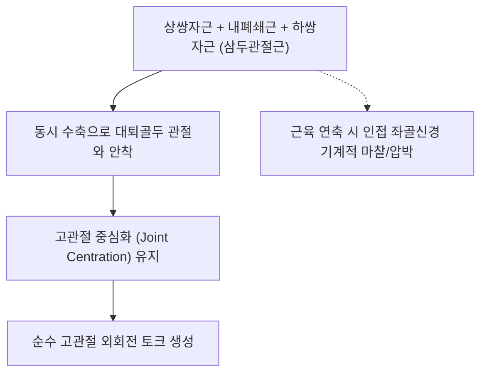

# [[상쌍자근]](Superior Gemellus)

> **핵심 요약 (Key Summary)**:
> [[좌골극]](Ischial spine) 외측면에서 기시하여 [[내폐쇄근]] 힘줄과 합류하여 [[대퇴골]] 대전자 전자와에 정지하는 심부 외회전근.
> 내폐쇄근과 함께 삼두관절근(Triceps coxae) 상부를 구성하여 고관절 외회전 및 대퇴골두 관절와 안착을 주동하며 [[내폐쇄근신경]](L5-S2)의 지배를 받음.
> 심부 둔부 증후군(Deep Gluteal Syndrome), 좌골신경 포착, 고관절 회전 제한을 초래하며 환도혈 심부 자침 및 고관절 내회전 PIR의 핵심 타깃임.

---
## 📌 목차
1. [해부학적 정밀 구조 및 지배 신경/혈관](#1-해부학적-정밀-구조-및-지배-신경혈관)
2. [생체역학·토크 분석 & 근막 사슬 (Biomechanical Synergy)](#2-생체역학토크-분석--근막-사슬-biomechanical-synergy)
3. [근막통증증후군(TP) & 연관통 패턴 (Travell & Simons)](#3-근막통증증후군tp--연관통-패턴-travell--simons)
4. [초음파 해부학(Sonoanatomy) 및 중재 시술 랜드마크](#4-초음파-해부학sonoanatomy-및-중재-시술-랜드마크)
5. [⭐ 원장님 심층 임상 고찰 및 원본 필기 (Clinical Pearls)](#5-원장님-심층-임상-고찰-및-원본-필기-clinical-pearls)
6. [관련 임상 질환 및 운동손상 증후군 총괄](#6-관련-임상-질환-및-운동손상-증후군-총괄)
7. [추나·도수치료(MET/PIR) & 침구·약침·재활 프로토콜](#7-추나도수치료metpir--침구약침재활-프로토콜)
8. [출처 및 학술 참고 문헌 (References)](#8-출처-및-학술-참고-문헌-references)

---
## 1. 해부학적 정밀 구조 및 지배 신경/혈관

| 항목 | 상세 내용 |
| :--- | :--- |
| **기시 (Origin)** | [[좌골]](Ischium)의 좌골극(Ischial spine) 후외측면 |
| **정지 (Insertion)** | [[내폐쇄근]](Obturator internus) 힘줄의 상연과 융합 → [[대퇴골]](Femur) 대전자 전자와(Trochanteric fossa) |
| **신경 지배** | [[내폐쇄근신경]](Nerve to obturator internus, L5, S1, S2) (내폐쇄근과 공통 지배) |
| **혈관 공급** | 하둔동맥(Inferior gluteal a.), 내음부동맥 |

### 🔬 해부학 도해 및 단면도
![[Gemelli_anatomy.png|450]]
> [해부학 도해]: 좌골극에서 기시하여 내폐쇄근 힘줄의 상연을 타고 대퇴골 대전자로 모여드는 상쌍자근.

![[Pasted image 20240117005715.png|450]]
> [구조적 특징]: 삼두관절근(Triceps coxae) 복합체의 상부 덮개로서 좌골신경 주행로 바로 깊은 곳에 위치.

---
## 2. 생체역학·토크 분석 & 근막 사슬 (Biomechanical Synergy)

* **삼두관절근(Triceps Coxae) 상부 윙**: 내폐쇄근 힘줄을 상방에서 감싸 대퇴골두의 후상방 탈구를 방어하는 동적 인대 역할.
* **고관절 회전 안정화**: 하지 지지기 동안 대퇴골의 비틀림을 미세 조절하여 슬관절 및 족관절 정렬 유지.
* **근막 사슬 연계 (Anatomy Trains)**: 심부전방선(Deep Front Line)의 후방 고관절 지지대로 골반저근과 장력 연속성 형성.

---
## 3. 근막통증증후군(TP) & 연관통 패턴 (Travell & Simons)

![[Obturator_internus_TriggerPoints.jpg|450]]
> **[그림 설명]**: 쌍자근 및 고관절 심부 외회전근 복합체 발통점 및 천골 외측 연관통 영역 (Travell & Simons)

* **발통점 위치**: 좌골극과 대전자 사이의 심부 둔근 주름 부위.
* **연관통 방사**: 둔부 심부 묵직한 통증 및 대퇴 후면, 슬와부로 찌릿하게 뻗어 나가는 방사통(이상근 증후군과 유사).

---
## 4. 초음파 해부학(Sonoanatomy) 및 중재 시술 랜드마크

* **초음파 스캔**: 좌골극과 대전자 사이 횡단 스캔에서 대둔근 아래, 좌골신경 심부에 위치한 내폐쇄근-상쌍자근 복합체 식별.
* **자침 안전 마진**: 좌골신경을 직접 찌르지 않도록 신경 주행 외측 또는 심부로 안전하게 침 첨 유도.

---
## 5. ⭐ 원장님 심층 임상 고찰 및 원본 필기 (Clinical Pearls)

* **삼두관절근 복합체와 좌골신경 포착 (원장님 필기 100% 보존)**:
  * 상쌍자근-내폐쇄근-하쌍자근은 개별 근육이 아니라 하나의 건으로 묶인 삼두관절근(Triceps coxae)으로 이해해야 함.
  * 이 복합체의 과긴장은 바로 표층을 지나는 [[좌골신경]]을 직접 압박하여 디스크 탈출증 없는 하지 방사통([[심부 둔부 증후군]])을 초래함.
* **이상근과의 감별 포인트**:
  * 이상근은 고관절 60도 굴곡 시 외전/내회전근으로 바뀌지만, 상쌍자근을 포함한 삼두관절근은 굴곡 상태에서도 외회전 작용을 유지함.
  * 고관절 90도 굴곡 상태에서 완전 내회전 시 엉덩이 깊은 곳에서 날카로운 통증이 발생하면 삼두관절근 단축 확진.

---
## 6. 관련 임상 질환 및 운동손상 증후군 총괄

| 임상 질환 / 증후군 | 병리적 연관 기전 | 주요 증상 및 이학적 검사 | 핵심 교정 타깃 |
| :--- | :--- | :--- | :--- |
| [[심부 둔부 증후군]](DGS) | 상쌍자근/내폐쇄근 건 비후로 좌골신경 압박 | 앉아 있을 때 둔부 통증, 하지 저림 | 삼두관절근 침도 박리, 신경 수력박리 |
| 가성 좌골신경통 | 상쌍자근 TrP 활성화 | 대퇴 후면 방사통, 보행 시 둔부 결림 | 환도혈 심부 자침, 온열 요법 |
| 고관절 후방 충돌 | 대퇴골두 후방 중심화 부전 | 고관절 과신전 시 후방 찝힘 통증 | 상쌍자근 이완, 대둔근 강화 |

---
## 7. 추나·도수치료(MET/PIR) & 침구·약침·재활 프로토콜

* **한의학 경혈 매핑 및 침구 프로토콜**:
  * 담경 환도(GB30), 방광경 질변(BL54).
  * 0.35×75mm 장침으로 좌골극 외측연을 향해 5~6cm 심부 자입.
* **근에너지기법 (MET/PIR)**:
  * 앙와위 고관절 90도 굴곡 상태에서 완전 내회전 유도 후 외회전 등척성 수축(7초) → 호기와 함께 내회전 신장.

---
## 8. 출처 및 학술 참고 문헌 (References)

1. **Standring, S.** (2020). *Gray's Anatomy* (42nd ed.). Elsevier.
   - `[연구 요약]`: 상쌍자근의 좌골극 기시 및 내폐쇄근 공통건 부착부 해부학 규명.
2. **Martin, H. D., et al.** (2015). Deep gluteal syndrome. *Journal of Hip Preservation Surgery*, 2(2), 99-107.
   - `[연구 요약]`: 삼두관절근과 좌골신경의 해부학적 관계 및 심부 둔부 증후군의 임상 지침.
