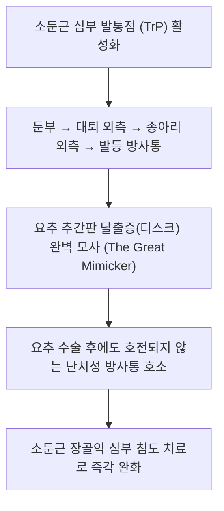

# [[소둔근]](Gluteus Minimus)

> **핵심 요약 (Key Summary)**:
> [[장골]] 외측면 전둔선과 하둔선 사이에서 기시하여 [[대퇴골]] 대전자 전연 및 고관절낭 전상부에 정지하는 최심층 외전근.
> 고관절 외전, 강력한 내회전 및 대퇴골두 관절와 안착을 주동하며 [[상둔신경]](Superior gluteal n., L4-S1)의 지배를 받음.
> 좌골신경통을 완벽히 모사하는 가성 디스크(The Great Mimicker), 대전자 점액낭염을 유발하며 거료혈 심부 침도와 고관절 외전 PIR의 핵심 타깃임.

---
## 📌 목차
1. [해부학적 정밀 구조 및 지배 신경/혈관](#1-해부학적-정밀-구조-및-지배-신경혈관)
2. [생체역학·토크 분석 & 근막 사슬 (Biomechanical Synergy)](#2-생체역학토크-분석--근막-사슬-biomechanical-synergy)
3. [근막통증증후군(TP) & 연관통 패턴 (Travell & Simons)](#3-근막통증증후군tp--연관통-패턴-travell--simons)
4. [초음파 해부학(Sonoanatomy) 및 중재 시술 랜드마크](#4-초음파-해부학sonoanatomy-및-중재-시술-랜드마크)
5. [⭐ 원장님 심층 임상 고찰 및 원본 필기 (Clinical Pearls)](#5-원장님-심층-임상-고찰-및-원본-필기-clinical-pearls)
6. [관련 임상 질환 및 운동손상 증후군 총괄](#6-관련-임상-질환-및-운동손상-증후군-총괄)
7. [추나·도수치료(MET/PIR) & 침구·약침·재활 프로토콜](#7-추나도수치료metpir--침구약침재활-프로토콜)
8. [출처 및 학술 참고 문헌 (References)](#8-출처-및-학술-참고-문헌-references)

---
## 1. 해부학적 정밀 구조 및 지배 신경/혈관

| 항목 | 상세 내용 |
| :--- | :--- |
| **기시 (Origin)** | [[장골]](Ilium) 외측면 (전둔선과 하둔선 사이의 장골익 심부면) |
| **정지 (Insertion)** | [[대퇴골]](Femur) 대전자(Greater trochanter)의 전연(Anterior border) 및 고관절낭 전상부 |
| **신경 지배** | [[상둔신경]](Superior gluteal nerve, L4, L5, S1) |
| **혈관 공급** | 상둔동맥(Superior gluteal a.) 심분지 |

### 🔬 해부학 도해 및 단면도
![[Pasted image 20240116151916.png|450]]
> [해부학적 층위]: 중둔근 바로 아래 심층에 위치하여 고관절낭 전상부에 밀착 부착되는 소둔근.

![[Pasted image 20240119015712.png|450]]
> [소둔근 방사통 도해]: 둔부 외측에서부터 대퇴 외측, 하퇴 외측, 발목/발등까지 뻗어 나가는 가성 좌골신경통 방사 라인.

---
## 2. 생체역학·토크 분석 & 근막 사슬 (Biomechanical Synergy)

* **대퇴골두 관절와 안착 (Joint Centration)**: 대퇴골두를 비구(Acetabulum) 전상방 안으로 강력하게 밀착시켜 고관절 아탈구 및 충돌 방어.
* **강력한 고관절 내회전 모멘트**: 전방 섬유가 수축하여 대퇴골을 안쪽으로 회전시키며, 보행 유각기에서 골반이 회전할 때 대퇴를 제어.
* **관절낭 찝힘 방어**: 고관절낭에 직접 섬유가 부착되어 고관절 굴곡/외전 시 관절낭이 비구연 사이에 끼이는 충돌을 방어.

---
## 3. 근막통증증후군(TP) & 연관통 패턴 (Travell & Simons)

![[Gluteus_minimus_TriggerPoints.jpg|450]]
> **[그림 설명]**: 소둔근(Gluteus Minimus) 전방부/후방부 발통점 및 가성 좌골신경통 방사통 경로 (Travell & Simons)

* **전방 발통점 (Anterior TrP)**:
  * 둔부 하부 및 대퇴 전외측, 무릎 외측, 하퇴 전외측, 발목 전면 및 발등까지 방사.
  * 요추 5번(L5) 신경근 병증(Radiculopathy)과 100% 동일한 방사통 지도 형성.
* **후방 발통점 (Posterior TrP)**:
  * 둔부 대부분, 대퇴 후면, 비복근(종아리) 및 아킬레스건 부위로 방사.
  * 천추 1번(S1) 신경근 병증과 완벽히 일치.
* **별칭**: **"The Great Mimicker (위대한 모방자)"** - 요추 디스크로 오진되는 대표적인 근육.

---
## 4. 초음파 해부학(Sonoanatomy) 및 중재 시술 랜드마크

* **초음파 관상면 스캔**:
  * 대퇴골 대전자 상단과 장골익 사이에서 장골 뼈 음영 바로 위에 밀착된 가장 깊은 저에코 근복 확인.
  * 표층의 중둔근과 소둔근 사이를 지나가는 상둔신경/동맥의 고에코 신경혈관속 확인.
* **자침 안전 마진**: 침 끝이 장골 뼈면에 부드럽게 닿을 때까지 깊게 진입시켜 소둔근 복식 전체를 관통하여 치료.

---
## 5. ⭐ 원장님 심층 임상 고찰 및 원본 필기 (Clinical Pearls)

* **좌골신경통 모방 (The Great Mimicker) (원장님 필기 100% 보존)**:
  * 소둔근의 발통점은 요추 디스크 탈출증과 거의 동일하게 **둔부 → 대퇴 후외측 → 하퇴 외측 → 발목/발등까지 찌릿한 방사통**을 유발하여 '가성 디스크'의 주원인이 됨.
  * 요추 MRI 상 디스크 병변이 심하지 않거나 신경 압박이 경미한데 환자가 "다리가 저려 걸을 수가 없다"고 극심한 방사통을 호소하면 100% 소둔근을 최우선 치료해야 함.
* **SLR(하지직거상 검사)과의 감별 포인트**:
  * 소둔근 단독 병변 환자는 누워서 다리를 들어 올릴 때(SLR) 요추 신경근 압박성 통증이 아니라 고관절 외측과 둔부의 뻐근한 당김만 호소함.
  * 환자를 측와위로 눕히고 고관절 내전+내회전 시 극심한 방사통이 재현되면 소둔근 확진.
* **거료혈(GB29) 심부 침도 박리술**:
  * ASIS와 대전자 정점을 잇는 선의 중점인 거료혈에서 장골 뼈 바닥을 향해 0.40×75mm 침도로 소둔근의 심부 섬유화 밴드를 2~3회 박리하면 수년간 지속된 다리 저림이 즉각 소실됨.

---
## 6. 관련 임상 질환 및 운동손상 증후군 총괄

| 임상 질환 / 증후군 | 병리적 연관 기전 | 주요 증상 및 이학적 검사 | 핵심 교정 타깃 |
| :--- | :--- | :--- | :--- |
| [[가성 좌골신경통]](Pseudo-Sciatica) | 소둔근 발통점 연관통 방사 | 하지 외측 찌릿한 저림, MRI상 디스크 불일치 | 거료혈 심부 침도, 소둔근 약침 |
| 고관절 관절낭염 | 소둔근 건 부착부 염증 | 고관절 내회전 제한, 깊은 서혜부 둔통 | 고관절낭 전상부 소염 약침 |
| 대전자 점액낭염 | 소둔근 건과 대전자 마찰 | 대전자 전연 압통, 보행 시 통증 | 대전자 부착부 침치료 |
| 러너스 힙 (Runner's Hip) | 달리기 시 착지 충격 반복 | 달릴 때 골반 깊은 곳의 찌르는 통증 | 소둔근 PIR, 착지 충격 분산 훈련 |

---
## 7. 추나·도수치료(MET/PIR) & 침구·약침·재활 프로토콜

* **한의학 경혈 매핑 및 침구 프로토콜**:
  * 담경 거료(GB29), 환도(GB30), 풍시(GB31), 양릉천(GB34).
  * 0.35×75mm 장침을 사용하여 장골익 뼈 바닥에 닿도록 수직 직자.
  * 중성어혈약침 또는 자하거약침 1.0cc를 소둔근 심부 관절낭 부착부에 주입.
* **근에너지기법 (MET/PIR)**:
  * 환자를 건측이 바닥으로 가도록 측와위로 눕히고, 환측 고관절을 신전+내전+외회전 위치로 하수.
  * 환자에게 가벼운 외전 저항 7초 후, 호기와 함께 내전 스트레칭.
* **장골익 직접 압박 이완 (Deep Soft Tissue Release)**:
  * 장골능 하방 3~4cm 지점의 소둔근 압통점을 팔꿈치나 엄지로 서서히 압박하며 허혈성 압박(Ischemic compression) 적용.

---
## 8. 출처 및 학술 참고 문헌 (References)

1. **Travell, J. G., & Simons, D. G.** (1999). *Myofascial Pain and Dysfunction: The Trigger Point Manual* (Vol. 2). Williams & Wilkins.
   - `[연구 요약]`: 소둔근 발통점과 L5/S1 신경근병증(좌골신경통)의 감별 진단 및 위대한 모방자(The Great Mimicker) 규명.
2. **Beck, M., Sledge, J. B., Gautier, E., Dora, C. F., & Ganz, R. (2000)**. The anatomy and function of the gluteus minimus muscle. *J Bone Joint Surg Br*, 82(3), 358-363. [PMID: 10813169](https://pubmed.ncbi.nlm.nih.gov/10813169/)
   - `[연구 요약]`: 소둔근의 전상방 관절낭 부착부와 대퇴골두 관절와 안착 기능의 정밀 해부학.