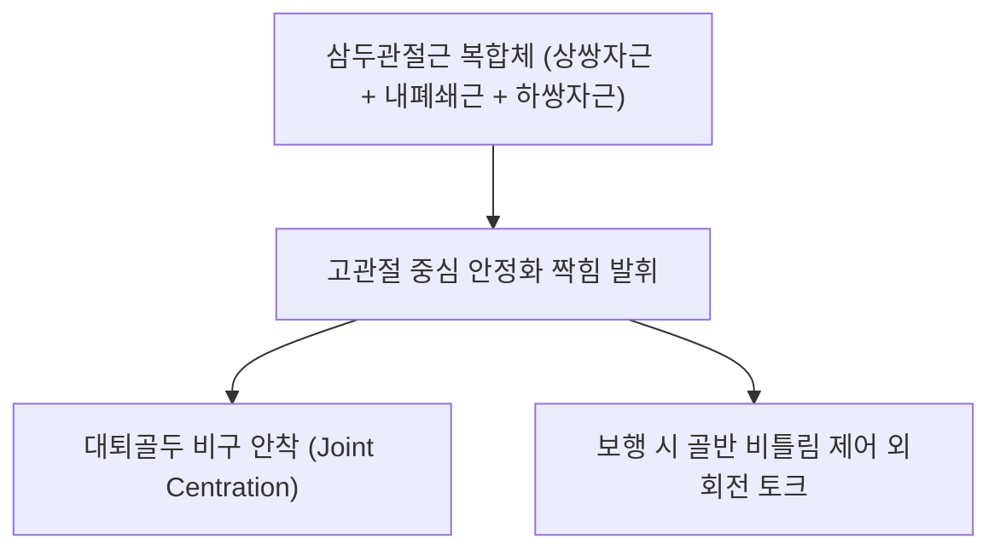

# [[쌍자근]](Gemelli Muscles)

> **핵심 요약 (Key Summary)**:
> [[상쌍자근]]과 [[하쌍자근]]으로 구성되어 [[내폐쇄근]] 힘줄의 상하면을 샌드위치처럼 감싸 대퇴골 대전자에 정지하는 쌍둥이 근육 복합체.
> 고관절 외회전 및 대퇴골두 관절와 안착을 주동하며 [[내폐쇄근신경]] 및 [[대퇴방형근신경]]의 분절 지배를 받음.
> 심부 둔부 증후군(DGS), 좌골신경 기계적 포착, 고관절 회전 장애를 유발하며 환도혈 심부 자침 및 삼두관절근 이완의 핵심 타깃임.

---
## 📌 목차
1. [해부학적 정밀 구조 및 지배 신경/혈관](#1-해부학적-정밀-구조-및-지배-신경혈관)
2. [생체역학·토크 분석 & 근막 사슬 (Biomechanical Synergy)](#2-생체역학토크-분석--근막-사슬-biomechanical-synergy)
3. [근막통증증후군(TP) & 연관통 패턴 (Travell & Simons)](#3-근막통증증후군tp--연관통-패턴-travell--simons)
4. [초음파 해부학(Sonoanatomy) 및 중재 시술 랜드마크](#4-초음파-해부학sonoanatomy-및-중재-시술-랜드마크)
5. [⭐ 원장님 심층 임상 고찰 및 원본 필기 (Clinical Pearls)](#5-원장님-심층-임상-고찰-및-원본-필기-clinical-pearls)
6. [관련 임상 질환 및 운동손상 증후군 총괄](#6-관련-임상-질환-및-운동손상-증후군-총괄)
7. [추나·도수치료(MET/PIR) & 침구·약침·재활 프로토콜](#7-추나도수치료metpir--침구약침재활-프로토콜)
8. [출처 및 학술 참고 문헌 (References)](#8-출처-및-학술-참고-문헌-references)

---
## 1. 해부학적 정밀 구조 및 지배 신경/혈관

| 구성근 | 기시 (Origin) | 정지 (Insertion) | 지배 신경 |
| :--- | :--- | :--- | :--- |
| [[상쌍자근]] (Superior gemellus) | 좌골극(Ischial spine) 외측면 | 내폐쇄근 힘줄 상연 → 대퇴골 대전자 전자와 | [[내폐쇄근신경]](L5-S2) |
| [[하쌍자근]] (Inferior gemellus) | 좌골결절(Ischial tuberosity) 상외측연 | 내폐쇄근 힘줄 하연 → 대퇴골 대전자 전자와 | [[대퇴방형근신경]](L4-S1) |

### 🔬 해부학 도해 및 단면도
![[Gemelli_anatomy.png|450]]
> [해부학 도해]: 내폐쇄근 힘줄을 위아래에서 감싸며 대퇴골 대전자로 모여드는 상·하쌍자근.

![[Pasted image 20240116151916.png|450]]
> [구조적 특징]: 내폐쇄근과 함께 삼두관절근(Triceps coxae)을 형성하여 고관절 심부 후방을 지탱.

---
## 2. 생체역학·토크 분석 & 근막 사슬 (Biomechanical Synergy)

* **샌드위치 구조의 협동 수축**: 내폐쇄근이 힘줄로 전환되어 소좌골절흔을 빠져나올 때 상·하쌍자근의 근섬유가 합류하여 하나의 강력한 삼두관절근 건을 형성.
* **대퇴골두 후방 탈구 방어**: 고관절 굴곡 시 대퇴골두가 뒤로 밀리지 않도록 후방 관절낭을 단단히 압박 지지.
* **근막 사슬 연계 (Anatomy Trains)**: 심부전방선(Deep Front Line)의 후방 고관절 닻 역할.

---
## 3. 근막통증증후군(TP) & 연관통 패턴 (Travell & Simons)

![[Obturator_internus_TriggerPoints.jpg|450]]
> **[그림 설명]**: 쌍자근(Gemelli) 및 심부 외회전근 발통점 및 둔부 심부 연관통 패턴 (Travell & Simons)

* **발통점 및 방사통**: 둔부 심부 묵직한 통증, 천장관절 연관통 및 좌골신경 주행로를 따라 대퇴 후면으로 뻗어 나가는 방사통.

---
## 4. 초음파 해부학(Sonoanatomy) 및 중재 시술 랜드마크

* **초음파 스캔**: 좌골결절과 대전자 사이에서 좌골신경 심부의 삼두관절근 층판 식별.
* **자침 안전 마진**: 좌골신경 손상 방지를 위해 프로브를 통해 신경을 실시간 확인하며 자침.

---
## 5. ⭐ 원장님 심층 임상 고찰 및 원본 필기 (Clinical Pearls)

* **삼두관절근 복합체와 좌골신경 포착 (원장님 필기 100% 보존)**:
  * 쌍자근의 과긴장 및 단축은 인접 주행하는 [[좌골신경]]을 직접 압박하여 둔부에서 하지로 이어지는 방사통·저림 유발.
  * 내폐쇄근, 대퇴방형근, 대둔근 등과 함께 운동 사슬을 형성하므로 단독 근육 치료보다 전체 둔부 외회전근군 복합 이완 필수.
* **이상근 증후군과의 감별**:
  * 엉덩이가 아프고 다리가 저리면 90%의 임상의가 이상근만 의심하지만, 실제 초음파나 MRI 상으로는 이상근 아래의 쌍자근-내폐쇄근 복합체 유착이 좌골신경을 누르는 경우가 흔함(심부 둔부 증후군).

---
## 6. 관련 임상 질환 및 운동손상 증후군 총괄

| 임상 질환 / 증후군 | 병리적 연관 기전 | 주요 증상 및 이학적 검사 | 핵심 교정 타깃 |
| :--- | :--- | :--- | :--- |
| [[심부 둔부 증후군]](DGS) | 쌍자근-내폐쇄근 복합체의 좌골신경 압박 | 앉을 때 둔통, 다리 저림, [[FAIR 검사]] 양성 | 삼두관절근 침도 박리, 수력박리 |
| 고관절 충돌증후군 | 후방 회전근 단축으로 대퇴골두 중심화 실패 | 서혜부 앞쪽 찝힘, 고관절 내회전 제한 | 쌍자근 이완, 고관절 전후방 밸런싱 |
| 대전자 점액낭염 | 삼두관절근 건과 대전자 마찰 | 대전자 부위 압통, 측와위 수면 통증 | 건 부착부 소염 약침 |

---
## 7. 추나·도수치료(MET/PIR) & 침구·약침·재활 프로토콜

* **한의학 경혈 매핑 및 침구 프로토콜**:
  * 환도(GB30), 질변(BL54).
  * 0.35×75mm 장침으로 좌골신경 외측 삼두관절근에 심부 자입.
* **근에너지기법 (MET/PIR)**:
  * 고관절 90도 굴곡+내회전 신장 도수(7초 등척성 수축 후 호기 이완).

---
## 8. 출처 및 학술 참고 문헌 (References)

1. **Yoon, Y. H., Hwang, J. H., Lee, H. W., et al. (2025)**. Beyond nerve entrapment: a narrative review of muscle-tendon pathologies in deep gluteal syndrome. *Diagnostics (Basel)*, 15(17), 2531. [PMID: 41095750](https://pubmed.ncbi.nlm.nih.gov/41095750/)
   - `[연구 요약]`:  심부 둔부 공간(deep gluteal space)의 근·건 병변과 좌골신경 포착(이상근·내폐쇄근·쌍자근 등 심부외회전근 포함)을 종합한 내러티브 리뷰.
2. **Travell, J. G., & Simons, D. G.** (1999). *Myofascial Pain and Dysfunction*. Williams & Wilkins.
   - `[연구 요약]`: 쌍자근 및 내폐쇄근 발통점의 둔부 및 대퇴 후면 방사통 패턴.