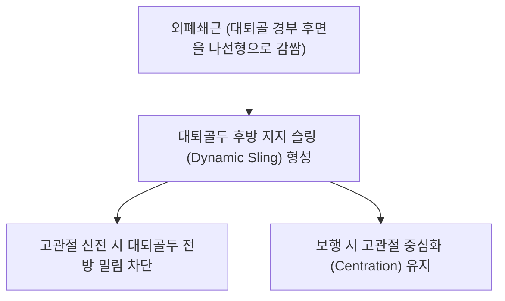

# [[외폐쇄근]](Obturator Externus)

> **핵심 요약 (Key Summary)**:
> [[골반]] 외측면의 [[폐쇄막]] 및 치골·좌골지 외측면에서 기시하여 대퇴골 경부 뒤를 나선형으로 감싸 [[대퇴골]] 전자와에 정지하는 심부 안정화근.
> 고관절 외회전, 굴곡 시 내전 보조 및 대퇴골두 중심화(Centration)를 주동하며 둔부 외회전근 중 유일하게 [[폐쇄신경]](Obturator n., L2-L4)의 지배를 받음.
> 외폐쇄근 증후군, 서혜부 심부 둔통, 고관절 회전 제한을 초래하며 대퇴삼각 심부 약침 및 고관절 가동 추나의 핵심 타깃임.

---
## 📌 목차
1. [해부학적 정밀 구조 및 지배 신경/혈관](#1-해부학적-정밀-구조-및-지배-신경혈관)
2. [생체역학·토크 분석 & 근막 사슬 (Biomechanical Synergy)](#2-생체역학토크-분석--근막-사슬-biomechanical-synergy)
3. [근막통증증후군(TP) & 연관통 패턴 (Travell & Simons)](#3-근막통증증후군tp--연관통-패턴-travell--simons)
4. [초음파 해부학(Sonoanatomy) 및 중재 시술 랜드마크](#4-초음파-해부학sonoanatomy-및-중재-시술-랜드마크)
5. [⭐ 원장님 심층 임상 고찰 및 원본 필기 (Clinical Pearls)](#5-원장님-심층-임상-고찰-및-원본-필기-clinical-pearls)
6. [관련 임상 질환 및 운동손상 증후군 총괄](#6-관련-임상-질환-및-운동손상-증후군-총괄)
7. [추나·도수치료(MET/PIR) & 침구·약침·재활 프로토콜](#7-추나도수치료metpir--침구약침재활-프로토콜)
8. [출처 및 학술 참고 문헌 (References)](#8-출처-및-학술-참고-문헌-references)

---
## 1. 해부학적 정밀 구조 및 지배 신경/혈관

| 항목 | 상세 내용 |
| :--- | :--- |
| **기시 (Origin)** | [[골반]] 외측면의 [[폐쇄막]](Obturator membrane) 외측 골표면 및 치골하지, 좌골지 |
| **정지 (Insertion)** | 대퇴골 경부 후면을 감아 올라가 [[대퇴골]](Femur) 대전자 내측 아래의 [[전자와]](Trochanteric fossa)에 부착 |
| **신경 지배** | [[폐쇄신경]](Obturator nerve, L2, L3, L4) 후지 (Posterior branch) |
| **혈관 공급** | 폐쇄동맥(Obturator a.), 내측대퇴회선동맥 |

### 🔬 해부학 도해 및 단면도
![[Obturator_externus_anatomy.png|450]]
> [해부학 도해]: 폐쇄막 외측에서 대퇴골 경부 후면을 나선형으로 감싸며 전자와로 파고드는 외폐쇄근.

![[Pasted image 20250828121415.jpg|450]]
> [전면-후면 연결]: 골반 전외측에서 기시하여 고관절 후방으로 넘어가는 3차원 주행 경로.

![[Pasted image 20240116151916.png|450]]
> [해부학적 랜드마크]: 치골근과 단내전근 심부에 위치한 최심층 고관절 안정화 근육.

---
## 2. 생체역학·토크 분석 & 근막 사슬 (Biomechanical Synergy)

* **대퇴골 경부 나선형 슬링 (Spiral Sling)**: 대퇴골 경부 뒤쪽을 나선형으로 감싸고 있어, 고관절 신전 시 대퇴골두가 앞으로 미끄러지는 전방 전단력을 물리적으로 차단.
* **지배 신경의 독특성 (원장님 핵심 강조)**: 다른 모든 둔부 단외회전근들(천골신경총 L4-S2)과 달리, **요추신경총(L2-L4) 유래 폐쇄신경의 지배**를 받는 유일한 둔부 외회전근.
* **근막 사슬 연계 (Anatomy Trains)**: 심부전방선(Deep Front Line)의 전면-후면 연결 브릿지로 내전근군 및 장요근과 인접.

---
## 3. 근막통증증후군(TP) & 연관통 패턴 (Travell & Simons)

![[Obturator_internus_TriggerPoints.jpg|450]]
> **[그림 설명]**: 외폐쇄근 및 고관절 심부 외회전근군 연관통 영역 (Travell & Simons)

* **발통점 및 증상**: 서혜부 깊은 곳, 치골 결절 하방 및 대퇴 내측을 따라 무릎 안쪽까지 뻗어 나가는 깊은 쑤심.
* **임상적 특징**: 고관절을 안쪽으로 돌리거나(내회전) 완전히 신전할 때 서혜부 심부에서 찝히는 통증 발생.

---
## 4. 초음파 해부학(Sonoanatomy) 및 중재 시술 랜드마크

* **초음파 서혜부 사선 스캔**:
  * 치골근(Pectineus)과 장내전근 심부, 폐쇄막 외측면에 밀착된 외폐쇄근 식별.
  * 폐쇄신경 전지와 후지 사이의 근막면 관찰.
* **자침 안전 마진**: 대퇴동맥과 정맥, 대퇴신경이 외측에 위치하므로 혈관 맥동을 확인하고 내측에서 안전하게 접근.

---
## 5. ⭐ 원장님 심층 임상 고찰 및 원본 필기 (Clinical Pearls)

* **좌골신경 및 장요근과의 관계 (원장님 필기 100% 보존)**:
  * 외폐쇄근의 과긴장 및 부종은 인접 주행하는 [[폐쇄신경]] 및 [[좌골신경]]을 자극하여 대퇴 내측 및 둔부 후면 방사통 유발.
  * 장요근 과긴장/약화 시 외폐쇄근 기능 이상이 동반되므로 대퇴 삼각 부위의 협응 평가 필수.
* **요추 L2-L4 병변과 외폐쇄근 연관통**:
  * 요추 2~4번 디스크나 협착증 환자가 서혜부 안쪽과 고관절 깊은 곳의 뻐근함을 호소할 때, 폐쇄신경을 통해 외폐쇄근에 연관통이 투사되는 경우가 흔함.
* **촉진 노하우**: 서혜인대 하방에서 대퇴동맥 맥박의 내측, 치골근 아래쪽을 손가락으로 깊게 압박할 때 특유의 깊은 압통 확인.

---
## 6. 관련 임상 질환 및 운동손상 증후군 총괄

| 임상 질환 / 증후군 | 병리적 연관 기전 | 주요 증상 및 이학적 검사 | 핵심 교정 타깃 |
| :--- | :--- | :--- | :--- |
| [[외폐쇄근 증후군]] | 외폐쇄근 건염 및 폐쇄신경 자극 | 서혜부 심부 통증, 대퇴 내측 저림 | 대퇴삼각 심부 약침, 폐쇄신경 수력박리 |
| 고관절 충돌증후군 | 대퇴골두 중심화 부전 | 고관절 내회전 시 찝힘 통증 | 외폐쇄근 이완, 관절 중심화 추나 |
| 서혜부 심부 둔통 | 장요근-외폐쇄근 복합 긴장 | 보행 시 고관절 앞쪽 깊은 쑤심 | 서혜부 심부 침치료 |

---
## 7. 추나·도수치료(MET/PIR) & 침구·약침·재활 프로토콜

* **한의학 경혈 매핑 및 침구 프로토콜**:
  * 비경 충문(SP12), 간경 음렴(LR11), 급맥(LR12).
  * 0.30×60mm 침으로 치골하지 외측면을 향해 45도 외하방 사자.
* **근에너지기법 (MET/PIR)**:
  * 앙와위 고관절 굴곡+내회전 신장 도수.

---
## 8. 출처 및 학술 참고 문헌 (References)

1. **Standring, S.** (2020). *Gray's Anatomy* (42nd ed.). Elsevier.
   - `[연구 요약]`: 외폐쇄근의 폐쇄신경 지배 및 대퇴골 경부 나선형 부착 해부학.
2. **Gudena, R., et al.** (2012). Obturator externus: an anatomical and clinical review. *Surgical and Radiologic Anatomy*, 34(7), 589-593.
   - `[연구 요약]`: 외폐쇄근의 대퇴골두 안정화 기능 및 고관절 보존 수술에서의 중요성 입증.
