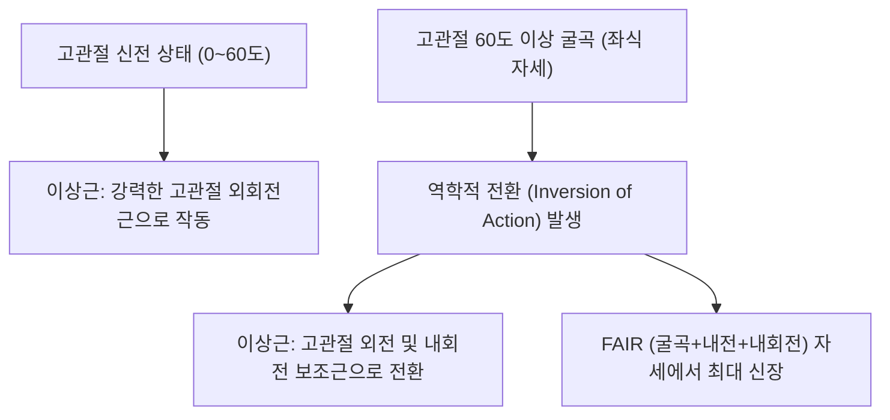

# [[이상근]](Piriformis Muscle)

> **핵심 요약 (Key Summary)**:
> [[천골]] 전면(S2~S4)에서 기시하여 대좌골공을 지나 [[대퇴골]] 대전자 첨부 상내측면에 정지하는 배 모양의 심부 외회전근.
> 고관절 외회전(신전 시) 및 외전(60도 굴곡 시)을 담당하며 대좌골공을 상·하공으로 양분하고 [[이상근신경]](S1-S2)의 지배를 받음.
> 대좌골공 하공을 통과하는 [[좌골신경]]을 압박하여 [[이상근 증후군]] 및 하지 방사통을 유발하며 환도혈 심부 자침과 FAIR 스트레칭의 핵심 타깃임.

---
## 📌 목차
1. [해부학적 정밀 구조 및 지배 신경/혈관](#1-해부학적-정밀-구조-및-지배-신경혈관)
2. [생체역학·토크 분석 & 근막 사슬 (Biomechanical Synergy)](#2-생체역학토크-분석--근막-사슬-biomechanical-synergy)
3. [근막통증증후군(TP) & 연관통 패턴 (Travell & Simons)](#3-근막통증증후군tp--연관통-패턴-travell--simons)
4. [초음파 해부학(Sonoanatomy) 및 중재 시술 랜드마크](#4-초음파-해부학sonoanatomy-및-중재-시술-랜드마크)
5. [⭐ 원장님 심층 임상 고찰 및 원본 필기 (Clinical Pearls)](#5-원장님-심층-임상-고찰-및-원본-필기-clinical-pearls)
6. [관련 임상 질환 및 운동손상 증후군 총괄](#6-관련-임상-질환-및-운동손상-증후군-총괄)
7. [추나·도수치료(MET/PIR) & 침구·약침·재활 프로토콜](#7-추나도수치료metpir--침구약침재활-프로토콜)
8. [출처 및 학술 참고 문헌 (References)](#8-출처-및-학술-참고-문헌-references)

---
## 1. 해부학적 정밀 구조 및 지배 신경/혈관

| 항목 | 상세 내용 |
| :--- | :--- |
| **기시 (Origin)** | [[천골]](Sacrum) 골반면(S2~S4 추체 사이 전외측), 대좌골절제연, [[천결절인대]] |
| **정지 (Insertion)** | [[대퇴골]](Femur) 대전자(Greater trochanter) 첨부의 상내측면 |
| **신경 지배** | [[이상근신경]](Nerve to piriformis, S1, S2 전지) |
| **혈관 공급** | 상둔동맥(Superior gluteal a.), 하둔동맥(Inferior gluteal a.), 내음부동맥 |

### 🔬 해부학 도해 및 단면도

![[Pasted image 20240116151916.png|450]]
> [구조적 특징]: 대둔근 심층에서 대좌골공을 이상근상공과 이상근하공으로 양분하는 둔부 해부학의 나침반.

---
## 2. 생체역학·토크 분석 & 근막 사슬 (Biomechanical Synergy)

* **역학적 작용 전환 (Inversion of Action)**:
  * 고관절 신전(0도): 강력한 고관절 외회전 및 신전 보조.
  * 고관절 60도 이상 굴곡: 작용선이 대퇴골두 회전축 전방으로 이동하여 **고관절 외전 및 내회전 보조근**으로 역학적 기능이 180도 전환됨.
* **천장관절(SI joint) 동적 안정화**: 천골 전면을 대전자 쪽으로 당겨 천골의 과도한 염전(Torsion)을 억제.
* **근막 사슬 연계 (Anatomy Trains)**: 심부전방선(Deep Front Line)의 후방 분지로 골반저근 및 이상근막과 연속.

---
## 3. 근막통증증후군(TP) & 연관통 패턴 (Travell & Simons)

![[Piriformis_TriggerPoints.jpg|450]]
> **[그림 설명]**: 이상근(Piriformis) 발통점(TrP1, TrP2) 및 둔부·대퇴 후면 좌골신경통 유사 방사통 패턴 (Travell & Simons)

* **이상근 발통점 (TrP)**:
  * TrP 1: 천골 외측연 기시부 부근.
  * TrP 2: 이상근 근복 중앙(환도혈 위치).
* **연관통 및 좌골신경 압박 증상**:
  * 둔부 전체의 깊은 뻐근함 및 천장관절 통증.
  * [[좌골신경]]을 직접 압박하여 대퇴 후면, 슬와부, 종아리 후외측, 발바닥까지 찌릿한 방사통(이상근 증후군) 유발.
  * 운전 중 액셀을 밟거나 지갑을 뒷주머니에 넣고 앉아 있을 때 통증 격화.

---
## 4. 초음파 해부학(Sonoanatomy) 및 중재 시술 랜드마크
![[Piriformis_anatomy.png|450]]
> [해부학 도해]: 천골 전면에서 대좌골공을 관통하여 대퇴골 대전자로 주행하며 좌골신경과 교차하는 이상근.
* **초음파 스캔 랜드마크**:
  * PSIS와 대전자를 잇는 선상의 횡단 스캔.
  * 장골 뼈 음영과 대전자 사이에서 저에코의 삼각형 이상근 근복 관찰.
  * 이상근 심부 바로 아래를 지나가는 원형/타원형의 고에코 좌골신경(Sciatic nerve) 확인.
* **수력박리술(Hydrodissection) 안전 마진**: 이상근과 좌골신경 사이 근막면에 약침액을 주입하여 신경 유착을 물리적으로 분리.

---
## 5. ⭐ 원장님 심층 임상 고찰 및 원본 필기 (Clinical Pearls)

* **말초신경약침의학 임상 치료 기법 (원장님 필기 100% 보존)**:
  * **이상근 증후군(Piriformis Syndrome) 좌골신경 포착 해소**:
    * 이상근의 만성 과긴장 및 섬유화는 대좌골공 하부(Infrapiriform foramen)를 지나는 좌골신경을 직접 압박하여 하지 방사통을 유발함.
  * **약침 주입점 및 혈위**:
    * 환도(GB30): 대전자와 천골열공을 잇는 선상의 외측 1/3 지점(이상근 근복 중심).
    * 이상근 라인(Piriformis Line): PSIS와 대전자를 잇는 선상에서 압통점 촉진 후 자입.
  * **약침 처방 및 주입법**:
    * 추천 제제: 오공약침(0.5~1.0ml) + 봉약침(Sweet BV 0.5ml) (1:1 OB Mix 추천).
    * 자입 기법: 26~30G 38~50mm 장침 니들을 사용하여 대둔근을 관통해 심부 이상근 근막에 도달할 때까지 30~45mm 직자하여 0.5ml 주입 (신경주위 수력박리 효과).
* **기능 전환(Inversion of Action)을 이용한 진단 및 스트레칭**:
  * 고관절이 60도 이상 굴곡되면 이상근이 외회전근에서 내회전근으로 바뀌므로, 이상근을 스트레칭할 때는 반드시 **고관절을 60~90도 굴곡시킨 상태에서 내전+내회전(FAIR)**을 시켜야 완벽히 늘어남.
* **지갑성 좌골신경통(Wallet Sciatica)**:
  * 두꺼운 지갑을 뒷주머니에 넣고 앉으면 이상근과 좌골신경이 지갑 모서리에 눌려 허혈성 신경병증이 발생하므로, 환자 티칭 시 뒷주머니 지갑 제거 필수 지시.

---
## 6. 관련 임상 질환 및 운동손상 증후군 총괄

| 임상 질환 / 증후군 | 병리적 연관 기전 | 주요 증상 및 이학적 검사 | 핵심 교정 타깃 |
| :--- | :--- | :--- | :--- |
| [[이상근 증후군]](Piriformis Syndrome) | 이상근 비후로 좌골신경 기계적 포착 | 둔부 통증, 하지 방사통, [[FAIR 검사]] 양성 | 환도혈 약침 수력박리, 이상근 침도 |
| 천장관절 기능장애 | 이상근 과긴장으로 천골 비틀림 | 천장관절 통증, 보행 시 골반 덜컹거림 | 천골 정복 추나, 이상근 PIR |
| 팔자걸음 (Out-toeing Gait) | 양측 이상근 단축 고착 | 보행 시 발끝이 45도 이상 벌어짐 | 이상근 이완, 고관절 내회전 가동 |
| 지갑성 신경병증 | 뒷주머니 지갑 압박에 의한 신경 허혈 | 앉을 때 둔부 저림, 대퇴 후면 감각 저하 | 생활 습관 교정, 신경 재생 한약 |

---
## 7. 추나·도수치료(MET/PIR) & 침구·약침·재활 프로토콜

* **한의학 경혈 매핑 및 침구 프로토콜**:
  * 담경 환도(GB30), 방광경 질변(BL54), 포황(BL53), 은문(BL37).
  * 0.35×75mm 장침으로 환도혈에 5~7cm 심부 직자(침 끝이 좌골신경 피막 근처에 도달할 때 묵직한 전기가 오는 듯한 득기감 확인).
* **근에너지기법 (MET/PIR - FAIR Stretch)**:
  * 앙와위에서 환측 고관절을 90도 굴곡+최대 내전+내회전 위치로 정렬.
  * 환자에게 가벼운 외회전 저항(20% 힘)을 7초간 요구한 후, 호기와 함께 내전/내회전 각도 증진.
* **추나 요법 (천골 앙와위 교정)**:
  * 천골 기저부(Sacral base)의 전방/후방 변위를 바로잡아 이상근 기시부의 장력 대칭성 회복.

---
## 8. 출처 및 학술 참고 문헌 (References)

1. **Garden, A. R., Finerty, J. T., & Everhart, J. S. (2025)**. Evaluation of the complications and outcomes of endoscopic and open surgical treatment of piriformis syndrome: a systematic review. *J Am Acad Orthop Surg*, 33(19), e878-e887. [PMID: 40526913](https://pubmed.ncbi.nlm.nih.gov/40526913/)
   - `[연구 요약]`:  이상근 증후군의 내시경·개방 수술적 치료 결과와 합병증을 체계적 리뷰로 비교 — 보존 치료 실패 후 수술 적응증 근거.
2. **Fishman, L. M., Dombi, G. W., Michaelsen, C., et al. (2002)**. Piriformis syndrome: diagnosis, treatment, and outcome—a 10-year study. *Arch Phys Med Rehabil*, 83(3), 295-301. [PMID: 11887107](https://pubmed.ncbi.nlm.nih.gov/11887107/)
   - `[연구 요약]`: 이상근 주사 및 전기진단학적 H-반사 검사를 통한 신경 포착 진단과 치료 결과 분석.
3. **Travell, J. G., & Simons, D. G.** (1999). *Myofascial Pain and Dysfunction*. Williams & Wilkins.
   - `[연구 요약]`: 이상근 발통점과 좌골신경 포착성 신경통의 감별 진단학.