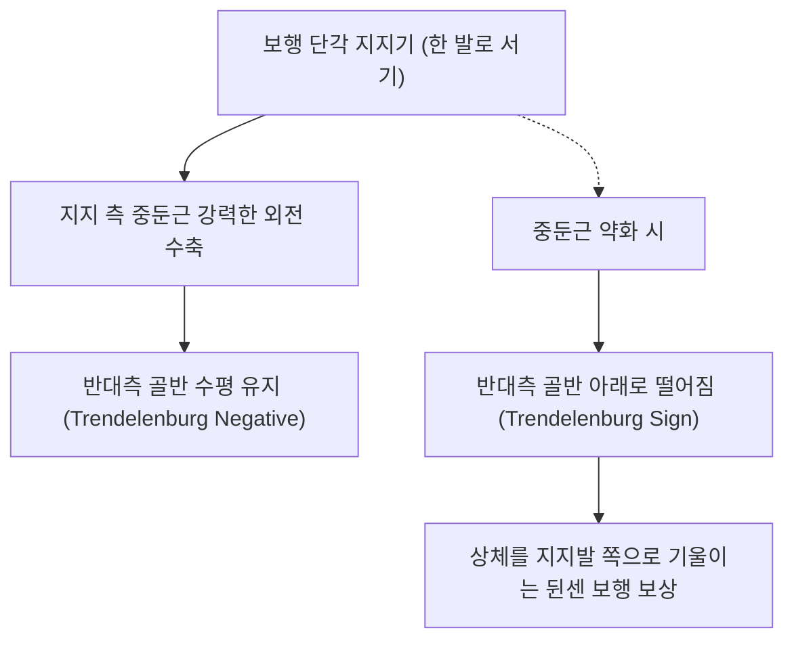

# [[중둔근]](Gluteus Medius)

> **핵심 요약 (Key Summary)**:
> [[장골]] 외측면 전둔선과 후둔선 사이에서 기시하여 [[대퇴골]] 대전자 상외측면에 정지하는 골반 측면 핵심 부채꼴 근육.
> 고관절 외전, 단각 지지기 반대측 골반 수평 유지(트렌델렌버그 방어)를 주동하며 [[상둔신경]](Superior gluteal n., L4-S1)의 지배를 받음.
> 트렌델렌버그 보행(뒤뚱거림), 대전자 통증 증후군(GTPS), 장경인대 마찰을 초래하며 거료혈 자침 및 클램쉘(Clamshell) 재활의 핵심 타깃임.

---
## 📌 목차
1. [해부학적 정밀 구조 및 지배 신경/혈관](#1-해부학적-정밀-구조-및-지배-신경혈관)
2. [생체역학·토크 분석 & 근막 사슬 (Biomechanical Synergy)](#2-생체역학토크-분석--근막-사슬-biomechanical-synergy)
3. [근막통증증후군(TP) & 연관통 패턴 (Travell & Simons)](#3-근막통증증후군tp--연관통-패턴-travell--simons)
4. [초음파 해부학(Sonoanatomy) 및 중재 시술 랜드마크](#4-초음파-해부학sonoanatomy-및-중재-시술-랜드마크)
5. [⭐ 원장님 심층 임상 고찰 및 원본 필기 (Clinical Pearls)](#5-원장님-심층-임상-고찰-및-원본-필기-clinical-pearls)
6. [관련 임상 질환 및 운동손상 증후군 총괄](#6-관련-임상-질환-및-운동손상-증후군-총괄)
7. [추나·도수치료(MET/PIR) & 침구·약침·재활 프로토콜](#7-추나도수치료metpir--침구약침재활-프로토콜)
8. [출처 및 학술 참고 문헌 (References)](#8-출처-및-학술-참고-문헌-references)

---
## 1. 해부학적 정밀 구조 및 지배 신경/혈관

| 항목 | 상세 내용 |
| :--- | :--- |
| **기시 (Origin)** | [[장골]](Ilium) 외측면 (전둔선과 후둔선 사이의 장골익 외측면) |
| **정지 (Insertion)** | [[대퇴골]](Femur) 대전자(Greater trochanter)의 상외측면 사선 융기부 |
| **신경 지배** | [[상둔신경]](Superior gluteal nerve, L4, L5, S1) |
| **혈관 공급** | 상둔동맥(Superior gluteal a.) 심분지 |

### 🔬 해부학 도해 및 단면도

![[Pasted image 20240116151916.png|450]]
> [구조적 특징]: 대둔근 심층, 소둔근 천층에 위치하며 보행 시 골반 수평을 조절하는 핵심 현수선.

![[Pasted image 20240119015700.png|450]]
> [3대 기능 분절]: 전섬유(내회전/외전), 중섬유(순수 외전), 후섬유(외회전/외전)의 기능적 구획.

---
## 2. 생체역학·토크 분석 & 근막 사슬 (Biomechanical Synergy)

* **보행 단각 지지기의 일차적 골반 수평자**: 보행 주기의 60%를 차지하는 지지기에서 골반이 반대측으로 기우는 중력 토크에 대항하여 골반을 수평으로 유지.
* **3대 분절의 다기능성**:
  * 전섬유: 고관절 외전 및 강력한 내회전(골반 전방 회전 제어).
  * 중섬유: 순수한 시상-관상면 외전 지렛대.
  * 후섬유: 고관절 외회전 및 대퇴골두 중심화, 기립 시 골반 안정화.
* **근막 사슬 연계 (Anatomy Trains)**: 외측선(Lateral Line)의 허브로 [[대퇴근막장근]], 장경인대, 비골근군과 연계되어 하지 관상면 밸런스 총괄.

---
## 3. 근막통증증후군(TP) & 연관통 패턴 (Travell & Simons)

![[Gluteus_medius_TriggerPoints.jpg|450]]
> **[그림 설명]**: 중둔근(Gluteus Medius) 발통점(TrP1~TrP3) 및 장골능·천골·둔부 연관통 영역 (Travell & Simons)

* **TrP 1 (후방 섬유)**: 장골능 후부와 천장관절, 둔부 전체로 방사.
* **TrP 2 (중간 섬유)**: 대전자 외측 및 대퇴 후외측으로 방사(가성 좌골신경통 유사).
* **TrP 3 (전방 섬유)**: 서혜부 및 장골능 전면으로 방사.
* **특징**: 옆으로 누워 잘 때 통증 부위가 눌려 아파서 깨며, 걸을 때 허리와 골반 외측이 묵직하게 쑤심.

---
## 4. 초음파 해부학(Sonoanatomy) 및 중재 시술 랜드마크

* **초음파 대전자 종단 스캔**:
  * 대퇴골 대전자 상외측면 뼈 음영 바로 위에 정지하는 중둔근 건(Gluteus medius tendon) 관찰.
  * 건 심부 및 천부의 대전자 점액낭(Trochanteric bursa) 종창 및 삼출액 평가.
* **자침 안전 마진**: 장골능과 대전자 사이 근복 자침 시 상둔신경 분지가 중둔근과 소둔근 사이를 주행하므로 심부 뼈면을 접촉하며 자침.
![[Gluteus_medius_anatomy.png|450]]
> [해부학 도해]: 장골익에서 대전자 외측면으로 부채꼴 모양으로 모여드는 중둔근의 3차원 섬유 주행.
---
## 5. ⭐ 원장님 심층 임상 고찰 및 원본 필기 (Clinical Pearls)

* **보행 이상과 연관통 (원장님 필기 100% 보존)**:
  * 중둔근이 약화되면 걸을 때 상체를 지지발 쪽으로 과도하게 기울이는 뒤뚱거리는 보행(Duchenne limp) 호발.
  * 장요근, 대퇴근막장근 과긴장 시 상대적으로 중둔근 약화가 쉽게 발생하므로 통합적 접근 필수.
* **대퇴근막장근(TFL)의 얌체 보상 작용**:
  * 중둔근이 약화되면 TFL이 외전 동작을 대신 맡으려 함.
  * 그러나 TFL은 내회전 모멘트가 강하므로 고관절이 안으로 비틀리고 장경인대가 과도하게 팽팽해져 무릎 외측 장경인대염(ITBS)이 속발함.
  * 중둔근을 강화하고 TFL을 풀어주는 것이 무릎 외측 통증 치료의 근본 해법임.
* **원장님 임상 수기 테크닉 (인대관절수기법 / LAS & 대전자 압박 도수)**:
  * 측와위에서 시술자가 한 손으로 대전자를 상내측으로 압박 지지하고, 다른 손으로 환자의 하지를 외전+신전시켜 중둔근 건 부착부의 긴장을 순간적으로 풀어주는 인대관절수기법 적용 시 즉각적인 보행 개선.

![[Pasted image 20240121214647.png|450]]
> [임상 방사통]: 둔부 외측과 장골능, 천장관절 부위로 방사하는 발통점 지도.

---
## 6. 관련 임상 질환 및 운동손상 증후군 총괄

| 임상 질환 / 증후군 | 병리적 연관 기전 | 주요 증상 및 이학적 검사 | 핵심 교정 타깃 |
| :--- | :--- | :--- | :--- |
| [[트렌델렌버그 징후]] | 중둔근 외전력 상실로 골반 처짐 | 편측 지지 시 반대쪽 골반 하강, 뒤뚱거림 | 중둔근 고립 강화, 상둔신경 약침 |
| [[대전자 통증 증후군]](GTPS) | 중둔근 건병증 및 대전자 점액낭염 | 대전자 부위 극심한 압통, 측와위 수면 불능 | 건 부착부 침도 및 재생 약침 |
| 만성 골반 비대칭 | 편측 중둔근 약화로 골반 높낮이 차이 | 서 있을 때 한쪽 골반 빠짐, 기능적 측만 | 중둔근 밸런스 추나, 측면 코어 재활 |
| 무릎 외측 장경인대염 | 중둔근 약화로 TFL/ITB 과부하 | 달리기 시 무릎 외측 찌릿한 마찰통 | 중둔근 강화 및 TFL/장경인대 이완 |

---
## 7. 추나·도수치료(MET/PIR) & 침구·약침·재활 프로토콜

* **한의학 경혈 매핑 및 침구 프로토콜**:
  * 담경 거료(GB29), 환도(GB30), 풍시(GB31).
  * 0.30×60mm 침으로 장골익 뼈면을 향해 45도 내하방 자입.
* **근에너지기법 (MET/PIR)**:
  * 측와위에서 비치료 측을 아래로 하고, 치료 측 다리를 베드 뒤쪽으로 하수(내전 유도).
  * 환자에게 가벼운 외전 저항 7초 요구 후, 호기와 함께 하지 내전 신장.
* **재활 훈련 (Clamshell & Side-Lying Hip Abduction)**:
  * 골반이 뒤로 눕지 않도록 중립을 유지한 상태에서 무릎을 벌리는 클램쉘 운동으로 중둔근 후섬유 선택적 강화.

---
## 8. 출처 및 학술 참고 문헌 (References)

1. **Gottschalk, F., Kourosh, S., & Leveau, B.** (1989). The functional anatomy of tensor fasciae latae and gluteus medius and minimus. *Journal of Anatomy*, 166, 179-189.
   - `[연구 요약]`: 중둔근의 3대 분절별 근전도 분석과 보행 시 골반 수평 안정화 메커니즘 규명.
2. **Travell, J. G., & Simons, D. G.** (1999). *Myofascial Pain and Dysfunction*. Williams & Wilkins.
   - `[연구 요약]`: 중둔근 발통점이 모사하는 요통 및 가성 디스크 통증의 감별 진단학.
3. **Fearon, A. M., et al.** (2013). Greater trochanteric pain syndrome: defining the clinical presentation. *British Journal of Sports Medicine*, 47(8), 488-493.
   - `[연구 요약]`: 대전자 통증 증후군에서 중둔근 건병증의 병리적 기전 및 중재 치료 연구.
