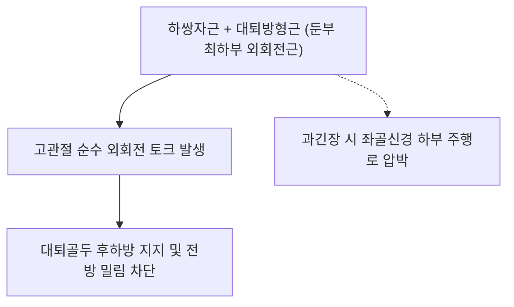

# [[하쌍자근]](Inferior Gemellus)

> **핵심 요약 (Key Summary)**:
> [[좌골결절]] 상부 외측연에서 기시하여 [[내폐쇄근]] 힘줄과 합류하여 [[대퇴골]] 대전자 전자와에 정지하는 심부 외회전근.
> 삼두관절근(Triceps coxae) 하부를 구성하여 고관절 외회전 및 대퇴골두 후하방 안정화를 주동하며 [[대퇴방형근신경]](L4-S1)의 지배를 받음.
> 심부 둔부 증후군, 좌골신경 마찰, 좌골대퇴 충돌을 초래하며 환도혈 하방 심부 침도와 고관절 내회전 도수의 핵심 타깃임.

---
## 📌 목차
1. [해부학적 정밀 구조 및 지배 신경/혈관](#1-해부학적-정밀-구조-및-지배-신경혈관)
2. [생체역학·토크 분석 & 근막 사슬 (Biomechanical Synergy)](#2-생체역학토크-분석--근막-사슬-biomechanical-synergy)
3. [근막통증증후군(TP) & 연관통 패턴 (Travell & Simons)](#3-근막통증증후군tp--연관통-패턴-travell--simons)
4. [초음파 해부학(Sonoanatomy) 및 중재 시술 랜드마크](#4-초음파-해부학sonoanatomy-및-중재-시술-랜드마크)
5. [⭐ 원장님 심층 임상 고찰 및 원본 필기 (Clinical Pearls)](#5-원장님-심층-임상-고찰-및-원본-필기-clinical-pearls)
6. [관련 임상 질환 및 운동손상 증후군 총괄](#6-관련-임상-질환-및-운동손상-증후군-총괄)
7. [추나·도수치료(MET/PIR) & 침구·약침·재활 프로토콜](#7-추나도수치료metpir--침구약침재활-프로토콜)
8. [출처 및 학술 참고 문헌 (References)](#8-출처-및-학술-참고-문헌-references)

---
## 1. 해부학적 정밀 구조 및 지배 신경/혈관

| 항목 | 상세 내용 |
| :--- | :--- |
| **기시 (Origin)** | [[좌골결절]](Ischial tuberosity) 상외측연 |
| **정지 (Insertion)** | [[내폐쇄근]](Obturator internus) 힘줄 하연에 융합 → [[대퇴골]](Femur) 대전자 전자와 |
| **신경 지배** | [[대퇴방형근신경]](Nerve to quadratus femoris, L4, L5, S1) (대퇴방형근과 공통 지배) |
| **혈관 공급** | 내측대퇴회선동맥(Medial circumflex femoral a.), 하둔동맥 |

### 🔬 해부학 도해 및 단면도
![[Gemelli_anatomy.png|450]]
> [해부학 도해]: 좌골결절 상연에서 내폐쇄근 힘줄의 아래쪽을 받치며 대퇴골로 주행하는 하쌍자근.

![[Pasted image 20240117005719.png|450]]
> [구조적 특징]: 위로는 내폐쇄근, 아래로는 대퇴방형근과 인접하여 둔부 심층을 빗장처럼 지탱.

---
## 2. 생체역학·토크 분석 & 근막 사슬 (Biomechanical Synergy)

* **삼두관절근 하부 받침대**: 내폐쇄근 힘줄의 하방을 지탱하며 고관절 회전 시 대퇴골두의 관절와 이탈을 방지.
* **신경 지배의 독특성 (원장님 감별 포인트)**: 상쌍자근은 내폐쇄근신경의 지배를 받는 반면, **하쌍자근은 대퇴방형근신경의 지배**를 받음.
* **근막 사슬 연계 (Anatomy Trains)**: 대퇴방형근 및 대내전근 상부와 근막적으로 연결되어 고관절 후방 관절낭 강화.

---
## 3. 근막통증증후군(TP) & 연관통 패턴 (Travell & Simons)

![[Obturator_internus_TriggerPoints.jpg|450]]
> **[그림 설명]**: 쌍자근 및 고관절 심부 외회전근 복합체 발통점 및 천골 외측 연관통 영역 (Travell & Simons)

* **발통점 및 증상**: 좌골결절과 대전자 사이 심부에서 둔통 유발, 대퇴 후면 및 좌골신경 주행로를 따라 뻐근함 방사.

---
## 4. 초음파 해부학(Sonoanatomy) 및 중재 시술 랜드마크

* **초음파 스캔**: 좌골결절과 대퇴골 전자간능 사이에서 대퇴방형근 상연에 위치한 하쌍자근-내폐쇄근 복합체 식별.
* **자침 안전 마진**: 좌골신경이 표층을 비스듬히 가로지르므로 초음파 유도하에 신경을 외측으로 젖히며 안전 자침.

---
## 5. ⭐ 원장님 심층 임상 고찰 및 원본 필기 (Clinical Pearls)

* **삼두관절근의 상하 신경 지배 차이와 임상 의의 (원장님 팁)**:
  * 해부학적으로 상·하쌍자근은 쌍둥이 근육이지만, 지배 신경은 **상쌍자근(내폐쇄근신경) vs 하쌍자근(대퇴방형근신경)**으로 분리되어 있음.
  * 따라서 요추 4번(L4) 병변이 있을 때는 하쌍자근과 대퇴방형근이 주로 영향을 받고, 천추 2번(S2) 병변 시에는 상쌍자근과 내폐쇄근이 영향을 받음.
* **좌골대퇴 공간과의 연계**:
  * 하쌍자근은 대퇴방형근의 바로 위에 위치하므로, 좌골결절과 소전자 사이 간격이 좁아지는 좌골대퇴 충돌증후군(IFI) 시 함께 부종과 유착이 발생함.

---
## 6. 관련 임상 질환 및 운동손상 증후군 총괄

| 임상 질환 / 증후군 | 병리적 연관 기전 | 주요 증상 및 이학적 검사 | 핵심 교정 타깃 |
| :--- | :--- | :--- | :--- |
| [[심부 둔부 증후군]] | 하쌍자근 연축으로 좌골신경 압박 | 둔부 심부 뻐근함, 하지 방사통 | 삼두관절근 하부 약침 수력박리 |
| 좌골대퇴 충돌 연관통 | 좌골-대퇴 간격 협소화 시 마찰 | 보행 시 둔부 하부 찝힘 통증 | 하쌍자근 이완, 보행 교정 |
| 고관절 외회전 구축 | 양측 쌍자근 만성 단축 | 팔자걸음, 고관절 내회전 제한 | 고관절 내회전 PIR 도수 |

---
## 7. 추나·도수치료(MET/PIR) & 침구·약침·재활 프로토콜

* **한의학 경혈 매핑 및 침구 프로토콜**:
  * 환도(GB30) 하방 1촌 지점, 질변(BL54).
  * 0.35×75mm 침으로 좌골결절 상외측연을 향해 5cm 심부 자입.
* **근에너지기법 (MET/PIR)**:
  * 고관절 90도 굴곡+내회전 신장 도수.

---
## 8. 출처 및 학술 참고 문헌 (References)

1. **Standring, S.** (2020). *Gray's Anatomy* (42nd ed.). Elsevier.
   - `[연구 요약]`: 하쌍자근의 기시, 정지 및 대퇴방형근신경 지배 해부학 분석.
2. **Martin, H. D., et al.** (2015). Deep gluteal syndrome. *Journal of Hip Preservation Surgery*.
   - `[연구 요약]`: 둔부 심부 외회전근군과 좌골신경 포착의 상관관계 연구.
