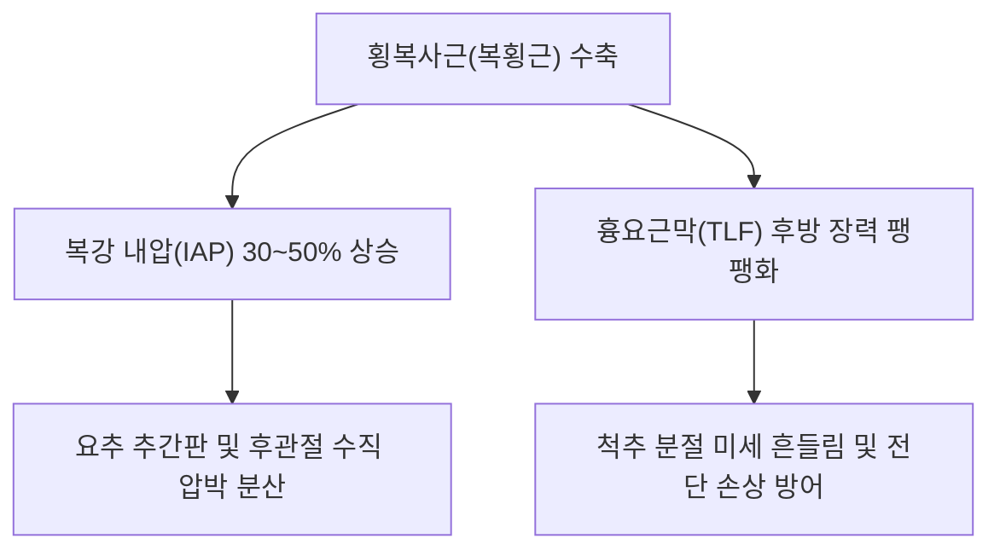

---
aliases:
  - 횡복사근
  - 가로복근
  - 복횡근
  - Transversus abdominis
  - TrA
---
# [[횡복사근]](Transversus Abdominis / 복횡근)

> **핵심 요약 (Key Summary)**:
> 흉요근막, 장골능 내순, 서혜인대 외측부 및 하부 6개 늑연골에서 기시하여 복부 백선과 치골능에 정지하는 복벽 최심층의 천연 코르셋 근육.
> [[갈비사이신경]](T7-T12) 및 [[장골하복신경]](L1)의 지배를 받으며, 복강 내압(IAP) 상승 및 척추·골반 분절의 선제적 안정화(Feed-forward)를 주동함.
> 만성 요통, 척추 불안정증, 복부팽만, 골반 부정렬의 핵심 병변근이며, 천추·대횡 침구 및 드로잉-인(Drawing-in) 복식호흡이 표적임.

---
## 📌 목차
1. [해부학적 정밀 구조 및 지배 신경/혈관](#1-해부학적-정밀-구조-및-지배-신경혈관)
2. [생체역학·토크 분석 & 근막 사슬 (Biomechanical Synergy)](#2-생체역학토크-분석--근막-사슬-biomechanical-synergy)
3. [근막통증증후군(TP) & 연관통 패턴 (Travell & Simons)](#3-근막통증증후군tp--연관통-패턴-travell--simons)
4. [초음파 해부학(Sonoanatomy) 및 중재 시술 랜드마크](#4-초음파-해부학sonoanatomy-및-중재-시술-랜드마크)
5. [⭐ 원장님 심층 임상 고찰 및 원본 필기 (Clinical Pearls)](#5-원장님-심층-임상-고찰-및-원본-필기-clinical-pearls)
6. [관련 임상 질환 및 운동손상 증후군 총괄](#6-관련-임상-질환-및-운동손상-증후군-총괄)
7. [추나·도수치료(MET/PIR) & 침구·약침·재활 프로토콜](#7-추나도수치료metpir--침구약침재활-프로토콜)
8. [출처 및 학술 참고 문헌 (References)](#8-출처-및-학술-참고-문헌-references)

---
## 1. 해부학적 정밀 구조 및 지배 신경/혈관

| 항목 | 상세 내용 |
| :--- | :--- |
| **기시 (Origin)** | [[흉요근막]](TLF) 중간엽, [[장골능]](Iliac crest) 내순 전방 2/3, [[서혜인대]] 외측 1/3, 하부 제7~12[[늑연골]] 내면 |
| **정지 (Insertion)** | [[백선]](Linea alba), [[검상돌기]](Xiphoid process) 및 [[치골]] 능선 (결합건 형성) |
| **신경 지배** | 제7~12 [[갈비사이신경]](Intercostal nn., T7-T12), [[장골하복신경]](Iliohypogastric n., L1), [[장골서혜신경]](L1) |
| **혈관 공급** | 심재장골회선동맥, 하복벽동맥 |

### 🔬 해부학 도해 및 단면도
![[Transversus_abdominis_anatomy.png|450]]
> [해부학 도해]: 복부를 수평으로 완전히 감싸며 흉요근막과 백선을 연결하는 인체 천연의 코르셋 구조.

![[Pasted image 20240117004655.png|450]]
> [구조적 특징]: 복벽의 가장 깊은 층에서 체간을 수평으로 둘러싸며 흉요근막과 백선을 통해 전·후방을 결속하는 횡복사근(복횡근).

---
## 2. 생체역학·토크 분석 & 근막 사슬 (Biomechanical Synergy)

* **복강 내압 (Intra-Abdominal Pressure, IAP) 형성**: 수축 시 복벽을 안으로 당겨 복압을 높이고 척추체의 하중을 30~50% 경감.
* **선제적 코어 안정화 (Feed-Forward Stabilization)**: 팔과 다리를 움직이기 30~50ms 전에 선제적으로 수축하여 척추 및 골반 분절의 미세 흔들림 방어.
* **골반저근 및 횡격막과의 협응 (이너 코어 실린더)**: [[횡격막]](천장), [[골반저근]](바닥), [[다열근(요부)]](후벽)과 함께 원통형 안정화 유닛 구성.
* **연계 메인 노트**: 상세 요부 및 복벽 바이오메카닉스는 [[복횡근]] 메인 노트를 함께 참조.

---
## 3. 근막통증증후군(TP) & 연관통 패턴 (Travell & Simons)

![[Abdominal_obliques_TriggerPoints.jpg|450]]
> **[그림 설명]**: 복횡근/복사근군 심부 발통점 및 서혜부·치골부 연관통 패턴 (Travell & Simons)

* **발통점 위치**: 늑골 하연 및 서혜부 상방의 심부 근복.
* **연관통 방사**: 복벽 전면 전체에 뻐근한 팽만감 및 기침, 재채기 시 결리는 통증.

---
## 4. 초음파 해부학(Sonoanatomy) 및 중재 시술 랜드마크

* **초음파 스캔**: 측복벽 횡단 스캔에서 외복사근-내복사근 심부의 복횡근(횡복사근) 층판 확인.
* **자침 안전 마진**: 복막 천공을 방지하기 위해 침 첨을 복벽과 평행하게 15~30도 사자.

---
## 5. ⭐ 원장님 심층 임상 고찰 및 원본 필기 (Clinical Pearls)

* **코어 안정화 실패와 요통 (원장님 필기 100% 보존)**:
  * 횡복사근의 수축 지연 및 약화는 요추 전만 증가, 골반 전방경사, 복부 돌출을 초래하며 척추 추간판의 퇴행성 마모를 가속화함.
  * 복직근, 내복사근, 외복사근, 다열근, 요방형근과 함께 통합적으로 재교육해야 함.
* **호흡 기반 드로잉-인 (Drawing-in Maneuver) 지도법**:
  * 배꼽을 척추 쪽으로 지그시 당겨 복횡근을 선택적으로 활성화하는 호흡 운동 지도.
* **추나 및 침구 치료 노하우**:
  * 천추(ST25), 대횡(SP15), 관원(CV4), 기해(CV6) 심부 직자 및 전침 치료.
  * McGill 컬업, 버드독, 데드버그(Deadbug) 코어 안정화 운동 병행.

---
## 6. 관련 임상 질환 및 운동손상 증후군 총괄

| 임상 질환 / 증후군 | 병리적 연관 기전 | 주요 증상 및 이학적 검사 | 핵심 교정 타깃 |
| :--- | :--- | :--- | :--- |
| [[만성 요통]] | 횡복사근 선행 수축 부전 | 자세 변경 시 덜컹거림, 만성 요배통 | 드로잉 인 호흡, 대횡혈 전침 |
| [[척추 불안정]] | 흉요근막 장력 형성 실패 | 기립 시 척추 전단력 누적 | 코어 실린더 협응 재활 |
| 복부 장기 하수 | 복압 지지력 상실 및 복벽 이완 | 식후 하복부 불룩 돌출, 소화불량 | 복횡근 강화, 복모혈 침구 |

---
## 7. 추나·도수치료(MET/PIR) & 침구·약침·재활 프로토콜

* **한의학 경혈 매핑 및 침구 프로토콜**:
  * 대횡(SP15), 천추(ST25), 기해(CV6), 관원(CV4).
  * 0.25×50mm 호침으로 복벽 사자 자입.
* **재활 훈련**: Deadbug, Bird-Dog, Drawing-in Maneuver.

---
## 8. 출처 및 학술 참고 문헌 (References)

1. **Hodges, P. W., & Richardson, C. A. (1997)**. Contraction of the abdominal muscles associated with movement of the lower limb. *Phys Ther*, 77(2), 132-144. [PMID: 9037214](https://pubmed.ncbi.nlm.nih.gov/9037214/)
   - `[연구 요약]`: 사지 운동 시 복횡근(횡복사근)의 선제적 수축 메커니즘과 만성 요통 환자에서의 동원 지연 규명.
2. **Standring, S.** (2020). *Gray's Anatomy: The Anatomical Basis of Clinical Practice* (42nd ed.). Elsevier.
   - `[연구 요약]`: 복횡근의 복벽 최심층 주행 및 T7-L1 신경 지배 해부학 분석.