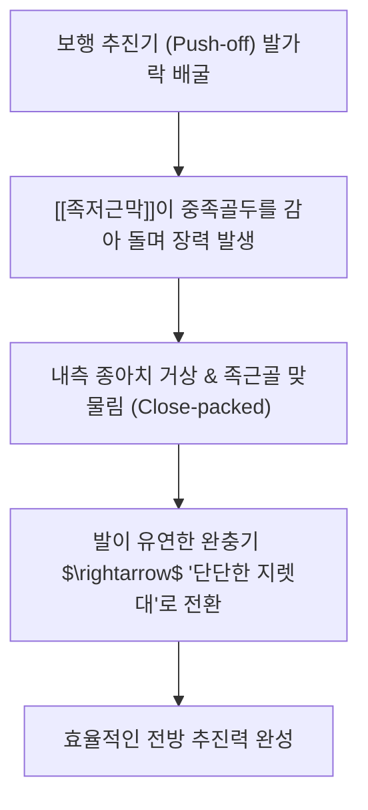

---
aliases:
  - 족저근막
  - 발바닥근막
  - Plantar fascia
  - Plantar aponeurosis
  - 족저건막
tags:
  - 골격
  - 인대
  - 근막
  - 족부
  - 윈드라스기전
  - 족저근막염
---
# 🦶 [[족저근막]] (Plantar Fascia, 발바닥근막 / 족저건막)

> **핵심 요약 (Key Summary)**:
> 종골 결절 내측 돌기에서 기원하여 5개 중족골두 족저판과 기위지골 기저부로 부착하는 두껍고 강인한 족부 심부 근막입니다.
> 내측 종아치(Longitudinal arch)를 지지하며 보행 추진기 시 발가락 배굴에 의해 족궁을 거상시키는 윈드라스 기전(Windlass mechanism)의 핵심 축입니다.
> 아침 첫 발 디딜 때 찢어지는 듯한 통증을 유발하는 족저근막염의 호발 부위이며 종골 골막 침도 박리 및 족부 추나요법의 주요 표적입니다.

---

## 📌 목차
1. [해부학적 구조 & 부착부 (Anatomy)](#1-해부학적-구조--부착부-anatomy)
2. [생체역학: 윈드라스 기전 & 족궁 완충 (Windlass Mechanism)](#2-생체역학-윈드라스-기전--족궁-완충-windlass-mechanism)
3. [근막 사슬 연계 (표면후방선 SBL & 아킬레스건)](#3-근막-사슬-연계-표면후방선-sbl--아킬레스건)
4. [초음파 해부학 & 병리 소견 (Fasciopathy)](#4-초음파-해부학--병리-소견-fasciopathy)
5. [관련 질환: 족저근막염 병태생리 및 임상 양상](#5-관련-질환-족저근막염-병태생리-및-임상-양상)
6. [침도·약침 & 족부 교정 추나 프로토콜](#6-침도약침--족부-교정-추나-프로토콜)
7. [출처 및 학술 참고 문헌 (References)](#7-출처-및-학술-참고-문헌-references)

---

## 1. 해부학적 구조 & 부착부 (Anatomy)

족저근막은 발바닥 피부 아래 두꺼운 피하지방 패드(Heel pad) 심층에 위치하며, 내측·중앙·외측 밴드 중 **중앙 밴드(Central band)**가 가장 두껍고 기능적으로 중요합니다.

```
       [종골 결절 내측 돌기 (Medial Calcaneal Tubercle)] ── 호발 병변부
                             │
                      [중앙 근막 체부] ────────────────── 족저 심부근 보호
                             │
               ┌─────────────┼─────────────┐
               ▼             ▼             ▼
          [5개의 슬립 (Slips)] ── 각 중족골두 족저판 및 기위지골 연결
```

* **기시 (Origin)**: [[종골]] 결절(Calcaneal tuberosity)의 내측 돌기.
* **정지 (Insertion)**: 제1~5 중족족지관절(MTP joint) 부위의 족저판(Plantar plate) 및 굴근건초, 기위지골 기저부.

---

## 2. 생체역학: 윈드라스 기전 & 족궁 완충 (Windlass Mechanism)



* **닻감개(Windlass) 원리**:
  * 보행 중 발뒤꿈치가 들리고 중족족지관절이 신전(Dorsiflexion)될 때, 족저근막이 도르래를 감듯 팽팽하게 조여지면서 종골과 중족골두 사이 거리를 좁혀 족궁(Arch)을 높입니다.
* **착지기 충격 흡수**:
  * 뒤꿈치 착지기(Heel strike)에는 족저근막이 신장되면서 지면 충격 에너지를 탄성 에너지로 흡수·저장합니다.

---

## 3. 근막 사슬 연계 (표면후방선 SBL & 아킬레스건)

* **아킬레스건과의 연결성**:
  * 종골 골막을 거쳐 아킬레스건([[비복근]], [[가자미근]])과 연속성을 지니며, 토마스 마이어스(Thomas Myers)의 **표면후방선(Superficial Back Line, SBL)**의 최하단 출발점.
  * 종아리 근육(비복근·가자미근)의 단축 및 족관절 배굴 제한은 족저근막의 장력을 비정상적으로 급증시키는 1차적 원인.

---

## 4. 초음파 해부학 & 병리 소견 (Fasciopathy)

* **정상 소견**:
  * 종골 부착부에서 두께 **4.0mm 이하**, 균일한 고에코 섬유 다발 패턴.
* **병리적 소견 (족저근막염)**:
  * 종골 부착부 두께 **4.5mm 이상 비후**, 저에코성 음영(점액성 퇴행 및 미세 파열), 골극(Calcaneal spur) 동반, 파워 도플러 상 혈류 증가.

---

## 5. 관련 질환: 족저근막염 병태생리 및 임상 양상

* **전형적 증상**:
  * **아침 첫 발 통증**: 밤새 발이 저굴(Plantarflexion)된 상태에서 단축되었던 근막이 기상 후 첫 체중 부하 시 급격히 신장되며 찢어지는 듯한 극통 유발.
  * 몇 걸음 걸으면 통증이 다소 완화되다가 오래 서 있거나 활동이 늘어나면 다시 악화.
* **압통점**:
  * 종골 결절 전내측 1cm 부위 압박 시 국소 압통 극심.

---

## 6. 침도·약침 & 족부 교정 추나 프로토콜

* **초음파 유도하 침도 미세 박리술**:
  * 종골 부착부의 만성 반흔 및 유착된 근막 섬유를 소침도로 미세 절개하여 국소 미세혈류 순환 복원 및 신생 조직 재생 유도.
* **약침 치료**:
  * 종골 부착부 저에코 부위에 [[신바로약침]] 또는 [[봉약침]](Sweet BV)을 0.3~0.5ml 주입하여 신경인성 염증 차단.
* **족부 추나 및 윈드라스 스트레칭**:
  * 거골하관절(Subtalar joint) 가동화 추나로 과회내(Over-pronation) 교정.
  * 발가락을 완전히 위로 젖힌 상태에서 비복근·아킬레스건을 늘리는 윈드라스 신장 운동 티칭.

---

## 7. 출처 및 학술 참고 문헌 (References)
* Hicks JH. The mechanics of the foot. II. The plantar aponeurosis and the arch. *J Anat*. 1954;88(1):25-30.
  * `[연구 요약]`: 족저근막의 윈드라스 기전(Windlass mechanism) 해부생체역학 최초 규명 논문.
* Lemont H, et al. Plantar fasciitis: a degenerative process (fasciosis) without inflammation. *J Am Podiatr Med Assoc*. 2003;93(3):234-237.
  * `[연구 요약]`: 족저근막염이 단순 염증이 아닌 콜라겐 변성, 점액양 퇴행 및 섬유화 건병증(Fasciosis)임을 조직학적으로 증명.
