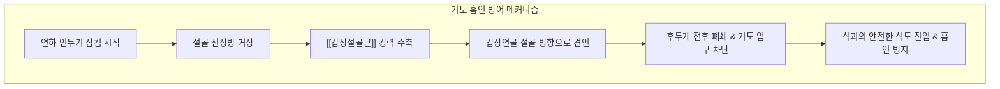

---
aliases:
  - 갑상설골근
  - Thyrohyoid
  - Thyrohyoid muscle
  - 방패목뿔근
---
# [[갑상설골근]](Thyrohyoid)

> **핵심 요약 (Key Summary)**:
> 갑상연골 판의 외측 사선(Oblique line)에서 기원하여 [[설골]] 체부 하연 및 대각 기저부에 정지하는 사각형의 설골하근 심부 근육입니다.
> [[설하신경]](CN XII)을 경유하여 주행하는 제1경추신경([[경신경총]] C1 섬유)의 독자적 지배를 받으며, [[설골]] 고정 시 후두를 거상하고 후두 고정 시 [[설골]]을 하강시킵니다.
> 연하 시 후두 거상 부전, 음식물 기도 흡인, 인후부 이물감(매핵기), 고음 발성 피로의 핵심 병변근이며, 염천, 인영, 수돌 혈위 침구 및 갑상연골 사선 도침 치료가 표적입니다.

---
## 📌 목차
1. [해부학적 정밀 구조 및 지배 신경/혈관](#1-해부학적-정밀-구조-및-지배-신경혈관)
2. [생체역학·토크 분석 & 경부 근막 사슬](#2-생체역학토크-분석--경부-근막-사슬)
3. [근막통증증후군(TP) & 연관통 패턴 (Travell & Simons)](#3-근막통증증후군tp--연관통-패턴-travell--simons)
4. [초음파 해부학(Sonoanatomy) 및 중재 시술 랜드마크](#4-초음파-해부학sonoanatomy-및-중재-시술-랜드마크)
5. [⭐ 원장님 심층 임상 고찰 및 원본 필기 (Clinical Pearls)](#5-원장님-심층-임상-고찰-및-원본-필기-clinical-pearls)
6. [관련 임상 질환 및 운동손상 증후군 총괄](#6-관련-임상-질환-및-운동손상-증후군-총괄)
7. [추나·도수치료(MET/PIR) & 침구·약침·재활 프로토콜](#7-추나도수치료metpir--침구약침재활-프로토콜)
8. [출처 및 학술 참고 문헌 (References)](#8-출처-및-학술-참고-문헌-references)

---
## 1. 해부학적 정밀 구조 및 지배 신경/혈관

| 항목 | 상세 내용 |
| :--- | :--- |
| **기시 (Origin)** | 갑상연골(Thyroid cartilage) 판 외측면의 사선(Oblique line) |
| **정지 (Insertion)** | [[설골]](Hyoid bone) 체부 하연의 외측 반부 및 대각(Greater horn) 기저부 |
| **신경 지배 (Innervation)** | 제1경추신경([[경신경총]] C1 신경근 섬유, [[설하신경]] CN XII 경유 주행) |
| **혈관 공급 (Vascular Supply)** | [[상갑상선동맥]](Superior thyroid artery)의 설골하동맥 및 상후두동맥 분지 |
| **기능 (Action)** | [[설골]] 고정 시 갑상연골(후두) 거상, 후두 고정 시 [[설골]] 하강, 후두개 폐쇄 보조 |
| **상대적 해부 위치** | [[흉골설골근]] 및 [[견갑설골근]] 상복의 심부, 갑상설골막(Thyrohyoid membrane)의 천층 |

### 🔬 신경 지배의 고유성 (C1 via CN XII)
* 설골하근군의 다른 세 근육([[흉골설골근]], [[흉골갑상근]], [[견갑설골근]])이 경신경고리(Ansa cervicalis, C1-C3 루프)의 지배를 받는 것과 달리, [[갑상설골근]]은 [[이설골근]]과 마찬가지로 **제1경추신경(C1 전지 섬유)**의 독자적인 지배를 받습니다.
* 이 C1 섬유는 두개저 부근에서 [[설하신경]](CN XII)에 편승(Hitchhiking)하여 주행하다가, 후두융기 상외측에서 분지하여 [[갑상설골근]]으로 진입합니다. 따라서 상위 경추(C1-C2) 아탈구 및 두개경추 접합부 긴장은 이 근육의 기능 장애를 직접 유발합니다.

### 🔬 갑상설골막 및 신경혈관 천공 관계
* [[갑상설골근]]의 심부에는 설골과 갑상연골을 잇는 단단한 갑상설골막(Thyrohyoid membrane)이 펼쳐져 있습니다.
* 이 막의 외측부에는 미주신경(CN X)의 분지인 **내후두신경(Internal laryngeal nerve)**과 상후두동맥이 성대 상부 점막 감각을 공급하기 위해 관통합니다. 따라서 갑상설골근의 만성 긴장은 내후두신경을 포착하여 인두부 이상감각 및 만성 기침을 유발할 수 있습니다.

### 🔬 해부학 도해 및 단면도
![[Thyrohyoid_muscle_anatomy.png|450]]
> [Wikimedia Commons / BodyParts3D 공중도메인]: 갑상연골 사선에서 설골 대각으로 수직 상행하는 갑상설골근의 정밀 해부도.

---
## 2. 생체역학·토크 분석 & 경부 근막 사슬

### ⚙️ 생체역학적 기능과 기도 보호 메커니즘
* **후두(Larynx) 거상 및 기도 폐쇄 주동 작용**:
  * 연하의 인두기(Pharyngeal phase)에서 설골상근군이 [[설골]]을 거상하면, [[갑상설골근]]이 강력히 수축하여 갑상연골(후두)을 설골 쪽으로 바짝 끌어올립니다.
  * 이로 인해 후두개(Epiglottis)가 뒤로 접히며 후두 입구를 완벽히 밀폐하고 식괴가 기도로 침범하는 것을 방어합니다.
* **고음 발성 시 후두 미세 조율**:
  * 후두를 상방으로 견인하여 성대의 진동 길이를 단축시키고 성문 상부 압력을 조절하여 고음역대 피치를 조율합니다.

### 🔗 근막경선(Anatomy Trains) 연계
* [[심부전방선]](Deep Front Line, DFL): 호흡횡격막-기관전근막-갑상연골-설골-구강저로 이어지는 인체 중심 근막 축의 핵심 마디입니다.
* 골반저나 횡격막의 기능부전은 [[심부전방선]]을 타고 올라와 [[갑상설골근]]의 단축을 유발하며, 이는 호흡과 연하의 협조 체계를 붕괴시킵니다.

---
## 3. 근막통증증후군(TP) & 연관통 패턴 (Travell & Simons)

### ⚡ 발통점(TrP) 및 통증 방사 양상
* **발통점 위치**: 갑상연골 사선 바로 위쪽 근복 및 설골 대각 아래 가장자리.
* **연관통 패턴**:
  * 갑상연골 외측 및 전경부 상부로 퍼지는 쑤시고 결리는 국소 통증.
  * 침이나 음식물을 삼킬 때 목 안쪽 깊은 곳에서 가시가 걸린 듯 찌르는 통증 및 이물감.
  * 귀 아래 유양돌기 부근 및 턱밑 후방으로 방사되는 둔한 방사통.

### 🔬 유발 및 지속 인자
* 거북목 및 머리를 앞으로 쭉 뺀 구부정한 자세(FHP).
* 성대 결절이나 과도한 고음 발성으로 인한 후두 거상근군의 피로.
* 인후두 역류증(LPRD)으로 인한 만성 점막 염증 및 반사성 근경련.

### 🔬 트리거 포인트 도해
![[Digastric_TriggerPoints.jpg|450]]
> [Travell & Simons Trigger Point Manual]: 설골하근 심부 및 [[갑상설골근]] 영역의 발통점과 경부 상전방 방사통 양상.

---
## 4. 초음파 해부학(Sonoanatomy) 및 중재 시술 랜드마크

### 🖥️ 고주파 초음파 스캔 프로토콜
* **탐촉자 위치**: 설골과 갑상연골 사이의 갑상설골막 레벨에서 고주파 선형 프로브를 전경부 사위 관상단면으로 거치.
* **층별 구조 확인**:
  1. 피부 및 피하조직
  2. [[경배근]](Platysma)
  3. [[흉골설골근]](Sternohyoid) 및 [[견갑설골근]](Omohyoid) 상복
  4. [[갑상설골근]](Thyrohyoid): 갑상설골막 바로 위를 덮고 있는 저에코성 근육층
  5. 갑상설골막 및 심부 후두개전지방체(Pre-epiglottic fat pad)
* **내후두신경(Internal Laryngeal Nerve) 주행 확인**:
  * 갑상설골막 외측부를 관통하는 상후두동맥의 박동 신호를 컬러 도플러로 확인하여 내후두신경의 위치를 간접 파악.

### ⚠️ 중재 안전 구역 및 침구 안전 가이드
* 갑상설골간극 외측에는 상후두동맥과 내후두신경이 위치하므로, 외측 깊은 자침은 신경 손상 및 후두 감각 마비를 초래할 수 있습니다.
* 자침 시 갑상연골 상연 또는 설골 대각 골막을 촉진하여 골 표면을 향해 얕고 완만하게 사자(0.3~0.5촌)하여 안전 마진을 엄수합니다.

---
## 5. ⭐ 원장님 심층 임상 고찰 및 원본 필기 (Clinical Pearls)

### 💡 100% 원본 필기 보존 및 심층 해설
1. **연하장애와 기도 흡인(Aspiration) 위험**:
   * *원본 필기*: "삼킴 시 후두 상승이 부족하면 음식물 기도 흡인 위험이 증가하므로, 갑상설골근의 유착 해소가 연하 재활의 핵심."
   * *심층 고찰*: 뇌졸중 후유증이나 파킨슨병, 노인성 근감소증 환자에서 연하 시 사레가 자주 들리고 폐렴 위험이 높아지는 근본적인 생체역학적 원인은 후두 거상력의 저하입니다. [[갑상설골근]]이 위축되거나 섬유화되어 갑상연골을 설골 쪽으로 끌어당기지 못하면 후두개가 기도를 완전히 막지 못해 음식물이 성대로 떨어지는 기도 흡인이 발생합니다. 따라서 연하 재활에서 이 근육의 활성화는 생명과 직결되는 치료 표적입니다.
2. **인후부 이물감(매핵기)과 경부 전면 긴장**:
   * *원본 필기*: "고개 숙인 자세와 거북목으로 갑상설골근이 단축되면 침 삼킬 때 목에 가시가 걸린 듯한 이물감(매핵기 유사 증상) 발생 → 염천혈 및 갑상연골 사선 부위 침구 이완."
   * *심층 고찰*: 스마트폰을 오래 보며 고개를 숙이는 자세는 설골과 갑상연골 간격을 비정상적으로 좁히고 [[갑상설골근]]의 단축을 유발합니다. 이로 인해 침을 삼킬 때마다 갑상연골이 설골 하연과 부딪히거나 갑상설골막이 압박되어 목구멍에 무엇인가 걸려 있는 듯한 만성 매핵기(梅核氣)를 호소하게 됩니다.

---
## 6. 관련 임상 질환 및 운동손상 증후군 총괄

| 임상 질환 / 증후군 | 병리적 연관 기전 | 주요 증상 및 이학적 검사 | 핵심 교정 타깃 |
| :--- | :--- | :--- | :--- |
| [[연하장애]](Dysphagia) | [[갑상설골근]] 위축으로 후두 거상 부전 | 식사 중 기침, 사레, 기도 흡인 | 염천혈 전침 및 멘델슨 기법 |
| [[매핵기]](Globus Sensation) | [[갑상설골근]] 단축으로 갑상설골간격 협소화 | 침 삼킬 때 목의 이물감, 목 조임 | 갑상연골 사선 도침 박리 |
| [[발성장애]](Dysphonia) | 후두 거상근 피로 및 고음역 조절 실패 | 고음 발성 시 쉰 목소리, 음성 피로 | 후두 가동 도수치료 |
| [[내후두신경 포착 증후군]] | 갑상설골막 관통 부위 신경 압박 | 원인 불명의 만성 마른 기침, 인두통 | 갑상설골막 신경 감압술 |

---
## 7. 추나·도수치료(MET/PIR) & 침구·약침·재활 프로토콜

### 👐 추나 및 도수치료 프로토콜
* **갑상설골 간격 확장 도수치료(Thyrohyoid Distraction)**:
  * 환자를 앙와위로 눕히고, 시술자는 한 손의 엄지와 검지로 설골을 상방으로 가볍게 고정하고 다른 손으로는 갑상연골을 하방으로 부드럽게 견인합니다.
  * 좁아진 갑상설골 공간을 넓혀주는 방향으로 30초간 완만한 지속 신장을 가합니다.
* **등척성 후두 거상 운동(MET)**:
  * 환자가 침을 삼키며 후두를 올리려 할 때 갑상연골 상단에 가벼운 하향 저항(7초 유지)을 준 후 이완시키는 PIR 기법을 적용합니다.

### 🎯 침구 및 약침 치료 프로토콜
* **주요 경혈 타깃**:
  * 염천(廉泉): 설골 체부 상연에서 설근 및 갑상설골근을 향해 1.0~1.2촌 자침.
  * 인영(人迎): 갑상연골 상연 외측 1.5촌. 경동맥 전연 안전 접근.
  * 수돌(水突): 갑상연골 사선 외측 [[흉골갑상근]] 및 [[갑상설골근]] 연접부 타깃.
* **도침 요법(Acupotomy)**:
  * 갑상연골 사선의 [[갑상설골근]] 기시부 유착 조직에 미세 도침을 접촉시켜 종축으로 1~2회 미세 절개하여 신경 포착을 해소합니다.
* **약침 치료**:
  * 설골 대각 하연 안전 구역에 신바로 약침 또는 중성어혈 약침 0.1cc를 얕게 주입하여 근막 긴장 완화 및 국소 순환을 개선합니다.

### 🏃 연하 재활 훈련
* **멘델슨 기법(Mendelsohn Maneuver)**:
  * 삼킴 도중 후두가 최고점에 도달했을 때 3~5초간 멈추어 근수축을 유지하는 훈련.
* **샤커 운동(Shaker Exercise)**:
  * 앙와위에서 어깨를 바닥에 붙인 채 머리만 들어 발끝을 바라보는 동작(1분 유지 또는 30회 반복)을 통해 설골상근 및 갑상설골근의 근력을 극대화.

---
## 8. 출처 및 학술 참고 문헌 (References)

1. **Standring, S. (2020)**. *Gray's Anatomy: The Anatomical Basis of Clinical Practice* (42nd ed.). Elsevier.
   * `[연구 요약]`: 갑상설골근의 사선 부착부, C1 신경 지배 특성 및 갑상설골막 관통 신경혈관 구조의 정밀 해부학적 기술.
2. **Travell, J. G., & Simons, D. G. (1999)**. *Myofascial Pain and Dysfunction: The Trigger Point Manual*, Vol. 1 (2nd ed.). Williams & Wilkins.
   * `[연구 요약]`: [[갑상설골근]] 발통점과 경부 상전방 연관통, 연하 장애 및 매핵기 증후군과의 밀접한 연관성 분석.
3. **Ishida, R., Palmer, J. B., & Hiiemae, K. M. (2002)**. Hyoid motion during swallowing: factors affecting forward and upward displacement. *Dysphagia*, 17(4), 262-272. [PMID: 12355141](https://pubmed.ncbi.nlm.nih.gov/12355141/)
   - **[연구 요약]**: 삼킴 시 설골의 전방·상방 변위에 영향을 주는 요인을 형광투시로 정량 분석 — 후두 거상·기도 보호에 관여하는 설골 주변근(설골하근군 포함) 역학의 기초 자료.
4. **Logemann, J. A. (1998)**. *Evaluation and Treatment of Swallowing Disorders* (2nd ed.). Pro-Ed.
   * `[연구 요약]`: 신경계 질환 환자에서 [[갑상설골근]] 약화로 인한 기도 흡인 메커니즘과 연하 재활 훈련의 임상적 프로토콜 확립.