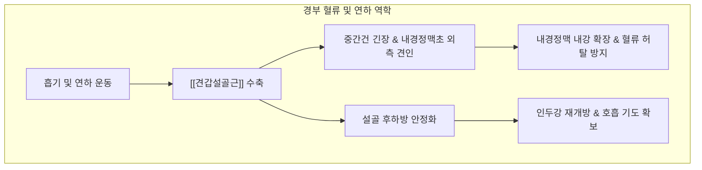

---
aliases:
  - 견갑설골근
  - Omohyoid
  - Omohyoid muscle
  - 어깨목뿔근
---
# [[견갑설골근]](Omohyoid)

> **핵심 요약 (Key Summary)**:
> 견갑골 상연 및 견갑절흔에서 기원하여 중간건을 거쳐 [[설골]] 체부 하연 외측에 정지하는 상복과 하복으로 구성된 긴 두복성 설골하근입니다.
> [[경신경고리]](Ansa cervicalis, C1-C3)의 지배를 받으며, [[설골]]을 하후방으로 견인하여 연하를 마무리하고 내경정맥초 근막 장력을 조절하여 경부 혈류 역학을 보조합니다.
> 경부 전면 근막 긴장, [[흉곽출구 증후군]], 뇌정맥 순환 장애성 두통, 연하 후 잔여 이물감의 핵심 병변근이며, 결분, 인영, 천돌 혈위 침구 및 도침 치료의 표적입니다.

---
## 📌 목차
1. [해부학적 정밀 구조 및 지배 신경/혈관](#1-해부학적-정밀-구조-및-지배-신경혈관)
2. [생체역학·토크 분석 & 근막 사슬 (Biomechanical Synergy)](#2-생체역학토크-분석--근막-사슬-biomechanical-synergy)
3. [근막통증증후군(TP) & 연관통 패턴 (Travell & Simons)](#3-근막통증증후군tp--연관통-패턴-travell--simons)
4. [초음파 해부학(Sonoanatomy) 및 중재 시술 랜드마크](#4-초음파-해부학sonoanatomy-및-중재-시술-랜드마크)
5. [⭐ 원장님 심층 임상 고찰 및 원본 필기 (Clinical Pearls)](#5-원장님-심층-임상-고찰-및-원본-필기-clinical-pearls)
6. [관련 임상 질환 및 운동손상 증후군 총괄](#6-관련-임상-질환-및-운동손상-증후군-총괄)
7. [추나·도수치료(MET/PIR) & 침구·약침·재활 프로토콜](#7-추나도수치료metpir--침구약침재활-프로토콜)
8. [출처 및 학술 참고 문헌 (References)](#8-출처-및-학술-참고-문헌-references)

---
## 1. 해부학적 정밀 구조 및 지배 신경/혈관

| 항목 | 상세 내용 |
| :--- | :--- |
| **기시 (Origin)** | **하복(Inferior belly)**: 견갑골 상연(Superior border of scapula) 및 상견갑횡인대 인근 견갑절흔 |
| **정지 (Insertion)** | **상복(Superior belly)**: 중간건에서 수직 상행하여 [[설골]](Hyoid bone) 체부 하연의 외측단 |
| **중간 연결** | **중간건(Intermediate tendon)**: 쇄골과 제1늑골에 심부 경부근막 띠로 단단히 앵커링(Anchoring) |
| **신경 지배 (Innervation)** | [[경신경고리]](Ansa cervicalis): 상복은 상근(C1 섬유), 하복은 하근(C2-C3 섬유) 분지 지배 |
| **혈관 공급 (Vascular Supply)** | [[상갑상선동맥]](Superior thyroid artery) 분지 및 [[하갑상선동맥]], 경횡동맥 분지 |
| **기능 (Action)** | [[설골]] 하후방 견인, 경부 심부 근막(내경정맥초) 긴장 유지, 강한 흡기 시 정맥 허탈 방지 |

### 🔬 경부 삼각 분할의 결정적 해부학 랜드마크
* [[견갑설골근]]은 경부 외측을 대각선으로 가로지르며 경부의 주요 해부학적 삼각(Triangles of the neck)을 나누는 기준선입니다.
  * **후경삼각 분할**: 하복이 후경삼각을 가로질러 상부의 **후두삼각(Occipital triangle)**과 하부의 **쇄골상삼각(Supraclavicular / Omoclavicular triangle)**으로 양분합니다.
  * **전경삼각 분할**: 상복이 전경삼각 내에서 [[흉쇄유돌근]], [[이복근]] 후복과 함께 **경동맥삼각(Carotid triangle)**의 하외측 경계를 형성합니다.
* **내경정맥초(Carotid Sheath)와의 직접 유착**: 중간건은 내경정맥의 전면을 감싸는 경부근막(Cervical fascia)의 건막 고리에 단단히 고정되어 있어, 근수축 시 정맥 벽을 외측으로 당겨 혈류 통로를 넓히는 기계적 역할을 수행합니다.

### 🔬 해부학 도해 및 단면도
![[Omohyoid_muscle_anatomy.png|450]]
> [Wikimedia Commons / BodyParts3D 공중도메인]: 견갑골 상연에서 시작하여 쇄골 상방 중간건을 거쳐 설골로 이어지는 견갑설골근의 정밀 3차원 주행.

---
## 2. 생체역학·토크 분석 & 근막 사슬 (Biomechanical Synergy)

### ⚙️ 생체역학적 기능과 혈류역학 조율 메커니즘
* **설골 하후방 견인 벡터**: 연하의 구강기 및 인두기에서 설골상근군([[이설골근]], [[악설골근]], [[이복근]])에 의해 전상방으로 거상되었던 설골을 연하 완료 시점에 후하방으로 강력히 당겨 원래 정렬로 복귀시킵니다.
* **내경정맥 개방성(Patency) 유지 및 뇌혈류 흡인 펌프**: 심호흡(흡기) 시 흉강 내에 강한 음압이 형성될 때 얇은 벽을 가진 내경정맥(IJV)이 허탈(Collapse)되는 것을 방지하기 위해, [[견갑설골근]]이 수축하여 정맥초 벽을 외측으로 긴장시킴으로써 두개강 내 정맥혈의 심장 환류를 물리적으로 보조합니다.

### 🔗 근막경선(Anatomy Trains) 연계
* [[심부전방선]](Deep Front Line, DFL): 골반저-횡격막-심낭막-내경정맥초-설골하근군으로 연결되는 신체 중심 안정화 축의 핵심 연결고리입니다.
* [[나선선]](Spiral Line, SPL): 견갑골 상각 및 견갑골 위치 변위는 [[견갑설골근]]을 통해 두경부의 비틀림 및 회전 변위와 직접적인 장력 피드백을 주고받습니다.

---
## 3. 근막통증증후군(TP) & 연관통 패턴 (Travell & Simons)

### ⚡ 발통점(TrP) 및 통증 방사 양상
* **발통점 위치**:
  * **상복 TrP**: 경동맥 삼각 하부, [[흉쇄유돌근]] 전연 깊은 곳.
  * **하복 TrP**: 쇄골 상와(Supraclavicular fossa) 외측, [[전사각근]] 및 [[중사각근]]의 앞쪽을 교차하는 부위.
* **연관통 패턴**:
  * 쇄골 상와에서 턱밑, 전경부 하부, 귀 뒤쪽 유양돌기 부근으로 쑤시는 듯한 연관통 방사.
  * 침을 삼킬 때 목구멍 하단에서 무언가 걸리는 이물감 및 연하통.
  * 뇌정맥 울혈에 따른 후두부 및 측두부의 묵직한 팽창성 두통 유발.

### 🔬 유발 및 지속 인자
* 둥근어깨(Round shoulders) 및 견갑골 하강/하방회전 부정렬로 인한 하복의 과도한 신장 부하.
* 타이트한 넥타이나 옷깃에 의한 쇄골 상와 압박.
* 만성적인 흉식 호흡 습관으로 인한 경부 보조 흡기근의 과부하.

### 🔬 트리거 포인트 도해
![[Digastric_TriggerPoints.jpg|450]]
> [Travell & Simons Trigger Point Manual]: 설골근군 및 [[견갑설골근]] 영역의 발통점과 경부 전외측 방사통 양상.

---
## 4. 초음파 해부학(Sonoanatomy) 및 중재 시술 랜드마크

### 🖥️ 고주파 초음파 스캔 프로토콜
* **탐촉자 위치**: 쇄골 상와에 선형 프로브를 횡단 및 사위(Oblique)로 거치하여 C5-C6 신경근 및 쇄골상와 구조를 동정.
* **초음파상 특징**:
  * [[흉쇄유돌근]] 심부에서 내경정맥(IJV)의 전외측 표면을 가로지르는 납작한 저에코의 [[견갑설골근]] 중간건 확인.
  * 하복 스캔 시 [[상완신경총]](Brachial plexus) 트렁크의 천층 앞쪽을 비스듬히 주행하는 근육 다발 식별.
* **컬러 도플러 랜드마크**:
  * 내경정맥 및 총경동맥(CCA), 경횡동맥(Transverse cervical artery)의 박동을 확인하여 중재 시 혈관 손상을 완벽히 배제.

### ⚠️ 중재 안전 구역 및 침구 안전 가이드
* 쇄골 상와 부위 자침 시 심부에는 폐첨(Lung apex)과 흉막(Pleura)이 존재하므로, 직각 심자 시 기흉(Pneumothorax) 위험이 있습니다.
* 자침 각도는 반드시 쇄골과 평행하게 외측 또는 얕은 내측으로 완만하게 사자(0.3~0.5촌)하며, 절대로 후하방 직자를 시행해서는 안 됩니다.

---
## 5. ⭐ 원장님 심층 임상 고찰 및 원본 필기 (Clinical Pearls)

### 💡 100% 원본 필기 보존 및 심층 해설
1. **내경정맥초와의 근막적 연계**:
   * *원본 필기*: "[[견갑설골근]] 중간건이 내경정맥초를 감싸고 있으므로, 이 근육의 과긴장은 뇌정맥 순환 장애 및 두통 유발 가능 → 쇄골 상와 부위 근막 이완 필수."
   * *심층 고찰*: 뇌에서 내려오는 정맥혈의 80% 이상은 내경정맥(IJV)을 통과합니다. [[견갑설골근]]이 만성 연축 상태에 빠지거나 중간건 섬유가 비후되어 내경정맥초를 압박하면, 두개강 내 정맥 고혈압(Intracranial venous hypertension) 및 뇌척수액 순환 장애가 초래됩니다. 이는 누워있을 때 악화되거나 아침 기상 시 머리가 터질 듯이 무거운 뇌정맥 울혈성 두통의 숨은 병소입니다.
2. **흉곽출구 증후군(TOS) 연동**:
   * *원본 필기*: "사각근과 인접하여 흉곽 상구의 긴장도를 조절하므로 상지 저림 환자 치료 시 반드시 함께 촉진 및 이호 필요."
   * *심층 고찰*: [[견갑설골근]] 하복은 쇄골 상와에서 [[전사각근]]과 [[중사각근]]의 바로 앞을 가로질러 주행합니다. 이 근육이 단축되면 사각근간극(Scalene triangle)의 전외측 지붕을 압박하여 그 아래를 지나는 [[상완신경총]]과 쇄골하동맥의 포착을 가중시킵니다. 따라서 난치성 [[흉곽출구 증후군]] 치료 시 단순 [[사각근]] 자침에만 머물지 않고 [[견갑설골근]] 하복을 함께 이완해야 치료율이 비약적으로 상승합니다.

---
## 6. 관련 임상 질환 및 운동손상 증후군 총괄

| 임상 질환 / 증후군 | 병리적 연관 기전 | 주요 증상 및 이학적 검사 | 핵심 교정 타깃 |
| :--- | :--- | :--- | :--- |
| [[흉곽출구 증후군]](TOS) | [[견갑설골근]] 하복 단축으로 사각근간극 전방 압박 | 상지 방사통, 손의 냉감, [[애드슨 검사]] 양성 | 쇄골 상와 하복 이완 |
| [[경정맥 포착 증후군]] | 중간건 과긴장에 의한 내경정맥 외인성 압박 | 후두부 팽창성 두통, 안압 상승감, 어지럼증 | 내경정맥초 근막 박리술 |
| [[연하장애]](Dysphagia) | 설골 하후방 복원력 저하 및 연하 후 인두 긴장 | 삼킴 후 목구멍 이물감, 목 조임 | 설골 체부 하연 도침 치료 |
| [[견갑골 부정렬 증후군]] | 라운드 숄더 및 견갑골 하강으로 인한 지속 견인 | 견갑골 상각 결림, 전경부 당김 | 견갑골 정렬 교정 추나 |

---
## 7. 추나·도수치료(MET/PIR) & 침구·약침·재활 프로토콜

### 👐 추나 및 도수치료 프로토콜
* **쇄골 상와 하복 도수 근막 이완(Myofascial Release)**:
  * 환자를 앙와위로 눕히고 두경부를 치료 측으로 가볍게 측굴 및 동측 회전하여 근육을 느슨하게 만듭니다.
  * 시술자는 쇄골 상연 바로 위 오목한 곳(결분혈 부위)에 검지와 중지를 대고 내경정맥 박동 외측에서 견갑골 방향으로 부드럽게 글라이딩 마사지를 1~2분간 시행합니다.
* **설골 하강근군 MET(Muscle Energy Technique)**:
  * 환자가 턱을 가볍게 치켜들며 연하 동작을 취할 때, 시술자는 설골 하연을 손가락으로 가볍게 안정화하며 등척성 저항(7초 유지, 3회)을 가한 후 경부 전면을 신장시킵니다.

### 🎯 침구 및 약침 치료 프로토콜
* **주요 경혈 타깃**:
  * 결분(缺盆): 쇄골상와 중앙. [[견갑설골근]] 하복 타깃. 반드시 외측으로 완만하게 0.3~0.5촌 사자.
  * 인영(人迎): 후두융기 양측 1.5촌, 총경동맥 박동부 전연. 상복 타깃. 동맥을 손가락으로 밀어 젖힌 후 안전 자침.
  * 천돌(天突): 흉골상절흔 중앙 함요처. [[설골하근군]] 전체의 장력 균형점.
* **도침 요법(Acupotomy)**:
  * 쇄골 상연의 [[견갑설골근]] 중간건 부착부 유착 및 섬유화 조직에 소형 도침을 이용하여 세로 방향으로 1~2회 절개·박리하여 신경혈관 포착을 해소합니다.
* **약침 치료**:
  * 쇄골 상와 안전 마진 내에 신바로 약침 또는 중성어혈 약침 0.2cc를 얕게 분주하여 국소 근막 염증과 섬유화를 완화합니다.

### 🏃 재활 운동 및 스트레칭
* [[견갑설골근]] **신장 스트레칭**:
  * 의자에 앉아 치료 측 손으로 의자 밑바닥을 잡아 견갑골을 하방 고정합니다.
  * 고개를 반대측으로 측굴하고 턱을 살짝 든 상태에서 반대측 후방으로 회전시켜 15~20초간 부드럽게 신장합니다.

---
## 8. 출처 및 학술 참고 문헌 (References)

1. **Standring, S. (2020)**. *Gray's Anatomy: The Anatomical Basis of Clinical Practice* (42nd ed.). Elsevier, pp. 580-582.
   * `[연구 요약]`: 견갑설골근의 상복·하복 및 중간건의 국소해부학적 구조, 내경정맥초와의 근막적 결합 및 경부 삼각 분할 기준 제시.
2. **Travell, J. G., & Simons, D. G. (1999)**. *Myofascial Pain and Dysfunction: The Trigger Point Manual*, Vol. 1 (2nd ed.). Williams & Wilkins.
   * `[연구 요약]`: 설골하근군의 발통점 위치, 경부 전면 및 턱밑 연관통 투사 기전, 흉식 호흡과의 병리적 악순환 규명.
3. **Kim, D. I., Kim, H. J., Park, J. Y., & Lee, K. S. (2010)**. Variation of the infrahyoid muscle: duplicated omohyoid and appearance of the levator glandulae thyroideae muscles. *Yonsei Med J*, 51(3), 456-458. [PMID: 20879073](https://pubmed.ncbi.nlm.nih.gov/20879073/)
   - **[연구 요약]**: 견갑설골근 중복(duplicated omohyoid) 등 설골하근 변이 사례를 해부로 보고 — 경부 수술·초음파 검사 시 변이 인지의 임상적 중요성.
4. **Yang, Y., Wang, X., Mao, W., et al. (2022)**. Anatomical relationship between the omohyoid muscle and the internal jugular vein on ultrasound guidance. *BMC Anesthesiol*, 22(1), 234. [PMID: 35698062](https://pubmed.ncbi.nlm.nih.gov/35698062/)
   - **[연구 요약]**: 초음파 유도 중심정맥관 삽입 시 견갑설골근과 내경정맥의 해부학적 위치 관계를 실측 — 경부 자세·근 긴장에 따른 정맥 압박 변이 분석.