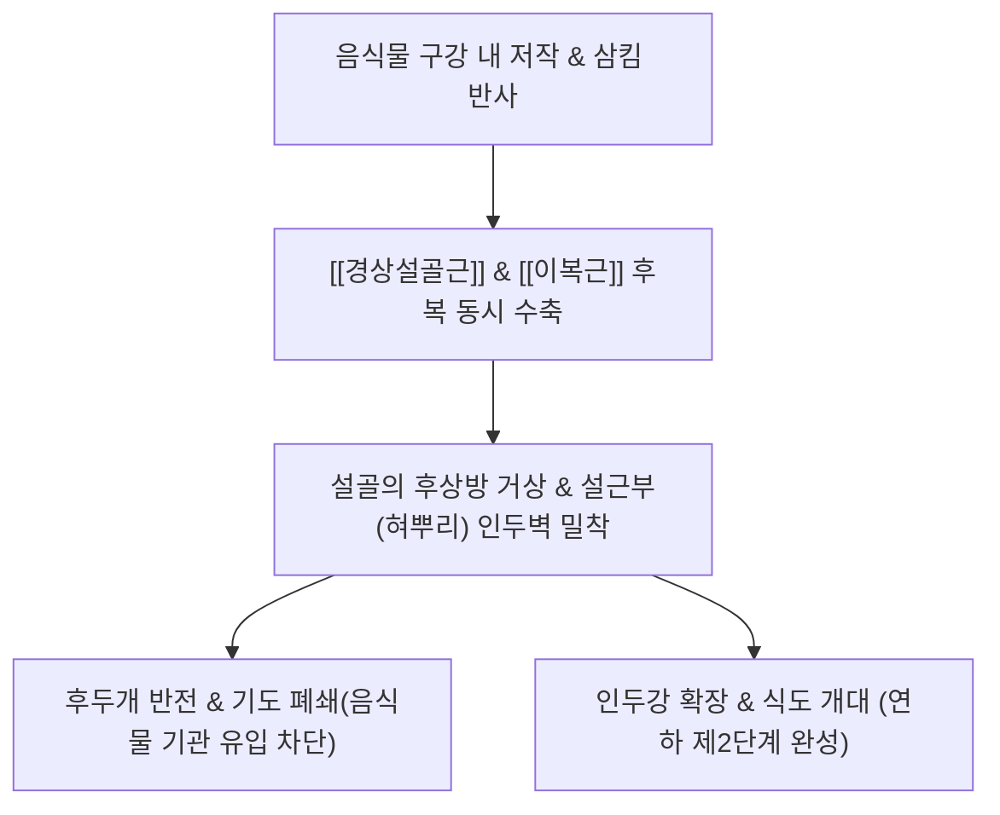
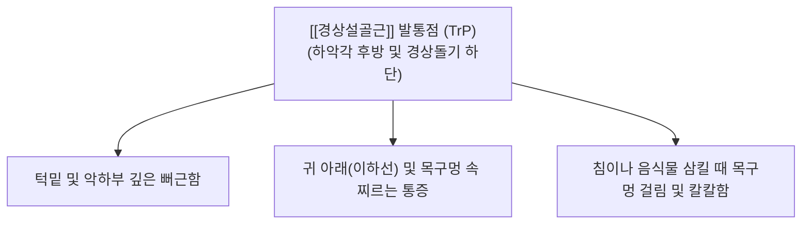

---
aliases:
  - 경상설골근
  - 붓목뿔근
  - Stylohyoid
  - Stylohyoid muscle
---
# [[경상설골근]](Stylohyoid)

> **핵심 요약 (Key Summary)**:
> 측두골 경상돌기에서 기원하여 설골 대각 상연에 정지하며 [[이복근]] 중간건을 감싸는 경부 설골상근입니다.
> [[안면신경]](CN VII) 경상설골가지의 지배를 받으며, 연하(삼킴) 시 설골을 후상방으로 견인하여 인두강 확장 및 후두 덮개 폐쇄를 보조합니다.
> [[이글 증후군]](Eagle syndrome), 삼킴통(연하곤란), 턱밑 결림 및 경추 회전 시 인후통의 핵심 병변근이며, 예풍·완골·염천혈 침구가 표적입니다.

---
## 📌 목차
1. [해부학적 정밀 구조 및 지배 신경/혈관](#1-해부학적-정밀-구조-및-지배-신경혈관)
2. [생체역학·토크 분석 & 근막 사슬 (Biomechanical Synergy)](#2-생체역학토크-분석--근막-사슬-biomechanical-synergy)
3. [근막통증증후군(TP) & 연관통 패턴 (Travell & Simons)](#3-근막통증증후군tp--연관통-패턴-travell--simons)
4. [초음파 해부학(Sonoanatomy) 및 중재 시술 랜드마크](#4-초음파-해부학sonoanatomy-및-중재-시술-랜드마크)
5. [⭐ 원장님 심층 임상 고찰 및 원본 필기 (Clinical Pearls)](#5-원장님-심층-임상-고찰-및-원본-필기-clinical-pearls)
6. [관련 임상 질환 및 운동손상 증후군 총괄](#6-관련-임상-질환-및-운동손상-증후군-총괄)
7. [추나·도수치료(MET/PIR) & 침구·약침·재활 프로토콜](#7-추나도수치료metpir--침구약침재활-프로토콜)
8. [출처 및 학술 참고 문헌 (References)](#8-출처-및-학술-참고-문헌-references)

---
## 1. 해부학적 정밀 구조 및 지배 신경/혈관

| 항목 | 상세 내용 |
| :--- | :--- |
| **기시 (Origin)** | 측두골 [[경상돌기]](Styloid process)의 후외측면 기저부 |
| **정지 (Insertion)** | 설골(Hyoid bone) 체부와 대각(Greater horn)의 접합부 상연 (정지부 직전 근건이 갈라져 [[이복근]] 중간건을 통과시킴) |
| **신경 지배** | [[안면신경]](Facial nerve, CN VII) 본간에서 갈라지는 경상설골가지 (Stylohyoid branch) |
| **혈관 공급** | 안면동맥(Facial A.), [[후두동맥]](Occipital A.), 후이개동맥의 설골 분지 |

### 🔬 해부학 도해 및 단면도
![[Stylohyoid_muscle_anatomy.png|450]]
> [Wikipedia 3D 해부도]: 측두골 경상돌기에서 설골 대각으로 사하방 주행하며 [[이복근]] 중간건을 슬릿(Slit) 형태로 관통시키는 [[경상설골근]](Stylohyoid)의 입체 구조.

![[Suprahyoid_muscles_anatomy.png|450]]
> [Gray's Anatomy 해부도]: [[경상설골근]]과 인접한 [[이복근]] 후복, 경상설근, 경상인두근의 두개저-설골 주행 관계.

---
## 2. 생체역학·토크 분석 & 근막 사슬 (Biomechanical Synergy)

* **연하(Swallowing) 시 설골 후상방 거상**:
  * 설골을 뒤쪽 위(후상방)로 들어 올려 **후두를 기관 내로 끌어올림과 동시에 후두개(Epiglottis)를 아래로 젖히는 기전**에 관여.
  * 음식물이 기도로 흡인(Aspiration)되지 않고 안전하게 하인두 및 식도로 넘어가도록 기도를 봉쇄하는 결정적 방어 역할.
* [[이복근]] **후복과의 활차 관통 파트너십**:
  * [[경상설골근]] 하단 건은 Y자 형태로 갈라지며 그 틈새로 [[이복근]]의 중간건이 관통.
  * 두 근육은 설골을 동일한 후상방 벡터로 끌어당기며, 설골이 전방으로 과도하게 쏠리지 않도록 후방 지주(Posterior stay) 역할을 분담.
* **근막 사슬 연계 (Anatomy Trains)**:
  * [[심부전방선]](Deep Front Line, DFL): 경상돌기-경상설골인대-설골-갑상연골로 연결되는 인두후벽 내장 근막 체계의 핵심 지지대.

---
## 3. 근막통증증후군(TP) & 연관통 패턴 (Travell & Simons)

* **발통점 및 연관통 특성**:
  * 하악각 후방, 유양돌기 내측 앞쪽의 경상돌기 주위에서 형성.
  * **귀 아래 및 목구멍 깊은 곳 연관통**:
    * 환자는 흔히 "귀 밑 턱뼈 안쪽 깊은 곳이 쑤신다", "침을 삼킬 때마다 가시가 찌르는 것 같다"고 호소.
    * 이비인후과 진찰상 편도염이나 인두염 소견이 없는데도 수개월 이상 지속되는 만성 연하통의 주범.

---
## 4. 초음파 해부학(Sonoanatomy) 및 중재 시술 랜드마크

* **초음파 스캔 프로토콜**:
  * 하악각 후방에서 프로브를 유양돌기와 설골 대각을 잇는 사선 방향으로 거치.
  * [[이복근]] 후복 바로 내측 또는 심부에서 경상돌기 골면 음영을 확인하고, 설골 대각으로 사하방 주행하는 [[경상설골근]] 확인.
* **고위험 신경혈관 랜드마크 (CRITICAL)**:
  * [[내경동맥]] **(ICA) 및 [[내경정맥]](IJV)**: 경상돌기 바로 심내측에 경동맥초가 밀착 주행.
  * [[설인신경]](Glossopharyngeal N., CN IX): 경상돌기 내측을 감아돌며 인두로 주행하므로 자극 시 미각 이상 및 인두 경련 주의.
  * [[안면신경]](CN VII): 경상돌기 기저부 외측의 경유돌공에서 분출.
* **안전 시술 절대 수칙**:
  * 맹목적으로 하악각 뒤쪽 깊숙이 수직 직자하는 것은 뇌혈관 및 주요 뇌신경 손상 위험이 있으므로 절대 금기.
  * 침이나 약침 시술 시 **하악각 내측연을 손가락으로 가볍게 촉진하여 경동맥 박동을 후방으로 밀어내고**, 설골 대각 골면(Bone touch)을 안전 가이드로 삼아 천자.

---
## 5. ⭐ 원장님 심층 임상 고찰 및 원본 필기 (Clinical Pearls)

### 1) [[이복근]] 후복과의 밀접한 협동 (원장님 필기 100% 보존)
* 설골을 후상방으로 당기는 핵심 듀오로서 설골의 상하좌우 변위 교정 시 [[이복근]]과 동시 이완 필수.
* 설골이 한쪽으로 비틀리거나 전하방으로 처진 환자는 [[이복근]] 후복과 [[경상설골근]]의 장력 밸런스를 맞춰주어야 연하 곤란과 목 이물감이 근본적으로 치료됩니다.

### 2) 이글 증후군(Eagle syndrome) 감별 (원장님 필기 100% 보존)
* 경상돌기 과골화 시 [[경상설골근]] 기시부의 만성 자극 통증 유발 → 경상돌기 부근 침도 박리.
* **원장님 핵심 진단 팁**:
  * 환자가 "고개를 돌릴 때마다 목구멍 깊은 곳이 찌릿하게 아프고, 귀 안쪽까지 방사통이 온다"고 할 때, 경추 디스크가 아니라 **경상돌기 과장증(Eagle syndrome)**을 반드시 감별해야 합니다.
  * 정상 경상돌기 길이는 약 2.5~3cm이나, 3cm 이상으로 길어지거나 경상설골인대가 석회화되면 경상설골근이 과도하게 견인되어 통증이 발생합니다. 경상돌기 하단 부착부에 침도(도침)로 유착을 미세 절개 박리해주면 극적인 호전이 나타납니다.

### 3) 설골 대각 증후군(Hyoid Bone Syndrome)
* 설골 대각 끝에 부착하는 [[경상설골근]] 건 부착부에 만성 기계적 마찰로 엔테소파시(Enthesopathy)가 호발합니다. 설골 대각을 촉진했을 때 극심한 압통과 함께 인후통이 재현되면 설골 대각 주위 소염약침이 특효입니다.

---
## 6. 관련 임상 질환 및 운동손상 증후군 총괄

| 임상 질환 / 증후군 | 병리적 연관 기전 | 주요 증상 및 이학적 검사 | 핵심 교정 타깃 |
| :--- | :--- | :--- | :--- |
| [[이글 증후군]] (Eagle syndrome) | 경상돌기 과장 및 경상설골근막 마찰 | 고개 회전 시 편측 인후통, 이통, 이물감 | 경상돌기 부착부 도침 박리 |
| [[연하통]] (삼킴통) | [[경상설골근]] 연축으로 설골 거상 장애 | 침 삼킬 때 귀 아래쪽 찌르는 통증 | 예풍·완골 침구 및 근막이완 |
| [[설골 대각 증후군]] | 설골 대각 부착부 만성 건초염 | 설골 대각 압통, 연하 시 목 통증 | 설골 대각 소염약침 투여 |
| [[경부 회전 시 인후통]] | [[경상설골근]] 단축으로 인한 신경 마찰 | 목 돌릴 때 귀밑 및 턱밑 찌릿함 | [[경상설골근]] PIR 및 추나요법 |
| [[매핵기]] 유사 증후군 | 설골상근군 과긴장으로 인두 압박 | 목에 가래나 솜이 걸린 느낌, 헛기침 | 설골 가동 추나 및 악하부 이완 |

---
## 7. 추나·도수치료(MET/PIR) & 침구·약침·재활 프로토콜

* **한의학 경혈 매핑**:
  * 예풍, 완골, 천주, 염천, 하관
* **침구 및 침도(도침) 프로토콜**:
  * **예풍혈(TE17) 및 경상돌기 하단 침도술**:
    * 유양돌기와 하악각 사이 함요처에서 경상돌기 골면 방향으로 완만하게 0.5~1.0촌 사자 진침하여 골면에 안착 후 가볍게 유착 박리.
  * **설골 대각 부착부 자침**:
    * 설골 대각 외측연 골면을 촉지하고, 손가락으로 경동맥을 외측으로 보호한 뒤 0.30x30mm 침으로 골면을 향해 0.3~0.5촌 천자.
* **약침 처방**:
  * **중성어혈약침**: [[이글 증후군]], 급성 연하통, 설골 변위로 인한 통증 부위에 0.3~0.5cc 주입.
  * **황련해독탕약침**: 인후부 작열통, 만성 목 이물감 동반 시 예풍혈 심부 주입.
  * **자하거약침**: 만성 연하 장애, 노인성 흡인성 폐렴 위험군 설골상근군 활성화.
* **추나 및 수기요법 (Hyoid Mobilization)**:
  * **설골 좌우 가동 추나**: 시술자의 엄지와 검지로 환자의 설골 체부와 양측 대각을 가볍게 쥐고, 좌우로 부드럽게 글라이딩(Lateral glide)시키며 가동 제한이 있는 방향으로 가벼운 견인력 적용.

---
## 8. 출처 및 학술 참고 문헌 (References)

1. **Standring, S. (2020)**. *Gray's Anatomy: The Anatomical Basis of Clinical Practice* (42nd ed.). Elsevier, pp. 581-583.
   - [연구 요약] 경상설골근의 경상돌기 기시 및 설골 대각 부착 구조, 안면신경 지배 및 [[이복근]] 중간건과의 해부학적 관통 관계 규명.
2. **Eagle, W. W. (1937)**. *Elongated styloid process: report of two cases*. *Archives of Otolaryngology*, 25(5), 584-587.
   - [연구 요약] 경상돌기 과골화 및 경상설골 복합체 긴장으로 인한 만성 인후통, 연하통, 이통 증후군(Eagle syndrome)의 최초 임상 보고.
3. **Travell, J. G., & Simons, D. G. (1999)**. *Myofascial Pain and Dysfunction: The Trigger Point Manual*, Vol. 1 (2nd ed.). Williams & Wilkins, pp. 273-284.
   - [연구 요약] 설골상근군([[경상설골근]], [[이복근]])의 발통점 연관통 및 연하 곤란 임상 경로 제시.
