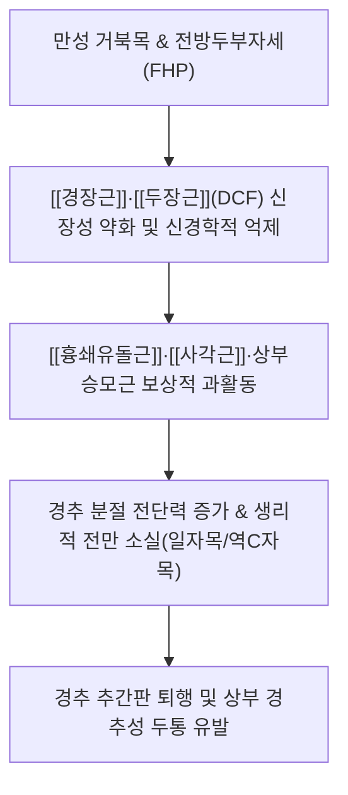
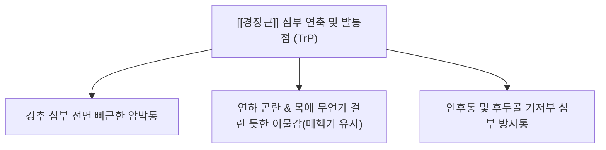

---
aliases:
  - 경장근
  - 긴목근
  - Longus colli
  - Longus colli muscle
---
# [[경장근]](Longus colli)

> **핵심 요약 (Key Summary)**:
> 상위 흉추와 경추 전면에 걸쳐 척주체 바로 앞을 지탱하는 경추 심부 굴곡근(DCF)의 핵심 축입니다.
> 경신경 전지(C2~C6)의 지배를 받으며, 경추의 분절 안정화, 전방 굴곡, 측굴 및 생리적 경추 전만(Lordosis) 유지에 결정적입니다.
> [[거북목 증후군|거북목증후군]], 일자목, 편타 손상(WAD), 경추성 두통, 급성 석회성 건염 및 연하통의 핵심 병변근이며, 임상적으로 심부 안정화 훈련(CCFT)과 정밀 침구가 표적입니다.

---
## 📌 목차
1. [해부학적 정밀 구조 및 지배 신경/혈관](#1-해부학적-정밀-구조-및-지배-신경혈관)
2. [생체역학·토크 분석 & 경부 근막 사슬 (Biomechanical Synergy)](#2-생체역학토크-분석--경부-근막-사슬-biomechanical-synergy)
3. [근막통증증후군(TP) & 연관통 패턴 (Travell & Simons)](#3-근막통증증후군tp--연관통-패턴-travell--simons)
4. [초음파 해부학(Sonoanatomy) 및 중재 시술 랜드마크](#4-초음파-해부학sonoanatomy-및-중재-시술-랜드마크)
5. [⭐ 원장님 심층 임상 고찰 및 원본 필기 (Clinical Pearls)](#5-원장님-심층-임상-고찰-및-원본-필기-clinical-pearls)
6. [관련 임상 질환 및 운동손상 증후군 총괄](#6-관련-임상-질환-및-운동손상-증후군-총괄)
7. [추나·도수치료(MET/PIR) & 침구·약침·재활 프로토콜](#7-추나도수치료metpir--침구약침재활-프로토콜)
8. [출처 및 학술 참고 문헌 (References)](#8-출처-및-학술-참고-문헌-references)

---
## 1. 해부학적 정밀 구조 및 지배 신경/혈관

| 항목 | 상세 내용 |
| :--- | :--- |
| **구분 (Divisions)** | 3개 파트(상사부, 하사부, 수직부)로 구성된 복합 다관절 심부 굴곡근 |
| **기시 (Origin)** | • **상사부(Superior oblique)**: 제3~5경추(C3~C5) 횡돌기 전결절 • **하사부(Inferior oblique)**: 제1~3흉추(T1~T3) 추체 전면 • **수직부(Vertical intermediate)**: 제5경추~제3흉추(C5~T3) 추체 전면 |
| **정지 (Insertion)** | • **상사부**: 제1경추(환추, Atlas) 전결절 (Anterior tubercle of atlas) • **하사부**: 제5~6경추(C5~C6) 횡돌기 전결절 • **수직부**: 제2~4경추(C2~C4) 추체 전면 |
| **신경 지배** | 경신경 전지 (C2~C6 anterior rami)의 직접 분지 |
| **혈관 공급** | 상행경동맥(Ascending cervical A.), 상행인두동맥(Ascending pharyngeal A.), [[추골동맥]](Vertebral A.)의 경추 분지 |

### 🔬 해부학 도해 및 주행 관계
![[Longus_colli_anatomy.png|450]]
> [Wikipedia 3D 해부도]: 척주체 전면 정중선 양측에 밀착하여 상사부·수직부·하사부의 삼각 격자망을 형성하는 [[경장근]](Longus colli)의 입체 주행.

![[Gray_longus_colli.png|450]]
> [Gray's Anatomy 공중도메인 해부학 도해]: 척추 전면 심부 근육군인 [[경장근]](Longus colli), [[두장근]](Longus capitis), 전두직근 및 외측두직근의 골 부착부와 신경 주행 관계.

---
## 2. 생체역학·토크 분석 & 경부 근막 사슬 (Biomechanical Synergy)

* **심부 경추 굴곡근(Deep Cervical Flexors, DCF)의 분절 안정화**:
  * 요추부의 심부 코어근육인 [[다열근]] 및 [[복횡근]]에 필적하는 경추부의 '동적 기둥(Dynamic Pillar)' 역할.
  * 표재근인 [[흉쇄유돌근]](SCM)이나 [[전사각근]]이 거친 대단위 경추 굴곡을 일으킬 때, 경장근은 척추 분절 하나하나를 서로 밀착시키며 **추체의 전방 전단력(Anterior shear force)을 억제**하고 축성 압박 안정성을 제공.
* **경추 전만(Cervical Lordosis) 유지 메커니즘**:
  * 수직부와 사부의 동시 수축은 경추 후방 신전근군([[경반극근]], [[두반극근]], [[판상근]])의 과도한 과신전을 제어하고 중립 곡선을 형성.
* **근막 사슬 연계 (Anatomy Trains)**:
  * **심부전방선(Deep Front Line, DFL)**: 발바닥 [[후경골근]]-[[내전근군]]-[[골반저근]]-[[장요근]]-[[횡격막]]-심부 흉부근막을 타고 올라와 경추 전방에서 [[경장근]]과 [[두장근]]으로 연결되어 두개저에 도달하는 인체 중심 코어선.

---
## 3. 근막통증증후군(TP) & 연관통 패턴 (Travell & Simons)

* **발통점 및 임상 연관통 특징**:
  * Travell & Simons 교재에서는 독립 단원으로 분리되지 않았으나, 임상적으로 전경부 심부 및 인두후간극(Retropharyngeal space)에 인접한 [[경장근]] TrP 활성화 시 **경추 심부 전면의 묵직한 통증**을 방사.
  * **연하통(Odynophagia) 및 이물감**: 침이나 음식물을 삼킬 때 식도 후벽을 압박하여 한의학적 [[매핵기]](梅核氣)나 신경성 인두염으로 오인하기 쉬운 삼킴 곤란 증상 유발.
  * [[급성 석회성 건염|급성 석회성 [[경장근]] 건염]](Acute Calcific Tendinitis of Longus Colli):
    * [[경장근]] 상사부 건 부착부(주로 C1-C2 수준)에 하이드록시아파타이트(Hydroxyapatite) 결정이 침착되면서 급성 염증 발생.
    * 수시간 내에 극심한 경부 강직, 삼킴 곤란, 경미한 발열 및 회전 제한이 발생하여 [[후두인두농양]](Retropharyngeal abscess)이나 [[뇌수막염]]으로 오진되기 쉬운 임상 응급 질환.

---
## 4. 초음파 해부학(Sonoanatomy) 및 중재 시술 랜드마크

* **초음파 단면 스캔 소견**:
  * 쇄골 상방 4~5cm 높이(C5-C6 레벨)에서 선형 프로브를 횡단(Short-axis) 배치.
  * 내측으로부터 기도(Trachea), 갑상선(Thyroid gland), 식도(Esophagus)가 관찰되고, 그 외측에 경동맥초(Carotid sheath)로 싸인 [[총경동맥]](Common carotid artery, CCA)과 [[내경정맥]](Internal jugular vein, IJV)이 위치.
  * **경장근의 위치**: 경동맥초와 식도의 심부, **경추 추체 전외측 골면(Vertebral body)에 바로 얹혀 있는 방추형 근육**이 [[경장근]].
* **초음파 가이드 접근 랜드마크**:
  * [[경부교감신경간]](Cervical sympathetic trunk): [[경장근]] 전면 근막(Prevertebral fascia) 바로 앞 또는 심부에 위치하므로 고용량 약침 주입 시 [[호너 증후군]](Horner's syndrome: 안검하수, 축동, 무한증) 발생 위험 평가 필요.
* **침구 및 약침 안전 마진 (CRITICAL)**:
  * **맹목적 자침 절대 엄금**: [[총경동맥]], [[내경정맥]], [[미주신경]], [[추골동맥]], 식도가 전외측을 빽빽하게 덮고 있으므로 전방에서 직자하는 것은 치명적 혈관 손상(혈종, 가성동맥류)이나 식도 천공을 유발할 수 있음.
  * **손가락 촉진 박리 유도 기법**: [[총경동맥]]의 맥박을 촉지하여 검지와 중지로 경동맥초를 외측으로 안전하게 밀어내고, 식도를 내측으로 보호한 뒤 형성된 안전 틈새를 통해 척추체 골면(Bone touch)을 목표로 지극히 섬세하게 접근.

---
## 5. ⭐ 원장님 심층 임상 고찰 및 원본 필기 (Clinical Pearls)

### 1) 심부 경추 안정화의 핵심 (원장님 필기 100% 보존)
* 표재성 근육([[흉쇄유돌근]], [[사각근]]) 과긴장 전 심부 [[경장근]]의 약화 여부 평가 필수.
* 만성 목 통증 환자가 내원했을 때 [[승모근]]이나 [[견갑거근]]만 풀어주면 며칠 못 가 통증이 재발합니다. 이는 경추를 앞에서 든든하게 받쳐주는 [[경장근]]이 억제되어 뒤쪽 근육들이 머리를 지탱하느라 과부하가 걸리기 때문입니다.

### 2) 경추 전만 붕괴 방지 (원장님 필기 100% 보존)
* [[거북목 증후군|거북목]] 시 [[경장근]] 신장성 약화로 경추 후만 유발.
* 스마트폰이나 모니터를 앞으로 내미는 전방두부자세(FHP)가 지속되면 [[경장근]]은 끊임없이 늘어나며 신장성 약화(Long & Weak) 상태에 빠지고, 척추체의 전방 전단력을 이기지 못해 정상적인 C자형 전만 곡선이 일자목이나 역C자형 후만으로 변형됩니다.

### 3) [[두개경추 굴곡 검사]](CCFT, Jull's Test) 임상 적용
* 바이오피드백 압력계(Chattanooga stabilizer)를 후두하부 경추 만곡 아래에 넣고 20 mmHg로 가압한 뒤, 턱을 가볍게 당기는 '끄덕임(Nodding)' 동작으로 22, 24, 26, 28, 30 mmHg까지 2 mmHg씩 단계별로 올리며 10초간 유지할 수 있는지 평가.
* **실패 징후**: 압력을 올릴 때 턱이 앞으로 튀어나오거나(치아 악물기), 표재성인 [[흉쇄유돌근]](SCM)이나 [[전사각근]]이 단단하게 튀어나오면 심부 [[경장근]]이 억제된 확실한 징후입니다.

---
## 6. 관련 임상 질환 및 운동손상 증후군 총괄

| 임상 질환 / 증후군 | 병리적 연관 기전 | 주요 증상 및 이학적 검사 | 핵심 교정 타깃 |
| :--- | :--- | :--- | :--- |
| [[심부 경추 무력증]] | [[경장근]]·[[두장근]] 신경근 조절 억제 | 만성 경항통, 잦은 목 삐임, 경추 지지력 상실 | CCFT 기반 심부 굴곡근 점진적 재활 |
| [[거북목 증후군]] | 경장근의 장축 신장 약화 및 억제 | 경추 전만 소실, 상부 경추 과신전, 역C자목 | 친턱(Chin-tuck) 운동 및 흉곽 교정 |
| [[편타 손상]] | 후방 추돌 시 과신전에 의한 [[경장근]] 미세 파열 | 수상 후 목 전면 뻐근함, 삼킴통, 경추 회전 장애 | 초기 안정 후 등척성 수축 침구 치료 |
| [[급성 석회성 건염]] | [[경장근]] 상사부 하이드록시아파타이트 결정 침착 | 급격한 연하 곤란, 심한 경부 회전 제한, 미열 | 소염 진통, 침구 항염 요법 및 안정 |
| [[경추성 두통]] | 상위 경추 분절 불안정성 보상 부하 | 후두하부 압박통, 관자놀이 및 정수리 방사통 | [[경장근]] 전방 안정화 & [[후두하근]] 이완 |
| [[매핵기]] | [[경장근]] 과긴장으로 인두 후벽 자극 | 목에 가래나 솜이 걸린 듯한 이물감, 헛기침 | [[경장근]] 연축 이완 및 호흡 패턴 개선 |

---
## 7. 추나·도수치료(MET/PIR) & 침구·약침·재활 프로토콜

* **경혈 배오 및 자침법**:
  * **천돌(CV22)**: 흉골병 상연 절흔 중앙에서 기관 전면을 따라 사하방으로 0.5~1촌 자침하여 흉강 상구의 심부 근막 장력 해소.
  * **인영(ST9)**: 갑상연골 상연 높이, 총경동맥 맥박 박동처의 내측 또는 외측을 손가락으로 가볍게 견인하여 경동맥을 외측으로 피한 뒤 완만하게 0.3~0.5촌 자침.
  * **천정(LI17)**: [[흉쇄유돌근]] 후연에서 경추 횡돌기 방향으로 완만하게 접근.
* **약침 임상 배오**:
  * 경추 분절성 불안정증 및 디스크성 통증에는 중성어혈약침 또는 신바로약침을 사용하여 [[경장근]] 정지부 인접 횡돌기 전결절 주위에 미량(0.1~0.2cc) 섬세하게 투여.
* **추나 및 도수치료 (MET/PIR)**:
  * **경추 분절 전만 복원 추나**: 환자를 앙와위로 눕히고 시술자의 검지와 중지로 경추 추체 후관절을 받쳐주며 전방으로 완만한 전만 견인력(Anterior mobilization)을 제공.
  * [[경장근]] **등척성 수축-이완(PIR)**: 환자가 턱을 살짝 당기는 미세 끄덕임(Nodding) 동작을 취할 때 이마에 미세한 저항(약 10~15% 힘)을 5초간 가한 뒤 숨을 내쉬며 이완 유도.
* **환자 재활 운동 티칭 (Chin-Tuck Exercise)**:
  * 벽에 등과 머리를 대고 서서 턱을 아래로 살짝 당겨 뒤통수로 벽을 가볍게 누르는 동작을 하루 10초씩 10회 반복 (목 앞쪽 표재근인 SCM에 힘이 들어가지 않도록 거울을 보며 티칭).

---
## 8. 출처 및 학술 참고 문헌 (References)

1. **Jull, G., O'Leary, S., & Falla, D. (2008)**. *Clinical assessment of the deep cervical flexor muscles: the craniocervical flexion test*. Journal of Manipulative and Physiological Therapeutics, 31(7), 525-533.
   - [연구 요약] 만성 경항통 환자에서 표재근(SCM)의 과보상과 심부 경추 굴곡근([[경장근]]·[[두장근]])의 선택적 활성화 장애를 평가하는 두개경추 굴곡 검사(CCFT)의 임상적 타당성을 규명.
2. **Falla, D., Jull, G., & Hodges, P. W. (2004)**. *Patients with neck pain demonstrate reduced electromyographic activity of the deep cervical flexor muscles during performance of the craniocervical flexion test*. Spine, 29(19), 2108-2114.
   - [연구 요약] 근전도(EMG) 측정을 통해 만성 목 통증 환자군에서 경장근의 활성도가 현저히 저하되어 있음을 입증하고 경추부 안정화 운동의 필요성을 확인.
3. **Eastwood, J. D., Hudgins, P. A., & Malone, D. (1998)**. *Retropharyngeal effusion in acute calcific tendinitis of the longus colli muscle*. American Journal of Neuroradiology, 19(9), 1789-1792.
   - [연구 요약] [[경장근]] 상사부의 급성 석회성 건염으로 인한 인두후간극 삼출액과 연하통 증례를 분석하여 인두후농양과의 감별 진단 랜드마크 제시.
4. **Standring, S. (2020)**. *Gray's Anatomy: The Anatomical Basis of Clinical Practice* (42nd ed.). Elsevier.
   - [연구 요약] 척주 전면 경장근의 상사부, 하사부, 수직부 부착부 및 인접 신경혈관 구조의 정밀 해부학적 데이터 제공.
5. **Travell, J. G., & Simons, D. G. (1999)**. *Myofascial Pain and Dysfunction: The Trigger Point Manual* (Vol. 1, 2nd ed.). Williams & Wilkins.
   - [연구 요약] 경부 굴곡근 및 심부 연부조직 연관통 패턴 총괄.
